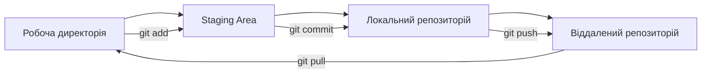
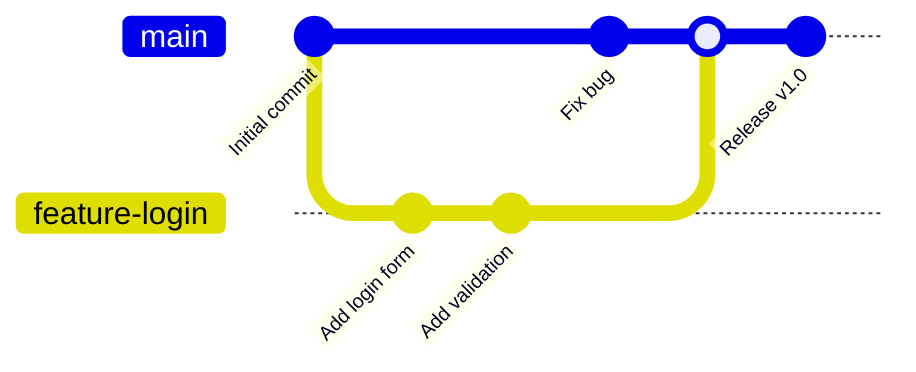

# Лабораторна робота 02 Налаштування середовища розробки та Git workflow

## 🎯 Мета роботи

Створення професійного робочого середовища для командної розробки програмного забезпечення, оволодіння основними принципами роботи з системою контролю версій Git та впровадження ефективного workflow для групової роботи над програмними проєктами.

## ✅ Завдання

### Рівень 1

Налаштування індивідуального робочого середовища та освоєння основ Git:

- встановити та сконфігурувати Git на локальному комп'ютері;
- створити акаунт на GitHub, увімкнути двофакторну автентифікацію та налаштувати безпечний доступ (SSH-ключ);
- створити локальний репозиторій та виконати базові операції (init, add, commit, push);
- склонувати існуючий репозиторій та синхронізувати зміни;
- вивчити структуру Git репозиторію та основні команди;
- створити файл README.md з описом проєкту.

### Рівень 2

Організація командної роботи з використанням Git workflow:

- виконати всі завдання з рівня 1;
- створити та працювати з гілками (branch, switch, merge);
- налаштувати спільний репозиторій для команди;
- використовувати Pull Request/Merge Request для code review;
- вирішувати конфлікти при злитті гілок.

### Рівень 3

Впровадження професійних практик розробки:

- виконати всі завдання з рівня 2;
- інтегрувати з IDE (VS Code) для ефективної роботи з Git;
- створити .gitignore файл для проєкту;
- вести завдання команди в GitHub Issues та пов'язувати з ними Pull Request;
- випустити реліз проєкту (тег версії та GitHub Release).


## 🖥️ Програмне забезпечення

- Git [git-scm.com](https://git-scm.com) - розподілена система контролю версій (для Windows встановлюється разом з Git Bash та Git Credential Manager);
- GitHub [github.com](https://github.com) - хмарна платформа для хостингу Git репозиторіїв;
- Visual Studio Code [code.visualstudio.com](https://code.visualstudio.com) - редактор коду з підтримкою Git;
- Python [python.org](https://www.python.org) - мова програмування для модулів навчального проєкту (рекомендовано, див. крок 1);
- GitHub Desktop [desktop.github.com](https://desktop.github.com) - графічний клієнт Git для Windows та macOS (опціонально).

## 👥 Форма виконання роботи

Форма виконання роботи **групова** (3-4 особи в команді). Кожна команда створює спільний репозиторій та демонструє навички командної розробки.

## 📝 Критерії оцінювання

- середній рівень (оцінка "задовільно", 4-6) - виконано завдання рівня 1. Налаштовано індивідуальне робоче середовище, продемонстровано базові навички роботи з Git. Під час захисту здобувач освіти демонструє розуміння основних концепцій системи контролю версій;
- достатній рівень (оцінка "добре", 7-9) - виконано всі вимоги рівня 2. Організовано ефективну командну роботу з використанням Git workflow, продемонстровано навички вирішення конфліктів та code review. Під час захисту допускаються невеликі неточності у розумінні процесів командної розробки;
- високий рівень (оцінка "відмінно", 10-12) - виконано завдання рівня 3. Впроваджено професійні практики розробки (інтеграція з IDE, .gitignore, Issues, реліз). Під час захисту продемонстровано глибоке розуміння принципів командної роботи та здатність налаштовувати складні workflow, проявлено системний підхід до організації процесів розробки.


## ⏰ Політика щодо дедлайнів

При порушенні встановленого терміну здачі лабораторної роботи максимальна можлива оцінка становить 9 балів ("добре"), незалежно від якості виконаної роботи. Винятки можливі лише за поважних причин, підтверджених документально.

## 📚 Теоретичні відомості

### Система контролю версій Git

**Git** — це розподілена система контролю версій, розроблена Лінусом Торвальдсом для управління розробкою ядра Linux. На відміну від централізованих систем, Git дозволяє кожному розробнику мати повну копію історії проєкту, що забезпечує високу надійність та можливість роботи в офлайн режимі.

Основні переваги Git:

- **розподіленість** — кожен розробник має повну копію репозиторію;
- **швидкість** — більшість операцій виконуються локально;
- **цілісність** — всі об'єкти Git мають контрольні суми;
- **гілкування** — легке створення та злиття гілок;
- **відкритість** — open source рішення з великою спільнотою.

### Основні концепції Git

**Репозиторій (Repository)** — це сховище, яке містить всі файли проєкту та їх історію змін. Репозиторій може бути локальним (на вашому комп'ютері) або віддаленим (на сервері).

**Коміт (Commit)** — це знімок стану проєкту в конкретний момент часу. Кожен коміт має унікальний ідентифікатор (hash), автора, дату та повідомлення, що описує внесені зміни.

**Гілка (Branch)** — це незалежна лінія розробки. Основна гілка сьогодні за замовчуванням називається `main` (у старіших проєктах — `master`). Гілки дозволяють працювати над різними функціями паралельно, не впливаючи на основний код. Створити гілку й одразу перейти на неї можна командою `git switch -c назва-гілки`; для перемикання на наявну гілку використовується `git switch назва-гілки`. Старіша команда `git checkout` також працює, але `git switch` зрозуміліша для початківців, бо виконує лише одну задачу.

**Індекс (Staging Area)** — це проміжна область між робочою директорією та репозиторієм, де підготовлюються файли для коміту.

### Робочий процес Git



Типовий цикл роботи з Git включає наступні кроки:

1. **Модифікація файлів** у робочій директорії;
2. **Додавання змін** до індексу командою `git add`;
3. **Створення коміту** командою `git commit`;
4. **Відправлення змін** на віддалений сервер командою `git push`.

Щоб отримати чужі зміни, використовується `git pull` — це поєднання двох дій: `git fetch` (завантажити нові коміти з віддаленого репозиторію) та `git merge` (злити їх у поточну гілку). Команда `git status` у будь-який момент показує, у якому стані перебувають файли.

### Git Workflow моделі

**Централізований Workflow** — найпростіша модель, де всі розробники працюють з однією гілкою `main`. Підходить для невеликих команд та простих проєктів.

**Feature Branch Workflow** — кожна нова функція розробляється в окремій гілці. Після завершення роботи гілка зливається з основною через Pull Request. Ця модель лежить в основі так званого GitHub Flow, який сьогодні є одним із найпоширеніших підходів у командах.



**Gitflow Workflow** — складніша модель з чітким розділенням гілок на типи: `main`, `develop`, `feature`, `release`, `hotfix`. Підходить для проєктів з регулярними релізами. Через свою громіздкість для веб-проєктів із безперервною доставкою змін Gitflow використовується дедалі рідше — команди віддають перевагу простішим моделям (GitHub Flow, trunk-based development).

### GitHub та колаборація

**GitHub** — це хмарна платформа для хостингу Git репозиторіїв, яка надає додаткові інструменти для командної роботи:

- **Pull Request** — механізм для пропозиції змін та їх обговорення;
- **Issues** — система відстеження помилок та завдань;
- **Projects** — інструменти для управління проєктами;
- **Releases** — публікація версій проєкту з описом змін;
- **Actions** — платформа для автоматизації CI/CD.

**Pull Request (PR)** — це запит на злиття змін з однієї гілки в іншу. PR дозволяє:

- переглядати код перед інтеграцією;
- обговорювати зміни в команді;
- запускати автоматичні тести;
- підтримувати якість коду.

### Автентифікація та безпека акаунта

Для роботи з віддаленим репозиторієм Git має довести GitHub, що це саме ви. Важливо знати:

- GitHub вимагає **двофакторну автентифікацію (2FA)** для акаунтів, що вносять код на платформу, тому її потрібно налаштувати одразу після реєстрації;
- пароль від акаунта **не приймається** для Git-операцій (`clone`, `push`, `pull`) — потрібен інший спосіб автентифікації.

Є три поширені способи:

| Спосіб | Як працює | Коли зручний |
|--------|-----------|--------------|
| **SSH-ключ** | пара ключів: приватний зберігається у вас, публічний додається в налаштування GitHub; посилання виду `git@github.com:user/repo.git` | універсальний, налаштовується один раз |
| **HTTPS + Git Credential Manager** | під час першої операції відкривається браузер для входу в акаунт; посилання виду `https://github.com/user/repo.git` | найпростіший для початківців; входить до складу Git for Windows |
| **HTTPS + персональний токен (PAT)** | токен вводиться замість пароля | запасний варіант, токен потрібно зберігати як пароль |

У цій лабораторній роботі використовується SSH. Приватний ключ (файл без розширення `.pub`) **ніколи** не передається іншим людям і не потрапляє в репозиторій.

### Конфлікти злиття

**Конфлікт** виникає, коли Git не може автоматично поєднати зміни — наприклад, коли двоє учасників змінили один і той самий рядок файлу в різних гілках. Git не вгадує, чия версія правильна, тому зупиняє злиття й позначає проблемні місця у файлі:

```text
<<<<<<< HEAD
Версія з вашої поточної гілки
=======
Версія з гілки, яку зливають
>>>>>>> origin/main
```

Щоб вирішити конфлікт, потрібно відкрити файл, обрати потрібний варіант (або поєднати обидва), **видалити службові маркери** `<<<<<<<`, `=======`, `>>>>>>>`, зберегти файл, додати його командою `git add` і створити коміт. Якщо ви розгубилися, злиття можна скасувати командою `git merge --abort`. VS Code підсвічує конфлікти та пропонує кнопки вибору варіанта, а також має окремий редактор злиття.

### Файл .gitignore

Не всі файли потрібно зберігати в репозиторії: тимчасові файли, каталоги віртуальних середовищ, паролі та ключі. Їх перелік записують у файл `.gitignore` у корені проєкту — Git ігноруватиме такі файли. Приклад для Python-проєкту:

```gitignore
__pycache__/
*.pyc
.venv/
.env
.vscode/
```

Готові шаблони для різних мов програмування доступні в репозиторії [github/gitignore](https://github.com/github/gitignore), а GitHub пропонує обрати шаблон під час створення репозиторію.

### Conventional Commits

**Conventional Commits** ([специфікація](https://www.conventionalcommits.org/uk/v1.0.0/)) — це конвенція для написання повідомлень комітів, яка покращує читабельність історії та дозволяє автоматизувати генерацію changelog і визначення номера наступної версії.

Формат повідомлення:
```
<тип>[область]: <опис>

[необов'язкове тіло]

[необов'язковий footer]
```

Типи комітів:
- `feat` — нова функціональність;
- `fix` — виправлення помилки;
- `docs` — зміни в документації;
- `style` — зміни в форматуванні коду;
- `refactor` — рефакторинг коду;
- `perf` — покращення продуктивності;
- `test` — додавання або зміна тестів;
- `build` — зміни в системі збірки та залежностях;
- `ci` — зміни в конфігурації автоматизації (наприклад, GitHub Actions);
- `chore` — технічні зміни.

Область пишуть у дужках одразу після типу (наприклад, `feat(login): add validation`). Знак оклику після типу (`feat!:`) позначає несумісну зміну. Мова опису (українська чи англійська) має бути єдиною для всієї команди.

## ▶️ Хід роботи

> [!TIP]
>  **Перед виконанням лабораторної**

> рекомендується попрактикуватись з git в онлайн симуляторах та переглянути документацію:

> - [Курс GitByBit](https://gitbybit.com/uk)
> - [Learn Git Branching](https://learngitbranching.js.org/?locale=uk)
> - [Git Simulator Online](https://webutility.io/git-simulator-online)
> - [Pro Git book](https://git-scm.com/book/uk/v2)


1. Формування команди та планування:
    1. Створення команди:
        1. сформувати команду з 3-4 осіб;
        2. обрати тему спільного проєкту (рекомендовано — набір невеликих Python-утиліт, наприклад калькулятор, конвертер одиниць, генератор паролів; кожен учасник відповідає за окремий модуль — саме на таку тему розрахований шаблон звіту);
        3. визначити ролі учасників команди (team lead, developer, QA).
    2. Планування проєкту:
        1. створити список основних функцій додатка;
        2. розподілити завдання між учасниками команди;
        3. визначити технологічний стек проєкту.
2. Індивідуальне налаштування Git (виконує кожен учасник):
    1. завантажити та встановити Git з офіційного сайту;
    2. перевірити встановлення командою `git --version`;
    3. налаштувати користувача та поведінку за замовчуванням:
        ```bash
        git config --global user.name "Ваше Ім'я"
        git config --global user.email "your.email@example.com"

        # Назва основної гілки для нових репозиторіїв
        git config --global init.defaultBranch main

        # Поведінка git pull при розбіжних гілках (злиття, без перебазування)
        git config --global pull.rebase false
        ```
    4. зареєструватися на [github.com](https://github.com) та увімкнути двофакторну автентифікацію (Settings → Password and authentication);
    5. налаштувати доступ до GitHub по SSH:
        ```bash
        # Створення пари ключів (на запитання натискайте Enter)
        ssh-keygen -t ed25519 -C "your.email@example.com"

        # Вивести публічний ключ, щоб скопіювати його
        cat ~/.ssh/id_ed25519.pub

        # Після додавання ключа на GitHub (Settings → SSH and GPG keys → New SSH key)
        # перевірити з'єднання
        ssh -T git@github.com
        ```
        У разі успіху GitHub привітає вас за іменем користувача. Команди виконуються в Git Bash (Windows) або в терміналі (macOS, Linux). Якщо SSH налаштувати не вдається, допускається використання HTTPS-посилань разом із Git Credential Manager (див. теоретичні відомості);
    6. виконати тренувальну вправу в локальному репозиторії (для завдань рівня 1):
        ```bash
        mkdir git-practice
        cd git-practice
        git init
        # створити у редакторі файл README.md з кількома рядками тексту
        git status
        git add README.md
        git commit -m "docs: add README"
        # змінити файл, знову виконати add і commit
        git log --oneline
        ```
3. Створення спільного репозиторію
    1. створити новий порожній репозиторій на GitHub (виконує team lead); щоб викладач міг перевірити роботу, репозиторій має бути публічним або в ньому потрібно додати викладача як collaborator;
    2. налаштувати базову структуру проєкту (каталоги, файл `.gitignore` — для рівня 3 обов'язково);
    3. створити файл README.md з описом проєкту;
    4. створити початковий коміт та відправити на GitHub:
        ```bash
        git init
        git add .
        git commit -m "docs: initial commit"
        git branch -M main
        git remote add origin git@github.com:username/repository.git
        git push -u origin main
        ```
    5. додати всіх учасників команди як collaborators (Settings → Collaborators); кожен учасник має прийняти запрошення (воно надходить на пошту та в сповіщення GitHub).

4. Організація командної роботи
    1. Робота з гілками:
        ```bash
        # Клонування репозиторію
        git clone git@github.com:username/repository.git
        cd repository

        # Створення нової гілки для функції
        git switch -c feature/user-authentication

        # Робота з файлами та створення комітів
        git add .
        git commit -m "feat: add user login form"

        # Відправлення гілки на сервер
        git push -u origin feature/user-authentication
        ```
    2. Pull Request процес:
        1. створити Pull Request для кожної завершеної функції;
        2. призначити reviewers з команди;
        3. обговорити зміни та внести правки при необхідності;
        4. злити PR після схвалення команди;
        5. після злиття оновити локальну основну гілку (`git switch main`, `git pull`) і видалити вже непотрібну гілку.
    3. Issues (для рівня 3):
        1. створити в репозиторії Issues для запланованих функцій та помилок;
        2. у описі Pull Request вказувати посилання на завдання (наприклад, `Closes #3`), щоб завдання закривалося автоматично після злиття.
5. Вирішення конфліктів
    1. Типові сценарії конфліктів:
        1. одночасне редагування одного файлу;
        2. видалення файлу одним розробником та редагування іншим;
        3. конфлікти при злитті довготривалих гілок.
    2. Створення конфлікту для тренування (виконують двоє учасників команди):
        1. кожен створює власну гілку від актуальної `main`;
        2. обидва змінюють один і той самий рядок у файлі README.md та створюють коміти;
        3. перший учасник зливає свій Pull Request у `main`;
        4. другий учасник отримує конфлікт у своєму Pull Request і вирішує його.
    3. Процес вирішення конфлікту:
        ```bash
        # Перейти у свою гілку та підтягнути актуальну main
        git switch feature-branch
        git fetch origin
        git merge origin/main

        # Git повідомить про конфлікт. Переглянути перелік проблемних файлів
        git status

        # Вирішення конфліктів в IDE
        # Вручну об'єднати зміни у файлах і видалити маркери <<<<<<<, =======, >>>>>>>

        # Додавання вирішених файлів
        git add README.md
        git commit -m "fix: resolve merge conflict in README.md"

        # Відправлення на сервер
        git push origin feature-branch
        ```
6. Професійні практики (рівень 3)
    1. виконати частину роботи (створення комітів, перемикання гілок, вирішення конфлікту) через вбудовані засоби Git у VS Code (панель Source Control, редактор злиття);
    2. переконатися, що `.gitignore` містить усі службові файли проєкту та в репозиторій не потрапили зайві файли;
    3. створити реліз: позначити стабільний стан `main` тегом `v1.0.0` та опублікувати GitHub Release (розділ Releases → Draft a new release) із коротким описом змін.
7. Документування та презентація
    1. оновити README.md з детальним описом проєкту;
    2. додати інструкції з встановлення та запуску;
    3. додати CHANGELOG.md з історією змін;
    4. створити і додати `lab02-report.md` для кожного учасника команди відповідно до шаблону звіту ([📄 Завантажити шаблон](assets/lab02-report-template.md));
    5. як відповідь на завдання в LMS Moodle дати посилання на репозиторій з проєктом;
    6. захистити лабораторну перед викладачем.

[👉 Здати лабораторну роботу](https://moodle.vcolnuft.volyn.ua/moodle/course/view.php?id=1426#section-2)

## ❓ Контрольні запитання

1. Які переваги має розподілена система контролю версій Git порівняно з централізованими системами?
2. Як організувати ефективний Git workflow для команди розробників?
3. Які кроки необхідно виконати для вирішення конфлікту при злитті гілок?
4. Як Pull Request допомагає підтримувати якість коду в командній розробці?
5. Які стратегії допомагають запобігти конфліктам у командній розробці?
6. Як правильно вирішувати merge конфлікти та які інструменти для цього використовувати?
