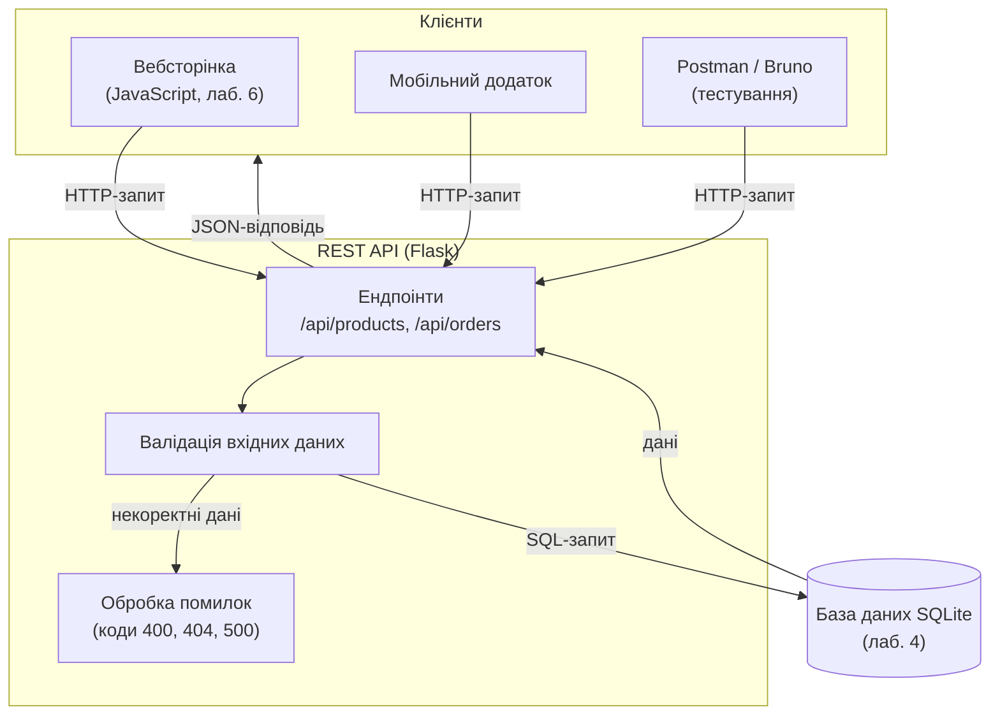

# Лабораторна робота 05 Розробка RESTful API з документацією

## 🎯 Мета роботи

Набути практичних навичок проєктування та реалізації REST API для вебзастосунку, навчитися повертати дані у форматі JSON, коректно використовувати HTTP-методи та коди відповідей, тестувати API за допомогою спеціалізованих інструментів і документувати його.

## ✅ Завдання

### Рівень 1

1. Розробити базовий REST API для існуючого проєкту:
    - Мінімум 6 endpoints
    - Базова обробка помилок
    - JSON формат даних
2. Протестувати розроблений API в Postman:
    - Створити колекцію тестів
    - Підготувати тестові сценарії
    - Задокументувати результати тестування

### Рівень 2

1. Виконати основне завдання.
2. Розробити документацію (рекомендовано використати бібліотеку `flasgger`):
    - Опис всіх endpoints
    - Схеми запитів і відповідей
    - Приклади використання

### Рівень 3

1. Виконати додаткове завдання
2. Реалізувати повне API зі всіма потрібними endpoints та з додатковими функціями:
    - Валідація вхідних даних
    - Декілька версій API
    - Обробка помилок з кодами статусу

## 🖥️ Програмне забезпечення

- Git [git-scm.com](https://git-scm.com) - розподілена система контролю версій;
- GitHub [github.com](https://github.com) - хмарна платформа для хостингу Git репозиторіїв;
- Visual Studio Code [code.visualstudio.com](https://code.visualstudio.com) - редактор коду з підтримкою Git;
- реляційна СКБД SQLite [sqlite.org](https://sqlite.org/)
- GitHub Desktop [desktop.github.com](https://desktop.github.com) - графічний клієнт Git (опціонально);
- мова програмування Python [https://www.python.org/](https://www.python.org/);
- клієнт для тестування API [Postman](https://www.postman.com/) (безкоштовний план з 2026 року розрахований на одного користувача — кожен учасник команди працює у власному обліковому записі й експортує колекцію у файл) або безкоштовна альтернатива без реєстрації [Bruno](https://www.usebruno.com/);
- бібліотека документування API [flasgger](https://github.com/flasgger/flasgger) (для рівня 2);
- вебфреймворк Flask [https://flask.palletsprojects.com](https://flask.palletsprojects.com).

## 👥 Форма виконання роботи

Форма виконання роботи **групова** (3-4 особи в команді).

## 📝 Критерії оцінювання

- середній рівень (оцінка “задовільно”, 4-6) - виконано основне завдання. Допускаються незначні помилки у коді або оформленні. Під час захисту здобувач освіти демонструє базове розуміння технологій та здатність вирішувати стандартні завдання.
- достатній рівень (оцінка “добре”, 7-9) - виконано всі вимоги достатнього рівня та виконано додаткове завдання. Під час захисту допускаються невеликі помилки та неповне розуміння деяких аспектів роботи.
- високий рівень (оцінка “відмінно”, 10-12) - виконано всі вимоги достатнього рівня та виконано творче завдання, під час захисту продемонстровано глибоке розуміння принципів роботи технологій вебзастосунку, код чистий, добре структурований та прокоментований, здобувач освіти може пояснити кожен аспект роботи та обґрунтувати прийняті рішення, проявлено творчий підхід до виконання завдання


## ⏰ Політика щодо дедлайнів

При порушенні встановленого терміну здачі лабораторної роботи максимальна можлива оцінка становить 9 балів ("добре"), незалежно від якості виконаної роботи. Винятки можливі лише за поважних причин, підтверджених документально.

## 📚 Теоретичні відомості

### Поняття API

API (Application Programming Interface) представляє собою набір правил та протоколів, які дозволяють різним програмним компонентам взаємодіяти між собою. Це своєрідний міст між різними частинами програмного забезпечення, який визначає, яким чином вони можуть обмінюватися даними та функціональністю.

Уявіть собі ресторан. Коли ви замовляєте їжу, ви не йдете безпосередньо на кухню - ви спілкуєтесь з офіціантом. Офіціант у цьому випадку виступає як API - він приймає ваше замовлення у зрозумілому форматі, передає його на кухню, а потім повертає вам готову страву. API працює схожим чином - він приймає запити від клієнтської програми, обробляє їх та повертає результат.

У контексті веб-розробки API дозволяє клієнтським додаткам (наприклад, веб-сайтам або мобільним додаткам) взаємодіяти з серверною частиною програми. Наприклад, коли ви відкриваєте стрічку новин у Facebook, клієнтський додаток використовує API для отримання актуальних постів з серверу.

### REST та його принципи

REST (Representational State Transfer) - це архітектурний стиль для створення веб-сервісів, який був представлений Роєм Філдінгом у 2000 році. REST визначає набір принципів та обмежень для створення масштабованих та надійних веб-сервісів.

REST базується на кількох ключових принципах:

**Stateless (не зберігає стан)**
У REST кожен запит від клієнта до сервера повинен містити всю необхідну інформацію для розуміння та обробки запиту. Сервер не зберігає жодної інформації про стан клієнта між запитами. Це схоже на похід у магазин - кожного разу, коли ви приходите за покупками, ви повинні показати свою платіжну картку, навіть якщо ви постійний клієнт.

**Уніфікований інтерфейс**
REST використовує стандартні HTTP методи для різних операцій:

- GET для отримання даних (як перегляд товарів у магазині)
- POST для створення нових ресурсів (як додавання нового товару)
- PUT/PATCH для оновлення існуючих ресурсів (як зміна ціни товару)
- DELETE для видалення ресурсів (як вилучення товару з асортименту)

**Ресурсна орієнтованість**
У REST все розглядається як ресурс, який має свій унікальний ідентифікатор (URI). Наприклад, у нашому інтернет-магазині:

- `/products` - всі товари
- `/products/123` - конкретний товар з ID 123
- `/orders/456` - замовлення з ID 456

**Можливість кешування**
Відповіді сервера можуть бути позначені як такі, що можна кешувати або не можна кешувати. Це дозволяє клієнту зберігати відповіді локально та використовувати їх повторно без необхідності звертатися до сервера.

Схема нижче показує, як REST API, яке ви створюєте в цій лабораторній роботі, вбудовується у ваш застосунок: різні клієнти звертаються до одних і тих самих ендпоінтів, а ті працюють з базою даних, створеною в лабораторній роботі 4.



### Приклад REST API для інтернет-магазину

У контексті інтернет-магазину на Flask, REST API може виглядати наступним чином:

```text
# Отримання списку всіх товарів
GET /api/products
Відповідь: {"products": [{"id": 1, "name": "Телефон", "price": 10000}, ...]}

# Отримання конкретного товару
GET /api/products/1
Відповідь: {"id": 1, "name": "Телефон", "price": 10000}

# Створення нового замовлення
POST /api/orders
Тіло запиту: {"products": [1, 2], "address": "вул. Шевченка, 1"}
Відповідь: {"order_id": 123, "status": "created"}

```

Кожен такий запит є незалежним та самодостатнім, що відповідає принципу відсутності стану (stateless) у REST. Відповіді зазвичай повертаються у форматі JSON, який є легким для читання як людьми, так і машинами.

REST API особливо корисний для створення масштабованих додатків, оскільки дозволяє розділити клієнтську та серверну частини. Це означає, що один і той же API може обслуговувати різні клієнти - веб-сайт, мобільний додаток, або навіть сторонні сервіси, при цьому забезпечуючи узгоджений спосіб доступу до даних та функціональності.

### HTTP методи та їх застосування в REST API

#### Загальний огляд HTTP методів

HTTP методи визначають тип операції, яку клієнт хоче виконати з ресурсом на сервері. Кожен метод має своє призначення та характеристики, що робить його придатним для певних типів операцій.

#### GET

GET використовується для отримання даних і є одним з найбільш поширених HTTP методів. Цей метод повинен бути безпечним та ідемпотентним, тобто не змінювати стан сервера незалежно від кількості викликів.

Приклад використання GET:

```http
GET /api/products/123 HTTP/1.1
Host: shop.example.com
Accept: application/json
```

Відповідь сервера:

```
HTTP/1.1 200 OK
Content-Type: application/json

{
    "id": 123,
    "name": "Смартфон XYZ",
    "price": 15999,
    "description": "Новий смартфон з потужною камерою"
}
```

GET запити можуть включати параметри в URL для фільтрації, сортування або пагінації:

```
GET /api/products?category=electronics&sort=price&page=1
```

#### POST

POST використовується для створення нових ресурсів на сервері. Цей метод не є ідемпотентним, тобто кожен новий виклик створює новий ресурс.

Приклад POST запиту:

```
POST /api/orders HTTP/1.1
Host: shop.example.com
Content-Type: application/json

{
    "customer_id": 456,
    "products": [
        {"id": 123, "quantity": 2},
        {"id": 124, "quantity": 1}
    ],
    "shipping_address": {
        "street": "Вулиця Шевченка, 1",
        "city": "Київ",
        "postal_code": "01001"
    }
}
```

Відповідь сервера:

```

HTTP/1.1 201 Created
Content-Type: application/json
Location: /api/orders/789

{
    "order_id": 789,
    "status": "created",
    "estimated_delivery": "2024-11-03"
}
```

#### PUT

PUT використовується для повного оновлення існуючого ресурсу. Цей метод є ідемпотентним - кілька однакових PUT запитів призведуть до того самого результату.

Приклад PUT запиту:

```
PUT /api/products/123 HTTP/1.1
Host: shop.example.com
Content-Type: application/json

{
    "name": "Смартфон XYZ Pro",
    "price": 16999,
    "description": "Оновлена версія смартфону з покращеною камерою",
    "stock": 50
}
```

#### PATCH

PATCH використовується для часткового оновлення ресурсу. На відміну від PUT, дозволяє оновити лише конкретні поля, не зачіпаючи інші.

Приклад PATCH запиту:

```
PATCH /api/products/123 HTTP/1.1
Host: shop.example.com
Content-Type: application/json

{
    "price": 14999,
    "stock": 45
}
```

#### DELETE

DELETE використовується для видалення ресурсу. Цей метод є ідемпотентним - повторні запити на видалення того самого ресурсу не повинні змінювати стан сервера.

Приклад DELETE запиту:

```
DELETE /api/products/123 HTTP/1.1
Host: shop.example.com
```

#### HEAD

HEAD працює аналогічно GET, але повертає тільки заголовки без тіла відповіді. Корисний для перевірки існування ресурсу або отримання метаданих.

Приклад HEAD запиту:

```
HEAD /api/products/123 HTTP/1.1
Host: shop.example.com
```

#### OPTIONS

OPTIONS використовується для отримання інформації про доступні методи та можливості для конкретного ресурсу.

Приклад OPTIONS запиту:

```
OPTIONS /api/products HTTP/1.1
Host: shop.example.com
```

Відповідь сервера:

```
HTTP/1.1 200 OK
Allow: GET, POST, PUT, DELETE, HEAD, OPTIONS
Access-Control-Allow-Methods: GET, POST, PUT, DELETE
Access-Control-Allow-Headers: Content-Type
```

#### Коди відповідей HTTP

При роботі з HTTP методами важливо правильно використовувати коди відповідей:

- 2xx - Успішне виконання
    - 200 OK - запит успішно оброблений
    - 201 Created - ресурс успішно створений
    - 204 No Content - запит успішний, але немає даних для повернення
- 4xx - Помилки клієнта
    - 400 Bad Request - неправильний запит
    - 401 Unauthorized - потрібна автентифікація
    - 403 Forbidden - доступ заборонено
    - 404 Not Found - ресурс не знайдено
    - 405 Method Not Allowed - метод не дозволений для даного ресурсу
- 5xx - Помилки сервера
    - 500 Internal Server Error - внутрішня помилка сервера
    - 503 Service Unavailable - сервіс тимчасово недоступний

#### Практичне застосування в REST API

У контексті REST API для інтернет-магазину типова структура ендпоінтів може виглядати так:

```python
from flask import Flask, request, jsonify

app = Flask(__name__)

# get_db() — функція підключення до SQLite з лабораторної роботи 4

@app.route('/api/products', methods=['GET'])
def get_products():
    # Отримання списку всіх товарів
    rows = get_db().execute('SELECT * FROM products').fetchall()
    return jsonify([dict(row) for row in rows]), 200

@app.route('/api/products/<int:product_id>', methods=['GET'])
def get_product(product_id):
    # Отримання одного товару; якщо його немає — 404
    row = get_db().execute('SELECT * FROM products WHERE id = ?', (product_id,)).fetchone()
    if row is None:
        return jsonify({'error': 'Товар не знайдено'}), 404
    return jsonify(dict(row)), 200

@app.route('/api/products', methods=['POST'])
def create_product():
    # Створення нового товару
    data = request.get_json(silent=True)  # None, якщо тіло запиту не є JSON
    if not data or not data.get('name') or not isinstance(data.get('price'), (int, float)):
        return jsonify({'error': 'Потрібні поля name (рядок) і price (число)'}), 400
    db = get_db()
    cursor = db.execute('INSERT INTO products (name, price) VALUES (?, ?)',
                        (data['name'], data['price']))
    db.commit()
    return jsonify({'id': cursor.lastrowid, **data}), 201

@app.route('/api/products/<int:product_id>', methods=['DELETE'])
def delete_product(product_id):
    # Видалення товару
    db = get_db()
    db.execute('DELETE FROM products WHERE id = ?', (product_id,))
    db.commit()
    return '', 204
```

Ця структура дозволяє створити повноцінний RESTful API, де кожен ендпоінт відповідає за конкретну операцію з ресурсами, використовуючи відповідні HTTP методи та коди відповідей.

#### Обробка помилок у форматі JSON

За замовчуванням Flask на помилки (наприклад, неіснуюча адреса) повертає HTML-сторінку. Для API це незручно: клієнт очікує JSON. Обробники помилок дозволяють повертати JSON для всього застосунку:

```python
@app.errorhandler(404)
def not_found(error):
    return jsonify({'error': 'Ресурс не знайдено'}), 404

@app.errorhandler(500)
def server_error(error):
    return jsonify({'error': 'Внутрішня помилка сервера'}), 500
```

#### Версіонування API (для рівня 3)

Найпростіший спосіб версіонування — додати номер версії в адресу: `/api/v1/products`, `/api/v2/products`. У Flask це зручно робити через Blueprint з префіксом:

```python
from flask import Blueprint

api_v1 = Blueprint('api_v1', __name__, url_prefix='/api/v1')

@api_v1.route('/products')
def get_products_v1():
    ...

app.register_blueprint(api_v1)
```

#### Документування API за допомогою flasgger (для рівня 2)

Бібліотека flasgger автоматично створює інтерактивну сторінку документації (Swagger UI) на основі описів у docstring функцій. Встановлення:

```bash
pip install flasgger
```

Підключення та опис ендпоінта у форматі YAML всередині docstring:

```python
from flasgger import Swagger

app = Flask(__name__)
swagger = Swagger(app)

@app.route('/api/products/<int:product_id>', methods=['GET'])
def get_product(product_id):
    """Отримати товар за ідентифікатором
    ---
    parameters:
      - name: product_id
        in: path
        type: integer
        required: true
    responses:
      200:
        description: Дані товару
      404:
        description: Товар не знайдено
    """
    ...
```

Після запуску застосунку документація доступна за адресою `http://127.0.0.1:5000/apidocs/`. На цій сторінці можна не лише прочитати опис, а й надіслати тестовий запит кнопкою **Try it out**.


## 🟣 Ресурси

- [Що таке rest api: основні принципи та практики застосування](https://foxminded.ua/shcho-take-rest-api/)
- [Вступ до REST API — RESTful вебсервіси](https://robotdreams.cc/uk/blog/466-vstup-do-rest-api-restful-vebservisi)
- [Postman](https://www.youtube.com/playlist?list=PLg5KTW75a-xN-q9_vFmpeichZESnFQSDz)
- [Bruno — документація](https://docs.usebruno.com/)
- [Flask: Handling Application Errors](https://flask.palletsprojects.com/en/stable/errorhandling/)
- [flasgger на GitHub](https://github.com/flasgger/flasgger)
- [HTTP response status codes — MDN](https://developer.mozilla.org/en-US/docs/Web/HTTP/Status)

## ▶️ Хід роботи

Приклад виконання лабораторної роботи ([📦 навчальний додаток](assets/lab05-flaskProject2API.zip))

1. **Підготувати середовище розробки**
    1. Активувати віртуальне середовище Python проєкту (створене в лабораторній роботі 3)
    2. Встановити клієнт для тестування API (Postman або Bruno)
    3. Підготувати структуру проєкту (ендпоінти API зручно винести в окремий файл, наприклад `routes/api.py`)
    4. Переконатися, що база даних SQLite з лабораторної роботи 4 працює

2. **Розробити API**
    1. Створити базові endpoints (мінімум 6)
    2. Реалізувати обробку запитів і відповідей в форматі JSON
    3. Додати базову обробку помилок

3. **Протестувати API в Postman**
    1. Створити колекцію запитів
    2. Підготувати тестові сценарії для кожного endpoint (успішний запит і хоча б один запит з помилкою — неіснуючий ID, порожнє поле тощо)
    3. Виконати тестування та зафіксувати результати
    4. Експортувати колекцію у файл (наприклад, `postman_collection.json`) і додати його до репозиторію

4. **Виконати за бажанням завдання рівня 2 і 3**
    - Рівень 2: додати документацію API (flasgger)
    - Рівень 3: реалізувати валідацію, версіонування API, розширену обробку помилок

5. **Підготувати звіт у форматі README.md**
    1. Створити файл `README.md` в **корені проєкту**
    2. Рекомендована структура звіту:
        - назва проєкту, склад команди;
        - короткий опис API та використані технології;
        - таблиця ендпоінтів: метод, адреса, призначення, коди відповідей;
        - результати тестування: скріншоти з Postman/Bruno (успішний запит і запит з помилкою);
        - для рівнів 2–3: скріншот сторінки документації `/apidocs/`, опис валідації та версій API;
        - висновки.

6. **Здати роботу**
    1. Завантажити проєкт на GitHub
    2. Надати посилання на репозиторій як відповідь на завдання в LMS Moodle
    3. Захистити лабораторну роботу перед викладачем

[👉 Здати лабораторну роботу](https://moodle.vcolnuft.volyn.ua/moodle/course/view.php?id=1426#section-2)

## ❓ Контрольні запитання

1. Що таке API? Поясніть на прикладі.
2. Що таке REST? Назвіть його основні принципи.
3. Що означає принцип відсутності стану (stateless)?
4. Яким операціям CRUD відповідають HTTP-методи GET, POST, PUT/PATCH, DELETE? Чим відрізняються PUT і PATCH?
5. Що таке ідемпотентність? Які HTTP-методи є ідемпотентними?
6. Які групи кодів відповідей HTTP існують? Коли API має повертати коди 200, 201, 400, 404?
7. Чому API повертає у форматі JSON не лише дані, а й повідомлення про помилки?
8. Навіщо документувати API і що таке Swagger (OpenAPI)?
9. Навіщо потрібне версіонування API і як його можна реалізувати?
