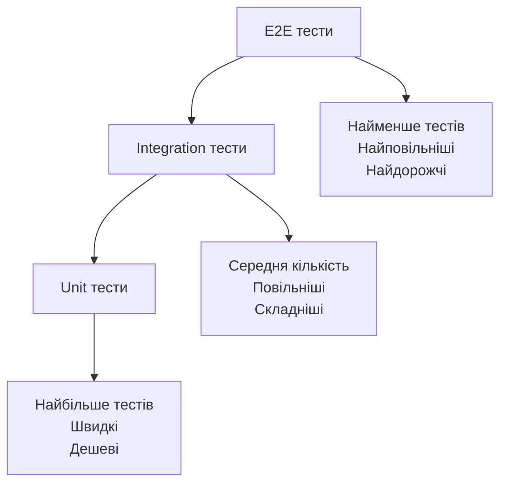

# Лабораторна робота 07 Написання unit та integration тестів

## 🎯 Мета роботи

Набуття практичних навичок написання автоматизованих тестів для вебзастосунку, розуміння різниці між модульними (unit) та інтеграційними (integration) тестами, вміння запускати тести та інтерпретувати їхні результати.

## ✅ Завдання

Написати автоматизовані тести для Flask-застосунку, розробленого в попередніх лабораторних роботах, використовуючи фреймворк **pytest**.

Обов'язкові вимоги:

- написати unit тести для окремих функцій вашого застосунку (мінімум 5 тестів);
- написати integration тести для API ендпоінтів з лабораторної роботи 5 (мінімум 3 тести);
- усі тести мають успішно проходити командою `pytest`;
- коротко описати тестові сценарії у файлі `TESTING.md`.

> [!TIP]
> **Що тестувати, якщо у проєкті мало «окремих функцій»**
>
> Найзручніше для unit тестів — функції, які отримують дані й повертають результат: перевірка (валідація) полів форми, підрахунок суми замовлення, застосування знижки, форматування ціни. Якщо така логіка зараз записана прямо всередині маршруту, винесіть її в окрему функцію — це і є перший крок до тестованого коду.

## 🖥️ Програмне забезпечення

- мова програмування Python [https://www.python.org/](https://www.python.org/);
- фреймворк для тестування pytest [docs.pytest.org](https://docs.pytest.org/);
- плагін вимірювання покриття коду pytest-cov [pytest-cov.readthedocs.io](https://pytest-cov.readthedocs.io/) (для високого рівня);
- середовище розробки Visual Studio Code (з розширенням Python) або PyCharm;
- Git для контролю версій.

## 👥 Форма виконання роботи

Форма виконання роботи **групова** (3-4 особи в команді).

## 📝 Критерії оцінювання

Оцінювання лабораторної роботи здійснюється за національною шкалою та враховує повноту виконання завдання, якість написаних тестів та рівень розуміння принципів тестування.

**Середній рівень (оцінка "задовільно", 4-6 балів):**

- написано мінімум 5 unit тестів для функцій застосунку;
- написано мінімум 3 integration тести для API ендпоінтів;
- усі тести успішно виконуються;
- у файлі `TESTING.md` перелічено тести та що кожен із них перевіряє;
- під час захисту здобувач освіти може пояснити різницю між unit та integration тестами та призначення написаних тестів.

**Достатній рівень (оцінка "добре", 7-9 балів):**

- всі вимоги середнього рівня;
- тести перевіряють не лише успішні (позитивні), а й помилкові (негативні) сценарії: некоректні дані, неіснуючий ресурс (коди 400, 404);
- для integration тестів використано fixture з окремою тестовою базою даних, тож тести не змінюють робочу базу;
- тести розкладено у директорії `tests/`, налаштовано файл `pytest.ini`;
- під час захисту здобувач освіти може пояснити вибір тестових даних та очікуваних результатів.

**Високий рівень (оцінка "відмінно", 10-12 балів):**

- всі вимоги достатнього рівня;
- тести оформлено за схемою AAA (Arrange, Act, Assert);
- перевірено граничні випадки (порожні рядки, нуль, дуже великі значення тощо), використано параметризовані тести `@pytest.mark.parametrize`;
- виміряно покриття коду тестами (pytest-cov), знімок звіту додано до `TESTING.md`;
- за бажанням: налаштовано автоматичний запуск тестів у GitHub Actions;
- під час захисту здобувач освіти демонструє глибоке розуміння принципів тестування, може обґрунтувати, що саме і чому тестується, проявлено творчий підхід до тестування.

## ⏰ Політика щодо дедлайнів

При порушенні встановленого терміну здачі лабораторної роботи максимальна можлива оцінка становить 9 балів ("добре"), незалежно від якості виконаної роботи. Винятки можливі лише за поважних причин, підтверджених документально.

## 📚 Теоретичні відомості

### Типи тестування програмного забезпечення

Тестування є критично важливою частиною розробки якісного програмного забезпечення. Автоматизований тест — це невелика програма, яка викликає ваш код з певними даними й перевіряє, чи отримано очікуваний результат. Перевагу такого підходу легко відчути: після кожної зміни в коді достатньо однієї команди, щоб за кілька секунд переконатися, що нічого не зламалося.

**Unit тестування** (модульне) перевіряє роботу окремих функцій в ізоляції від решти системи: без бази даних, мережі та вебсервера. Unit тести швидкі, незалежні один від одного та легкі в підтримці, тому їх має бути найбільше.

**Integration тестування** (інтеграційне) перевіряє взаємодію кількох частин системи. У нашому випадку — чи правильно API ендпоінт приймає запит, працює з базою даних і повертає відповідь з потрібним кодом. Integration тести повільніші, бо задіюють більше компонентів.

### Піраміда тестування



Піраміда тестування показує оптимальний розподіл зусиль між різними типами тестів. Основу піраміди складають unit тести, яких має бути найбільше. Integration тестів має бути менше, вони перевіряють критичні точки взаємодії. На вершині знаходяться end-to-end (наскрізні) тести, які імітують дії користувача в браузері; їх найменше через складність і повільність. У цій лабораторній роботі E2E тести не пишемо.

### Як працює pytest

pytest автоматично знаходить файли, назви яких починаються з `test_`, і запускає в них функції, назви яких теж починаються з `test_`. Перевірка записується звичайним оператором `assert`: якщо умова хибна, тест вважається проваленим, і pytest покаже, яке значення очікувалося, а яке отримано.

```python
def test_sum():
    assert 2 + 2 == 4
```

### Структура тесту AAA

Тести зручно писати за схемою AAA (Arrange-Act-Assert):

**Arrange** (підготовка) — створюємо тестові дані.

**Act** (виконання) — викликаємо функцію або надсилаємо запит.

**Assert** (перевірка) — перевіряємо, що результат відповідає очікуванням.

### Fixtures

**Fixture** — це функція, яка готує все необхідне для тесту (тестовий клієнт, тимчасову базу даних, тестові дані) і передає це в тест. Тест «замовляє» fixture, просто вказавши її назву як параметр. Завдяки fixtures кожен тест починає роботу в однакових, передбачуваних умовах і не залежить від інших тестів.

Для Flask-застосунку головна fixture — **тестовий клієнт** (`app.test_client()`). Він надсилає запити до застосунку без запуску справжнього сервера, тому integration тести виконуються швидко.

### Покриття коду тестами

Покриття коду (code coverage) показує, яка частина рядків коду виконувалась під час тестів. Високе покриття не гарантує відсутність помилок, але низьке покриття точно вказує на неперевірені ділянки коду.

## 🟣 Ресурси

- [pytest: Get Started](https://docs.pytest.org/en/stable/getting-started.html)
- [pytest: How to use fixtures](https://docs.pytest.org/en/stable/how-to/fixtures.html)
- [pytest: How to parametrize tests](https://docs.pytest.org/en/stable/how-to/parametrize.html)
- [Flask: Testing Flask Applications](https://flask.palletsprojects.com/en/stable/testing/)
- [pytest-cov — документація](https://pytest-cov.readthedocs.io/)
- [Python testing in Visual Studio Code](https://code.visualstudio.com/docs/python/testing)
- [pytest www.youtube.com](https://www.youtube.com/results?search_query=pytest+flask)

## ▶️ Хід роботи

### 1. Підготовка середовища для тестування

Активуйте віртуальне середовище проєкту та встановіть pytest:

```bash
pip install pytest pytest-cov
pip freeze > requirements.txt
```

Створіть у корені проєкту директорію `tests/` і файл `pytest.ini`:

```ini
[pytest]
testpaths = tests
pythonpath = .
```

Параметр `pythonpath = .` дозволяє в тестах імпортувати ваш застосунок (`from app import ...`), а `testpaths` вказує, де шукати тести.

Структура проєкту після підготовки:

```
project/
├── app.py
├── pytest.ini
├── requirements.txt
└── tests/
    ├── conftest.py        # спільні fixtures
    ├── test_validators.py # unit тести
    └── test_api.py        # integration тести
```

### 2. Написання unit тестів

Знайдіть у своєму застосунку функції з логікою, яку можна перевірити окремо (або винесіть таку логіку в функцію). Наприклад, функція перевірки даних товару:

```python
# app.py (фрагмент)
def validate_product(data):
    errors = []
    if not data or not str(data.get('name', '')).strip():
        errors.append("Поле name обов'язкове")
    price = (data or {}).get('price')
    if not isinstance(price, (int, float)) or price < 0:
        errors.append("Поле price має бути невід'ємним числом")
    return errors
```

Unit тести для неї:

```python
# tests/test_validators.py
import pytest
from app import validate_product

def test_valid_product_has_no_errors():
    # Arrange
    data = {'name': 'Чай', 'price': 50}

    # Act
    errors = validate_product(data)

    # Assert
    assert errors == []

def test_empty_name_is_error():
    assert "Поле name обов'язкове" in validate_product({'name': '  ', 'price': 10})

def test_negative_price_is_error():
    assert len(validate_product({'name': 'Чай', 'price': -1})) == 1

def test_no_data_gives_two_errors():
    assert len(validate_product(None)) == 2

@pytest.mark.parametrize('price', [0, 9.99, 1000])
def test_correct_prices(price):
    assert validate_product({'name': 'Кава', 'price': price}) == []
```

Останній тест параметризований: pytest запустить його тричі — для кожного значення `price`.

### 3. Написання integration тестів

Integration тести надсилають запити до API через тестовий клієнт Flask. Щоб тести не змінювали вашу робочу базу даних, кожен тест має працювати з тимчасовою базою. Для цього шлях до бази даних у застосунку має братися з `app.config['DATABASE']` (як у прикладі з лабораторної роботи 4), а функція створення таблиць (`init_db()`) — бути окремою.

Спільні fixtures записують у файл `tests/conftest.py` — pytest підключає його автоматично:

```python
# tests/conftest.py
import pytest
from app import app as flask_app, init_db

@pytest.fixture
def client(tmp_path):
    # Arrange: тимчасова база даних у тимчасовій директорії тесту
    flask_app.config['TESTING'] = True
    flask_app.config['DATABASE'] = str(tmp_path / 'test.db')
    with flask_app.app_context():
        init_db()
    with flask_app.test_client() as client:
        yield client
```

Вбудована fixture `tmp_path` створює для кожного тесту нову порожню директорію, тому кожен тест отримує чисту базу даних.

```python
# tests/test_api.py
def test_get_products_empty(client):
    response = client.get('/api/products')

    assert response.status_code == 200
    assert response.json == []

def test_create_product(client):
    # Arrange
    product = {'name': 'Чай', 'price': 50}

    # Act
    response = client.post('/api/products', json=product)

    # Assert
    assert response.status_code == 201
    assert response.json['name'] == 'Чай'
    assert 'id' in response.json

def test_create_then_get(client):
    created = client.post('/api/products', json={'name': 'Кава', 'price': 80}).json

    response = client.get(f"/api/products/{created['id']}")

    assert response.status_code == 200
    assert response.json['price'] == 80

def test_create_invalid_returns_400(client):
    response = client.post('/api/products', json={'name': ''})
    assert response.status_code == 400

def test_unknown_product_returns_404(client):
    response = client.get('/api/products/999')
    assert response.status_code == 404
```

Адаптуйте адреси, поля та очікувані коди відповідей під своє API.

### 4. Запуск тестів

Запустіть усі тести з кореня проєкту:

```bash
pytest
```

Для детальнішого виводу (назва кожного тесту та його результат):

```bash
pytest -v
```

Якщо тест провалено, pytest покаже назву тесту, рядок з `assert` та фактичне значення. Розберіться, де помилка — у тесті чи в коді застосунку, — і виправте її.

> [!NOTE]
> **Запуск з VS Code**
>
> Розширення Python для VS Code має вкладку **Testing** (значок колби): після вибору pytest як фреймворку тести можна запускати окремо й бачити результат біля кожної функції.

### 5. Вимірювання покриття коду (для високого рівня)

```bash
pytest --cov=app --cov-report=term-missing
```

У звіті для кожного файлу видно відсоток покриття та номери рядків, які не виконувались під час тестів (`Missing`). Подумайте, чи варто написати для них тести.

### 6. Документування тестових сценаріїв

Створіть у корені проєкту файл `TESTING.md`. Рекомендована структура:

- команда запуску тестів;
- перелік unit тестів: назва тесту, що перевіряє, очікуваний результат (зручно у вигляді таблиці);
- перелік integration тестів: назва тесту, запит, очікуваний код відповіді;
- скріншот результату `pytest -v` (для високого рівня — також звіту про покриття);
- висновки.

### 7. Підготовка, здача та захист лабораторної

Переконатись, що всі тести успішно виконуються. Додати до `TESTING.md` скріншот результату запуску тестів (і звіту про покриття — для високого рівня). Як відповідь на завдання в LMS Moodle дати посилання на репозиторій з проєктом. Захистити лабораторну перед викладачем, продемонструвавши запуск тестів і розуміння написаних тестів.

[👉 Здати лабораторну роботу](https://moodle.vcolnuft.volyn.ua/moodle/course/view.php?id=1426#section-2)

## ❓ Контрольні запитання

1. У чому полягає різниця між unit та integration тестами? Наведіть приклади з вашого проєкту.
2. Що таке схема AAA (Arrange-Act-Assert) та чому вона робить тести зрозумілішими?
3. Як pytest знаходить тести і як записується перевірка в тесті?
4. Що таке fixture і навіщо integration тестам окрема тестова база даних?
5. Навіщо перевіряти не лише успішні, а й помилкові сценарії?
6. Що показує метрика покриття коду тестами? Чи означає 100% покриття відсутність помилок у коді?
7. Чому unit тестів має бути більше ніж integration тестів згідно з пірамідою тестування?
