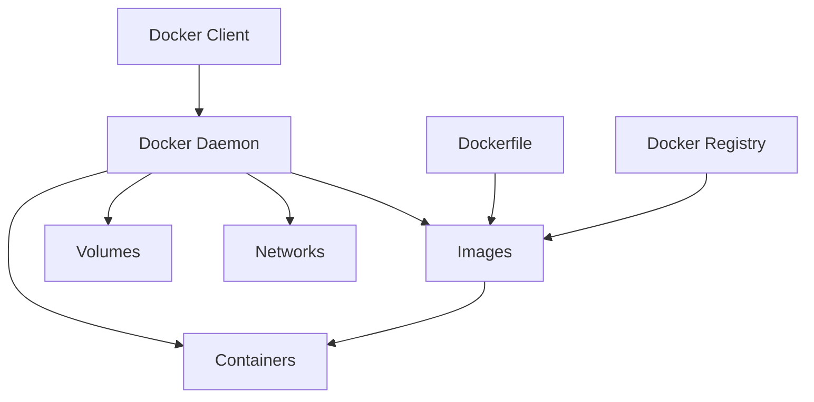

# Лабораторна робота 08 Контейнеризація проєкту

## 🎯 Мета роботи

Набуття практичних навичок контейнеризації вебзастосунків за допомогою Docker, розуміння принципів роботи контейнерів та оркестрації багатоконтейнерних додатків, а також підготовка проєкту до розгортання в робочому (production) середовищі.

## ✅ Завдання

Виконати контейнеризацію раніше розробленого Flask вебпроєкту з SQLite базою даних, створивши повне контейнерне середовище для його розгортання.

### Основні вимоги

1. Створити Dockerfile для Flask застосунку з оптимізацією розміру образу.
2. Налаштувати файл Docker Compose (`compose.yaml`) для запуску застосунку.
3. Організувати збереження SQLite бази даних через volumes.
4. Додати змінні середовища для конфігурації застосунку.
5. Налаштувати health check для перевірки працездатності застосунку.
6. Підготувати документацію для запуску проєкту в контейнерах.

## 🖥️ Програмне забезпечення

- Docker Desktop [docker.com](https://www.docker.com/products/docker-desktop) - платформа для контейнеризації додатків (містить Docker Engine та Docker Compose; у Windows потребує WSL 2, який інсталятор пропонує увімкнути).
- Git - система контролю версій для збереження конфігураційних файлів.
- Visual Studio Code з розширенням Container Tools (або інший редактор) для редагування Dockerfile та `compose.yaml`.

## 👥 Форма виконання роботи

Форма виконання роботи **групова** (3-4 особи в команді).

## 📝 Критерії оцінювання

### Середній рівень (оцінка "задовільно", 4-6 балів)

Виконано базову контейнеризацію застосунку:

- створено простий Dockerfile для Flask застосунку;
- застосунок успішно запускається в контейнері;
- налаштовано `compose.yaml` для запуску сервісу;
- SQLite база даних зберігається у volume;
- проєкт запускається командою `docker compose up`;
- підготовлено базову документацію із командами запуску.

Під час захисту здобувач освіти демонструє базове розуміння концепції контейнеризації, може пояснити призначення основних директив у Dockerfile та структуру `compose.yaml`. Допускаються помилки у налаштуванні volumes, які не перешкоджають базовій роботі застосунку.

### Достатній рівень (оцінка "добре", 7-9 балів)

Виконано якісну контейнеризацію з оптимізацією:

- всі вимоги середнього рівня;
- використано багатоетапну збірку (multi-stage build) для зменшення розміру образу;
- правильно налаштовано volume для збереження SQLite бази даних з коректними правами доступу;
- додано файл .dockerignore для виключення непотрібних файлів;
- налаштовано змінні середовища через .env файл;
- додано health check для контейнера;
- документація містить опис конфігурації та змінних середовища.

Під час захисту здобувач освіти демонструє розуміння переваг багатоетапної збірки, може пояснити особливості роботи з SQLite у контейнерах, розуміє принципи збереження даних через volumes. Допускаються незначні неоптимальні рішення, які не впливають на функціональність.

### Високий рівень (оцінка "відмінно", 10-12 балів)

Виконано професійну контейнеризацію з додатковими можливостями:

- всі вимоги достатнього рівня;
- оптимізовано Dockerfile із використанням кешування шарів та полегшеного (slim) базового образу;
- налаштовано restart policies для автоматичного перезапуску сервісу;
- створено окремі конфігурації для development та production середовищ;
- додано додаткові сервіси (наприклад, Nginx як reverse proxy);
- реалізовано логування контейнера;
- налаштовано backup стратегію для бази даних;
- документація включає troubleshooting секцію та опис архітектури.

Під час захисту здобувач освіти демонструє глибоке розуміння архітектури Docker, може обґрунтувати прийняті рішення щодо оптимізації, пояснити особливості роботи з файловою базою даних у контейнерах. Проявлено творчий підхід до організації контейнерного середовища.

## ⏰ Політика щодо дедлайнів

При порушенні встановленого терміну здачі лабораторної роботи максимальна можлива оцінка становить 9 балів ("добре"), незалежно від якості виконаної роботи. Винятки можливі лише за поважних причин, підтверджених документально.

## 📚 Теоретичні відомості

### Контейнеризація та Docker

Контейнеризація — це метод віртуалізації на рівні операційної системи, який дозволяє запускати додатки в ізольованих середовищах, які називаються контейнерами. На відміну від віртуальних машин, контейнери використовують спільне ядро операційної системи, що робить їх легшими та швидшими.

Docker — це платформа для розробки, доставки та запуску додатків у контейнерах. Docker автоматизує розгортання застосунків всередині контейнерів, забезпечуючи додаткову абстракцію та автоматизацію віртуалізації на рівні операційної системи.

### Основні переваги контейнеризації

Контейнери забезпечують однаковість середовища на всіх етапах розробки. Застосунок, який працює на машині розробника, працюватиме так само в тестовому та робочому середовищах. Це усуває класичну проблему "works on my machine" («а на моєму комп'ютері все працює»).

Портативність контейнерів дозволяє легко переміщувати додатки між різними платформами та хмарними провайдерами. Контейнер з усіма залежностями може працювати на будь-якій системі, де встановлено Docker.

Ефективність використання ресурсів є важливою перевагою контейнерів порівняно з віртуальними машинами. Контейнери споживають менше пам'яті та CPU, оскільки не потребують повної операційної системи для кожного екземпляра.

Швидкість розгортання контейнерів вимірюється секундами, тоді як віртуальні машини можуть запускатися хвилинами. Це значно прискорює процес розробки та тестування.

### Архітектура Docker



Docker Client — це інтерфейс командного рядка, через який користувачі взаємодіють з Docker. Команди, які ви вводите, надсилаються до Docker Daemon.

Docker Daemon — це фоновий процес, який управляє контейнерами, образами, мережами та volumes. Daemon слухає API запити та виконує відповідні операції.

Docker Image (образ) — це шаблон лише для читання, який містить усе необхідне для створення контейнера. Образи будуються з Dockerfile та можуть базуватися на інших образах.

Docker Container — це запущений екземпляр образу. Контейнер є ізольованим процесом з власною файловою системою, мережею та ресурсами.

Docker Registry — сховище образів. Найвідоміше — Docker Hub, звідки завантажуються базові образи на кшталт `python:3.13-slim`.

### Dockerfile: структура та директиви

Dockerfile — це текстовий файл, який містить інструкції для автоматичної збірки Docker образу. Інструкції, що змінюють файлову систему (`RUN`, `COPY`), створюють нові шари образу.

Базовий образ визначається директивою FROM та є основою для вашого застосунку:

```dockerfile
FROM python:3.13-slim
```

Робоча директорія встановлюється через WORKDIR. Всі наступні команди виконуватимуться відносно цієї директорії:

```dockerfile
WORKDIR /app
```

Копіювання файлів здійснюється командами COPY або ADD. COPY просто копіює файли, тоді як ADD може також розпаковувати архіви:

```dockerfile
COPY requirements.txt .
COPY . .
```

Виконання команд під час збірки образу виконується через RUN. Це можуть бути встановлення пакетів, створення директорій або інші операції:

```dockerfile
RUN pip install --no-cache-dir -r requirements.txt
```

Змінні середовища встановлюються через ENV та будуть доступні в контейнері:

```dockerfile
ENV DATABASE_PATH=/app/data/database.db
ENV PYTHONUNBUFFERED=1
```

`PYTHONUNBUFFERED=1` змушує Python одразу виводити повідомлення, тому вони без затримки з'являються в логах контейнера.

Відкриття портів декларується через EXPOSE. Це документує, які порти використовує застосунок:

```dockerfile
EXPOSE 5000
```

Команда запуску визначається через CMD або ENTRYPOINT. CMD задає команду за замовчуванням, яка може бути перевизначена, а ENTRYPOINT задає незмінну команду:

```dockerfile
CMD ["python", "app.py"]
```

### Багатоетапна збірка

Багатоетапна збірка дозволяє використовувати кілька FROM інструкцій в одному Dockerfile. Це допомагає зменшити розмір фінального образу, залишивши в ньому лише необхідні для запуску файли:

```dockerfile
# Етап встановлення залежностей
FROM python:3.13-slim AS builder
RUN python -m venv /opt/venv
ENV PATH="/opt/venv/bin:$PATH"
COPY requirements.txt .
RUN pip install --no-cache-dir -r requirements.txt

# Фінальний етап
FROM python:3.13-slim
WORKDIR /app
COPY --from=builder /opt/venv /opt/venv
ENV PATH="/opt/venv/bin:$PATH"
COPY . .
CMD ["python", "app.py"]
```

У цьому прикладі перший етап встановлює Python пакети у віртуальне середовище `/opt/venv`, а другий етап копіює лише готове середовище. Кеш pip, тимчасові файли та інструменти збірки (якщо вони знадобилися для компіляції пакетів) залишаються в першому етапі та не потрапляють у фінальний образ.

> [!WARNING]
> **Обидва етапи мають використовувати однаковий базовий образ**
>
> У старих прикладах трапляється збірка на `python:...-slim` (Debian) з копіюванням пакетів у `python:...-alpine`. Так робити не варто: Alpine використовує іншу системну бібліотеку C (musl замість glibc), тому скомпільовані частини пакетів можуть не запуститися. Для Python-застосунків у навчальних проєктах оптимальним є образ `slim`.

### Docker Compose

Docker Compose — це інструмент для визначення та запуску багатоконтейнерних додатків. За допомогою YAML файлу ви описуєте всі сервіси вашого застосунку, а потім запускаєте їх однією командою.

Сучасний Docker Compose (версія 2 і новіші) вбудований у Docker і викликається командою `docker compose` (через пробіл). Стара окрема утиліта `docker-compose` (через дефіс) більше не підтримується. Рекомендована назва файлу — `compose.yaml` (стара назва `docker-compose.yml` теж розпізнається). Рядок `version: '3.8'` на початку файлу застарів і більше не потрібен — Compose лише виводить попередження про нього.

Основна структура `compose.yaml` включає опис сервісів та volumes:

```yaml
services:
  web:
    build: .
    ports:
      - "5000:5000"
    environment:
      - DATABASE_PATH=/app/data/database.db
    volumes:
      - sqlite_data:/app/data

volumes:
  sqlite_data:
```

Директива services визначає контейнери, які складають ваш застосунок. Кожен сервіс може бути побудований з Dockerfile або використовувати готовий образ.

### Volumes та збереження даних

Volumes — це механізм Docker для збереження даних, які генеруються та використовуються контейнерами. Дані в volumes зберігаються навіть після видалення контейнера.

Для SQLite бази даних це особливо важливо, оскільки база даних зберігається у файлі. Без volume всі дані будуть втрачені при видаленні контейнера (зокрема при `docker compose down` або перезбиранні образу).

Named volumes керуються Docker і зберігаються в спеціальній директорії на хост-системі:

```yaml
volumes:
  - sqlite_data:/app/data
```

Це означає, що директорія `/app/data` всередині контейнера буде збережена у volume з назвою `sqlite_data`, і дані не зникнуть при перезапуску.

Bind mounts прив'язують директорію з хост-системи до контейнера. Це зручно для розробки, коли потрібен доступ до бази даних з хост-системи:

```yaml
volumes:
  - ./data:/app/data
```

### Особливості роботи з SQLite у контейнерах

SQLite зберігає всю базу даних в одному файлі, що спрощує роботу з контейнерами порівняно з клієнт-серверними базами даних. Проте є кілька важливих моментів.

Шлях до файлу бази даних має братися зі змінної середовища, а сам файл — лежати в директорії, яку підключено як volume (`/app/data`). Якщо файл бази даних лежить поруч з `app.py`, він потрапить в образ і кожне перезбирання образу «скидатиме» базу.

Права доступу до файлу бази даних мають бути правильно налаштовані. Flask застосунок повинен мати можливість читати та писати у файл бази даних. Зазвичай це вирішується створенням директорії для даних під час збірки образу:

```dockerfile
RUN mkdir -p /app/data
```

Ініціалізація бази даних при першому запуску може бути автоматизована: якщо таблиць ще немає, застосунок має створити їх (`CREATE TABLE IF NOT EXISTS ...`).

Backup бази даних спрощується тим, що потрібно скопіювати лише один файл. Це можна автоматизувати через cron завдання або окремий контейнер.

### Health Checks

Health checks дозволяють Docker перевіряти, чи працює контейнер коректно. Docker періодично виконує вказану команду всередині контейнера: якщо вона завершилася успішно — контейнер `healthy`, якщо ні — `unhealthy`.

Команда перевірки має використовувати лише ті програми, які є в образі. В образі `python:3.13-slim` немає `curl` і `wget`, зате є сам Python, тож перевірку зручно робити ним:

```dockerfile
HEALTHCHECK --interval=30s --timeout=3s --start-period=10s --retries=3 \
  CMD python -c "import urllib.request; urllib.request.urlopen('http://localhost:5000/health')" || exit 1
```

Те саме у `compose.yaml`:

```yaml
healthcheck:
  test: ["CMD", "python", "-c", "import urllib.request; urllib.request.urlopen('http://localhost:5000/health')"]
  interval: 30s
  timeout: 3s
  retries: 3
  start_period: 10s
```

Для Flask застосунку варто створити спеціальний endpoint `/health`, який повертає статус сервісу та перевіряє доступність бази даних (див. крок 6 ходу роботи).

### Змінні середовища та безпека

Змінні середовища зберігаються в .env файлі, який не повинен потрапляти в систему контролю версій:

```env
SECRET_KEY=your-secret-key-here
DATABASE_PATH=/app/data/database.db
FLASK_DEBUG=0
```

> [!NOTE]
> **FLASK_ENV більше не використовується**
>
> Змінна `FLASK_ENV`, яка трапляється в старих прикладах, видалена з Flask 2.3. Режим налагодження вмикається змінною `FLASK_DEBUG=1` (або параметром `debug=True`). У робочому середовищі режим налагодження має бути вимкнений.

У `compose.yaml` вони використовуються так:

```yaml
services:
  web:
    env_file:
      - .env
```

Важливо додати .env до .gitignore, щоб чутливі дані не потрапили в репозиторій.

### Оптимізація Docker образів

Зменшення розміру образу покращує швидкість розгортання та економить дисковий простір. Використовуйте полегшені (slim) варіанти базових образів:

```dockerfile
FROM python:3.13-slim
```

Об'єднання пов'язаних команд в один RUN зменшує кількість шарів і дозволяє видаляти тимчасові файли в тому самому шарі, де вони з'явилися:

```dockerfile
RUN apt-get update && \
    apt-get install -y --no-install-recommends gcc && \
    pip install --no-cache-dir -r requirements.txt && \
    apt-get purge -y gcc && rm -rf /var/lib/apt/lists/*
```

Використання .dockerignore файлу виключає непотрібні файли з контексту збірки:

```
__pycache__
*.pyc
.pytest_cache
.git
.env
.venv
venv
.vscode
data/
```

Кешування залежностей прискорює збірку. Копіюйте файли залежностей окремо та встановлюйте їх перед копіюванням решти коду — тоді при зміні лише коду Docker повторно використає вже встановлені пакети:

```dockerfile
COPY requirements.txt .
RUN pip install --no-cache-dir -r requirements.txt
COPY . .
```

## 🟣 Ресурси

- [Docker: Get started](https://docs.docker.com/get-started/)
- [Dockerfile reference](https://docs.docker.com/reference/dockerfile/)
- [Docker Compose — документація](https://docs.docker.com/compose/)
- [Multi-stage builds](https://docs.docker.com/build/building/multi-stage/)
- [Docker volumes](https://docs.docker.com/engine/storage/volumes/)
- [Офіційний образ Python на Docker Hub](https://hub.docker.com/_/python)
- [Docker www.youtube.com](https://www.youtube.com/results?search_query=docker+flask)

## ▶️ Хід роботи

### 1. Підготовка проєкту

Переконайтеся, що ваш Flask проєкт знаходиться в Git репозиторії та має чітку структуру. Типова структура проєкту:

```
myproject/
├── app.py
├── models.py
├── templates/
├── static/
├── tests/
├── requirements.txt
└── data/
    └── database.db
```

Встановіть Docker Desktop на вашу систему, запустіть його та переконайтеся, що Docker працює коректно:

```bash
docker --version
docker compose version
docker run hello-world
```

Остання команда завантажує тестовий образ і запускає його; якщо ви бачите повідомлення `Hello from Docker!`, середовище готове.

### 2. Створення requirements.txt

Якщо у вас ще немає актуального файлу requirements.txt, створіть його з активованого віртуального середовища проєкту:

```bash
pip freeze > requirements.txt
```

Приклад вмісту:

```
Flask==3.1.3
flask-cors==6.0.5
flasgger==0.9.7.1
```

Переконайтеся, що в списку є всі бібліотеки, які імпортує ваш застосунок, — інакше контейнер завершиться з помилкою `ModuleNotFoundError`.

### 3. Створення Dockerfile

Створіть файл з назвою `Dockerfile` (без розширення) в кореневій директорії проєкту:

```dockerfile
# Етап 1: встановлення залежностей
FROM python:3.13-slim AS builder

# Створюємо віртуальне середовище, яке потім скопіюємо у фінальний образ
RUN python -m venv /opt/venv
ENV PATH="/opt/venv/bin:$PATH"

# Спочатку копіюємо лише список залежностей — для кешування шару
COPY requirements.txt .
RUN pip install --no-cache-dir -r requirements.txt

# Етап 2: фінальний образ
FROM python:3.13-slim

WORKDIR /app

# Копіюємо встановлені пакети з етапу збірки
COPY --from=builder /opt/venv /opt/venv

# Налаштування змінних середовища
ENV PATH="/opt/venv/bin:$PATH" \
    PYTHONUNBUFFERED=1 \
    DATABASE_PATH=/app/data/database.db

# Створюємо директорію для бази даних
RUN mkdir -p /app/data

# Копіюємо код застосунку
COPY . .

# Відкриваємо порт
EXPOSE 5000

# Health check (у slim-образі немає curl/wget, тому використовуємо Python)
HEALTHCHECK --interval=30s --timeout=3s --start-period=10s --retries=3 \
  CMD python -c "import urllib.request; urllib.request.urlopen('http://localhost:5000/health')" || exit 1

# Команда запуску
CMD ["python", "app.py"]
```

Для середнього рівня достатньо одноетапного варіанту:

```dockerfile
FROM python:3.13-slim
WORKDIR /app
COPY requirements.txt .
RUN pip install --no-cache-dir -r requirements.txt
RUN mkdir -p /app/data
COPY . .
ENV DATABASE_PATH=/app/data/database.db PYTHONUNBUFFERED=1
EXPOSE 5000
CMD ["python", "app.py"]
```

### 4. Створення .dockerignore

Створіть файл `.dockerignore` для виключення непотрібних файлів з контексту збірки:

```
__pycache__
*.pyc
*.pyo
.pytest_cache
.coverage
htmlcov
.git
.gitignore
.env
.venv
venv
env
.vscode
.idea
*.log
.DS_Store
data/
```

Директорію `data/` виключаємо, щоб локальна база даних з комп'ютера розробника не потрапила в образ.

### 5. Оновлення Flask застосунку

Переконайтеся, що шлях до бази даних береться зі змінних середовища, а сервер слухає адресу `0.0.0.0`. Оновіть ваш `app.py`:

```python
import os
from flask import Flask

app = Flask(__name__)

# Отримуємо шлях до бази даних зі змінної середовища
app.config['DATABASE'] = os.environ.get('DATABASE_PATH', 'data/database.db')
app.config['SECRET_KEY'] = os.environ.get('SECRET_KEY', 'dev-secret-key')

# Решта коду: get_db(), init_db(), маршрути...

if __name__ == '__main__':
    # Створюємо директорію для бази даних, якщо її немає
    os.makedirs(os.path.dirname(app.config['DATABASE']), exist_ok=True)

    # Ініціалізуємо базу даних при першому запуску
    with app.app_context():
        init_db()

    # Запускаємо сервер
    app.run(host='0.0.0.0', port=5000,
            debug=os.environ.get('FLASK_DEBUG') == '1')
```

> [!WARNING]
> **Чому host='0.0.0.0' обов'язковий**
>
> За замовчуванням `app.run()` слухає лише адресу `127.0.0.1` — тобто приймає з'єднання тільки зсередини самого контейнера. Тоді контейнер запускається без помилок, але в браузері сторінка не відкривається. Параметр `host='0.0.0.0'` дозволяє приймати з'єднання ззовні контейнера.

Якщо ви використовуєте SQLAlchemy, замість `init_db()` викличте `db.create_all()`, а шлях передайте в `SQLALCHEMY_DATABASE_URI`.

### 6. Додавання health endpoint

Створіть endpoint для health check, який перевіряє доступність бази даних:

```python
import sqlite3

@app.route('/health')
def health():
    try:
        # Перевіряємо підключення до бази даних
        get_db().execute('SELECT 1')
        return {'status': 'healthy', 'database': 'connected'}, 200
    except sqlite3.Error as e:
        return {'status': 'unhealthy', 'error': str(e)}, 500
```

Якщо ви використовуєте SQLAlchemy 2.x, текстовий SQL потрібно обгорнути у `text()`: `db.session.execute(text('SELECT 1'))`.

### 7. Створення compose.yaml

Створіть файл `compose.yaml` для зручного запуску проєкту:

```yaml
services:
  web:
    build: .
    container_name: flask_app
    ports:
      - "5000:5000"
    env_file:
      - .env
    environment:
      - DATABASE_PATH=/app/data/database.db
    volumes:
      - sqlite_data:/app/data
    restart: unless-stopped
    healthcheck:
      test: ["CMD", "python", "-c", "import urllib.request; urllib.request.urlopen('http://localhost:5000/health')"]
      interval: 30s
      timeout: 3s
      retries: 3
      start_period: 10s

volumes:
  sqlite_data:
```

Для development середовища з автоматичним перезапуском при зміні коду створіть окремий файл `compose.dev.yaml`:

```yaml
services:
  web:
    build: .
    container_name: flask_app_dev
    ports:
      - "5000:5000"
    environment:
      - DATABASE_PATH=/app/data/database.db
      - FLASK_DEBUG=1
      - SECRET_KEY=dev-secret-key
    volumes:
      - .:/app
      - sqlite_data:/app/data
    command: python app.py

volumes:
  sqlite_data:
```

Запуск development конфігурації: `docker compose -f compose.dev.yaml up`. Bind mount `.:/app` підключає код з вашого комп'ютера в контейнер, а `FLASK_DEBUG=1` вмикає режим налагодження з автоматичним перезапуском, тому зміни у файлах одразу видно без перезбирання образу.

### 8. Створення .env файлу

Створіть файл `.env` для зберігання змінних середовища (додайте його до .gitignore):

```env
# Flask configuration
SECRET_KEY=your-random-secret-key-here
FLASK_DEBUG=0
```

Випадковий ключ можна згенерувати командою `python -c "import secrets; print(secrets.token_hex(32))"`.

Створіть також файл `.env.example` з шаблоном (його можна додати в репозиторій):

```env
# Flask configuration
SECRET_KEY=change-this-to-random-string
FLASK_DEBUG=0
```

Оновіть .gitignore:

```
.env
data/
```

### 9. Збірка та запуск контейнерів

Виконайте збірку образу:

```bash
docker compose build
```

Перегляньте розмір створеного образу:

```bash
docker images
```

Запустіть застосунок:

```bash
docker compose up -d
```

Перегляньте стан контейнера:

```bash
docker compose ps
```

Перегляньте логи:

```bash
docker compose logs -f web
```

### 10. Тестування застосунку

Відкрийте браузер та перейдіть на `http://localhost:5000`. Перевірте, чи всі функції застосунку працюють коректно.

Додайте кілька записів до бази даних через інтерфейс застосунку. Потім зупиніть і видаліть контейнер та запустіть знову:

```bash
docker compose down
docker compose up -d
```

Переконайтеся, що дані збереглися та не втратилися після перезапуску.

### 11. Перевірка health check

Перегляньте статус health check:

```bash
docker compose ps
```

У колонці STATUS ви побачите `healthy` або `unhealthy` (протягом перших секунд — `health: starting`).

Детальніша інформація:

```bash
docker inspect --format "{{json .State.Health}}" flask_app
```

### 12. Робота з базою даних

Якщо потрібно створити backup бази даних:

```bash
docker compose exec web cp /app/data/database.db /app/data/backup.db
```

Або скопіювати на хост-систему:

```bash
docker cp flask_app:/app/data/database.db ./backup.db
```

Відновлення з backup:

```bash
docker cp ./backup.db flask_app:/app/data/database.db
docker compose restart web
```

### 13. Корисні команди Docker

Зупинка застосунку:

```bash
docker compose down
```

Зупинка з видаленням volumes (база даних буде видалена):

```bash
docker compose down -v
```

Перегляд логів у реальному часі:

```bash
docker compose logs -f
```

Виконання команди в контейнері:

```bash
docker compose exec web sh
```

Перегляд використання ресурсів:

```bash
docker stats flask_app
```

Очищення невикористовуваних ресурсів:

```bash
docker system prune -a
```

Перегляд інформації про volume (назва складається з назви директорії проєкту та назви volume):

```bash
docker volume ls
docker volume inspect myproject_sqlite_data
```

### 14. Налагодження проблем

Якщо контейнер не запускається, перегляньте логи:

```bash
docker compose logs web
```

Типові причини:

- `ModuleNotFoundError` — бібліотеки немає в `requirements.txt`;
- контейнер працює, але сторінка не відкривається — у `app.run()` не вказано `host='0.0.0.0'`;
- `port is already allocated` — порт 5000 зайнятий (наприклад, локально запущеним Flask або службою AirPlay Receiver у macOS); змініть ліву частину відображення порту: `"5001:5000"`;
- `env file .env not found` — створіть файл `.env` (можна скопіювати з `.env.example`).

Якщо виникають проблеми з правами доступу до бази даних, перевірте права директорії:

```bash
docker compose exec web ls -la /app/data
```

Якщо база даних не ініціалізується, виконайте ініціалізацію вручну:

```bash
docker compose exec web python -c "from app import app, init_db; app.app_context().push(); init_db()"
```

Для перевірки змінних середовища:

```bash
docker compose exec web env
```

### 15. Додавання Nginx (для високого рівня)

Створіть файл `nginx.conf`:

```nginx
server {
    listen 80;
    server_name localhost;

    location / {
        proxy_pass http://web:5000;
        proxy_set_header Host $host;
        proxy_set_header X-Real-IP $remote_addr;
        proxy_set_header X-Forwarded-For $proxy_add_x_forwarded_for;
    }

    location /static/ {
        alias /app/static/;
    }
}
```

Оновіть `compose.yaml`:

```yaml
services:
  web:
    build: .
    container_name: flask_app
    expose:
      - "5000"
    env_file:
      - .env
    environment:
      - DATABASE_PATH=/app/data/database.db
    volumes:
      - sqlite_data:/app/data
    restart: unless-stopped

  nginx:
    image: nginx:alpine
    container_name: nginx_proxy
    ports:
      - "80:80"
    volumes:
      - ./nginx.conf:/etc/nginx/conf.d/default.conf:ro
      - ./static:/app/static:ro
    depends_on:
      - web
    restart: unless-stopped

volumes:
  sqlite_data:
```

Тепер застосунок доступний за адресою `http://localhost` (порт 80), а статичні файли Nginx віддає напряму з директорії `static/` проєкту, не звертаючись до Flask.

Для робочого середовища замість вбудованого сервера Flask (`python app.py`) зазвичай використовують WSGI-сервер Gunicorn. Для цього додайте `gunicorn` до `requirements.txt` і змініть команду запуску в Dockerfile: `CMD ["gunicorn", "--bind", "0.0.0.0:5000", "app:app"]`. Зверніть увагу: у такому разі блок `if __name__ == '__main__':` не виконується, тому виклик `init_db()` потрібно перенести за його межі.

### 16. Підготовка документації

Створіть файл `README.md` з описом виконаної роботи та інструкціями щодо запуску проєкту. Рекомендована структура:

- короткий опис застосунку;
- команди запуску проєкту в контейнерах (від клонування репозиторію до відкриття в браузері);
- опис образу: базовий образ, розмір, чи використано багатоетапну збірку;
- сервіси та volumes з `compose.yaml`, змінні середовища (з посиланням на `.env.example`);
- обґрунтування прийнятих рішень (вибір образу, збереження бази даних, оптимізації);
- для високого рівня: схема архітектури та розділ з типовими проблемами;
- висновки.

### 17. Перевірка на «чистій» системі

Переконайтеся, що проєкт запускається з нуля. Видаліть контейнери та volumes (`docker compose down -v`), клонуйте репозиторій у нову директорію, створіть `.env` з `.env.example` і виконайте `docker compose up --build`.

### 18. Здача роботи

Завантажте до системи LMS Moodle:

- посилання на Git репозиторій з усіма файлами (Dockerfile, compose.yaml, .dockerignore, .env.example, README.md).

[👉 Здати лабораторну роботу](https://moodle.vcolnuft.volyn.ua/moodle/course/view.php?id=1426#section-2)

## ❓ Контрольні запитання

1. У чому полягають основні відмінності між контейнерами та віртуальними машинами? Які переваги та недоліки кожного підходу?
2. Поясніть призначення основних директив Dockerfile (FROM, RUN, COPY, CMD, ENTRYPOINT). Коли використовувати CMD, а коли ENTRYPOINT?
3. Що таке багатоетапна збірка (multi-stage build) і як вона допомагає оптимізувати розмір образу?
4. Яка різниця між named volumes та bind mounts? Коли доцільно використовувати кожен тип для SQLite бази даних?
5. Чому важливо виносити SQLite базу даних у volume? Що станеться з даними без використання volume?
6. Навіщо потрібні health checks і як вони впливають на надійність застосунку?
7. Які особливості роботи з файловою базою даних (SQLite) у контейнерах порівняно з клієнт-серверними БД?
