# Лекція 4. Вимоги до ПЗ: збір, аналіз, документування

## Вступ

У попередній лекції ми розглянули моделі життєвого циклу програмного забезпечення — послідовні, ітеративні та гнучкі. Але яким би не був обраний процес, він завжди починається з одного й того самого запитання: а що, власне, потрібно побудувати? Відповідь на це запитання — і є вимогами до системи. Тому інженерія вимог не випадково стоїть на початку практичного блоку курсу: усі подальші теми — архітектура, тестування, управління проєктом — так чи інакше спираються на те, наскільки чітко визначено, що саме розробляється.

Успішність будь-якого програмного проєкту значною мірою залежить від того, наскільки точно та повно визначені вимоги до системи. Недооцінка важливості цього етапу часто призводить до створення систем, які не відповідають очікуванням замовників, перевищують бюджет або потребують кардинального переробляння вже на пізніх стадіях, коли виправлення коштує найдорожче.

Інженерія вимог — це дисципліна, яка займається систематичним підходом до визначення, документування та супроводу вимог протягом усього життєвого циклу програмного продукту. Вона включає не лише технічні аспекти, а й роботу з людьми, розуміння бізнес-контексту та управління змінами — і саме тому, як ми побачимо далі, у гнучких методологіях (їм присвячені наступні лекції) підхід до вимог виглядає інакше, ніж у класичному waterfall, хоча мета лишається тією самою.

## Основні поняття та класифікація вимог

### Визначення вимоги

Вимога до програмного забезпечення — це умова або можливість, яка потрібна користувачу для вирішення проблеми або досягнення мети. Вимога також може бути умовою чи можливістю, яку повинна мати система (або її компонент) для задоволення контракту, стандарту, специфікації чи іншого формально нав'язаного документа.

Кожна вимога повинна описувати щось, що є необхідним, корисним або бажаним для системи. Вимоги служать основою для проєктування архітектури, планування розробки, тестування та приймання системи. Вони також є основним засобом комунікації між зацікавленими сторонами проєкту — часто саме документ вимог є тим "спільним словником", яким користуються замовник, аналітик, розробник і тестувальник, хоча кожен з них дивиться на систему по-своєму.

### Функціональні вимоги

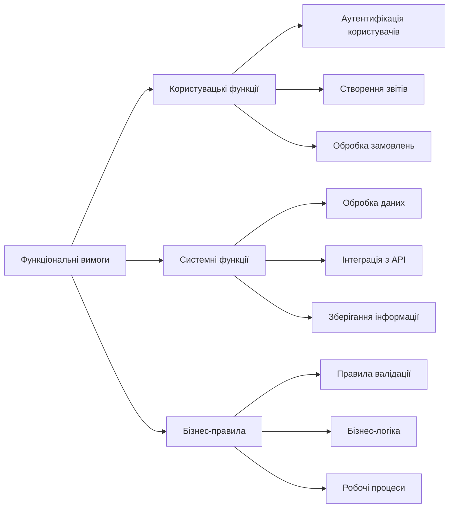

Функціональні вимоги описують, що система повинна робити. Вони визначають функції, які система має виконувати, послуги, які вона надає, та реакції на конкретні вхідні дані. Функціональні вимоги безпосередньо пов'язані з основним призначенням системи.

Функціональні вимоги можуть стосуватися обчислювальної функціональності, можливостей введення й виведення даних, перевірки даних або будь-яких інших специфічних функцій системи. Наприклад, для системи інтернет-магазину функціональними вимогами будуть можливість додавання товарів до кошика, оформлення замовлення, обробка платежів та відстеження статусу доставки.

Приклади функціональних вимог:

- Система повинна дозволяти користувачам реєструватися, вказуючи електронну пошту та пароль.
- Система повинна відправляти електронне повідомлення для підтвердження реєстрації.
- Система повинна дозволяти адміністраторам переглядати список усіх зареєстрованих користувачів.
- Система повинна автоматично блокувати обліковий запис після п'яти невдалих спроб входу.

### Нефункціональні вимоги

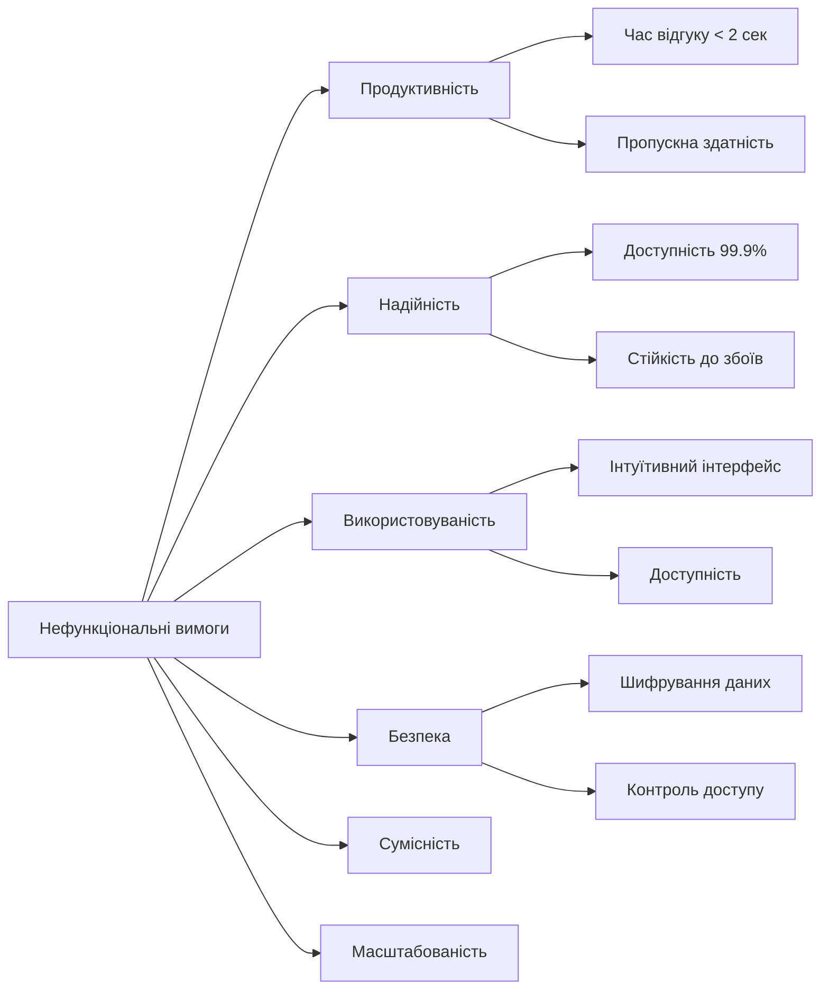

Нефункціональні вимоги описують не стільки що система робить, скільки як вона це робить. Вони визначають якісні характеристики системи та обмеження на її функціонування. На перший погляд функціональні вимоги здаються важливішими — саме вони описують "видиму" частину системи. Але саме нефункціональні вимоги часто визначають, чи буде системою взагалі можливо користуватися: коректно працюючий, але повільний або ненадійний застосунок користувачі просто покинуть.

**Продуктивність** включає вимоги до швидкості відгуку системи, пропускної здатності та ефективності використання ресурсів. Наприклад, вебдодаток може мати вимогу, щоб сторінка завантажувалася менше ніж за 3 секунди.

**Надійність** охоплює вимоги до доступності системи, її здатності відновлюватися після збоїв та стабільності роботи. Критичні системи можуть мати вимоги до доступності 99,99 % часу.

**Використовуваність** стосується зручності використання системи кінцевими користувачами: інтуїтивності інтерфейсу, простоти навчання роботі з системою та доступності для користувачів з особливими потребами.

**Безпека** включає вимоги до захисту даних, аутентифікації, авторизації та загального забезпечення конфіденційності й цілісності інформації.

Приклади нефункціональних вимог:

- Система повинна обробляти до 1000 одночасних користувачів без зниження продуктивності.
- Час відгуку на запити користувачів не повинен перевищувати 2 секунди у 95 % випадків.
- Система повинна бути доступною 24/7 з максимальним часом простою 4 години на місяць.
- Усі паролі повинні зберігатися у зашифрованому вигляді.

### Користувацькі сценарії використання

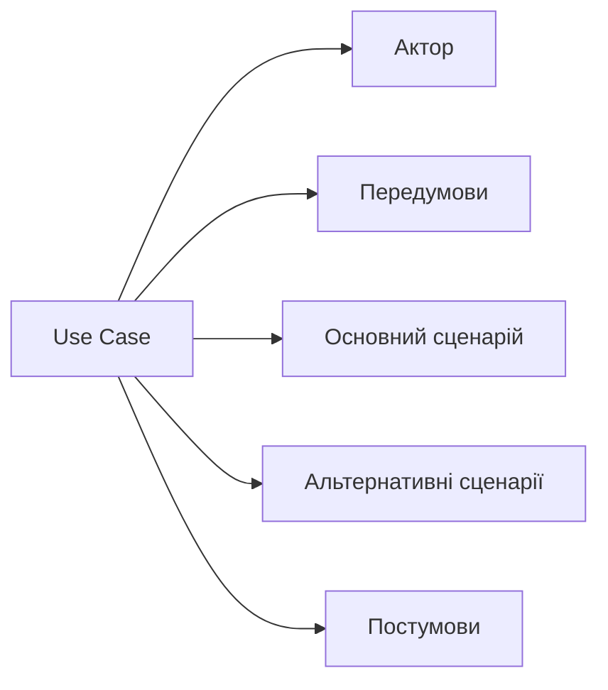

Сценарії використання (Use Cases) надають детальніший опис взаємодії між користувачем та системою: передумови, основний потік подій, альтернативні потоки та постумови. Вони особливо корисні для складних бізнес-процесів, де просте формулювання "система повинна робити X" не передає всієї логіки взаємодії.

Приклад сценарію використання "Оформлення замовлення":

**Передумови:** Користувач аутентифікований, у кошику є товари.

**Основний сценарій:**

1. Користувач натискає "Оформити замовлення".
2. Система відображає форму з даними доставки.
3. Користувач заповнює або підтверджує адресу доставки.
4. Система відображає способи оплати.
5. Користувач обирає спосіб оплати.
6. Система обробляє платіж.
7. Система створює замовлення та надсилає підтвердження.

**Альтернативні сценарії:**

- Якщо платіж не проходить, система повідомляє про помилку.
- Якщо товару немає в наявності, система пропонує альтернативи.

## Процес збору вимог

### Підготовчий етап

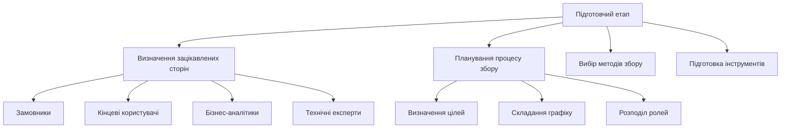

Успішний збір вимог починається з ретельної підготовки. Перш за все необхідно ідентифікувати всіх зацікавлених сторін проєкту. До них належать не лише безпосередні замовники та кінцеві користувачі, а й адміністратори системи, служби підтримки, служби безпеки та інші групи, які можуть впливати на вимоги або на яких може вплинути майбутня система.

Кожна група зацікавлених сторін має свої унікальні потреби та точки зору на систему. Замовники зосереджуються на бізнес-цілях та поверненні інвестицій, кінцеві користувачі турбуються про зручність використання, адміністратори думають про супровід та безпеку. Важливо зібрати представників усіх ключових груп, щоб отримати повну картину вимог, а не лише погляд однієї сторони.

Планування процесу збору вимог включає визначення цілей, методів збору, графіку роботи та розподіл відповідальності між учасниками команди, а також підготовку інструментів для фіксації й організації зібраної інформації.

### Методи збору вимог

**Інтерв'ю** є одним з найефективніших методів збору детальної інформації про вимоги. Структуровані інтерв'ю проводяться за заздалегідь підготовленим планом з конкретними питаннями. Неструктуровані інтерв'ю дозволяють вільніше досліджувати тему та виявляти неочікувані аспекти.

Підготовка до інтерв'ю включає:
- визначення цілей та ключових питань;
- ознайомлення з предметною областю;
- планування тривалості та формату зустрічі;
- підготовку засобів фіксації інформації.

Під час інтерв'ю важливо:
- створити довірчу атмосферу;
- ставити відкриті питання;
- активно слухати та уточнювати незрозумілі моменти;
- фіксувати не лише відповіді, а й контекст.

Тут варто зробити практичну примітку: сьогодні аналітики дедалі частіше використовують інструменти автоматичного транскрибування розмов (наприклад, вбудовані функції запису й розшифровки в Zoom/Teams чи спеціалізовані сервіси), а також AI-асистенти для попереднього структурування нотаток інтерв'ю у чернетку вимог. Це економить час на рутинній частині роботи, але не звільняє аналітика від головного — перевірити, чи правильно машина зрозуміла сказане, і чи не загубився контекст, який був важливий саме для цього замовника.

**Опитування** дозволяють зібрати інформацію від великої кількості респондентів за короткий час. Вони особливо ефективні для збору статистичних даних та виявлення загальних тенденцій. Анкети можуть містити закриті питання з варіантами відповідей для кількісного аналізу та відкриті питання для якісної інформації.

**Мозковий штурм** є груповим методом генерації ідей та виявлення вимог. Учасники вільно висловлюють свої ідеї без критики й оцінки, що дозволяє виявити творчі рішення та неочевидні вимоги. Важливо забезпечити участь представників різних груп зацікавлених сторін.

**Спостереження** за роботою користувачів дає цінну інформацію про реальні процеси та потреби. Цей метод особливо корисний для виявлення неявних вимог та проблем, які користувачі можуть не усвідомлювати або не згадувати під час інтерв'ю.

**Аналіз документації** включає вивчення існуючих регламентів, інструкцій, звітів та іншої документації організації. Це допомагає зрозуміти поточні процеси та формальні вимоги.

### Робота з зацікавленими сторонами

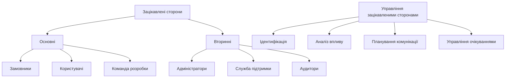

Ефективна робота з зацікавленими сторонами є ключовим фактором успіху проєкту. Різні групи можуть мати конфліктуючі інтереси та пріоритети, тому важливо вміти управляти цими відносинами, а не просто фіксувати побажання кожної групи окремо.

Основні зацікавлені сторони мають безпосередній вплив на проєкт та високий інтерес до його результатів. Вторинні зацікавлені сторони можуть мати менший вплив, але їхні потреби також важливо враховувати — саме вони часто підказують нефункціональні вимоги, які легко пропустити, зосередившись лише на кінцевому користувачі.

Для кожної групи зацікавлених сторін необхідно:
- визначити їхні основні інтереси та цілі;
- зрозуміти їхню роль у проєкті;
- обрати найефективніші методи комунікації;
- регулярно інформувати про прогрес проєкту.

Управління очікуваннями включає чітке пояснення можливостей проєкту, обмежень та ризиків. Важливо встановити реалістичні очікування та регулярно їх коригувати відповідно до змін у проєкті.

## Аналіз та моделювання вимог

### Методи аналізу вимог

Після збору первинної інформації необхідно її проаналізувати, структурувати та перетворити на чіткі, зрозумілі вимоги. Аналіз вимог включає кілька ключових активностей.

**Класифікація вимог** допомагає організувати зібрану інформацію. Вимоги групуються за типом, пріоритетом, джерелом або функціональною областю, що полегшує подальшу роботу з ними та їх відстеження.

**Пріоритизація вимог** визначає, які вимоги є найважливішими для успіху проєкту — адже ресурси й час завжди обмежені, і не все, чого хоче замовник, можна реалізувати одночасно.

**Виявлення конфліктів** — це пошук суперечливих або взаємовиключних вимог. Конфлікти можуть виникати між вимогами різних груп зацікавлених сторін або між функціональними та нефункціональними вимогами (наприклад, вимога до максимальної безпеки може суперечити вимозі до максимальної зручності використання).

**Аналіз залежностей** визначає зв'язки між вимогами: деякі з них можуть залежати від інших або конфліктувати з ними. Розуміння цих залежностей важливе для планування розробки.

### Моделювання бізнес-процесів

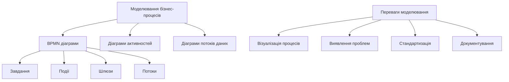

Моделювання бізнес-процесів допомагає зрозуміти, як працює організація, та визначити, як програмна система може покращити ці процеси. Візуальне представлення процесів робить їх зрозумілими для всіх зацікавлених сторін, зокрема й для тих, хто не має технічної підготовки.

**BPMN (Business Process Model and Notation)** є стандартом для моделювання бізнес-процесів. BPMN використовує стандартизовані символи для представлення різних елементів процесу:

- завдання — конкретні дії, які виконують учасники процесу;
- події — моменти, які впливають на хід процесу;
- шлюзи — точки прийняття рішень у процесі;
- потоки — з'єднання між елементами процесу.

Приклад моделювання процесу обробки замовлення:

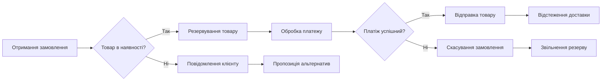

**Діаграми потоків даних** показують, як інформація рухається через систему, і допомагають зрозуміти, які дані потрібні для кожного процесу та як вони трансформуються.

**Діаграми активностей** зосереджуються на послідовності дій та логіці прийняття рішень і корисні для моделювання алгоритмів та робочих процесів.

### Прототипування

Прототипування є потужним інструментом валідації вимог та покращення розуміння між командою розробки й зацікавленими сторонами. Прототипи дозволяють "побачити" майбутню систему ще до початку повноцінної розробки — і саме тому цей етап часто дешевше виявляє помилки в розумінні вимог, ніж будь-яке обговорення на папері.

**Типи прототипів:**

*Паперові прототипи* — найпростіший і найшвидший спосіб візуалізації ідей. Ескізи інтерфейсів на папері дозволяють швидко досліджувати різні варіанти дизайну ще до відкриття будь-якого інструменту.

*Цифрові mockup'и та інтерактивні прототипи* сьогодні здебільшого створюються в одному й тому самому інструменті — **Figma**, яка фактично стала галузевим стандартом для UI/UX-дизайну. Ще кілька років тому цей етап розбивали на два окремі кроки: спершу статичні макети в Adobe XD або Sketch, а потім — окремий інструмент для клікабельного прототипу, як-от InVision чи Marvel. Зараз ця межа стерлася: Figma одночасно й дизайнерський, і прототипувальний інструмент, з підтримкою коментування та спільної роботи в реальному часі просто у браузері. (Adobe XD з 2023 року в режимі підтримки без розвитку нових можливостей, а InVision у 2024 році закрив свій сервіс прототипування — обидва варто розглядати як історичний контекст, а не як актуальний вибір для нового проєкту.) Для складніших сценаріїв з умовною логікою чи прив'язкою до реальних даних використовують спеціалізовані інструменти на кшталт Axure RP.

*Функціональні прототипи* реалізують частину функціональності системи реальним кодом і корисні для перевірки технічної можливості реалізації складних вимог. Останніми роками до цієї категорії додалися no-code/low-code платформи (наприклад, Bubble), що дозволяють швидко зібрати робочий MVP без написання коду з нуля.

**Переваги прототипування:**

- раннє виявлення проблем у вимогах;
- покращення комунікації з зацікавленими сторонами;
- зменшення ризиків неправильного розуміння;
- можливість тестування ідей з користувачами;
- зменшення вартості змін на пізніх етапах.

## Документування вимог

### Структура документа вимог

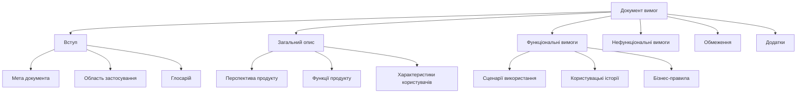

Документ вимог до програмного забезпечення (Software Requirements Specification, SRS) є основним артефактом процесу інженерії вимог. Він служить контрактом між замовником та командою розробки, основою для проєктування й планування, а також критерієм для приймання системи.

**Вступ** містить загальну інформацію про документ та проєкт:

- мету створення документа та його аудиторію;
- область застосування системи та її основні цілі;
- глосарій термінів і скорочень;
- посилання на пов'язані документи та стандарти.

**Загальний опис** надає високорівневий огляд системи:

- перспективу продукту — як система вписується в більший контекст;
- основні функції та можливості системи;
- характеристики різних груп користувачів;
- загальні обмеження та припущення.

**Функціональні вимоги** описують конкретні функції системи через сценарії використання, користувацькі історії та бізнес-правила — залежно від того, яка нотація прийнята в команді.

**Нефункціональні вимоги** фіксують якісні атрибути системи: продуктивність, безпеку, використовуваність та інші характеристики, розглянуті вище.

### Атрибути якісної вимоги

Якісна вимога має відповідати кільком критеріям, і саме ці критерії варто використовувати як чек-лист під час рев'ю документа.

**Однозначність** означає, що вимога має лише одне можливе тлумачення. Погано сформульована вимога на кшталт "система повинна бути швидкою" не є перевірюваною — незрозуміло, що саме вважати "швидким". Краще: "система повинна обробляти запити користувачів за час, що не перевищує 2 секунди у 95 % випадків".

**Повнота** передбачає, що вимога містить усю необхідну інформацію для її реалізації. Неповні вимоги змушують розробників робити припущення, які можуть не відповідати очікуванням замовника.

**Зрозумілість** означає, що вимога написана простою, ясною мовою, зрозумілою для всіх зацікавлених сторін. Складні технічні терміни варто пояснювати або виносити в глосарій.

**Перевірюваність** передбачає можливість об'єктивно перевірити, чи виконана вимога. Для цього вимога повинна містити конкретні критерії або метрики.

**Відстежуваність** означає можливість простежити зв'язки вимоги з її джерелами, пов'язаними вимогами та елементами дизайну. Це допомагає керувати змінами й оцінювати вплив модифікацій.

### Управління змінами вимог

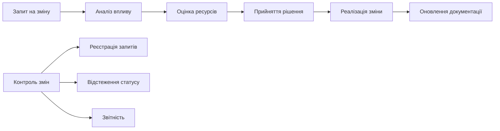

Вимоги неминуче змінюються протягом життєвого циклу проєкту. Ефективне управління цими змінами критично важливе для успіху проєкту: неконтрольовані зміни можуть призвести до збільшення бюджету, затримок та зниження якості.

**Процес управління змінами** включає:

1. **Ідентифікацію потреби у зміні** — виявлення нових вимог або необхідності модифікації існуючих.
2. **Формалізацію запиту** — документування запропонованої зміни з описом причин та очікуваних результатів.
3. **Аналіз впливу** — оцінку того, як зміна вплине на інші вимоги, архітектуру, графік та бюджет проєкту.
4. **Оцінку ресурсів** — визначення часу, зусиль та коштів, необхідних для реалізації зміни.
5. **Прийняття рішення** — колегіальне рішення про схвалення, відхилення або відкладення зміни.
6. **Реалізацію зміни** — внесення змін у вимоги, дизайн та код системи.
7. **Оновлення документації** — актуалізацію всіх пов'язаних документів та моделей.

**Комітет з контролю змін** складається з представників ключових зацікавлених сторін і приймає рішення про затвердження змін, що допомагає збалансувати інтереси різних груп і запобігти поспішним рішенням.

**Базовий план вимог** встановлюється після завершення початкового аналізу вимог. Усі подальші зміни порівнюються з цим базовим планом, що дозволяє контролювати scope creep — неконтрольоване розширення проєкту.

## Інструменти для роботи з вимогами

### Програмні засоби управління вимогами

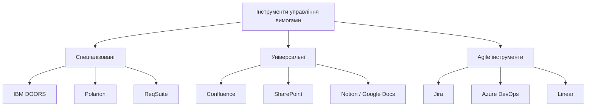

Вибір підходящих інструментів суттєво впливає на ефективність процесу управління вимогами. Різні інструменти підходять для різних типів проєктів та організацій.

**Спеціалізовані інструменти** призначені саме для управління вимогами та надають розширені можливості:

*IBM DOORS (Dynamic Object Oriented Requirements System)* — потужне enterprise-рішення для управління вимогами у великих організаціях, насамперед у регульованих галузях (авіація, оборонна промисловість, медичне обладнання), де потрібна повна формальна відстежуваність кожної вимоги.

*Polarion* поєднує управління вимогами з можливостями управління проєктами та тестування й особливо популярний у галузях з високими вимогами до якості та регулювання.

*ReqSuite* надає інтуїтивний вебінтерфейс для управління вимогами та підтримує колаборативну роботу команди.

**Універсальні інструменти** не призначені спеціально для вимог, але ефективно використовуються для їх документування:

*Confluence* дозволяє створювати структуровану документацію з коментуванням, версійністю та інтеграцією з Jira.

*Microsoft SharePoint* надає можливості документообігу та спільної роботи в корпоративному середовищі.

*Notion* і *Google Docs* добре підходять невеликим командам, яким потрібен простий та гнучкий інструмент для спільної роботи над документами; Notion за останні роки суттєво потіснив Google Docs саме завдяки можливості поєднувати текст, таблиці вимог і бази даних завдань в одному просторі.

**Agile-інструменти** орієнтовані на роботу з користувацькими історіями та підтримку гнучких методологій:

*Jira* лишається стандартом для Agile-команд, дозволяє керувати користувацькими історіями, епіками й спринтами; останніми роками Atlassian додала в неї AI-функції (Atlassian Intelligence) для чорнового формулювання й уточнення елементів беклогу.

*Azure DevOps* інтегрує управління вимогами з плануванням спринтів, контролем версій та CI/CD.

*Linear* — відносно новий, але дуже популярний у стартапах та невеликих продуктових командах інструмент: свідомо простіший за Jira, орієнтований на швидкість роботи розробників, а не на кастомізацію процесів.

### Критерії вибору інструментів

Вибір інструменту залежить від кількох факторів:

**Розмір проєкту та команди.** Великі корпоративні проєкти потребують потужних інструментів з розширеними можливостями відстеження та звітності. Невеликі команди можуть обійтися простішими рішеннями.

**Складність вимог.** Проєкти зі складними залежностями між вимогами та високими вимогами до трасабельності потребують спеціалізованих інструментів.

**Методологія розробки.** Agile-команди віддають перевагу інструментам, що підтримують користувацькі історії та спринти. Проєкти з waterfall-процесом можуть використовувати традиційні документо-орієнтовані інструменти.

**Інтеграція з іншими системами.** Важливо, щоб інструмент інтегрувався з наявними системами управління проєктами, контролю версій та тестування.

**Бюджет.** Спеціалізовані інструменти можуть бути дорогими, особливо для великих команд, тож варто оцінювати співвідношення вартості й користі.

## Валідація та верифікація вимог

### Методи валідації вимог

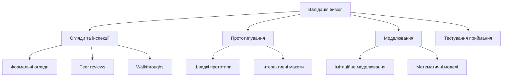

Валідація вимог перевіряє, чи відповідають вимоги реальним потребам зацікавлених сторін і чи можна на їх основі створити систему, яка вирішить поставлені проблеми. Верифікація перевіряє, чи відповідають вимоги встановленим стандартам якості. Різниця тонка, але важлива: валідація відповідає на питання "чи будуємо ми правильну систему", верифікація — "чи правильно ми описали те, що будуємо".

**Огляди та інспекції** є систематичним процесом перевірки документів вимог:

*Формальні огляди* проводяться за чітко визначеною процедурою з участю експертів, які попередньо ознайомлюються з документами й готують свої зауваження.

*Peer reviews* включають колегіальну перевірку вимог іншими аналітиками або членами команди.

*Walkthroughs* — менш формальні зустрічі, де автор вимог проводить команду через документ, пояснюючи логіку та отримуючи зворотний зв'язок.

**Прототипування** дозволяє зацікавленим сторонам "побачити" майбутню систему та оцінити, чи відповідають вимоги їхнім очікуванням, — особливо ефективно для валідації вимог до користувацького інтерфейсу.

**Моделювання** використовується для складних систем, де необхідно перевірити правильність алгоритмів або оцінити продуктивність. Імітаційне моделювання може показати, як система поводитиметься за різних умов навантаження.

### Критерії якості специфікації

Якісна специфікація вимог повинна відповідати таким критеріям:

**Правильність:** кожна вимога точно відображає потрібну функціональність або характеристику системи.

**Недвозначність:** кожна вимога має лише одне можливе тлумачення.

**Повнота:** специфікація включає всі необхідні вимоги для створення системи, яка задовольнить потреби користувачів.

**Консистентність:** вимоги не суперечать одна одній та не містять внутрішніх конфліктів.

**Ранжування за важливістю:** кожна вимога має визначений пріоритет або рівень важливості.

**Перевірюваність:** для кожної вимоги існує скінченно-вартісний процес, за допомогою якого можна перевірити, чи задовольняє система цю вимогу.

**Модифікованість:** структура специфікації дозволяє легко вносити зміни без впливу на інші вимоги.

**Відстежуваність:** можна простежити походження кожної вимоги та її зв'язки з іншими вимогами й елементами дизайну.

## Agile-підхід до управління вимогами

### Користувацькі історії в Agile

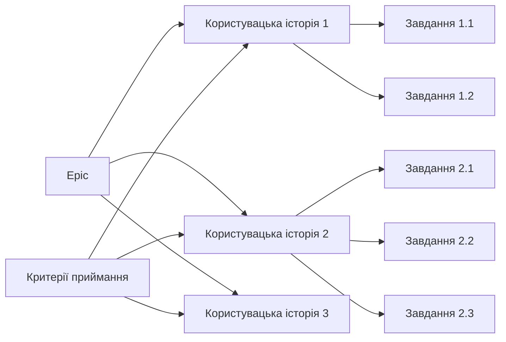

У гнучких методологіях розробки (докладно про них — у наступних двох лекціях) підхід до роботи з вимогами кардинально відрізняється від традиційного waterfall. Замість детальної специфікації на початку проєкту Agile використовує концепцію "just enough" — достатньо деталей для початку роботи з можливістю уточнення в процесі розробки.

**Ієрархія вимог в Agile:**

*Epic* — великі функціональності, які можуть охоплювати кілька спринтів або релізів. Епіки описують високорівневі бізнес-цілі.

*Користувацькі історії* — конкретні функції, описані з точки зору користувача. Зазвичай реалізуються протягом одного спринту.

*Завдання* — технічні роботи, необхідні для реалізації користувацької історії.

**Формат користувацької історії:**
"Як [роль], я хочу [функціональність], щоб [бізнес-цінність]."

Приклад: "Як користувач мобільного додатка банку, я хочу переглядати баланс рахунку, щоб контролювати свої фінанси."

**Критерії приймання** (Acceptance Criteria) визначають умови, за яких користувацька історія вважається виконаною. Вони часто пишуться у форматі Given-When-Then:

```
Given [початкові умови]
When [дія користувача]
Then [очікуваний результат]
```

Приклад критеріїв приймання:
```
Given користувач аутентифікований у додатку
When користувач натискає "Мій баланс"
Then система відображає поточний баланс усіх рахунків
And система показує дату останнього оновлення
```

### Product Backlog та його управління

Product Backlog — централізований список усіх відомих вимог до продукту, впорядкованих за пріоритетом. Він постійно еволюціонує протягом життя продукту.

**Характеристики якісного Product Backlog (DEEP):**

*Detailed appropriately* — елементи з високим пріоритетом опрацьовані детально, елементи з низьким пріоритетом описані загально.

*Emergent* — беклог постійно змінюється відповідно до нових знань та зворотного зв'язку.

*Estimated* — для елементів беклогу є оцінки складності або трудозатрат.

*Prioritized* — елементи впорядковані за бізнес-цінністю та пріоритетом.

**Процес управління беклогом включає:**

*Backlog Refinement* — регулярні зустрічі команди для деталізації, оцінки й пріоритизації елементів беклогу.

*Story Mapping* — візуальну техніку організації користувацьких історій у вигляді карти користувацького шляху.

*Release Planning* — планування того, які функції буде включено в наступні релізи.

### Definition of Ready та Definition of Done

**Definition of Ready (DoR)** визначає критерії готовності користувацької історії до включення в спринт:

- історія написана у правильному форматі;
- критерії приймання чітко визначені;
- залежності ідентифіковані та вирішені;
- історія оцінена командою;
- є mockup'и інтерфейсу, якщо потрібно.

**Definition of Done (DoD)** визначає критерії завершеності роботи:

- код написаний та відповідає стандартам;
- unit-тести написані й проходять;
- код пройшов code review;
- функціональність протестована;
- документація оновлена;
- історія продемонстрована Product Owner.

## Практичні поради та найкращі практики

### Поширені помилки при роботі з вимогами

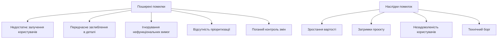

**Недостатнє залучення кінцевих користувачів** — одна з найпоширеніших причин невдач проєктів. Розробники та аналітики можуть робити припущення про потреби користувачів, які виявляються неправильними. Регулярна взаємодія з реальними користувачами протягом усього проєкту допомагає уникнути цієї проблеми.

**Передчасне заглиблення в технічні деталі** відволікає від розуміння бізнес-потреб. На ранніх етапах важливо зосередитися на "що" потрібно зробити, а не на "як" це реалізувати.

**Ігнорування нефункціональних вимог** може призвести до створення функціонально повної, але непридатної для використання системи.

**Відсутність чіткої пріоритизації** призводить до розподілу ресурсів між багатьма завданнями замість зосередження на найважливіших, що знижує швидкість доставки цінності користувачам.

**Поганий контроль змін** дозволяє scope creep руйнувати плани проєкту. Кожна зміна повинна проходити через формальний процес оцінки й затвердження.

### Рекомендації для успішної роботи з вимогами

**Залучайте користувачів на всіх етапах:** організовуйте регулярні демонстрації, збирайте зворотний зв'язок та тестуйте прототипи з реальними користувачами.

**Використовуйте ітеративний підхід:** не намагайтеся зібрати всі вимоги одразу. Починайте з найважливіших та поступово деталізуйте інші.

**Документуйте обґрунтування:** записуйте не лише що потрібно зробити, а й чому. Це допомагає приймати правильні рішення при виникненні альтернатив.

**Інвестуйте в якість вимог:** час, витрачений на написання якісних вимог, окупається багаторазово завдяки зменшенню переробок та помилок.

**Підтримуйте відстежуваність:** забезпечте можливість простежити кожну вимогу від її джерела до реалізації в коді.

**Будьте готові до змін:** створюйте процеси та інструменти, які дозволяють ефективно керувати змінами вимог.

### Метрики та показники

Для оцінки ефективності процесу роботи з вимогами використовують такі метрики:

**Стабільність вимог:** відсоток вимог, які змінилися після базового плану. Висока нестабільність може вказувати на проблеми в процесі збору вимог.

**Покриття вимог тестами:** відсоток вимог, для яких написані тести. Показує готовність до верифікації виконання вимог.

**Час на аналіз вимог:** середній час від ідентифікації потреби до готової для розробки вимоги.

**Кількість дефектів, пов'язаних з вимогами:** дефекти, причиною яких є неточні, неповні або відсутні вимоги.

**Задоволеність зацікавлених сторін:** регулярні опитування про якість процесу збору й документування вимог.

## Висновки

Робота з вимогами — критично важливий процес у розробці програмного забезпечення, який визначає успіх або невдачу всього проєкту. Якісні вимоги служать фундаментом для всіх подальших етапів розробки — від архітектурного проєктування до тестування та впровадження.

Ефективний процес роботи з вимогами включає систематичний збір інформації від усіх зацікавлених сторін, ретельний аналіз та моделювання бізнес-процесів, чітке документування вимог та управління змінами протягом життєвого циклу проєкту.

Сучасні гнучкі методології розробки не применшують важливості вимог, а пропонують більш адаптивний підхід до роботи з ними. Користувацькі історії, backlog management та continuous refinement дозволяють ефективно реагувати на зміни й доставляти цінність користувачам — саме про ці методології детально йтиметься в наступних лекціях курсу.

## Питання для самоперевірки

1. У чому полягає різниця між функціональними та нефункціональними вимогами? Наведіть приклади кожного типу.
2. Які методи збору вимог найбільш ефективні для різних типів проєктів та зацікавлених сторін?
3. Як забезпечити якість вимог? Які атрибути характеризують добре написану вимогу?
4. Чому важливо управляти змінами вимог? Опишіть процес контролю змін.
5. Як відрізняється підхід до роботи з вимогами в Agile-методологіях від традиційного waterfall?
6. Що таке користувацька історія? Як написати ефективні критерії приймання?
7. Які інструменти можна використовувати для управління вимогами? Як обрати підходящий інструмент?
8. Як валідувати та верифікувати вимоги? Які методи найбільш ефективні?
9. Які найпоширеніші помилки при роботі з вимогами? Як їх уникнути?
10. Як оцінити ефективність процесу роботи з вимогами? Які метрики можна використовувати?
