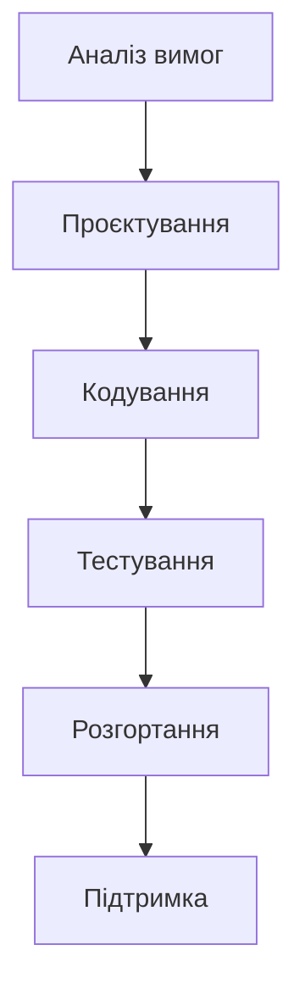
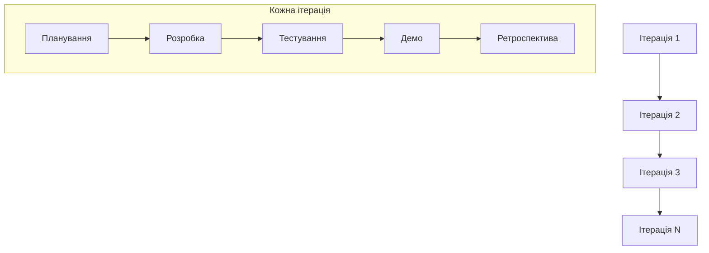
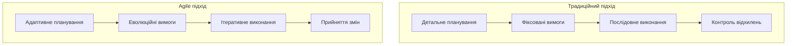
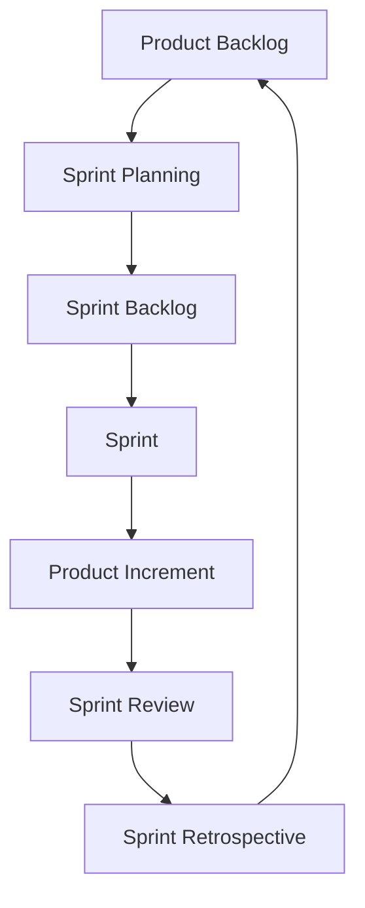
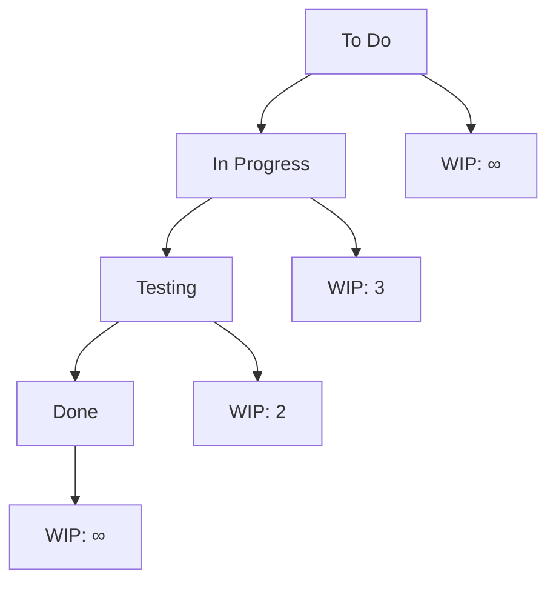
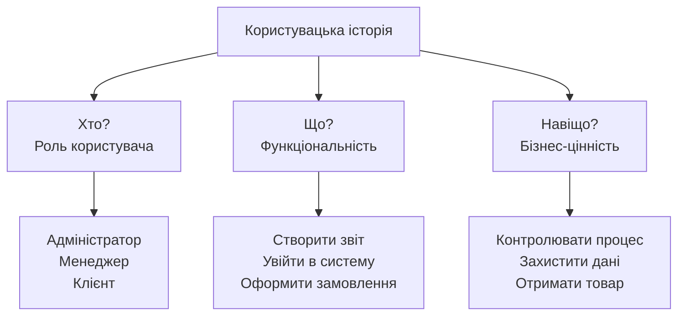
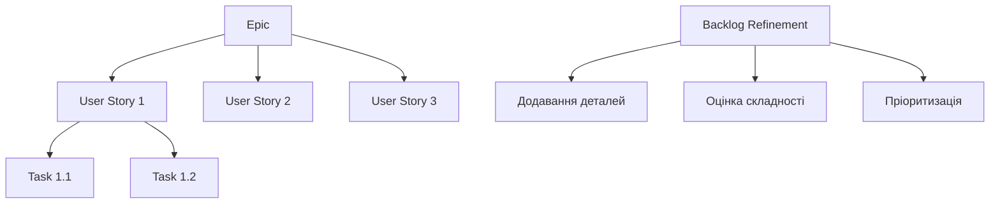
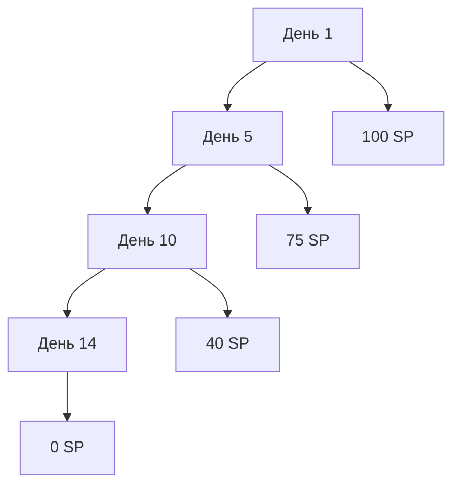

# Лекція 5. Гнучкі методології: Agile Manifesto та принципи

## Вступ

У лекції про вимоги до ПЗ ми вже кілька разів згадували, що Agile-підхід до вимог відрізняється від класичного: замість вичерпної специфікації на старті проєкту — короткі користувацькі історії, що уточнюються поступово. Настав час розібратися, звідки взявся цей підхід і на яких принципах він тримається, перш ніж у наступній лекції перейти до його найпоширеніших практичних втілень — Scrum і Kanban.

Гнучкі методології розробки програмного забезпечення виникли як відповідь на обмеження традиційних каскадних підходів до управління проєктами. У сучасному швидкозмінному технологічному середовищі здатність адаптуватися до змін та забезпечувати постійну цінність для замовника стала критично важливою для успіху програмних проєктів. Agile-підходи фундаментально змінили спосіб мислення про розробку ПЗ, перенісши акцент з детального планування й документації на співпрацю, гнучкість та швидке реагування на зміни.

Розуміння принципів Agile необхідне для сучасного інженера програмного забезпечення, оскільки ці методології застосовуються в більшості ІТ-компаній по всьому світу. Вони впливають не тільки на процеси розробки, а й на організаційну культуру, структуру команд та підходи до взаємодії з замовниками.

## Історичний контекст та передумови виникнення Agile

### Проблеми традиційних методологій

Традиційні каскадні методології розробки ПЗ, що домінували в індустрії протягом десятиліть, базувалися на лінійному підході до планування та виконання проєктів. Ці методології успадкували принципи з інженерних та будівельних галузей, де зміни в процесі реалізації є дорогими й небажаними.

Каскадна модель передбачала, що всі вимоги можна повністю визначити на початку проєкту, після чого команда послідовно проходить через етапи аналізу, проєктування, реалізації, тестування та розгортання. Кожен етап мав бути повністю завершений перед переходом до наступного, а повернення до попередніх етапів розглядалося як ознака поганого планування.

Однак реальність програмної розробки виявилася значно складнішою за ці припущення. Програмне забезпечення є нематеріальним продуктом, що ускладнює точне передбачення всіх вимог на початку проєкту (саме про це йшлося в попередній лекції — навіть найретельніший збір вимог не гарантує, що вони не зміняться). Бізнес-потреби постійно змінюються під впливом ринкових умов, технологічних інновацій та зворотного зв'язку користувачів.

Основні проблеми каскадних методологій — це високий ризик невідповідності кінцевого продукту реальним потребам користувачів через довгий час між визначенням вимог та отриманням робочого ПЗ. Зміни вимог на пізніх етапах проєкту коштували надзвичайно дорого й часто призводили до провалу всього проєкту. Відсутність регулярного зворотного зв'язку від замовників та кінцевих користувачів означала, що проблеми виявлялися тільки на етапі тестування або після розгортання.

Жорстка структура каскадних процесів погано пристосовувалася до інноваційної природи програмної розробки, де експериментування та ітеративне вдосконалення часто є ключовими для створення успішного продукту. Довгі цикли розробки означали, що конкуренти могли випередити проєкт, вивівши подібні рішення на ринок значно раніше.

### Еволюція підходів до розробки

Протягом 1990-х років різні команди розробників почали експериментувати з альтернативними підходами, що підкреслювали ітеративність, гнучкість та тісну співпрацю з замовниками. Ці підходи включали Rapid Application Development, Dynamic Systems Development Method, Scrum, Extreme Programming та інші методології, що пізніше стали відомі як гнучкі, або Agile.

Спільними рисами цих підходів були коротші цикли розробки з регулярним постачанням робочого ПЗ, активне залучення замовників протягом усього процесу розробки, адаптивність до змін замість жорсткого дотримання початкового плану та акцент на людях і взаємодії як ключових факторах успіху проєкту.

Ці методології почали демонструвати кращі результати порівняно з традиційними підходами, особливо в проєктах з високим рівнем невизначеності та мінливими вимогами. Проте відсутність єдиного теоретичного фундаменту й спільних принципів ускладнювала їх систематичне застосування та поширення в індустрії.

## Agile Manifesto: народження руху

### Історія створення маніфесту

У лютому 2001 року сімнадцять видатних практиків програмної розробки зібралися на гірськолижному курорті Snowbird у штаті Юта, щоб обговорити альтернативи традиційним методологіям розробки ПЗ. Серед учасників були автори та прихильники різних гнучких методологій, зокрема Кент Бек (Extreme Programming), Джефф Сазерленд і Кен Швабер (Scrum), Алістер Кокберн (Crystal), Мартін Фаулер та інші впливові фігури індустрії.

Метою зустрічі було знайти спільні принципи, які об'єднують різні гнучкі підходи, та створити альтернативу домінуючим на той час процесо-орієнтованим методологіям. Результатом цієї зустрічі став Agile Manifesto — короткий документ, що визначив фундаментальні цінності та принципи гнучкої розробки ПЗ.

### Основні цінності Agile Manifesto

Agile Manifesto проголошує чотири основні цінності, що визначають пріоритети гнучкої розробки:

**Люди та взаємодія понад процеси та інструменти.** Ця цінність підкреслює, що успіх програмного проєкту залежить передусім від талановитих людей та їхньої здатності ефективно співпрацювати. Хоча процеси й інструменти важливі для підтримки роботи команди, вони не повинні замінювати людську творчість, експертизу та комунікацію.

**Робоче програмне забезпечення понад вичерпну документацію.** Першочерговою метою будь-якого програмного проєкту є створення функціонального ПЗ, що вирішує реальні проблеми користувачів. Хоча документація залишається важливою, вона не повинна ставати самоціллю або перешкодою для швидкого постачання цінності.

**Співпраця з замовником понад переговори щодо контракту.** Традиційний підхід до управління проєктами часто створює антагоністичні відносини між розробниками та замовниками, де кожна сторона намагається захистити свої інтереси через детальні контракти. Agile підкреслює важливість партнерських відносин, де замовник розглядається як член розширеної команди проєкту.

**Реагування на зміни понад дотримання плану.** У швидкозмінному бізнес-середовищі здатність адаптуватися до нових обставин часто важливіша за точне виконання початкового плану. Agile-команди розглядають зміни не як перешкоди, а як можливості для покращення продукту та кращого задоволення потреб користувачів.

Важливо розуміти, що ці цінності не заперечують важливості елементів у правій частині кожного твердження. Процеси, документація, контракти та планування залишаються необхідними компонентами успішної розробки. Маніфест лише встановлює пріоритети, вказуючи, що елементи в лівій частині повинні цінуватися більше за умов конфлікту або необхідності вибору.

### Дванадцять принципів Agile

Поряд з основними цінностями Agile Manifesto включає дванадцять принципів, що деталізують практичне застосування гнучкого підходу:

**Найвищий пріоритет — задоволення замовника через раннє та постійне постачання цінного програмного забезпечення.** Раннє постачання означає, що користувачі отримують доступ до корисної функціональності якомога швидше, а не чекають завершення всього проєкту.

**Приймайте зміни вимог, навіть на пізніх стадіях розробки. Agile-процеси використовують зміни для конкурентної переваги замовника.** Замість того щоб розглядати зміни як проблему, Agile-команди вбачають у них можливість створити кращий продукт.

**Постачайте робоче програмне забезпечення часто, з періодичністю від кількох тижнів до кількох місяців, надаючи перевагу коротшим термінам.** Регулярні релізи дозволяють отримувати зворотний зв'язок від користувачів, виявляти проблеми на ранніх стадіях та демонструвати прогрес стейкхолдерам.

**Представники бізнесу та розробники повинні працювати разом щодня протягом усього проєкту.** Постійна комунікація між технічною командою та бізнес-стороною забезпечує правильне розуміння вимог та швидке вирішення питань, що виникають.

**Будуйте проєкти навколо мотивованих людей. Надайте їм середовище та підтримку, яких вони потребують, і довіряйте їм виконати роботу.** Цей принцип підкреслює важливість створення умов для самоорганізації та професійного розвитку членів команди.

**Найефективніший та найкращий метод передачі інформації команді розробників — розмова віч-на-віч.** Особиста взаємодія залишається найбагатшим каналом для передачі складної інформації та налагодження довіри.

**Робоче програмне забезпечення — основний показник прогресу.** Agile оцінює прогрес через функціональність, що реально працює й приносить цінність, а не через відсоток завершених завдань.

**Agile-процеси сприяють сталому розвитку. Спонсори, розробники та користувачі повинні мати можливість підтримувати постійний темп роботи.** Довгострокова продуктивність команди важливіша за короткочасні ривки, що можуть призвести до професійного вигорання.

**Постійна увага до технічної досконалості та гарного дизайну покращує гнучкість.** Інвестування в якість коду та архітектури створює основу для майбутньої адаптивності й розширюваності системи.

**Простота — мистецтво максимізації обсягу невиконаної роботи — є суттєвою.** Цей принцип закликає фокусуватися на найважливіших функціях та уникати надмірної складності.

**Найкращі архітектури, вимоги та дизайни виникають із самоорганізованих команд.** Команди, які мають свободу приймати технічні рішення, часто створюють більш інноваційні та ефективні рішення.

**Через регулярні інтервали команда міркує про те, як стати більш ефективною, після чого налаштовує та коригує свою поведінку відповідно.** Принцип постійного вдосконалення забезпечує еволюцію процесів і практик команди відповідно до накопиченого досвіду.

## Основні концепції та практики Agile

### Ітеративна та інкрементальна розробка

Серцем Agile-підходу є ітеративна та інкрементальна розробка — процес, що розбиває великий проєкт на серію коротких циклів розробки, званих ітераціями або спринтами. Кожна ітерація являє собою повний мінізований цикл розробки ПЗ, що включає планування, аналіз, проєктування, кодування, тестування та демонстрацію результатів.

Ітеративний характер означає, що команда повторює одні й ті самі процеси протягом кожного циклу, постійно вдосконалюючи свій підхід на основі отриманого досвіду. Інкрементальний аспект гарантує, що кожна ітерація додає нову функціональність до продукту, створюючи робоче ПЗ, яке можна продемонструвати та навіть використати кінцевим користувачам.

Переваги цього підходу включають раннє виявлення ризиків та проблем через регулярне тестування й демонстрацію результатів. Замовники отримують можливість побачити прогрес проєкту та надати зворотний зв'язок значно раніше, ніж у традиційних методологіях.

Типова тривалість ітерації складає від одного до чотирьох тижнів, причому багато команд надають перевагу двотижневим спринтам як оптимальному балансу між достатнім часом для досягнення значущих результатів та достатньою частотою для швидкого реагування на зміни.

### Командна співпраця та самоорганізація

Agile-команди характеризуються високим рівнем співпраці та здатністю до самоорганізації. На відміну від традиційних ієрархічних структур, де рішення приймаються менеджментом і передаються вниз по ланцюгу команд, Agile-команди наділяються правом та відповідальністю за прийняття рішень щодо того, як виконувати свою роботу.

Самоорганізована команда включає всі необхідні навички та експертизу для виконання поставлених завдань без постійного зовнішнього керівництва. Члени команди спільно планують роботу, розподіляють завдання між собою та несуть колективну відповідальність за досягнення цілей спринту.

Ключова характеристика ефективної Agile-команди — кроссфункціональність, тобто наявність у команді всіх необхідних ролей та навичок для створення готового продукту (розробники, тестувальники, дизайнери, аналітики та інші спеціалісти). Невеликий розмір команди, зазвичай від 5 до 9 осіб, забезпечує ефективну комунікацію та координацію без надмірних накладних витрат на управління.

Спільне розташування команди або, у випадку віддалених команд, регулярна синхронна взаємодія створює умови для швидкого обміну інформацією та колективного вирішення проблем.

### Фокус на цінності для замовника

Центральним елементом Agile-філософії є постійний фокус на створенні цінності для замовника. Це означає, що всі рішення та дії команди оцінюються через призму їхнього впливу на задоволення потреб кінцевих користувачів та досягнення бізнес-цілей замовника.

Концепція цінності в Agile-контексті виходить за рамки простого додавання нових функцій. Цінність може створюватися через покращення користувацького досвіду, підвищення продуктивності системи, зменшення ризиків безпеки або спрощення складних процесів. Визначення того, що є цінним, здійснюється в тісній співпраці з замовником та на основі реального зворотного зв'язку від користувачів.

Для забезпечення фокусу на цінності Agile-команди використовують техніки пріоритизації, такі як MoSCoW (Must have, Should have, Could have, Won't have) або оцінку бізнес-цінності. Product Owner відіграє ключову роль у визначенні та комунікації пріоритетів.

## Порівняння Agile з традиційними методологіями

### Фундаментальні відмінності у підходах

У традиційних методологіях планування розглядається як основа успіху проєкту. Детальні плани створюються на початку проєкту та служать основою для контролю прогресу й управління ресурсами. Зміни в планах розглядаються як відхилення, що потребують формального процесу управління змінами.

Agile-підхід розглядає планування як постійний процес адаптації до нових знань та обставин. Плани створюються на різних рівнях деталізації — від високорівневого бачення продукту до детальних планів поточного спринту.

### Управління ризиками

Традиційні методології намагаються мінімізувати ризики через ретельне попереднє планування та створення детальної документації. Коли ризики все ж реалізуються, це часто призводить до значних затримок та перевитрат бюджету.

Agile-підхід визнає невід'ємну невизначеність програмної розробки та використовує ітеративний процес для раннього виявлення й мітигації ризиків. Технічні ризики мітигуються через практики на кшталт безперервної інтеграції, автоматизованого тестування та рефакторингу.

### Якість та тестування

У традиційних методологіях тестування часто розглядається як окремий етап, що виконується після завершення розробки, — це може призводити до виявлення критичних дефектів на пізніх стадіях, коли їх виправлення дороге й довготривале.

Agile інтегрує забезпечення якості у повсякденні практики розробки. Техніки, такі як Test-Driven Development, безперервна інтеграція та автоматизоване тестування, забезпечують виявлення дефектів на ранніх стадіях. Парне програмування та регулярні огляди коду сприяють підвищенню якості коду й розповсюдженню знань у команді.

## Популярні Agile-фреймворки

### Scrum

Scrum — найпоширеніший Agile-фреймворк, що надає структуровану основу для впровадження гнучких принципів. Розроблений Кеном Швабером та Джеффом Сазерлендом у 1990-х роках, Scrum визначає підзвітності, події та артефакти для ефективної командної роботи. (Детально Scrum розглянемо в наступній лекції; тут — лише загальний огляд.)

Чинна версія Scrum Guide (2020 рік) визначає єдину Scrum-команду з трьома підзвітностями: Product Owner відповідає за визначення й пріоритизацію вимог, Scrum Master допомагає команді дотримуватися принципів Scrum і усувати перешкоди, а Розробники (Developers) відповідають за створення продукту. Це важливе термінологічне уточнення порівняно з попередніми версіями посібника: раніше в межах Scrum-команди виокремлювали окрему "команду розробки", що на практиці нерідко провокувало поділ на "ми" (розробники) та "вони" (Product Owner). Тепер Scrum-команда — єдине ціле, і саме вона повністю відповідає за кожен інкремент продукту.

Scrum використовує часові блоки, звані спринтами, зазвичай тривалістю від одного до чотирьох тижнів. Кожен спринт починається зі Sprint Planning, де команда обирає завдання з Product Backlog та формує Sprint Backlog. Щоденні Scrum-зустрічі забезпечують синхронізацію команди та виявлення перешкод.

Sprint Review дозволяє продемонструвати створену функціональність стейкхолдерам та отримати зворотний зв'язок. Sprint Retrospective дає команді можливість проаналізувати свою роботу та визначити покращення для наступного спринту.

### Kanban

Kanban походить з виробничої системи Toyota й був адаптований для розробки ПЗ як альтернатива часовим спринтам Scrum. Основна ідея Kanban полягає у візуалізації робочого процесу та обмеженні кількості завдань у кожному стані одночасно.

Kanban-дошка візуалізує потік роботи через різні стадії, від початкових ідей до завершених завдань. Ліміти Work in Progress (WIP) запобігають перевантаженню команди та допомагають виявляти вузькі місця в процесі.

На відміну від Scrum, Kanban не використовує фіксовані часові рамки, дозволяючи команді працювати в безперервному потоці. Це робить Kanban особливо придатним для підтримки наявних систем або проєктів з непередбачуваним потоком вимог. Метрики на кшталт часу циклу та пропускної здатності використовуються для оптимізації процесу.

### Extreme Programming (XP)

Extreme Programming, розроблене Кентом Беком, фокусується на технічних практиках для забезпечення високої якості коду та здатності до швидких змін. XP отримало свою назву через те, що воно доводить до крайності добре відомі практики програмування.

Основні практики XP включають парне програмування, де два розробники працюють разом над одним завданням, Test-Driven Development, де тести пишуться перед кодом, безперервну інтеграцію для раннього виявлення конфліктів та рефакторинг для постійного покращення дизайну коду.

Планування в XP базується на користувацьких історіях, що описують функціональність з перспективи кінцевого користувача. Короткі релізи забезпечують регулярне постачання цінності замовнику. Простий дизайн підкреслює важливість мінімалізму та уникнення передчасної оптимізації.

XP також включає практики, орієнтовані на замовника: планувальну гру для спільного визначення пріоритетів та обсягу роботи, присутність замовника в команді для швидкого отримання зворотного зв'язку та приймальні тести для валідації функціональності з бізнес-перспективи.

## Користувацькі історії та управління вимогами

### Концепція користувацьких історій

Користувацькі історії є фундаментальним інструментом Agile для опису функціональних вимог з перспективи кінцевого користувача. На відміну від традиційних детальних специфікацій вимог (лекція 4), користувацькі історії — короткі, зрозумілі описи функціональності, що фокусуються на цінності для користувача, а не на технічних деталях реалізації.

Стандартний формат користувацької історії включає три ключові елементи: як [роль користувача], я хочу [функціональність], щоб [бізнес-цінність].

Переваги користувацьких історій включають простоту розуміння для всіх стейкхолдерів, у тому числі нетехнічних, гнучкість у деталізації залежно від етапу розробки та природний фокус на цінності для кінцевого користувача.

### Критерії прийняття та Definition of Done

Кожна користувацька історія повинна включати критерії прийняття — конкретні, тестовані умови, що визначають, коли історія вважається завершеною. Ефективні критерії прийняття характеризуються специфічністю й тестованістю, покриттям як позитивних, так і негативних сценаріїв, та фокусом на поведінці системи, а не на технічній реалізації. Вони часто формулюються у форматі Given-When-Then.

Definition of Done — командний стандарт якості, що визначає загальні критерії для завершення будь-якої роботи: покриття тестами, огляд коду, документування та готовність до розгортання.

### Управління Product Backlog

Product Backlog — упорядкований список усіх відомих вимог до продукту, включно з функціональними можливостями, покращеннями, виправленнями дефектів та технічними завданнями.

Ефективний беклог характеризується детальністю для найближчих елементів та загальністю для віддалених, оцінками розміру для планування та регулярним оновленням відповідно до зворотного зв'язку й зміни пріоритетів.

## Планування в Agile

### Рівні планування

Agile використовує багаторівневий підхід до планування, що дозволяє балансувати між довгостроковим баченням і гнучкістю в короткострокових рішеннях.

Стратегічне планування фокусується на довгостроковому баченні продукту (від пів року до кількох років) і включає епіки та тематичні блоки функціональності. Планування релізу охоплює період від 2 до 6 місяців та визначає, які функції потраплять у наступний великий реліз. Планування ітерації (спринту) — найдетальніший рівень, що охоплює 1–4 тижні: команда обирає конкретні користувацькі історії та розбиває їх на технічні завдання.

### Оцінка в Agile

Agile-команди використовують відносні методи оцінки, що фокусуються на порівнянні складності завдань між собою, а не на абсолютних часових оцінках.

Planning Poker — популярна техніка оцінки, де кожен член команди незалежно оцінює складність користувацької історії, використовуючи модифіковану послідовність Фібоначчі. Story Points — відносна одиниця виміру, що враховує складність, обсяг роботи та невизначеність завдання. Velocity — швидкість команди — вимірюється як кількість story points, що команда завершує за спринт, і використовується для планування майбутніх спринтів.

### Адаптивне планування

Adaptive planning визнає, що плани повинні адаптуватися до нових знань та змін в обставинах. Кожен спринт надає нову інформацію про продуктивність команди, складність завдань та потреби користувачів, яку використовують для корекції майбутніх планів.

Rolling wave planning — техніка, де детальні плани створюються тільки для найближчого періоду, а довгострокові плани залишаються на високому рівні.

## Метрики та вимірювання в Agile

### Основні Agile-метрики

Agile-команди використовують метрики для вимірювання продуктивності, якості та прогресу, але з акцентом на покращення процесу, а не на контроль.

Velocity вимірює обсяг роботи, яку команда завершує за спринт, зазвичай у story points; вона специфічна для кожної команди й не повинна використовуватися для порівняння між командами.

Burndown charts візуалізують прогрес команди протягом спринту, показуючи, скільки роботи залишилося виконати.

Cycle Time вимірює час від початку роботи над завданням до його завершення (цю метрику часто використовують Kanban-команди). Lead Time вимірює час від моменту, коли вимога була висунута, до моменту доставки функціональності користувачу.

### Метрики якості

Code Coverage показує відсоток коду, покритий автоматизованими тестами. Defect Density вимірює кількість дефектів на одиницю коду чи функціональності. Customer Satisfaction вимірюється через опитування, Net Promoter Score або аналіз використання функцій.

### Використання метрик для покращення

Важливий принцип використання метрик в Agile — їх спрямованість на покращення процесу, а не на оцінку чи контроль індивідуальної продуктивності. Ретроспективні зустрічі надають контекст для аналізу метрик та визначення дій для покращення.

Важливо уникати ігрових механізмів, коли команди оптимізують метрики за рахунок реальних цілей. Наприклад, фокус тільки на velocity може призвести до завищення оцінок або зниження якості коду.

## Культурні аспекти та трансформація

### Зміна організаційної культури

Впровадження Agile-методологій потребує глибокої зміни організаційної культури, що виходить далеко за межі простого впровадження нових процесів та інструментів.

Традиційні організації часто характеризуються ієрархічними структурами прийняття рішень, де інформація й повноваження концентруються на вищих рівнях управління. Agile-підхід вимагає розподілу повноважень та створення автономних команд, що можуть швидко приймати рішення в межах своєї компетенції.

Культура довіри є фундаментальною для успішного Agile-впровадження. Відкритість до експериментування та прийняття невдач як частини процесу навчання також критично важлива.

### Управління змінами

Успішна Agile-трансформація вимагає системного підходу до управління змінами, що враховує як технічні, так і людські аспекти.

Leadership commitment — необхідна умова успішної трансформації: керівництво повинно не тільки підтримувати зміни на словах, а й демонструвати нову поведінку та інвестувати ресурси в навчання й розвиток команд. Change agents — співробітники, які активно підтримують і просувають зміни, — відіграють ключову роль у поширенні нової культури й практик по всій організації.

### Виклики впровадження

Опір змінам — природна реакція людей на порушення звичних способів роботи. Масштабування Agile за межі окремих команд створює додаткові виклики, пов'язані з координацією між командами, управлінням залежностями та підтримкою узгодженості архітектури. Frameworks на кшталт SAFe, LeSS або Spotify Model надають структури для масштабування Agile.

## Майбутнє Agile

### Еволюція методологій

Agile-методології продовжують еволюціонувати відповідно до змін у технологічному ландшафті та бізнес-потребах.

DevOps являє собою природне розширення принципів Agile на операційну діяльність, інтегруючи розробку й управління інфраструктурою в єдиний процес. Design Thinking та User Experience дизайн дедалі більше інтегруються з Agile-процесами. Lean Startup поєднує Agile-розробку з експериментальним підходом до валідації бізнес-гіпотез.

### Agile в нових контекстах

Принципи Agile знаходять застосування далеко за межами розробки ПЗ — у маркетингу, HR, освіті та навіть у традиційних галузях на кшталт виробництва й будівництва. Віддалена робота та розподілені команди створюють нові виклики й можливості для Agile-практик: цифрові інструменти для співпраці дозволяють підтримувати Agile-принципи навіть при роботі в різних часових зонах.

## Висновки

Agile Manifesto та гнучкі методології являють собою фундаментальний зсув у підході до розробки ПЗ, що відображає зміну від індустріальної до інформаційної епохи. Основні цінності Agile — фокус на людях, робочому програмному забезпеченні, співпраці з замовником та реагуванні на зміни — залишаються актуальними й важливими в сучасному технологічному середовищі.

Успішне впровадження Agile вимагає більше, ніж просте застосування нових процесів та інструментів. Воно потребує глибокої культурної трансформації, що включає зміну ментальності, цінностей та способів взаємодії.

Розуміння принципів Agile критично важливе для сучасних інженерів програмного забезпечення, незалежно від конкретних методологій чи інструментів, що використовуються в їхній роботі. У наступній лекції ми детально розглянемо, як ці принципи втілюються на практиці в найпоширеніших фреймворках — Scrum і Kanban.

## Питання для самоперевірки

1. Які чотири основні цінності проголошує Agile Manifesto та як вони відрізняються від традиційних підходів до управління проєктами?
2. Поясніть різницю між ітеративною та інкрементальною розробкою. Чому ця комбінація є ефективною для програмних проєктів?
3. Які підзвітності, події та артефакти визначає Scrum? Як вони співпрацюють для досягнення цілей проєкту?
4. Що таке користувацькі історії та як вони відрізняються від традиційних документів вимог? Які переваги надає їх використання?
5. Як Agile-команди підходять до планування та оцінки? Чому відносні оцінки часто є ефективнішими за абсолютні часові оцінки?
6. Які основні метрики використовуються в Agile-проєктах та як вони допомагають у покращенні процесу розробки?
7. Які культурні зміни необхідні для успішного впровадження Agile в організації? Які основні виклики можуть виникнути в процесі трансформації?
8. Як принципи Agile адаптуються до сучасних трендів, таких як DevOps, віддалена робота та міждисциплінарна співпраця?
