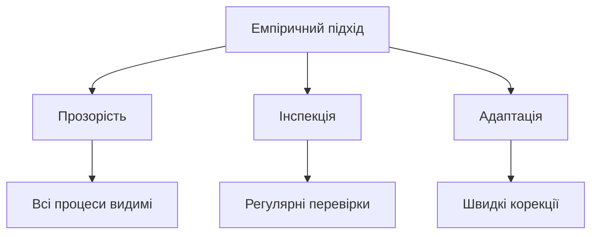
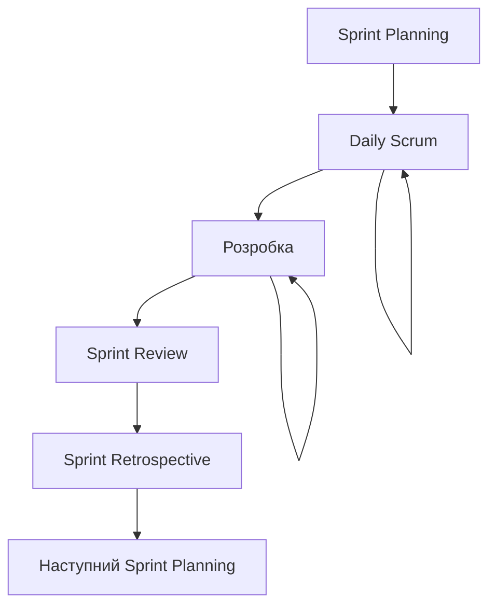
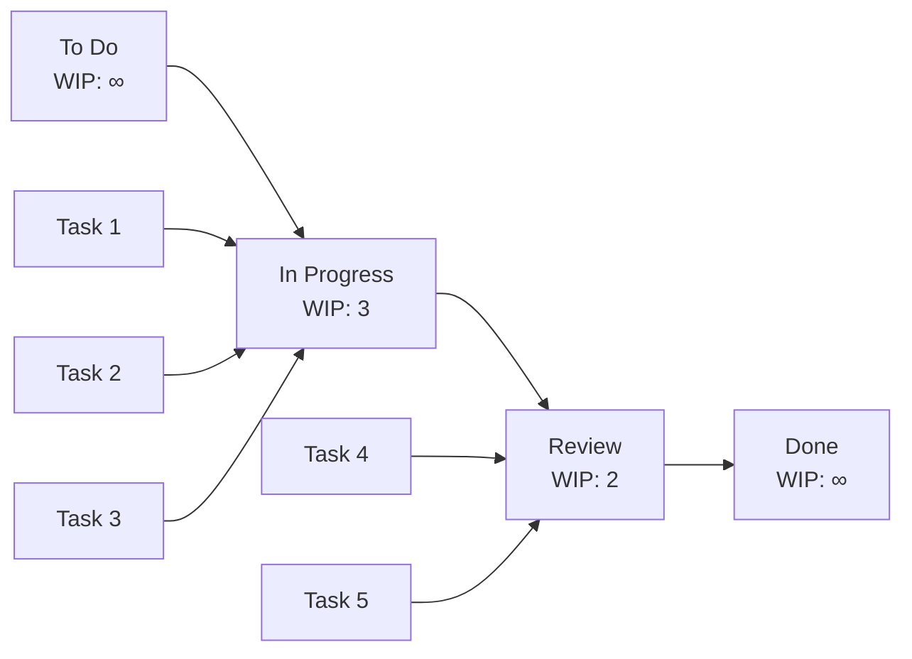
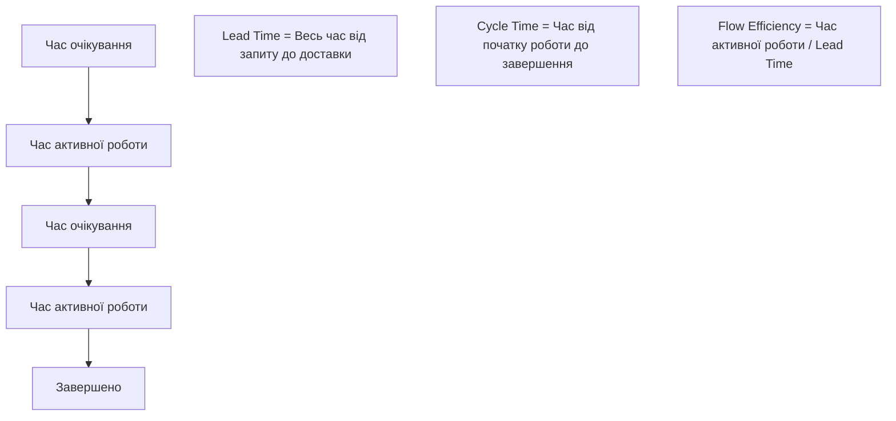
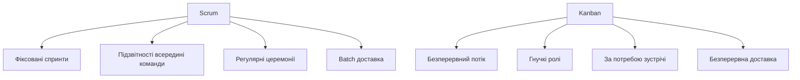
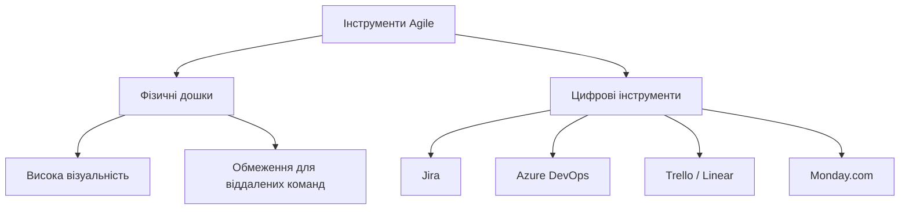
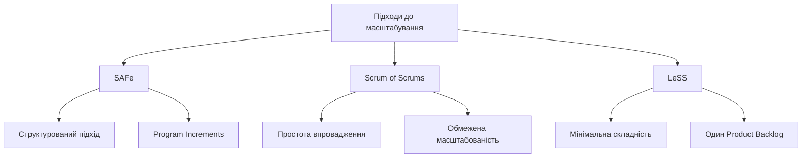

# Лекція 6. Scrum та Kanban

## Вступ

У попередній лекції ми розібрали, звідки з'явився Agile і на яких цінностях та принципах він тримається. Але сам маніфест не описує, як саме організувати роботу команди день у день, — для цього потрібні конкретні фреймворки. Найпопулярніші серед них — Scrum та Kanban, і саме вони є темою цієї лекції.

Scrum надає чітку структуру підзвітностей, подій та артефактів для організації роботи команди в коротких ітераціях. Kanban фокусується на візуалізації робочого процесу та постійному покращенні потоку роботи. Обидва підходи спрямовані на підвищення продуктивності команди, покращення якості продукту та швидку адаптацію до змін вимог, але роблять це по-різному — і розуміння цієї різниці допоможе усвідомлено обирати підхід для конкретної команди чи проєкту.

У цій лекції ми детально розглянемо структуру та принципи роботи Scrum, основи Kanban, порівняємо їхні переваги й недоліки, а також вивчимо практичні аспекти впровадження цих підходів у реальних проєктах розробки ПЗ.

## Методологія Scrum

### Фундаментальні принципи Scrum

Scrum базується на емпіричному підході до управління проєктами, що використовує три стовпи: прозорість, інспекція та адаптація. Прозорість означає, що всі аспекти процесу, які впливають на результат, мають бути видимими для відповідальних за результат. Інспекція передбачає регулярну перевірку артефактів Scrum та прогресу для виявлення небажаних відхилень. Адаптація дозволяє швидко коригувати процес або продукт, якщо результати інспекції виходять за межі прийнятного.

Scrum працює в ітераціях фіксованої тривалості, які називаються спринтами. Кожен спринт має чітко визначену мету та створює потенційно готовий до випуску приріст продукту. Такий підхід дозволяє команді регулярно отримувати зворотний зв'язок від замовників і користувачів.

Scrum-команда самоорганізована та крос-функціональна. Самоорганізація означає, що команда сама вирішує, як виконувати роботу, без зовнішнього мікроменеджменту. Крос-функціональність передбачає, що команда має всі навички, необхідні для створення продукту, не покладаючись на людей поза командою.

> **Важливе уточнення термінології.** Чинна редакція Scrum Guide (2020 рік) описує Scrum-команду як єдине ціле без внутрішнього поділу на підгрупи. Раніше в багатьох джерелах (і в попередній версії посібника) окремо виділяли "команду розробки" (Development Team) як підгрупу всередині Scrum-команди, підпорядковану Product Owner і Scrum Master. Автори Scrum Guide відмовилися від цієї термінології саме тому, що вона на практиці провокувала поділ на "ми" (ті, хто пише код) і "вони" (ті, хто ставить завдання). Тепер Scrum-команда — це одна команда з трьома підзвітностями всередині неї, і кожен її член так само відповідає за спільний результат.

### Підзвітності в Scrum

**Product Owner** відповідає за максимізацію цінності продукту та роботи команди. Це включає управління Product Backlog, чітке формулювання його елементів, упорядкування їх для найкращого досягнення цілей, забезпечення видимості й прозорості Product Backlog для всіх та розуміння його елементів на потрібному рівні деталізації.

Product Owner — одна людина, а не комітет. Він може представляти бажання комітету в Product Backlog, але ті, хто хоче змінити пріоритет елемента, повинні звертатися саме до Product Owner. Щоб Product Owner був успішним, уся організація повинна поважати його рішення, видимі у змісті й порядку елементів Product Backlog.

**Scrum Master** відповідає за встановлення Scrum так, як це описано в Scrum Guide, допомагаючи всім розуміти теорію, практики, правила та цінності Scrum. Scrum Master — це слугою-лідер для Scrum-команди, який допомагає організації зрозуміти, які з її взаємодій зі Scrum-командою корисні, а які — ні, і сприяє змінам, що максимізують цінність, яку створює команда.

Scrum Master служить Product Owner у кількох способах: допомагає знайти техніки для ефективного управління Product Backlog, допомагає команді зрозуміти потребу в ясних і стислих його елементах, сприяє розумінню продуктового планування в емпіричному середовищі та полегшує проведення Scrum-подій за потреби чи запитом.

**Розробники (Developers)** — це люди в Scrum-команді, які відповідають за створення будь-якого аспекту придатного до використання інкременту в кожному спринті. Конкретні навички, потрібні розробникам, часто широкі й залежать від домену роботи; водночас команда завжди має спільно володіти всіма навичками, необхідними для створення приросту. Scrum не визнає титулів для розробників незалежно від виконуваної роботи, і не визнає підкоманд усередині Scrum-команди, незалежно від того, яких доменів (тестування, архітектура, аналіз) стосується їхня спеціалізація: індивідуальні члени можуть мати вузьку спеціалізацію, але відповідальність завжди належить команді як цілому.

Оптимальний розмір Scrum-команди — зазвичай 10 осіб або менше: досить малий, щоб залишатися гнучким, і досить великий, щоб виконати значний обсяг роботи в межах спринту.

### Scrum-події

**Sprint** — це серце Scrum, контейнер фіксованої тривалості для всіх інших подій. Спринти мають постійну тривалість протягом усього процесу розробки. Новий спринт починається одразу після завершення попереднього. Спринти складаються зі Sprint Planning, Daily Scrum, власне роботи з розробки, Sprint Review та Sprint Retrospective.

Під час спринту не вносяться зміни, які загрожували б цілі спринту; цілі якості не знижуються; обсяг може уточнюватися й перепереговорюватися між Product Owner та розробниками в міру того, як вони дізнаються більше. Кожен спринт можна розглядати як проєкт з горизонтом не більше одного місяця.

**Sprint Planning** ініціює спринт, визначаючи роботу, яка буде виконана в ньому. Цей план створюється спільною роботою всієї Scrum-команди й обмежений максимум вісьмома годинами для місячного спринту (для коротших спринтів подія зазвичай коротша). Sprint Planning відповідає на три питання: чому цей спринт цінний, що можна доставити в прирості та як буде виконана потрібна робота.

**Daily Scrum** — 15-хвилинна подія для розробників, що проводиться щодня протягом спринту для інспекції прогресу до Sprint Goal та адаптації Sprint Backlog за потреби. Важливо зауважити: чинна версія Scrum Guide більше не приписує обов'язковий формат "трьох питань" ("що я зробив учора / що робитиму сьогодні / які є перешкоди") — команді дозволено обирати будь-яку структуру зустрічі, яка тримає фокус на цілі спринту. Багато команд і сьогодні використовують три питання як зручний за замовчуванням формат, і це нормально, — головне пам'ятати, що це практика, а не формальна вимога фреймворку.

**Sprint Review** проводиться наприкінці спринту для інспекції інкременту та адаптації Product Backlog за потреби. Це робоча зустріч, а не статусна доповідь: Scrum-команда та зацікавлені сторони разом обговорюють, що було зроблено, і що варто зробити далі для оптимізації цінності. Максимальна тривалість — чотири години для місячного спринту.

**Sprint Retrospective** — можливість для Scrum-команди інспектувати саму себе й скласти план покращень на наступний спринт: як щодо людей, відносин, процесу, так і щодо інструментів. Відбувається після Sprint Review та перед наступним Sprint Planning; максимальна тривалість — три години для місячного спринту.

### Артефакти Scrum

**Product Backlog** — упорядкований, постійно змінюваний список усього, що потрібно продукту. Це єдине джерело вимог для будь-яких змін у продукті. Product Owner відповідає за Product Backlog, включно з його змістом, доступністю й упорядкуванням. Product Backlog ніколи не буває "завершеним" — він розвивається доти, доки існує сам продукт.

Елементи вищого пріоритету зазвичай ясніші й детальніші за нижчі; ті, що потраплять у найближчий спринт, уточнюються настільки, щоб їх можна було розумно завершити протягом спринту. Commitment для Product Backlog — **Product Goal**: довгостроковий об'єкт Scrum-команди, що описує майбутній стан продукту й дає орієнтир, до якого має наближати кожен окремий спринт.

**Sprint Backlog** складається зі Sprint Goal (навіщо), набору елементів Product Backlog, обраних для спринту (що), і плану доставки приросту (як). Це прогноз розробників щодо того, яка функціональність увійде в наступний інкремент, і оновлюваний упродовж спринту "живий" план роботи.

**Increment** — конкретна сходинка до Product Goal. Кожен інкремент додається до всіх попередніх, і всі разом ретельно перевіряються, щоб гарантувати, що вони працюють разом. Щоб забезпечити цінність, інкремент має бути придатним до використання. Commitment для інкременту — **Definition of Done**: формальний опис стану, якому інкремент повинен відповідати, щоб вважатися готовим.

## Методологія Kanban

### Принципи Kanban

Kanban — метод поступового та еволюційного покращення процесів доставки чи розробки. Він базується на шести основних практиках: візуалізації робочого процесу, обмеженні роботи в процесі, керуванні потоком, створенні явних політик процесу, впровадженні циклів зворотного зв'язку та покращенні співпрацею.

Візуалізація робочого процесу — основа Kanban. Команда створює візуальну модель своєї роботи, де робочі елементи представлені на дошці, що дозволяє бачити стан кожного елемента в будь-який момент часу.

Обмеження роботи в процесі означає, що команда обмежує кількість робочих елементів в активному стані. Ці обмеження допомагають виявити вузькі місця в робочому процесі та заохочують команду співпрацювати для підтримки плавного потоку роботи.

Керування потоком фокусується на плавному та передбачуваному потоці робочих елементів через систему. Команда відстежує, вимірює й звітує про потік роботи, щоб зробити покращення, які позитивно вплинуть на результати бізнесу.

### Дошка Kanban

Дошка Kanban є центральним інструментом методології й візуалізує весь робочий процес команди. Найпростіша дошка має три колонки: "To Do", "In Progress" та "Done". Кожна колонка представляє стан робочого елемента, а картки переміщуються зліва направо в міру прогресу.

Складніші дошки можуть мати додаткові колонки, що відображають конкретні етапи процесу команди — наприклад, "Backlog", "Analysis", "Development", "Testing", "Code Review", "Deployment", "Done". Кожна колонка може мати власний ліміт WIP, що обмежує кількість елементів у цьому стані одночасно.

Картки містять назву, опис, виконавця, пріоритет, оцінку складності та інші релевантні деталі й можуть бути кольорово закодовані за типом роботи, пріоритетом або командою. Swimlanes (доріжки) дозволяють категоризувати роботу за різними критеріями — наприклад, окремо для функцій, виправлень помилок і технічного боргу.

### WIP-ліміти та управління потоком

WIP-ліміти — ключовий елемент Kanban, що обмежує кількість робочих елементів у кожному стані. Вони допомагають команді зосередитися на завершенні поточної роботи перед початком нової, покращуючи загальну продуктивність та якість.

Встановлення правильних лімітів вимагає експериментування й адаптації. Якщо ліміти занадто високі, команда бере на себе забагато роботи, що призводить до затримок і зниження якості; якщо занадто низькі — команда не повністю використовує свою пропускну здатність.

Коли команда досягає WIP-ліміту в певній колонці, це створює "pull signal" — сигнал витягування: замість початку нової роботи команда зосереджується на переміщенні наявної роботи далі або на усуненні перешкод.

Метрики потоку допомагають командам вимірювати й покращувати продуктивність: час циклу (cycle time) — час від початку роботи над елементом до завершення; час виконання (lead time) — загальний час від запиту до доставки; пропускна здатність (throughput) — кількість елементів, завершених за період; коефіцієнт потоку (flow efficiency) — частка часу, коли елемент активно оброблявся.

### Класи обслуговування

Класи обслуговування допомагають командам управляти різними типами роботи з різними очікуваннями щодо доставки й ризику.

**Expedite** використовується для критичних проблем, що потребують негайного вирішення. Такі елементи мають найвищий пріоритет і можуть порушувати WIP-ліміти; їхня кількість має бути мінімальною.

**Fixed Date** включає елементи з жорсткими дедлайнами, що плануються завчасно та мають високий пріоритет відповідно до дедлайну.

**Standard** — звичайні робочі елементи, що складають основну частину роботи команди й обслуговуються в порядку пріоритету.

**Intangible** включає роботу без прямої бізнес-цінності, але необхідну для підтримки системи: технічний борг, рефакторинг, оновлення безпеки, інфраструктурні покращення.

## Порівняння Scrum та Kanban

### Структурні відмінності

Scrum має чітку структуру з визначеними подіями, артефактами й підзвітностями. Усі спринти мають фіксовану тривалість, зазвичай від одного до чотирьох тижнів; команда працює в ітераціях, кожна з яких завершується потенційно готовим до випуску інкрементом. Зміни в Sprint Backlog не заохочуються під час спринту.

Kanban гнучкіший і адаптивніший: не має фіксованих ітерацій, робота протікає безперервно, а зміни можуть вноситися будь-коли, коли з'являється нова інформація чи змінюються пріоритети.

У Scrum команда бере на себе зобов'язання доставити певний обсяг роботи до кінця спринту; Product Owner може змінювати пріоритети між спринтами, але не всередині нього. Це створює стабільність для розробників, але може бути менш адаптивним до швидких змін бізнес-вимог.

Kanban дозволяє постійну зміну пріоритетів: нові високопріоритетні елементи можуть додаватися будь-коли, менш важливі — відкладатися чи видалятися. Це робить Kanban гнучкішим до змін, але може створювати нестабільність та перемикання контексту.

### Метрики та вимірювання

Scrum використовує метрики, пов'язані зі спринтами: velocity, burndown- та burnup-charts. Kanban фокусується на метриках потоку: cycle time, lead time, throughput, cumulative flow diagrams.

Вибір між підходами часто залежить від природи роботи та організаційного контексту. Scrum краще підходить для проєктів з чітко визначеними цілями та стабільними командами; Kanban ефективніший для підтримуючої роботи, операційних завдань або ситуацій із частими змінами пріоритетів.

### Комбінування підходів: Scrumban

Багато команд поєднують елементи Scrum і Kanban, створюючи гібридний підхід — Scrumban, що використовує структуру ролей Scrum з гнучкістю потоку Kanban.

У Scrumban команди можуть використовувати спринти, але з більшою гнучкістю щодо змін під час них; можуть використовувати Kanban-дошку для візуалізації роботи та WIP-ліміти для керування потоком, а Sprint Planning замінити на pull-based планування, коли нова робота береться в міру появи пропускної здатності.

Scrumban особливо ефективний для команд, що переходять від Scrum до Kanban, або для команд, яким потрібні водночас структура Scrum і гнучкість Kanban.

## Практичне впровадження

### Впровадження Scrum

Початок роботи зі Scrum вимагає ретельної підготовки та навчання команди. Перший крок — визначення Product Owner, що має глибоке розуміння продукту та може приймати рішення щодо пріоритетів.

Розробники повинні бути крос-функціональними й мати всі навички, потрібні для створення продукту; оптимальний розмір команди — до 10 осіб. Scrum Master повинен мати досвід у Scrum та навички фасилітації.

Перші спринти часто найскладніші, оскільки команда вчиться працювати разом та освоює нові процеси. Важливо встановити реалістичні очікування та фокусуватися на навчанні, а не на максимальній продуктивності.

Створення якісного Product Backlog — ключове для успішного впровадження Scrum: елементи мають бути написані у форматі User Stories й мати чіткі критерії прийняття.

### Впровадження Kanban

Впровадження Kanban починається з мапування наявного робочого процесу команди. Важливо зрозуміти, як робота протікає через систему зараз, перш ніж намагатися її покращити.

Початкова дошка Kanban повинна відображати поточний процес, а не ідеальний, — це дозволяє побачити, де насправді виникають проблеми. Початкові WIP-ліміти можна встановити емпірично на основі спостережень.

Краще почати з вищих лімітів і поступово їх зменшувати, ніж встановити занадто низькі, які паралізують роботу команди. Регулярні зустрічі для перегляду дошки допомагають команді виявляти проблеми й можливості для покращення.

### Поширені помилки та виклики

Одна з найпоширеніших помилок при впровадженні Scrum — намагання адаптувати Scrum до наявних процесів замість того, щоб адаптувати процеси до Scrum. Це призводить до "ScrumBut" — ситуації, коли команда каже "ми використовуємо Scrum, але..." та вносить зміни, що підривають ефективність фреймворку.

Недостатня підтримка з боку менеджменту може серйозно вплинути на успіх впровадження Agile-методологій. Неправильне розуміння підзвітностей часто призводить до проблем: Product Owner може не мати достатньо часу чи повноважень, а Scrum Master — бути перевантаженим іншими обов'язками.

При впровадженні Kanban поширена помилка — відсутність справжніх WIP-лімітів: команда може створити дошку, але не встановити реальні обмеження на кількість роботи в процесі, і тоді Kanban втрачає більшість своїх переваг.

Фокус на інструментах замість принципів також створює проблеми: команди можуть витрачати забагато часу на налаштування програмного забезпечення замість того, щоб зосередитися на покращенні співпраці й доставки цінності.

## Інструменти та технології

### Фізичні дошки

Фізичні дошки залишаються потужним інструментом для команд, що працюють в одному офісі: вони забезпечують високу візуальність та тактильний досвід переміщення карток, легко налаштовуються без технічних обмежень. Проте вони мають значні обмеження для розподілених команд і ускладнюють відстеження історичних даних та звітність.

### Цифрові інструменти

Jira від Atlassian лишається одним з найпопулярніших інструментів для управління Agile-проєктами: підтримує і Scrum, і Kanban, надає потужні можливості для відстеження задач, планування спринтів та генерації звітів. Останніми роками Atlassian додала в Jira функції на основі штучного інтелекту (Atlassian Intelligence) — наприклад, чорнове формулювання й підсумовування елементів беклогу, — але остаточне рішення про пріоритети й формулювання завжди лишається за командою.

Azure DevOps від Microsoft інтегрує управління проєктами з інструментами розробки — контролем версій, збіркою й тестуванням, що робить його привабливим для команд в екосистемі Microsoft.

Trello надає простий та інтуїтивний інтерфейс для Kanban-дошок; його простота приваблює невеликі команди без потреби у складних функціях. Linear, набагато молодший за Jira і Trello інструмент, останніми роками здобув популярність серед продуктових та інженерних команд саме завдяки навмисній простоті й швидкості роботи.

Monday.com та подібні платформи надають гнучкі можливості для налаштування робочих процесів і можуть бути адаптовані для різних методологій; вони часто мають інтуїтивніший інтерфейс для нетехнічних користувачів.

### Інтеграція з інструментами розробки

Сучасні Agile-інструменти повинні інтегруватися з іншими інструментами команди. Інтеграція з системами контролю версій (Git) дозволяє автоматично пов'язувати коміти з робочими елементами, забезпечуючи повну простежуваність від вимог до коду.

Інтеграція з CI/CD-конвеєрами дозволяє автоматично оновлювати статус робочих елементів на основі результатів збірки й розгортання: наприклад, коли код успішно розгорнутий у production, відповідна задача автоматично переміщується до "Done". Інтеграція з інструментами тестування може автоматично створювати дефекти або оновлювати статус тестових випадків.

## Масштабування Agile

### Frameworks для масштабування

Коли організації зростають та мають кілька команд, що працюють над одним продуктом чи пов'язаними продуктами, виникає потреба в масштабуванні Agile-підходів.

Scaled Agile Framework (SAFe) — один з найпопулярніших підходів до масштабування: надає структуру для координації роботи кількох команд через програмні інкременти й Release Trains.

Scrum of Scrums — простіший підхід, що використовує представників кожної команди для координації роботи через регулярні зустрічі щодо залежностей, конфліктів та спільних викликів.

Large Scale Scrum (LeSS) намагається мінімізувати складність масштабування, зберігаючи принципи Scrum на організаційному рівні: використовує один Product Backlog для всіх команд і координує роботу через спільні Sprint Planning та Review.

### Виклики масштабування

Координація між командами стає одним з найбільших викликів при масштабуванні Agile: команди повинні управляти залежностями, синхронізувати релізи та забезпечувати узгодженість архітектури, що вимагає додаткових процесів і ролей, здатних сповільнити гнучкість — головну перевагу Agile.

Управління спільним кодом та архітектурою потребує координації між командами щодо стандартів кодування й архітектурних рішень, що може вимагати створення архітектурних команд або Communities of Practice. Культурні зміни стають складнішими у великих організаціях, де різні частини можуть мати різний рівень готовності до трансформації.

## Практичні поради та рекомендації

### Для команд-початківців

Новим командам рекомендується почати з простих практик і поступово додавати складність: краще повністю освоїти базові елементи Scrum або Kanban, ніж намагатися впровадити всі практики одразу.

Регулярні ретроспективи критично важливі для навчання й адаптації — команди повинні чесно обговорювати, що працює добре, а що потребує покращення, у безпечному середовищі без страху критики. Інвестиції в навчання та коучинг можуть значно прискорити адаптацію.

### Для досвідчених команд

Досвідчені команди можуть експериментувати з комбінуванням практик різних методологій — наприклад, використовувати Scrum-події з Kanban-метриками або додавати практики XP до Scrum-процесу.

Фокус на метриках та безперервному покращенні стає важливішим для зрілих команд, які можуть використовувати складніші метрики, такі як flow efficiency чи predictability. Досвідчені команди також можуть менторити нові команди в організації.

### Адаптація до контексту

Немає універсального рішення для всіх команд та організацій. Scrum може бути кращим для команд, що працюють над новими продуктами з невизначеними вимогами; Kanban — більш підходящим для підтримуючих команд або команд з частими змінами пріоритетів. Розмір команди, досвід її членів, організаційна культура й тип продукту — усі ці фактори варто враховувати при виборі та адаптації методології.

## Висновки

Scrum та Kanban — два різні, але взаємодоповнювані підходи до Agile-розробки ПЗ. Scrum надає структуру й ритм через фіксовані спринти та регулярні церемонії, що особливо корисно для команд, яким потрібен чіткий фокус і регулярні точки синхронізації. Kanban фокусується на покращенні потоку роботи та візуалізації процесу, що робить його ідеальним для команд зі змінними пріоритетами й постійним потоком завдань.

Обидва підходи ділять основні принципи Agile: фокус на людях та взаємодії, співпрацю з клієнтами, реагування на зміни й доставку робочого ПЗ. Вибір між ними або комбінування їх елементів залежить від конкретного контексту команди, організації та проєкту.

Успішне впровадження будь-якої з цих методологій вимагає не лише розуміння механізмів, а й культурних змін в організації. Важливо пам'ятати: Scrum та Kanban — це інструменти, а не самоціль. Головна мета — покращити здатність команди доставляти цінність клієнтам швидко й ефективно; методології мають служити цій цілі, а не створювати додаткову бюрократію чи обмеження.

У наступних лекціях ми розглянемо, як ці методології інтегруються з технічними практиками розробки ПЗ, включно з архітектурою, проєктуванням та управлінням якістю коду.

## Питання для самоперевірки

1. Які три стовпи емпіричного підходу лежать в основі Scrum? Поясніть кожен з них.
2. Які підзвітності визначені в Scrum-команді та за що відповідає кожна з них?
3. Опишіть кожну зі Scrum-подій: мету, тривалість та учасників.
4. Що таке Product Goal, Sprint Goal та Definition of Done і чому вони важливі?
5. Які шість основних практик Kanban? Поясніть кожну з них.
6. У чому полягають ключові структурні відмінності між Scrum та Kanban?
7. Що таке Scrumban та коли доцільно його використовувати?
8. Які поширені помилки виникають при впровадженні Scrum та Kanban? Як їх уникнути?
9. Як обрати між Scrum та Kanban для конкретної команди чи проєкту?
10. Які підходи використовуються для масштабування Agile на кілька команд?
