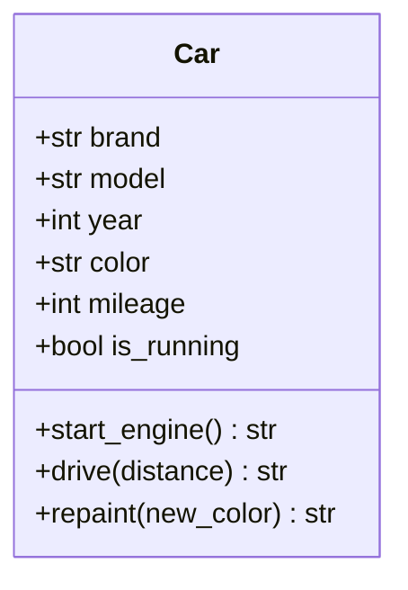
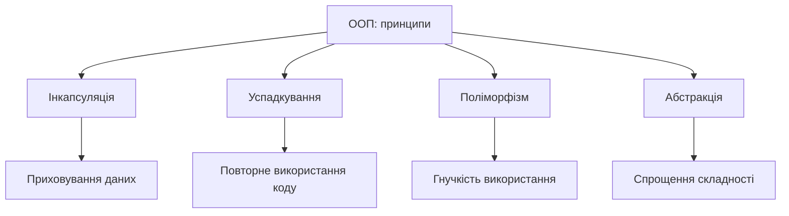
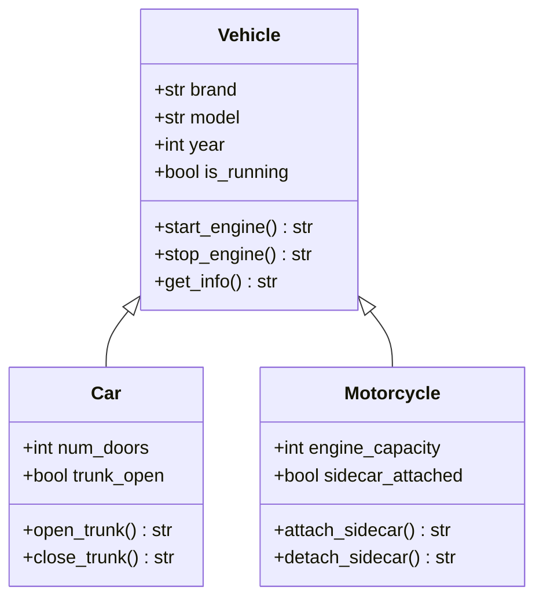

# Основи об'єктно-орієнтованого програмування

## Основні поняття

- **Об'єкт** — програмна модель реальної або абстрактної сутності, що поєднує дані (стан) та функції для роботи з ними (поведінку). Кожен об'єкт має власну ідентичність.
- **Клас** — шаблон (креслення), за яким створюють об'єкти. Клас описує, які атрибути та методи матимуть усі його екземпляри.
- **Інкапсуляція** — об'єднання даних і методів в одному класі та обмеження прямого доступу до внутрішнього стану: зовнішній код працює з об'єктом лише через його публічний інтерфейс.
- **Успадкування** — створення нового класу (підкласу) на основі наявного (суперкласу) з повторним використанням його атрибутів і методів.
- **Поліморфізм** — здатність об'єктів різних класів по-різному реагувати на однаковий виклик, завдяки чому з ними можна працювати через єдиний інтерфейс.
- **Абстракція** — виділення суттєвих характеристик об'єкта та приховування другорядних деталей. У коді виражається через абстрактні класи та інтерфейси.
- **Композиція** — побудова складного об'єкта з простіших, які він містить як власні частини (відношення «має»). Часто є гнучкішою альтернативою успадкуванню.

## Вступ

До цього моменту наші програми складалися з функцій та окремих структур даних: списків, словників, рядків. Такий підхід добре працює, поки програма невелика. Проте коли кількість функцій сягає сотень, а дані, з якими вони працюють, мають складну структуру, стає важко зрозуміти, яка функція може змінювати які дані і що зламається, якщо змінити формат одного зі словників. Об'єктно-орієнтоване програмування (ООП) пропонує інший спосіб організації коду: дані та функції, які з ними працюють, збираються разом в об'єкти, а програма розглядається як система об'єктів, що взаємодіють між собою.

ООП дозволяє моделювати предметну область через програмні об'єкти, що робить код інтуїтивнішим і ближчим до того, як ми думаємо про задачу. Замість запитання «які функції потрібно викликати над цим словником?» ми ставимо запитання «які об'єкти є в системі, що кожен із них знає і що вміє робити?». Такий підхід природно відображає структуру багатьох реальних завдань — від інтернет-магазину, де є покупці, товари та замовлення, до відеогри з персонажами, предметами та рівнями, — і спрощує проєктування складних систем.

Історія ООП починається з мови Simula, створеної у 1960-х роках у Норвегії (Оле-Йохан Даль і Крістен Нюгор): вона вперше запровадила класи й об'єкти для моделювання симуляцій. Ідеї розвинула мова Smalltalk, яку у 1970-х роках створила команда Алана Кея в Xerox PARC і в якій усе, включно з числами, було об'єктом. У 1980–1990-х роках ООП стало мейнстримом завдяки C++, Java та Python. Сьогодні переважна більшість популярних мов підтримує ООП: Java, C#, Python, C++, JavaScript і TypeScript, Kotlin, Swift. Більшість із них є мультипарадигменними: вони дозволяють поєднувати об'єктний, процедурний і функціональний стилі, і сучасний розробник вільно комбінує їх за потреби. Приклади цієї лекції написано на Python 3 (вони працюють з версії 3.10 і новіших; на момент написання актуальною стабільною гілкою є 3.14).

Є ще одна причина, чому варто розібратися з ООП саме зараз. Сучасні ШІ-асистенти для програмування (Copilot, Claude Code та подібні) охоче генерують класи, ієрархії успадкування та абстрактні інтерфейси. Щоб оцінити, чи запропонований код справді хороший, а не просто «схожий на правильний», потрібно розуміти, навіщо потрібен кожен клас і кожен зв'язок між ними. У цій лекції ми закладаємо саме таку основу. У наступній лекції ми розглянемо принципи проєктування (SOLID, DRY, KISS), які підказують, як робити класи якісними, а в лекції 9 побачимо, як з класів складаються цілі архітектури застосунків.

## Концепція об'єктів та класів

### Що таке об'єкт

Об'єкт у програмуванні — це програмна модель реального або абстрактного поняття. Він поєднує в собі дані та методи для роботи з ними. Таке поєднання пов'язаної інформації та функціональності в одну логічну одиницю називають інкапсуляцією; докладніше про неї ми поговоримо нижче.

Розглянемо приклад із реального світу. Автомобіль має характеристики: марку, модель, рік випуску, колір, пробіг. Він також має поведінку: запуск двигуна, рух, гальмування, зміну кольору після перефарбування. В ООП ми створюємо програмний об'єкт, який моделює автомобіль з цими характеристиками та можливостями. Найпростіше уявлення автомобіля в Python — словник:

```python
# Найпростіша модель: автомобіль як набір даних
car = {
    'brand': 'Toyota',
    'model': 'Camry',
    'year': 2020,
    'mileage': 15000,
    'color': 'silver'
}
```

Словник зберігає лише дані — стан. Зауважимо, що він нічого не «вміє»: щоб збільшити пробіг, нам довелося б написати окрему функцію, яка приймає цей словник і змінює його. Ніщо не пов'язує словник із функціями, що з ним працюють, і ніщо не заважає комусь записати в `mileage` рядок або від'ємне число. Справжній об'єкт усуває обидві проблеми, поєднуючи дані з методами.

Кожен об'єкт має стан і поведінку. Стан визначається значеннями його властивостей: у нашому прикладі це марка, модель, рік випуску, пробіг і колір. Поведінка визначається методами, які можуть змінювати стан або виконувати певні дії: метод руху збільшує пробіг, метод фарбування змінює колір.

Важлива особливість об'єктів — їхня ідентичність. Навіть якщо два об'єкти мають однакові значення всіх характеристик, вони залишаються різними сутностями. Два автомобілі однакової моделі та кольору — це все одно два різні автомобілі з різною історією експлуатації. У Python ця різниця відображається у двох різних операціях порівняння: `==` порівнює значення, а `is` перевіряє, чи це один і той самий об'єкт.

```python
car_a = {'brand': 'Toyota', 'model': 'Camry'}
car_b = {'brand': 'Toyota', 'model': 'Camry'}
car_c = car_a  # друге ім'я для того самого об'єкта

print(car_a == car_b)  # True  — значення однакові
print(car_a is car_b)  # False — це два різні об'єкти
print(car_a is car_c)  # True  — це один і той самий об'єкт
```

Розрізнення «однакові за значенням» і «той самий об'єкт» є джерелом багатьох помилок у початківців, тож варто його засвоїти з самого початку.

### Що таке клас

Клас — це шаблон, або креслення, для створення об'єктів. Якщо об'єкт — конкретний екземпляр, то клас визначає спільну структуру та поведінку всіх об'єктів цього типу. Використовуючи аналогію з будівництвом, клас можна порівняти з архітектурним планом будинку, а об'єкт — із конкретним будинком, побудованим за цим планом. За одним планом можна побудувати скільки завгодно будинків, і кожен буде окремою спорудою зі своїм станом: в одному вікна відчинені, в іншому зачинені.

```python
class Car:
    """Автомобіль: зберігає свій стан і вміє виконувати прості дії."""

    def __init__(self, brand: str, model: str, year: int, color: str) -> None:
        self.brand = brand
        self.model = model
        self.year = year
        self.color = color
        self.mileage = 0
        self.is_running = False

    def start_engine(self) -> str:
        if not self.is_running:
            self.is_running = True
            return f"{self.brand} {self.model}: двигун запущено"
        return f"{self.brand} {self.model}: двигун вже працює"

    def drive(self, distance: int) -> str:
        if self.is_running:
            self.mileage += distance
            return f"Проїхано {distance} км. Загальний пробіг: {self.mileage} км"
        return "Спершу запустіть двигун"

    def repaint(self, new_color: str) -> str:
        old_color = self.color
        self.color = new_color
        return f"Автомобіль перефарбовано з {old_color} на {new_color}"
```

Записи на кшталт `brand: str` називають анотаціями типів. Вони підказують читачеві (і засобам перевірки коду, наприклад mypy чи Pyright), які значення очікуються, але сам Python під час виконання їх не перевіряє. У сучасному Python анотації вважаються доброю практикою, тому ми використовуватимемо їх у прикладах.

Клас складається з двох основних компонентів: атрибутів і методів. Атрибути зберігають дані об'єкта. У нашому прикладі це марка, модель, рік випуску, колір, пробіг і стан двигуна. Методи визначають поведінку: `start_engine` запускає двигун, `drive` імітує рух і збільшує пробіг, `repaint` змінює колір.

Спеціальний метод `__init__` називають конструктором (точніше, ініціалізатором). Він викликається автоматично щоразу, коли створюється новий об'єкт, і встановлює його початковий стан. Перший параметр кожного методу, `self`, посилається на конкретний екземпляр, для якого метод викликано. Саме через `self` метод отримує доступ до атрибутів і методів цього екземпляра: коли ми викликаємо `my_car.drive(50)`, Python фактично виконує `Car.drive(my_car, 50)`.

Структуру класу зручно показувати на діаграмі класів мови UML. Верхня частина блоку містить назву класу, середня — атрибути, нижня — методи (знак `+` означає публічний член).



### Створення та використання об'єктів

Після визначення класу ми можемо створювати необмежену кількість об'єктів на його основі. Кожен об'єкт має власний стан, незалежний від інших об'єктів того самого класу.

```python
# Створення екземплярів класу Car
my_car = Car('Toyota', 'Camry', 2020, 'silver')
your_car = Car('Honda', 'Civic', 2021, 'blue')

# Використання методів об'єктів
print(my_car.start_engine())
print(my_car.drive(50))
print(my_car.drive(30))

print(your_car.start_engine())
print(your_car.repaint('red'))

print(isinstance(my_car, Car))  # True — перевірка, що об'єкт належить класу
```

У цьому прикладі створено два різні об'єкти автомобілів. Хоча обидва мають спільний клас `Car`, вони мають різні характеристики та незалежні стани: коли ми збільшуємо пробіг `my_car`, пробіг `your_car` залишається незмінним.

Важливо розуміти різницю між класом і об'єктом. Клас існує в програмі один раз як опис, а об'єктів можна створити скільки завгодно. Кожен об'єкт займає окрему область пам'яті та має власний життєвий цикл: він створюється під час виконання програми і знищується автоматично, коли на нього більше не залишається жодних посилань (у Python цим займається лічильник посилань і збирач сміття, тож вручну звільняти пам'ять не потрібно).

Багато класів існують лише для того, щоб зберігати дані, і методів майже не мають. Щоб не писати `__init__` та інші службові методи вручну, у Python є декоратор `@dataclass`, який генерує їх автоматично:

```python
from dataclasses import dataclass


@dataclass
class Point:
    x: float
    y: float


p1 = Point(1.5, 2.0)
p2 = Point(1.5, 2.0)

print(p1)        # Point(x=1.5, y=2.0) — зручне текстове представлення
print(p1 == p2)  # True — порівняння за значеннями полів
```

Це не окрема технологія, а звичайний клас, для якого Python сам створив конструктор, текстове представлення та порівняння. Якщо додати `@dataclass(frozen=True)`, об'єкт стане незмінним після створення — для значень на кшталт координат чи грошових сум це часто бажана властивість.

## Чотири основні принципи ООП

Об'єктно-орієнтований підхід традиційно описують чотирма принципами: інкапсуляція, успадкування, поліморфізм і абстракція. Вони не існують окремо один від одного: інкапсуляція ховає деталі, абстракція визначає, що саме залишається видимим, успадкування дозволяє повторно використовувати вже написане, а поліморфізм робить так, щоб код, який використовує об'єкти, не залежав від їхніх конкретних типів. Кожен принцип розв'язує конкретну проблему розробки, і в сукупності вони дають змогу будувати складні системи з окремих, зрозумілих частин.



### Інкапсуляція

Інкапсуляція є одним із найважливіших принципів ООП. Вона має два аспекти. По-перше, дані та методи, які з ними працюють, об'єднуються в єдину структуру — клас. По-друге, внутрішня реалізація об'єкта приховується від зовнішнього світу: інші частини програми взаємодіють з об'єктом лише через чітко визначений публічний інтерфейс і не залежать від того, як він влаштований усередині.

Розглянемо класичний приклад — банківський рахунок. Баланс не можна змінювати довільно: гроші можна тільки покласти або зняти, причому зняти не більше, ніж є на рахунку.

```python
class InsufficientFundsError(Exception):
    """Недостатньо коштів для виконання операції."""


class BankAccount:
    def __init__(self, account_number: str, owner_name: str,
                 initial_balance: int = 0) -> None:
        if initial_balance < 0:
            raise ValueError("Початковий баланс не може бути від'ємним")
        self.account_number = account_number
        self.owner_name = owner_name
        self.__balance = initial_balance          # «приватний» атрибут
        self.__transaction_history: list[str] = []

    @property
    def balance(self) -> int:
        """Поточний баланс (доступний лише для читання)."""
        return self.__balance

    def deposit(self, amount: int) -> None:
        if amount <= 0:
            raise ValueError("Сума поповнення має бути додатною")
        self.__balance += amount
        self.__transaction_history.append(f"Поповнення: +{amount}")

    def withdraw(self, amount: int) -> None:
        if amount <= 0:
            raise ValueError("Сума зняття має бути додатною")
        if amount > self.__balance:
            raise InsufficientFundsError(
                f"На рахунку {self.__balance}, а потрібно {amount}"
            )
        self.__balance -= amount
        self.__transaction_history.append(f"Зняття: -{amount}")

    def get_transaction_history(self) -> list[str]:
        return self.__transaction_history.copy()
```

Зверніть увагу на кілька рішень у цьому коді. Атрибути `__balance` та `__transaction_history` позначено двома підкресленнями: це сигнал, що вони призначені лише для внутрішнього використання. Для читання балансу є властивість `balance`, створена декоратором `@property`: ззовні вона виглядає як звичайний атрибут (`account.balance`), але змінити її не можна. Для зміни стану є лише методи `deposit` і `withdraw`, які перевіряють коректність операції. Про помилки методи повідомляють винятками (`ValueError`, `InsufficientFundsError`), а не текстовими повідомленнями: виняток неможливо випадково проігнорувати, а рядок «Недостатньо коштів» програма легко сприйме за успішний результат. Нарешті, `get_transaction_history` повертає копію списку, щоб зовнішній код не міг змінити історію операцій. Для грошових сум ми використовуємо цілі числа: числа з рухомою комою для грошей не годяться через похибки округлення (наприклад, `0.1 + 0.2` дає `0.30000000000000004`).

```python
# Використання інкапсуляції
account = BankAccount('UA123456', 'Іван Петренко', 1000)

account.deposit(500)
account.withdraw(300)
print(f"Поточний баланс: {account.balance}")  # 1200

try:
    account.withdraw(5000)
except InsufficientFundsError as error:
    print(f"Операцію відхилено: {error}")

# account.balance = 1_000_000  # AttributeError: властивість лише для читання
# print(account.__balance)     # AttributeError: такого атрибута «ззовні» немає
```

Переваги інкапсуляції численні. По-перше, вона захищає дані від неконтрольованих змін: ніхто не може просто встановити довільне значення балансу в обхід перевірок. По-друге, вона дозволяє змінювати внутрішню реалізацію без впливу на зовнішній код: ми можемо змінити спосіб зберігання балансу чи історії, не змінюючи інтерфейс класу, і все, що його використовує, продовжить працювати. По-третє, вона спрощує використання класу, адже користувачеві достатньо знати кілька методів, а не розбиратися в деталях реалізації.

Рівні доступу до членів класу визначають, хто може їх використовувати. Публічні члени доступні звідусіль і формують зовнішній інтерфейс. Захищені члени, які за домовленістю позначають одним підкресленням (`_name`), призначені для використання всередині класу та його нащадків. Приватні члени з двома підкресленнями (`__name`) призначені лише для самого класу. Проте варто знати важливу особливість Python: на відміну від Java чи C#, ця «приватність» не є жорсткою забороною. Python лише перейменовує такий атрибут (`__balance` стає `_BankAccount__balance`), щоб уникнути випадкових збігів імен, але за бажання до нього все одно можна дістатися:

```python
print(account._BankAccount__balance)  # 1200 — технічно можливо, але так робити не слід
```

Філософія Python полягає в тому, що всі ми дорослі люди: підкреслення є чесною угодою між розробниками, а не замком. Порушувати її — значить свідомо брати на себе відповідальність за наслідки.

### Успадкування

Успадкування дозволяє створювати нові класи на основі наявних, отримуючи їхні властивості та поведінку. Клас, від якого успадковують, називають батьківським, базовим класом або суперкласом. Клас, який успадковує, — дочірнім класом або підкласом. Успадкування сприяє повторному використанню коду й побудові ієрархій класів, а його зміст добре передає відношення «є»: автомобіль є транспортним засобом, мотоцикл теж є транспортним засобом.

Нижче клас `Car` визначено заново: тепер він є нащадком загального класу `Vehicle` і містить лише те, що відрізняє автомобіль від інших транспортних засобів.

```python
# Базовий клас
class Vehicle:
    def __init__(self, brand: str, model: str, year: int) -> None:
        self.brand = brand
        self.model = model
        self.year = year
        self.is_running = False

    def start_engine(self) -> str:
        self.is_running = True
        return f"{self.brand} {self.model}: двигун запущено"

    def stop_engine(self) -> str:
        self.is_running = False
        return f"{self.brand} {self.model}: двигун зупинено"

    def get_info(self) -> str:
        return f"{self.year} {self.brand} {self.model}"


# Дочірній клас Car успадковує Vehicle
class Car(Vehicle):
    def __init__(self, brand: str, model: str, year: int, num_doors: int) -> None:
        super().__init__(brand, model, year)
        self.num_doors = num_doors
        self.trunk_open = False

    def open_trunk(self) -> str:
        self.trunk_open = True
        return "Багажник відкрито"

    def close_trunk(self) -> str:
        self.trunk_open = False
        return "Багажник закрито"

    def get_info(self) -> str:
        return f"{super().get_info()}, {self.num_doors} дверей"


# Дочірній клас Motorcycle успадковує Vehicle
class Motorcycle(Vehicle):
    def __init__(self, brand: str, model: str, year: int,
                 engine_capacity: int) -> None:
        super().__init__(brand, model, year)
        self.engine_capacity = engine_capacity
        self.sidecar_attached = False

    def attach_sidecar(self) -> str:
        self.sidecar_attached = True
        return "Бокову коляску приєднано"

    def detach_sidecar(self) -> str:
        self.sidecar_attached = False
        return "Бокову коляску від'єднано"

    def get_info(self) -> str:
        return f"{super().get_info()}, {self.engine_capacity} куб. см"
```

Ієрархію класів також зручно зображати діаграмою: стрілка з порожнім трикутником вказує від нащадка до батьківського класу.



Клас `Vehicle` є базовим і визначає характеристики та поведінку, спільні для всіх транспортних засобів. Класи `Car` і `Motorcycle` успадковують `Vehicle` та додають власну функціональність: автомобіль має кількість дверей і багажник, мотоцикл — об'єм двигуна та можливість приєднати бокову коляску. Спільний код (запуск і зупинка двигуна) написано один раз, у базовому класі.

Функція `super()` дає доступ до методів батьківського класу. У конструкторі дочірнього класу ми спершу викликаємо `super().__init__()`, щоб батьківська частина об'єкта була ініціалізована, а вже потім додаємо власні атрибути. Метод `get_info` у нащадках розширює батьківський метод: він викликає його через `super()` і дописує специфічну інформацію.

```python
# Використання успадкування
sedan = Car('Toyota', 'Camry', 2020, 4)
bike = Motorcycle('Harley-Davidson', 'Street 750', 2019, 750)

print(sedan.get_info())      # 2020 Toyota Camry, 4 дверей
print(sedan.start_engine())  # метод успадковано від Vehicle
print(sedan.open_trunk())    # власний метод Car

print(bike.get_info())
print(bike.attach_sidecar())

print(isinstance(sedan, Vehicle))  # True — автомобіль «є» транспортним засобом
```

За кількістю батьківських класів розрізняють одиничне успадкування, коли клас має одного батька, і множинне, коли їх кілька. Багаторівневе успадкування утворює ланцюжок: клас успадковує від класу, який сам є нащадком іншого. Python підтримує множинне успадкування, і саме тут виникає складність: якщо два батьки мають метод з однаковою назвою, потрібно знати, чий саме буде викликано. Python вирішує це за допомогою порядку розв'язання методів (MRO), який можна переглянути:

```python
class Flyer:
    def move(self) -> str:
        return "летить"

class Swimmer:
    def move(self) -> str:
        return "пливе"

class Duck(Flyer, Swimmer):
    pass

print(Duck().move())                        # летить — Flyer стоїть першим у списку
print([cls.__name__ for cls in Duck.__mro__])
# ['Duck', 'Flyer', 'Swimmer', 'object']
```

Множинне успадкування — потужний інструмент, але воно легко призводить до заплутаних ієрархій (зокрема до «ромбоподібного» успадкування, коли два батьки самі мають спільного предка). Тому на практиці його використовують обережно і переважно для невеликих класів-домішок (mixins) з однією вузькою функцією.

### Поліморфізм

Поліморфізм (від грецького «багато форм») означає, що об'єкти різних класів можуть по-різному реагувати на однаковий виклик. Це дозволяє працювати з об'єктами різних типів через єдиний інтерфейс, не перевіряючи, який саме тип перед нами. Поліморфізм значно підвищує гнучкість і розширюваність коду.

```python
import math


class Shape:
    def __init__(self, color: str) -> None:
        self.color = color

    def area(self) -> float:
        raise NotImplementedError("Метод area має бути реалізований у підкласі")

    def perimeter(self) -> float:
        raise NotImplementedError("Метод perimeter має бути реалізований у підкласі")

    def describe(self) -> str:
        return f"Це {self.color} фігура"


class Rectangle(Shape):
    def __init__(self, color: str, width: float, height: float) -> None:
        super().__init__(color)
        self.width = width
        self.height = height

    def area(self) -> float:
        return self.width * self.height

    def perimeter(self) -> float:
        return 2 * (self.width + self.height)

    def describe(self) -> str:
        return f"{super().describe()} — прямокутник {self.width}x{self.height}"


class Circle(Shape):
    def __init__(self, color: str, radius: float) -> None:
        super().__init__(color)
        self.radius = radius

    def area(self) -> float:
        return math.pi * self.radius ** 2

    def perimeter(self) -> float:
        return 2 * math.pi * self.radius

    def describe(self) -> str:
        return f"{super().describe()} — коло радіусом {self.radius}"


class Triangle(Shape):
    def __init__(self, color: str, side_a: float, side_b: float, side_c: float) -> None:
        super().__init__(color)
        self.side_a = side_a
        self.side_b = side_b
        self.side_c = side_c

    def area(self) -> float:
        s = self.perimeter() / 2  # формула Герона
        return (s * (s - self.side_a) * (s - self.side_b) * (s - self.side_c)) ** 0.5

    def perimeter(self) -> float:
        return self.side_a + self.side_b + self.side_c

    def describe(self) -> str:
        return (f"{super().describe()} — трикутник зі сторонами "
                f"{self.side_a}, {self.side_b}, {self.side_c}")
```

У цьому прикладі всі фігури мають методи `area`, `perimeter` та `describe`, але кожна реалізує їх по-своєму, відповідно до своєї геометрії. Тепер з ними можна працювати однаково:

```python
# Поліморфне використання об'єктів
shapes = [
    Rectangle('червона', 5, 3),
    Circle('синя', 4),
    Triangle('зелена', 3, 4, 5),
]

# Усі фігури обробляються однаково, хоча кожна рахує площу по-своєму
for shape in shapes:
    print(shape.describe())
    print(f"Площа: {shape.area():.2f}")
    print(f"Периметр: {shape.perimeter():.2f}")
    print()
```

Цикл `for` нічого не знає про конкретні класи: він лише викликає `area()`, а Python сам обирає потрібну версію методу залежно від типу об'єкта. Це і є поліморфізм. Його головна цінність — розширюваність: якщо завтра з'явиться клас `Ellipse`, цикл продовжить працювати без жодних змін.

Ключовим механізмом поліморфізму є перевизначення методів. Дочірній клас надає власну реалізацію методу, успадкованого від батьківського, і під час виклику використовується версія з найконкретнішого класу в ієрархії. Слід розрізняти перевизначення (override) і перевантаження (overload). Перевантаження — це кілька методів з однаковою назвою, але різними параметрами, у мовах на кшталт Java чи C++. У Python перевантаження в такому вигляді немає: остання визначена функція з певною назвою просто замінює попередні. Потрібну гнучкість у Python досягають іншими засобами: значеннями параметрів за замовчуванням, аргументами `*args` і `**kwargs`, а для вибору реалізації за типом аргумента — стандартним декоратором `functools.singledispatch`.

Python також підтримує «качину типізацію» (duck typing): якщо об'єкт має потрібний метод, його можна використовувати, навіть якщо він не пов'язаний спільним предком з іншими. Прислів'я про качку звучить так: «Якщо воно ходить як качка і крякає як качка, то це, найімовірніше, качка».

```python
class Duck:
    def speak(self) -> str:
        return "Кря!"

class Robot:
    def speak(self) -> str:
        return "Біп-буп"

for thing in (Duck(), Robot()):
    print(thing.speak())  # спільного батьківського класу немає, але код працює
```

Таким чином, у Python поліморфізм не вимагає обов'язкового успадкування, а спільний «контракт» між класами можна описати явно, що й підводить нас до абстракції.

### Абстракція

Абстракція означає виділення суттєвих характеристик об'єкта й ігнорування несуттєвих деталей. Коли ми користуємося смартфоном, нам достатньо знати, що екран реагує на дотик; як саме влаштований сенсор, ми не думаємо. У програмуванні абстракція дозволяє розробнику мислити на рівні «що робить об'єкт», а не «як він це робить».

Основним інструментом абстракції в Python є абстрактні класи. Абстрактний клас визначає загальний інтерфейс для групи пов'язаних класів, але не може бути використаний для створення об'єктів безпосередньо: він слугує шаблоном для конкретних класів.

```python
from abc import ABC, abstractmethod


class Database(ABC):
    def __init__(self, connection_string: str) -> None:
        self.connection_string = connection_string
        self.is_connected = False

    @abstractmethod
    def connect(self) -> str:
        """Встановити з'єднання з базою даних."""

    @abstractmethod
    def disconnect(self) -> str:
        """Закрити з'єднання."""

    @abstractmethod
    def execute_query(self, query: str) -> str:
        """Виконати запит."""

    def get_connection_status(self) -> str:
        # Конкретний метод: спільна поведінка для всіх нащадків
        return "Підключено" if self.is_connected else "Відключено"


class MySQLDatabase(Database):
    def connect(self) -> str:
        self.is_connected = True
        return f"Підключено до MySQL: {self.connection_string}"

    def disconnect(self) -> str:
        self.is_connected = False
        return "Відключено від MySQL"

    def execute_query(self, query: str) -> str:
        if not self.is_connected:
            return "Помилка: спочатку підключіться до бази даних"
        return f"Виконано запит MySQL: {query}"


class PostgreSQLDatabase(Database):
    def connect(self) -> str:
        self.is_connected = True
        return f"Підключено до PostgreSQL: {self.connection_string}"

    def disconnect(self) -> str:
        self.is_connected = False
        return "Відключено від PostgreSQL"

    def execute_query(self, query: str) -> str:
        if not self.is_connected:
            return "Помилка: спочатку підключіться до бази даних"
        return f"Виконано запит PostgreSQL: {query}"


class MongoDatabase(Database):
    def connect(self) -> str:
        self.is_connected = True
        return f"Підключено до MongoDB: {self.connection_string}"

    def disconnect(self) -> str:
        self.is_connected = False
        return "Відключено від MongoDB"

    def execute_query(self, query: str) -> str:
        if not self.is_connected:
            return "Помилка: спочатку підключіться до бази даних"
        return f"Виконано запит MongoDB: {query}"
```

Абстрактний клас `Database` визначає, що означає «працювати з базою даних»: підключитися, відключитися, виконати запит. Конкретної реалізації цих методів він не містить: кожна база даних реалізує їх відповідно до своєї специфіки. Зверніть увагу, що поряд з абстрактними методами клас має і звичайний метод `get_connection_status` — спільну поведінку, яку всі нащадки отримують готовою. Спроба створити екземпляр абстрактного класу, а також екземпляр підкласу, який не реалізував усі абстрактні методи, призведе до помилки `TypeError` — причому в момент створення об'єкта, а не пізніше, під час виклику методу.

```python
# Неможливо створити екземпляр абстрактного класу
# db = Database("connection_string")  # TypeError

# Використання конкретних реалізацій
mysql_db = MySQLDatabase("localhost:3306/mydb")
postgres_db = PostgreSQLDatabase("localhost:5432/mydb")

print(mysql_db.connect())
print(mysql_db.execute_query("SELECT * FROM users"))
print(mysql_db.disconnect())

print(postgres_db.connect())
print(postgres_db.execute_query("SELECT * FROM products"))
print(postgres_db.disconnect())
```

Абстракція допомагає створювати чіткі контракти між компонентами системи. Коли ми оголошуємо абстрактний клас, ми гарантуємо, що всі його нащадки матимуть певний набір методів, а код, який користується `Database`, працюватиме з будь-якою базою однаково. Це полегшує розробку модульних систем, де різні компоненти взаємодіють через добре визначені інтерфейси.

Інтерфейс і абстрактний клас служать близьким цілям, проте відрізняються. Абстрактний клас може містити і абстрактні методи, і готову реалізацію деяких методів, тоді як інтерфейс у чистому вигляді визначає лише сигнатури методів. В окремому ключовому слові `interface` Python не має, але має два способи описати контракт. Перший — абстрактні класи (`ABC`), як вище: нащадок явно успадковує клас і зобов'язаний реалізувати його методи. Другий — протоколи (`typing.Protocol`), які працюють за принципом «качиної типізації», але з перевіркою: клас підходить, якщо має потрібні методи, і успадковувати щось для цього не потрібно.

```python
from typing import Protocol


class Notifier(Protocol):
    def send(self, message: str) -> None: ...


class EmailNotifier:  # ніщо не успадковує Notifier
    def send(self, message: str) -> None:
        print(f"Email: {message}")


class SmsNotifier:
    def send(self, message: str) -> None:
        print(f"SMS: {message}")


def alert(notifier: Notifier, text: str) -> None:
    notifier.send(text)


alert(EmailNotifier(), "Сервер недоступний")
alert(SmsNotifier(), "Сервер недоступний")
```

Обидва підходи мають право на життя: абстрактні класи зручні, коли є спільна реалізація, яку потрібно передати нащадкам, а протоколи — коли потрібно лише описати, що має вміти об'єкт. Перевіряють відповідність протоколу не під час виконання, а засоби статичного аналізу типів (mypy, Pyright). Ми ще повернемося до цієї теми в наступній лекції, коли розглядатимемо принципи розділення інтерфейсів та інверсії залежностей.

## Практичні аспекти ООП

### Коли використовувати ООП

Об'єктно-орієнтоване програмування найефективніше у певних сценаріях. Складні застосунки з багатьма взаємодіючими компонентами природно моделюються через об'єкти. Системи, що потребують багаторазового використання коду, виграють від успадкування та композиції. Проєкти з тривалим життєвим циклом і необхідністю підтримки потребують чіткої структури, яку надає ООП.

Застосунки з графічним інтерфейсом ідеально підходять для об'єктного підходу: кожен елемент інтерфейсу — кнопка, текстове поле, вікно — є об'єктом з властивостями та методами. Розробка ігор також активно використовує ООП для моделювання персонажів, предметів та ігрових механік. Симуляції реального світу природно відображаються через об'єкти з їхньою поведінкою та взаємодією. Саме на об'єктах побудовано і більшість фреймворків, з якими ви працюватимете в серверній розробці.

Водночас ООП не є єдиним правильним способом писати програми. Для простих скриптів або невеликих утиліт воно може бути надмірним: якщо програма складається з кількох простих функцій без складної логіки, процедурний підхід буде коротшим і зрозумілішим. Показовим є приклад екосистеми JavaScript: бібліотека React, яка починала з класових компонентів, у сучасному вигляді працює переважно з функціями та хуками. Мова Python теж заохочує простоту: функція, якій не потрібно зберігати стан, не мусить перетворюватися на клас. Важливо обирати інструмент відповідно до задачі, а не застосовувати ООП скрізь лише тому, що це популярна парадигма.

### Переваги ООП

Модульність коду є однією з головних переваг. Функціональність розділяється на окремі класи, кожен з яких відповідає за свою частину системи. Це спрощує розробку, тестування та супровід великих проєктів. Зміни в одному класі зазвичай не впливають на інші, що знижує ризик внесення помилок.

Повторне використання коду через успадкування та композицію значно підвищує продуктивність розробки. Замість копіювання коду між частинами програми спільну функціональність виносять у базові класи або окремі компоненти. Це не лише економить час, а й покращує підтримуваність: виправлення чи покращення потрібно внести лише в одному місці.

Гнучкість і розширюваність систем досягаються через поліморфізм і абстракцію. Нову функціональність можна додати створенням нових класів без зміни наявного коду. Інтерфейси дозволяють різним компонентам взаємодіяти незалежно від конкретної реалізації, що полегшує заміну чи оновлення окремих частин системи.

### Недоліки та обмеження

Надмірна складність може виникнути при неправильному застосуванні ООП. Велика кількість класів зі складними ієрархіями успадкування робить код важким для розуміння: щоб зрозуміти, що робить один метод, доводиться підніматися по кількох рівнях батьківських класів. Часто простіше було б використати функції замість класів. Потрібно шукати баланс між структурованістю та простотою.

Продуктивність може знижуватися через додаткові рівні абстракції та накладні витрати на роботу з об'єктами. Створення й знищення великої кількості об'єктів споживає пам'ять і процесорний час. Для більшості застосунків ці витрати непомітні, але для систем із жорсткими вимогами до швидкодії може знадобитися оптимізація або інша парадигма.

Крива навчання ООП буває крутою для початківців. Концепції успадкування, поліморфізму та абстракції потребують часу для повного розуміння, а правильне проєктування ієрархій класів і зв'язків між ними вимагає досвіду й практики. Помилки проєктування на ранніх етапах можуть призвести до проблем у майбутньому, тому не варто хвилюватися, якщо перші класи вийдуть не ідеальними: навчаються саме на таких прикладах.

## Найкращі практики ООП

### Принципи проєктування класів

Кожен клас повинен мати чітку відповідальність і робити одну річ добре. Це принцип єдиної відповідальності, який ми докладно розглянемо в наступній лекції. Клас не повинен бути надто великим або намагатися виконувати занадто багато різних завдань. Якщо клас стає надто складним, варто розглянути можливість поділу його на кілька менших класів.

Інкапсуляції слід дотримуватися послідовно. Внутрішні деталі реалізації класу мають бути приховані, а взаємодія з об'єктами має відбуватися через добре визначений публічний інтерфейс. Це дозволяє змінювати внутрішню реалізацію без впливу на код, що використовує клас.

Успадкування слід використовувати обережно. Замість глибоких ієрархій успадкування часто краще застосувати композицію. Принцип «композиція краща за успадкування» рекомендує будувати функціональність шляхом об'єднання об'єктів, а не створенням складних ієрархій класів. Успадкування найкраще підходить для моделювання відношення «є» (автомобіль є транспортним засобом), тоді як композиція — для відношення «має» (автомобіль має двигун).

```python
class Engine:
    def __init__(self, power_hp: int) -> None:
        self.power_hp = power_hp
        self.is_running = False

    def start(self) -> str:
        self.is_running = True
        return f"двигун {self.power_hp} к.с. запущено"


class Car:
    def __init__(self, brand: str, engine: Engine) -> None:
        self.brand = brand
        self.engine = engine  # Car МАЄ Engine (композиція), а не Є Engine

    def start(self) -> str:
        return f"{self.brand}: {self.engine.start()}"


car = Car("Toyota", Engine(150))
print(car.start())  # Toyota: двигун 150 к.с. запущено
```

Перевага такого підходу в тому, що двигун можна замінити (наприклад, на електричний) без зміни класу `Car` і без перебудови ієрархії успадкування. Якби ми зробили `Car` нащадком `Engine`, це було б не лише логічною помилкою, а й жорстким зв'язком, який важко розірвати пізніше.

### Іменування та організація коду

Назви класів мають бути іменниками, що відображають суть об'єкта. Для назв класів використовують стиль PascalCase (`BankAccount`, `ShoppingCart`) — так прийнято в переважній більшості мов. Назви мають бути описовими та зрозумілими без звернення до документації. Уникайте надто загальних назв на кшталт `Manager`, `Handler` чи `Utility`, якщо можна знайти конкретнішу.

Назви методів мають починатися з дієслова, оскільки метод виконує дію: `deposit`, `start_engine`, `get_balance`. У Python, згідно з настановами стилю PEP 8, методи, функції та змінні пишуть у стилі snake_case, а константи — великими літерами (`MAX_SPEED`); в інших мовах, як-от Java чи JavaScript, поширений camelCase. Параметри методів також мають описові назви, а члени класу, призначені для внутрішнього використання, позначають підкресленням, щоб показати їхнє призначення.

Дотримання таких домовленостей не потрібно перевіряти вручну: сучасні інструменти роблять це автоматично. Лінтер і форматувальник Ruff, який став стандартним для Python-проєктів, за секунди перевіряє стиль і виявляє типові помилки, а mypy чи Pyright перевіряють анотації типів. Налаштувавши їх один раз, ви отримуєте підказки прямо в редакторі коду.

Організація файлів і модулів важлива для підтримки великих проєктів. Зазвичай кожен клас розміщують в окремому файлі, особливо якщо він великий, а споріднені класи групують у модулі чи пакети. Чітка структура каталогів полегшує навігацію проєктом і пошук потрібного коду.

### Документування коду

Кожен клас повинен мати рядок документації (docstring), що описує його призначення та відповідальність. Документація має пояснювати, що робить клас, а не як саме він це робить. Опишіть основні атрибути класу та їхнє призначення, за потреби додайте приклад використання. Загальні правила оформлення docstring описано в PEP 257, а для структурування опису параметрів і результатів найчастіше використовують стиль Google, як у прикладі нижче.

```python
class ShoppingCart:
    """
    Клас для керування кошиком покупок в інтернет-магазині.

    Attributes:
        customer_id: Ідентифікатор покупця.
        items: Список товарів у кошику.

    Example:
        >>> cart = ShoppingCart('CUST123')
        >>> cart.add_item('Ноутбук', 1200, 1)
        >>> cart.get_total()
        1200
    """

    def __init__(self, customer_id: str) -> None:
        """
        Ініціалізує новий кошик для покупця.

        Args:
            customer_id: Унікальний ідентифікатор покупця.
        """
        self.customer_id = customer_id
        self.items: list[dict] = []

    def add_item(self, name: str, price: int, quantity: int = 1) -> dict:
        """
        Додає товар до кошика.

        Args:
            name: Назва товару.
            price: Ціна за одиницю (у гривнях).
            quantity: Кількість одиниць товару.

        Returns:
            Доданий товар з усіма деталями.

        Raises:
            ValueError: Якщо ціна або кількість не є додатними.
        """
        if price <= 0 or quantity <= 0:
            raise ValueError("Ціна та кількість мають бути додатними")
        item = {
            'name': name,
            'price': price,
            'quantity': quantity,
            'total': price * quantity,
        }
        self.items.append(item)
        return item

    def get_total(self) -> int:
        """Повертає загальну вартість товарів у кошику."""
        return sum(item['total'] for item in self.items)
```

Зверніть увагу: оскільки типи вже зазначено в анотаціях, їх не потрібно дублювати в docstring — це зайвий обсяг, який до того ж легко розсинхронізувати з кодом (порушивши принцип DRY, про який ми поговоримо в наступній лекції). Методи класу також потребують документації, особливо якщо вони входять до публічного інтерфейсу: опишіть параметри, результат, винятки, які метод може генерувати, а також побічні ефекти, якщо метод змінює стан об'єкта. Docstring-и мають додаткову користь: з них можна автоматично генерувати довідкову документацію, а електронні посібники, побудовані на Material for MkDocs, підтримують це через плагін mkdocstrings.

## Висновки

Об'єктно-орієнтоване програмування — потужна парадигма, яка дозволяє створювати структуровані, підтримувані й масштабовані програмні системи. Розуміння чотирьох основних принципів ООП — інкапсуляції, успадкування, поліморфізму та абстракції — є основою для ефективного використання цього підходу.

Класи й об'єкти надають природний спосіб моделювання реального світу в коді. Правильне використання інкапсуляції захищає дані та приховує складність реалізації, а винятки роблять помилки помітними. Успадкування дозволяє повторно використовувати код і будувати логічні ієрархії, але його слід застосовувати для відношення «є», віддаючи перевагу композиції для відношення «має». Поліморфізм надає гнучкість у роботі з різними типами об'єктів через єдиний інтерфейс. Абстракція, реалізована через абстрактні класи або протоколи, допомагає визначати чіткі контракти між компонентами системи.

Застосування найкращих практик ООП охоплює дотримання принципів проєктування, зрозуміле іменування й організацію коду та ретельне документування. Варто пам'ятати, що ООП — лише інструмент, і його слід використовувати доречно. Не кожна задача потребує об'єктного підходу, а вміння обрати відповідну парадигму для конкретної ситуації — ознака досвідченого розробника.

У наступній лекції ми розглянемо принципи проєктування програмного забезпечення (SOLID, DRY, KISS), які спираються на концепції ООП і пояснюють, чим хороший клас відрізняється від поганого. Далі, в лекції 9, ми побачимо, як класи та модулі об'єднуються в архітектуру цілого застосунку.

## Питання для самоперевірки

1. У чому різниця між класом і об'єктом? Наведіть приклад із реального життя.
2. Чим відрізняються `==` та `is` у Python? Чому два об'єкти з однаковими даними залишаються різними об'єктами?
3. Поясніть принцип інкапсуляції та чому він важливий для розробки програмного забезпечення. Чи є «приватні» атрибути Python справді недоступними?
4. Які переваги надає успадкування? У яких ситуаціях краще використовувати композицію замість успадкування? Наведіть свій приклад відношень «є» і «має».
5. Що таке поліморфізм і як він реалізується в ООП? Чим перевизначення методів відрізняється від перевантаження?
6. Яка різниця між абстрактним класом і звичайним класом? Коли замість абстрактного класу доречніше використати `Protocol`?
7. Чому в прикладі з банківським рахунком про помилки повідомляють винятками, а не текстовими повідомленнями?
8. Які основні переваги та недоліки об'єктно-орієнтованого програмування? У яких випадках краще обійтися функціями?
