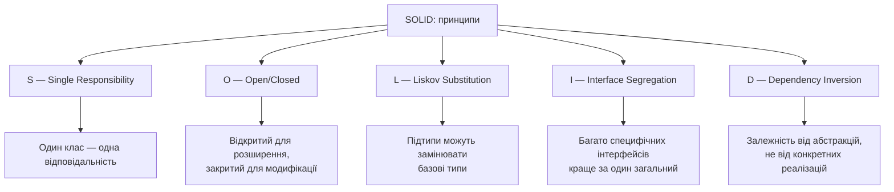
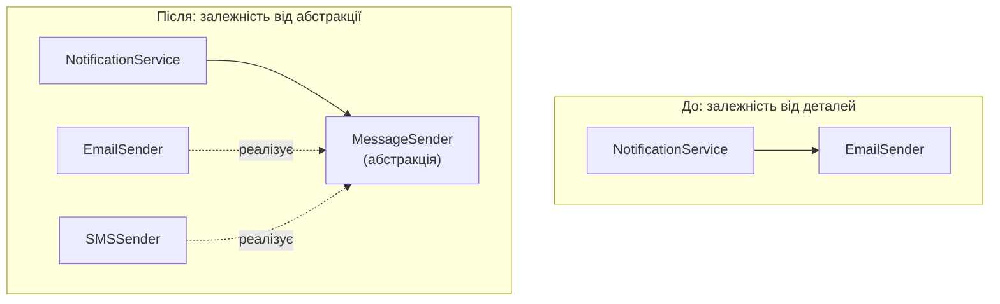
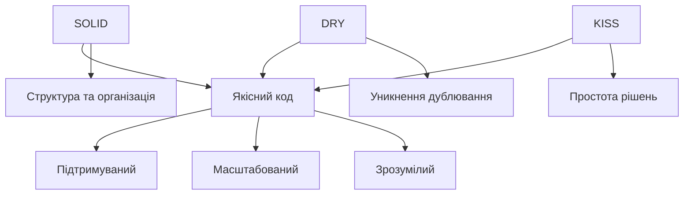

# Принципи проєктування програмного забезпечення: SOLID, DRY, KISS

## Основні поняття

- **Принцип проєктування** — узагальнена рекомендація, сформульована на основі багаторічного досвіду розробників, яка допомагає приймати рішення щодо структури коду. Це орієнтир, а не закон.
- **Зв'язаність (coupling)** — міра залежності одного модуля від іншого. Чим слабша зв'язаність, тим легше змінювати й тестувати частини системи окремо.
- **Зчепленість (cohesion)** — міра того, наскільки тісно пов'язані між собою обов'язки всередині одного модуля чи класу. Хороший клас має високу зчепленість: усе в ньому стосується однієї теми.
- **SOLID** — п'ять принципів об'єктно-орієнтованого проєктування: єдина відповідальність, відкритість/закритість, підстановка Лісков, розділення інтерфейсів, інверсія залежностей.
- **DRY (Don't Repeat Yourself)** — принцип, за яким кожна частина знань про систему має єдине, недвозначне представлення.
- **KISS (Keep It Simple, Stupid)** — принцип, що закликає обирати найпростіше рішення, яке розв'язує задачу.
- **Рефакторинг** — зміна внутрішньої структури коду без зміни його зовнішньої поведінки з метою зробити його зрозумілішим і простішим у підтримці.

## Вступ

Розробка якісного програмного забезпечення вимагає не лише знання синтаксису мови та вміння написати код, що працює. Програму, яка «просто працює», може написати і початківець. Справжні труднощі починаються пізніше: коли вимоги змінюються, до проєкту приєднуються нові люди, а код доводиться читати й змінювати через пів року після того, як його було написано. Саме тоді виявляється, чи був код спроєктований добре. Переважну частину життя програмного продукту становить супровід, а не перше написання, тому вміння створювати код, який легко зрозуміти й змінити, — одна з найцінніших навичок розробника.

У попередній лекції ми вивчили механізми ООП: класи, успадкування, поліморфізм, абстракцію. Але ці механізми самі по собі не гарантують якості: з їхньою допомогою можна створити як чудову, так і жахливу архітектуру. Принципи проєктування відповідають на запитання, як саме користуватися цими інструментами. Вони формувалися протягом десятиліть практики й узагальнюють типові помилки та способи їх уникнути. Дотримання принципів не гарантує ідеального коду, але суттєво підвищує шанси створити програмне забезпечення, яке легко розуміти, змінювати та розширювати. Крім того, принципи слугують спільною мовою для команди: фраза «цей клас порушує принцип єдиної відповідальності» передає в один рядок те, що інакше довелося б пояснювати хвилинами.

Дві ідеї проходять крізь усю лекцію: зв'язаність і зчепленість. Ми прагнемо до слабкої зв'язаності (модулі мало залежать один від одного) і високої зчепленості (усередині модуля зібране те, що стосується однієї теми). Майже кожен принцип, який ми розглянемо, є способом досягти цього.

У цій лекції розглянуто три групи принципів. SOLID — п'ять принципів об'єктно-орієнтованого проєктування. DRY закликає не дублювати знання. KISS наголошує на цінності простоти. Наприкінці ми побачимо, як ці принципи взаємодіють і навіть суперечать одне одному, як застосовувати їх при рефакторингу та рецензуванні коду, зокрема того, що згенерували ШІ-асистенти. У лекції 9 ці ідеї виведуть нас на рівень архітектури цілих застосунків.

## Принципи SOLID

SOLID — це акронім, що об'єднує п'ять принципів об'єктно-орієнтованого проєктування. Історія їхньої появи цікава сама собою. Принцип відкритості/закритості сформулював Бертран Мейєр наприкінці 1980-х років. Принцип підстановки описала Барбара Лісков у 1987–1994 роках. Роберт Мартін («дядько Боб») на початку 2000-х зібрав ці й інші ідеї в набір рекомендацій, а зручний акронім SOLID запропонував Майкл Феверс приблизно у 2004 році. Відтоді ці п'ять принципів стали базовою лексикою об'єктно-орієнтованого проєктування, а їхнє знання очікують на співбесідах і в рецензуванні коду.



### Принцип єдиної відповідальності (SRP)

Принцип єдиної відповідальності (Single Responsibility Principle) стверджує, що клас повинен мати лише одну причину для зміни. Це означає, що клас виконує одну чітко визначену функцію. Коли клас має кілька відповідальностей, зміна в одній частині функціональності може непередбачувано вплинути на іншу, адже вони живуть в одному місці й ділять одні й ті самі дані.

Пізніше Роберт Мартін уточнив це формулювання: «причина для зміни» — це, по суті, замовник або роль, що вимагає змін (команда фінансів, команда безпеки, відділ маркетингу). Клас має відповідати перед однією такою «силою». На практиці ж зручно користуватися простою перевіркою: спробуйте описати призначення класу одним реченням. Якщо в цьому реченні доводиться вживати «і» («клас перевіряє дані, і зберігає їх, і надсилає листи»), то, швидше за все, принцип порушено.

Розглянемо приклад порушення. Клас `User` збирає забагато обов'язків: керування даними користувача, валідацію, збереження в базі, відправку листів і хешування пароля.

```python
# Погане рішення: порушення SRP
class User:
    def __init__(self, name, email, password):
        self.name = name
        self.email = email
        self.password = password

    def validate_email(self):
        # Валідація email
        return '@' in self.email and '.' in self.email

    def validate_password(self):
        # Перевірка надійності пароля
        return len(self.password) >= 8

    def save_to_database(self):
        # Код збереження в базу даних
        print(f"Збереження користувача {self.name} в базу даних")
        # SQL-запити тощо

    def send_welcome_email(self):
        # Відправка листа
        print(f"Відправка вітального листа на {self.email}")

    def hash_password(self):
        # Хешування пароля (тут — лише заглушка)
        return f"hashed_{self.password}"
```

У цьому класі щонайменше чотири різні відповідальності: дані користувача, валідація, робота з базою даних і відправка листів (а ще хешування). Зміни в логіці валідації потребують модифікації класу `User`, так само як і зміни в способі збереження чи відправки листів. У результаті клас стає крихким: виправляючи одне, легко зламати інше. Тестувати його теж незручно: щоб перевірити валідацію, доводиться враховувати базу даних і поштовий сервіс.

Правильний підхід — розділити відповідальності між різними класами. Кожен виконує одну чітко визначену функцію й може змінюватися незалежно від інших.

```python
# Хороше рішення: дотримання SRP
import hashlib
import hmac
import os


class User:
    """Лише дані користувача."""
    def __init__(self, name: str, email: str, password_hash: str) -> None:
        self.name = name
        self.email = email
        self.password_hash = password_hash


class UserValidator:
    """Лише перевірка вхідних даних."""
    @staticmethod
    def validate_email(email: str) -> bool:
        return '@' in email and '.' in email.split('@')[-1]

    @staticmethod
    def validate_password(password: str) -> bool:
        return len(password) >= 8

    @classmethod
    def validate(cls, email: str, password: str) -> None:
        if not cls.validate_email(email):
            raise ValueError("Некоректний email")
        if not cls.validate_password(password):
            raise ValueError("Пароль має містити мінімум 8 символів")


class PasswordHasher:
    """Лише хешування та перевірка паролів."""
    @staticmethod
    def hash(password: str) -> str:
        salt = os.urandom(16)
        digest = hashlib.scrypt(password.encode(), salt=salt, n=2**14, r=8, p=1)
        return f"{salt.hex()}:{digest.hex()}"

    @staticmethod
    def verify(password: str, stored: str) -> bool:
        salt_hex, digest_hex = stored.split(':')
        digest = hashlib.scrypt(password.encode(), salt=bytes.fromhex(salt_hex),
                                n=2**14, r=8, p=1)
        return hmac.compare_digest(digest.hex(), digest_hex)


class UserRepository:
    """Лише збереження в базі даних."""
    def save(self, user: User) -> bool:
        print(f"Збереження користувача {user.name} в базу даних")
        return True


class EmailService:
    """Лише відправка листів."""
    def send_welcome_email(self, user: User) -> bool:
        print(f"Відправка вітального листа на {user.email}")
        return True


# Використання
email, password = "ivan@example.com", "securepass123"

UserValidator.validate(email, password)
user = User("Іван Петренко", email, PasswordHasher.hash(password))
UserRepository().save(user)
EmailService().send_welcome_email(user)
```

Тепер кожен клас має одну чітку відповідальність. `User` лише зберігає дані. `UserValidator` відповідає за валідацію. `PasswordHasher` — за паролі. `UserRepository` керує збереженням у базу, а `EmailService` надсилає листи. Зміни в логіці валідації не вплинуть на код відправки листів чи збереження. Зверніть увагу й на безпекову деталь: пароль ніколи не зберігають у відкритому вигляді. Ми зберігаємо лише «відбиток» (хеш), обчислений повільним алгоритмом зі «сіллю» (випадковим значенням, унікальним для кожного пароля); тут використано `scrypt` зі стандартної бібліотеки. У реальних проєктах для цього зазвичай беруть перевірені бібліотеки на кшталт `argon2-cffi` чи `bcrypt`, а не пишуть власне.

Переваги дотримання SRP очевидні. Код стає модульнішим і зрозумілішим, оскільки кожен клас має чітку мету. Тестування спрощується, адже кожен клас можна перевіряти незалежно. Повторне використання покращується: клас із чіткою відповідальністю легше застосувати в іншому контексті. Супровід простішає, бо зміни локалізуються в окремих класах. Водночас не слід впадати в іншу крайність — дробити код на десятки мікроскопічних класів по одному методу. Якщо для розуміння простої дії доводиться відкривати п'ять файлів, принцип застосовано надто буквально.

### Принцип відкритості та закритості (OCP)

Принцип відкритості та закритості (Open/Closed Principle) стверджує, що програмні сутності (класи, модулі, функції) мають бути відкритими для розширення, але закритими для модифікації. Це означає, що нову функціональність слід додавати, не змінюючи наявний перевірений код. Дотримання цього принципу мінімізує ризик внести помилки в уже працюючу частину програми.

Розглянемо систему розрахунку знижок в інтернет-магазині. У поганому рішенні для кожного нового типу знижки доводиться змінювати наявний клас.

```python
# Погане рішення: порушення OCP
class DiscountCalculator:
    def calculate_discount(self, customer, amount, discount_type):
        if discount_type == 'regular':
            return amount * 0.05
        elif discount_type == 'premium':
            return amount * 0.10
        elif discount_type == 'vip':
            return amount * 0.20
        elif discount_type == 'seasonal':
            return amount * 0.15
        return 0
```

Щоразу, коли потрібен новий тип знижки, доводиться змінювати метод `calculate_discount` і додавати нову гілку в ланцюжок `if-elif`. Це порушує принцип, бо ми змінюємо код, що вже працює, заради нової функціональності. До того ж зростає ризик помилок, а тестувати метод стає дедалі складніше.

Правильний підхід використовує абстракцію та поліморфізм, щоб розширення не вимагало змін у наявному коді. Кожен тип знижки — це окремий клас, що реалізує спільний інтерфейс (у літературі це називають патерном «Стратегія»).

```python
# Хороше рішення: дотримання OCP
from abc import ABC, abstractmethod


class DiscountStrategy(ABC):
    @abstractmethod
    def calculate(self, amount: float) -> float:
        ...


class RegularDiscount(DiscountStrategy):
    def calculate(self, amount: float) -> float:
        return amount * 0.05


class PremiumDiscount(DiscountStrategy):
    def calculate(self, amount: float) -> float:
        return amount * 0.10


class VIPDiscount(DiscountStrategy):
    def calculate(self, amount: float) -> float:
        return amount * 0.20


class SeasonalDiscount(DiscountStrategy):
    def calculate(self, amount: float) -> float:
        return amount * 0.15


class FirstPurchaseDiscount(DiscountStrategy):
    def calculate(self, amount: float) -> float:
        return amount * 0.25


class DiscountCalculator:
    def __init__(self, discount_strategy: DiscountStrategy) -> None:
        self.discount_strategy = discount_strategy

    def calculate_discount(self, amount: float) -> float:
        return self.discount_strategy.calculate(amount)


# Використання
amount = 1000

regular_calculator = DiscountCalculator(RegularDiscount())
print(f"Звичайна знижка: {regular_calculator.calculate_discount(amount)}")

vip_calculator = DiscountCalculator(VIPDiscount())
print(f"VIP-знижка: {vip_calculator.calculate_discount(amount)}")

# Додавання нової знижки не вимагає змін у наявному коді:
# достатньо створити ще один клас (FirstPurchaseDiscount)
first_purchase_calculator = DiscountCalculator(FirstPurchaseDiscount())
print(f"Знижка першої покупки: {first_purchase_calculator.calculate_discount(amount)}")
```

Тепер додавання нового типу знижки вимагає лише створити новий клас, що реалізує інтерфейс `DiscountStrategy`. Наявний код калькулятора й інші стратегії залишаються без змін, тож система розширюється без ризику зламати те, що вже працює.

Зауважимо, що принцип потрібно застосовувати з розумом. Якби всі знижки відрізнялися лише відсотком, окремі класи були б надмірними: достатньо було б словника `{'regular': 0.05, 'vip': 0.20}` (це простіше і теж легко розширюється). Ієрархія класів виправдана тоді, коли різними є саме алгоритми, а не числа. А в Python роль «стратегії» часто виконує проста функція, передана як аргумент. Це перша демонстрація того, як принципи взаємодіють з KISS, про що йтиметься нижче.

Ключові механізми для дотримання OCP: абстракція через інтерфейси та абстрактні класи, поліморфізм, який дозволяє працювати з різними реалізаціями через єдиний інтерфейс, і патерни проєктування, які інкапсулюють те, що змінюється. Результатом є код, який легко розширюється без модифікації перевірених ділянок.

### Принцип підстановки Лісков (LSP)

Принцип підстановки Лісков (Liskov Substitution Principle) стверджує, що об'єкти підкласів мають можливість замінювати об'єкти базових класів без порушення коректності програми. Якщо клас B успадковує клас A, то всюди, де програма очікує об'єкт типу A, ми маємо право передати об'єкт типу B, і програма має працювати правильно. Ідея проста: успадкування — це не лише «спільний код», а й обіцянка: підклас поводиться так, як обіцяє базовий.

Класичний приклад порушення — проблема квадрата та прямокутника. З погляду математики квадрат є окремим випадком прямокутника, але в програмуванні успадкування квадрата від прямокутника призводить до проблем.

```python
# Погане рішення: порушення LSP
class Rectangle:
    def __init__(self, width, height):
        self.width = width
        self.height = height

    def set_width(self, width):
        self.width = width

    def set_height(self, height):
        self.height = height

    def area(self):
        return self.width * self.height


class Square(Rectangle):
    def set_width(self, width):
        self.width = width
        self.height = width   # змінює і висоту!

    def set_height(self, height):
        self.width = height   # змінює і ширину!
        self.height = height


# Проблема виявляється під час використання
def process_rectangle(rectangle):
    rectangle.set_width(5)
    rectangle.set_height(4)
    expected_area = 5 * 4
    actual_area = rectangle.area()
    print(f"Очікувана площа: {expected_area}, фактична площа: {actual_area}")
    assert actual_area == expected_area, "Площа не відповідає очікуваній!"


# Працює для Rectangle
process_rectangle(Rectangle(3, 3))

# Не працює для Square
process_rectangle(Square(3, 3))  # AssertionError!
```

Функція `process_rectangle` розраховує, що ширину й висоту можна задавати незалежно, як у звичайного прямокутника. Для квадрата це припущення хибне, бо зміна однієї сторони автоматично змінює іншу. Підстановка `Square` замість `Rectangle` порушує коректність програми — саме це і є порушенням принципу Лісков. Корінь проблеми в тому, що відношення «є» у математиці й у програмуванні — не одне й те саме: у програмуванні важливо не «чим є об'єкт», а «як він поводиться».

Правильне рішення — не використовувати успадкування між цими класами, а описати їхню спільну частину окремим інтерфейсом.

```python
# Хороше рішення: дотримання LSP
from abc import ABC, abstractmethod


class Shape(ABC):
    @abstractmethod
    def area(self) -> float:
        ...


class Rectangle(Shape):
    def __init__(self, width: float, height: float) -> None:
        self._width = width
        self._height = height

    def area(self) -> float:
        return self._width * self._height

    def set_dimensions(self, width: float, height: float) -> None:
        self._width = width
        self._height = height


class Square(Shape):
    def __init__(self, side: float) -> None:
        self._side = side

    def area(self) -> float:
        return self._side ** 2

    def set_side(self, side: float) -> None:
        self._side = side


# Коректне використання
shapes = [Rectangle(5, 4), Square(5)]

for shape in shapes:
    print(f"Площа фігури: {shape.area()}")
```

Тепер `Rectangle` та `Square` є незалежними класами зі спільним інтерфейсом `Shape`. У них немає проблемних стосунків успадкування, яке порушувало б підстановку. Кожен клас має методи, що відповідають його природі: прямокутник встановлює ширину й висоту, квадрат — лише сторону. Є й інший вихід: зробити фігури незмінними (без методів-сеттерів, наприклад, через `@dataclass(frozen=True)`). Тоді проблема зникає, бо ніхто не може «розсинхронізувати» сторони квадрата.

Дотримання LSP вимагає уважного проєктування ієрархій. Підклас має розширювати функціональність базового класу, а не змінювати його фундаментальної поведінки. Формально це означає три речі: підклас не може вимагати від вхідних даних більшого, ніж базовий клас (передумови не можна посилювати), не може обіцяти меншого (післяумови не можна послаблювати), і має зберігати інваріанти (те, що завжди істинне) базового класу. Практичні ознаки порушення: підклас реалізує метод, кидаючи `NotImplementedError` або нічого не роблячи; код перевіряє тип об'єкта через `isinstance`, щоб обробити «особливий» підклас інакше; підклас несподівано змінює поведінку, на яку покладається клієнтський код.

### Принцип розділення інтерфейсів (ISP)

Принцип розділення інтерфейсів (Interface Segregation Principle) стверджує, що клієнти не повинні залежати від інтерфейсів, які вони не використовують. Замість одного великого інтерфейсу краще створити кілька спеціалізованих. Це робить систему гнучкішою та знижує зв'язаність між компонентами: зміна одного методу не змушує змінювати класи, яким він узагалі не потрібен.

Розглянемо систему для різних типів працівників. У поганому дизайні всі класи змушені реалізовувати методи, які їм не потрібні.

```python
# Погане рішення: порушення ISP
from abc import ABC, abstractmethod


class Worker(ABC):
    @abstractmethod
    def work(self): ...

    @abstractmethod
    def eat(self): ...

    @abstractmethod
    def sleep(self): ...


class Human(Worker):
    def work(self):
        return "Людина працює"

    def eat(self):
        return "Людина їсть"

    def sleep(self):
        return "Людина спить"


class Robot(Worker):
    def work(self):
        return "Робот працює"

    def eat(self):
        # Роботу не потрібно їсти, але метод доводиться реалізувати
        raise NotImplementedError("Робот не їсть")

    def sleep(self):
        raise NotImplementedError("Робот не спить")
```

Клас `Robot` змушений реалізувати методи `eat` та `sleep`, які йому не потрібні й не мають сенсу. Це порушує ISP та створює код-пастку: метод існує, але при виклику видає помилку. Заодно порушується й принцип Лісков, адже `Robot` не можна підставити всюди, де очікується `Worker`.

Правильний підхід — кілька спеціалізованих інтерфейсів, кожен з яких описує окремий аспект поведінки.

```python
# Хороше рішення: дотримання ISP
from abc import ABC, abstractmethod


class Workable(ABC):
    @abstractmethod
    def work(self): ...


class Eatable(ABC):
    @abstractmethod
    def eat(self): ...


class Sleepable(ABC):
    @abstractmethod
    def sleep(self): ...


class Human(Workable, Eatable, Sleepable):
    def work(self):
        return "Людина працює"

    def eat(self):
        return "Людина їсть"

    def sleep(self):
        return "Людина спить"


class Robot(Workable):
    def work(self):
        return "Робот працює"


class AnimalWorker(Workable, Eatable, Sleepable):
    def work(self):
        return "Тварина виконує роботу"

    def eat(self):
        return "Тварина їсть"

    def sleep(self):
        return "Тварина спить"


# Використання
def make_work(worker: Workable):
    print(worker.work())


def feed(eater: Eatable):
    print(eater.eat())


human = Human()
robot = Robot()

make_work(human)
make_work(robot)
feed(human)
# feed(robot)  # перевірка типів (mypy/Pyright) одразу вкаже: Robot не є Eatable
```

Тепер кожен клас реалізує лише ті інтерфейси, які йому справді потрібні. `Robot` реалізує тільки `Workable`, оскільки роботу достатньо вміти працювати. `Human` реалізує всі три. Зверніть увагу на коментар у кінці: Python не має етапу компіляції, тож помилка «`feed(robot)`» буде виявлена або під час виконання, або ще в редакторі, якщо в проєкті використовується статична перевірка типів. Це ще одна причина вживати анотації типів: вони перетворюють принципи проєктування на речі, які інструменти перевіряють за вас. У Python роль вузьких інтерфейсів так само добре виконують протоколи (`typing.Protocol`), розглянуті в попередній лекції.

Переваги ISP: зниження зв'язаності, бо клас залежить лише від тих методів, які фактично використовує; більша гнучкість, адже змінювати окремі інтерфейси легше, не зачіпаючи решту; краща зрозумілість, оскільки маленькі, сфокусовані інтерфейси легше осягнути.

### Принцип інверсії залежностей (DIP)

Принцип інверсії залежностей (Dependency Inversion Principle) стверджує: модулі високого рівня не повинні залежати від модулів низького рівня, обидва мають залежати від абстракцій; а абстракції не повинні залежати від деталей, натомість деталі повинні залежати від абстракцій. Прості слова: бізнес-логіка не повинна «знати», який саме поштовий сервіс, база даних чи сховище файлів використовується. Вона має спиратися на «розетку» (інтерфейс), а не на конкретний «прилад».

Розглянемо систему сповіщень. У поганому рішенні клас високого рівня жорстко прив'язаний до конкретної реалізації.

```python
# Погане рішення: порушення DIP
class EmailSender:
    def send(self, message, recipient):
        print(f"Відправка email: {message} до {recipient}")


class SMSSender:
    def send(self, message, phone):
        print(f"Відправка SMS: {message} на {phone}")


class NotificationService:
    def __init__(self):
        self.email_sender = EmailSender()  # жорстка залежність

    def notify(self, message, recipient):
        self.email_sender.send(message, recipient)
```

Клас `NotificationService` напряму залежить від конкретного `EmailSender`. Якщо потрібно надсилати повідомлення іншим способом, доведеться змінювати `NotificationService`. Його неможливо ізольовано протестувати: він завжди створює справжній `EmailSender`, тож тест справді відправлятиме листи.

Правильний підхід використовує абстракцію, і залежності «перевертаються»: тепер конкретні відправники залежать від інтерфейсу, який належить бізнес-логіці, а не навпаки.



```python
# Хороше рішення: дотримання DIP
from abc import ABC, abstractmethod


class MessageSender(ABC):
    @abstractmethod
    def send(self, message: str, recipient: str) -> bool:
        ...


class EmailSender(MessageSender):
    def send(self, message: str, recipient: str) -> bool:
        print(f"Відправка email: {message} до {recipient}")
        return True


class SMSSender(MessageSender):
    def send(self, message: str, recipient: str) -> bool:
        print(f"Відправка SMS: {message} на {recipient}")
        return True


class PushNotificationSender(MessageSender):
    def send(self, message: str, recipient: str) -> bool:
        print(f"Відправка push-повідомлення: {message} до {recipient}")
        return True


class NotificationService:
    def __init__(self, sender: MessageSender) -> None:
        self.sender = sender  # залежність від абстракції

    def notify(self, message: str, recipient: str) -> bool:
        return self.sender.send(message, recipient)


# Використання
email_service = NotificationService(EmailSender())
email_service.notify("Привіт", "user@example.com")

sms_service = NotificationService(SMSSender())
sms_service.notify("Код підтвердження", "+380123456789")

push_service = NotificationService(PushNotificationSender())
push_service.notify("Нове повідомлення", "device_token_123")
```

Тепер `NotificationService` залежить від абстракції `MessageSender`, а не від конкретних класів. Спосіб надсилання можна змінити без модифікації `NotificationService`, а нові відправники додаються реалізацією інтерфейсу. Тестування теж спрощується: замість справжнього відправника можна підставити «підробку» (fake), яка нічого не надсилає, а лише запам'ятовує виклики.

```python
class FakeSender(MessageSender):
    def __init__(self) -> None:
        self.sent: list[tuple[str, str]] = []

    def send(self, message: str, recipient: str) -> bool:
        self.sent.append((message, recipient))
        return True


def test_notify_sends_message():
    fake = FakeSender()
    NotificationService(fake).notify("Привіт", "user@example.com")
    assert fake.sent == [("Привіт", "user@example.com")]
```

Такий тест виконується миттєво, не потребує мережі й не надсилає жодних реальних повідомлень. Це один із найпотужніших практичних аргументів на користь DIP.

Варто розрізняти три близькі поняття. Інверсія залежностей (DIP) — це принцип: спиратися на абстракції. Впровадження залежностей (dependency injection, DI) — прийом, яким цей принцип реалізують: залежності не створюються всередині класу, а передаються ззовні через конструктор, метод чи властивість, що робить їх явними й замінними. Контейнери залежностей та фреймворки (наприклад, механізм `Depends` у FastAPI) — інструменти, що автоматизують DI. Для навчальних і невеликих проєктів достатньо передавати залежності через конструктор «вручну», як у прикладі нижче.

```python
# Приклад із впровадженням залежностей через конструктор
class UserService:
    def __init__(self, repository, logger, email_service) -> None:
        self.repository = repository
        self.logger = logger
        self.email_service = email_service

    def register_user(self, user_data):
        self.logger.log("Початок реєстрації користувача")
        user = self.repository.save(user_data)
        self.email_service.notify("Ласкаво просимо!", user.email)
        self.logger.log("Користувач зареєстрований успішно")
        return user
```

### Підсумок принципів SOLID

| Принцип | Суть | Результат |
|---------|------|-----------|
| **S** | Одна відповідальність | Модульність |
| **O** | Відкритий для розширення, закритий для модифікації | Розширюваність |
| **L** | Підстановка Лісков | Коректність успадкування |
| **I** | Розділення інтерфейсів | Гнучкість |
| **D** | Інверсія залежностей | Слабка зв'язаність |

## Принцип DRY

### Не повторюйся

DRY означає «Don't Repeat Yourself» — «не повторюйся». Принцип уперше сформулювали Ендрю Гант і Девід Томас у книзі «The Pragmatic Programmer»: кожна частина знань має мати єдине, недвозначне, авторитетне представлення в системі. Зверніть увагу на слово «знання»: йдеться не про те, щоб ніколи не написати двічі схожі рядки коду, а про те, щоб одне правило, одна формула чи одне рішення не жили одночасно у двох місцях.

Коли один і той самий код повторюється в різних частинах програми, будь-яка зміна логіки вимагає правити всі копії. Ризик пропустити одну з них високий, і тоді програма поводиться непослідовно: наприклад, онлайн-замовлення отримує знижку за старим правилом, а замовлення в магазині — за новим. Дублювання ускладнює супровід і роздуває кодову базу.

```python
# Погане рішення: порушення DRY
class OrderService:
    def process_online_order(self, order):
        # Валідація замовлення
        if not order.items:
            raise ValueError("Замовлення порожнє")
        if order.total < 0:
            raise ValueError("Загальна сума не може бути від'ємною")

        # Обчислення знижки
        discount = 0
        if order.total > 1000:
            discount = order.total * 0.1

        final_total = order.total - discount
        print(f"Обробка онлайн-замовлення. Сума: {final_total}")
        return True

    def process_store_order(self, order):
        # Та сама валідація повторюється
        if not order.items:
            raise ValueError("Замовлення порожнє")
        if order.total < 0:
            raise ValueError("Загальна сума не може бути від'ємною")

        # Та сама логіка знижки повторюється
        discount = 0
        if order.total > 1000:
            discount = order.total * 0.1

        final_total = order.total - discount
        print(f"Обробка замовлення в магазині. Сума: {final_total}")
        return True
```

У цьому прикладі логіка валідації та обчислення знижки повторюється в обох методах. Якщо потрібно змінити правила валідації чи розрахунку знижки, доведеться вносити зміни в обох місцях. Це збільшує ймовірність помилок і ускладнює підтримку.

Правильний підхід — винести повторювану логіку в окремі компоненти, які можна використовувати повторно.

```python
# Хороше рішення: дотримання DRY
class Order:
    def __init__(self, items, total):
        self.items = items
        self.total = total


class OrderValidator:
    @staticmethod
    def validate(order: Order) -> bool:
        if not order.items:
            raise ValueError("Замовлення порожнє")
        if order.total < 0:
            raise ValueError("Загальна сума не може бути від'ємною")
        return True


class DiscountCalculator:
    @staticmethod
    def calculate(total: float) -> float:
        if total > 1000:
            return total * 0.1
        return 0


class OrderService:
    def __init__(self) -> None:
        self.validator = OrderValidator()
        self.discount_calculator = DiscountCalculator()

    def process_order(self, order: Order, order_type: str) -> bool:
        self.validator.validate(order)
        discount = self.discount_calculator.calculate(order.total)
        final_total = order.total - discount
        print(f"Обробка {order_type} замовлення. Сума: {final_total}")
        return True

    def process_online_order(self, order: Order) -> bool:
        return self.process_order(order, "онлайн")

    def process_store_order(self, order: Order) -> bool:
        return self.process_order(order, "в магазині")
```

Тепер логіка валідації та розрахунку знижки міститься в одному місці. Будь-які зміни в ній автоматично застосовуються до всіх типів замовлень. Код став коротшим, зрозумілішим і простішим у підтримці. Зауважте також, що DRY і SRP тут працюють разом: винесені класи водночас мають єдину відповідальність.

### Рівні застосування DRY

Принцип DRY застосовується на різних рівнях розробки. На рівні коду слід уникати копіювання й вставлення однакових фрагментів: повторювану логіку виносять у функції чи методи, а схожі класи можуть успадковувати спільну функціональність від базового класу.

На рівні даних інформація має зберігатися в одному місці. Базу даних нормалізують, щоб не дублювати дані в кількох таблицях (докладніше — у лекції 10). Конфігураційні параметри — адреси серверів, ліміти, назви — зберігають у централізованих файлах налаштувань або змінних оточення, а не розкидають рядковими літералами по коду.

На рівні документації текст має бути синхронізований із кодом. Замість дублювання в коментарях і окремих документах того, як працює код, краще користуватися самодокументованими назвами та структурою, а типи параметрів фіксувати в анотаціях, а не повторювати у тексті docstring. Коментарі мають пояснювати «чому», а не «що» робить код. Ще один приклад DRY на цьому рівні — генерація документації з коду чи з єдиного джерела (так, специфікацію API, про яку йтиметься в лекції 11, використовують і для документації, і для перевірок, і для генерації клієнтів).

### Баланс між DRY та читабельністю

Хоча DRY — важливий принцип, доводити його до крайнощів не варто. Іноді трохи дублювання прийнятне, якщо повне його усунення зробить код надмірно складним. Головне, що варто розуміти: DRY стосується дублювання знань, а не випадкової схожості коду. Два фрагменти можуть виглядати однаково, але відображати різні бізнес-правила, які завтра почнуть змінюватися незалежно. Наприклад, знижка для замовлень понад 1000 гривень і ліміт безкоштовної доставки понад 1000 гривень — це два різні рішення, які випадково мають одне й те саме число. Об'єднання їх у одну константу створить пастку: змінюючи один поріг, ви ненавмисно змінюєте й другий.

Передчасна абстракція може бути не менш шкідливою, ніж дублювання. Її наслідки складніше виправляти: неправильна абстракція вимагає нових параметрів, прапорців та винятків, щоб «задовольнити» кожен новий випадок використання. Через це популярна емпірична порада, відома як правило трьох: перший раз пишемо код, другий раз (якщо потрібно) дублюємо, а на третьому повторенні вже видно справжню спільну структуру й час рефакторити. Так ми виносимо в абстракцію те, що справді повторюється, а не те, що лише здається схожим.

## Принцип KISS

### Тримай це простим

KISS означає «Keep It Simple, Stupid» — «нехай це буде простим». За поширеною історією, вислів пов'язують з авіаконструктором Келлі Джонсоном з компанії Lockheed: він вимагав, щоб літак міг полагодити звичайний механік у польових умовах із мінімальним набором інструментів. Ця ідея цілком переноситься на програмне забезпечення. Прості рішення легше розуміти, підтримувати, тестувати та змінювати. Складність — головний ворог надійності: чим складніша система, тим більше в ній прихованих взаємодій, і тим важче передбачити, що зламається.

Надмірна складність найчастіше виникає з благих намірів: розробник намагається передбачити всі майбутні потреби й створює гнучку архітектуру з численними рівнями абстракції для функціональності, яка, можливо, ніколи не знадобиться. Наслідок — надмірно складний код, який важко зрозуміти й підтримувати, а «майбутні потреби» здебільшого виявляються зовсім іншими.

```python
# Погане рішення: надмірна складність
class AbstractDataProcessorFactory:
    @staticmethod
    def create_processor(processor_type):
        if processor_type == 'basic':
            return BasicDataProcessorBuilder().build()
        elif processor_type == 'advanced':
            return AdvancedDataProcessorBuilder().build()


class DataProcessorBuilder:
    def __init__(self):
        self.validators = []
        self.transformers = []
        self.outputters = []

    def add_validator(self, validator):
        self.validators.append(validator)
        return self

    def add_transformer(self, transformer):
        self.transformers.append(transformer)
        return self

    def add_outputter(self, outputter):
        self.outputters.append(outputter)
        return self

    def build(self):
        return DataProcessor(self.validators, self.transformers, self.outputters)

# ... багато додаткових класів і рівнів абстракції
```

Для простої задачі обробки даних створено складну ієрархію з фабриками, будівельниками та численними абстракціями. Для великої системи це може бути виправданим, але для простих завдань це надмірно. Пам'ятайте: кожен додатковий рівень абстракції — це ще одне місце, яке треба прочитати, зрозуміти й підтримувати.

Простіше рішення виконує ту саму роботу з мінімумом коду та абстракцій.

```python
# Хороше рішення: простота
def process(data: list[str]) -> list[str]:
    if not data:
        raise ValueError("Дані порожні")
    return [item.upper() for item in data if item]


# Використання
print(process(['hello', 'world', '']))  # ['HELLO', 'WORLD']
```

Просте рішення зрозуміле з першого погляду: не потрібно розбиратися в абстракціях чи відстежувати виклики крізь кілька рівнів класів. Зверніть увагу, що тут навіть не потрібен клас: це звичайна функція. Якщо в майбутньому знадобиться більша гнучкість, код можна поступово рефакторити, додаючи складність лише тоді, коли вона справді необхідна.

### Ознаки порушення KISS

Надто довгі методи чи функції — ознака порушення простоти. Якщо метод займає більше екрана або має багато рівнів вкладеності, його варто розділити на менші, сфокусованіші функції: кожна має робити одну справу й робити її добре. Для оцінки складності існує метрика цикломатичної складності (кількість незалежних шляхів виконання функції). Загальновживаний орієнтир: функції зі значенням понад приблизно 10 варто розглянути на предмет спрощення. Сучасні лінтери, як-от Ruff, вміють це перевіряти автоматично.

Складні умовні конструкції з багатьма вкладеними `if-else` ускладнюють читання й розуміння коду. Часто їх можна спростити через поліморфізм, словники функцій, ранні повернення (guard clauses) або виділення умови в окрему функцію з промовистою назвою. Надмірна кількість параметрів функції — теж сигнал складності та, найімовірніше, порушення принципу єдиної відповідальності.

Передчасна оптимізація нерідко призводить до надмірно складного коду. Замість того, щоб спершу створити просте працююче рішення, розробники намагаються оптимізувати продуктивність, перш ніж з'ясується, чи це взагалі потрібно. Часто цитують Дональда Кнута: «Передчасна оптимізація — корінь усього зла». Проте в повному вигляді ця думка точніша: Кнут говорив про те, що в близько 97% випадків дрібні оптимізації не варті зусиль, але в вирішальних 3% від них не варто відмовлятися. Отже, порада така: спершу зробити код правильним і зрозумілим, виміряти, де програма справді повільна, і оптимізувати лише ці місця.

### Застосування KISS на практиці

Починайте з найпростішого рішення, яке може працювати. Не намагайтеся одразу створити універсальну архітектуру для всіх можливих сценаріїв. Додавайте складність поступово, лише коли вона стає необхідною. Принцип YAGNI («You Aren't Gonna Need It» — «вам це не знадобиться»), що походить з екстремального програмування, добре доповнює KISS: не реалізуйте функціональність, яка, можливо, знадобиться колись. Ви витратите час на код, який, імовірно, доведеться переробляти або видаляти.

Використовуйте стандартні бібліотеки й перевірені рішення замість створення власних «велосипедів». Стандартні бібліотеки зазвичай добре протестовані, оптимізовані й знайомі іншим розробникам. Створювати власну реалізацію доцільно лише тоді, коли наявні рішення не підходять або мають суттєві обмеження. Це особливо стосується безпеки: власноруч написану криптографію чи систему автентифікації писати не слід.

Пишіть код для людей, а не для комп'ютерів. Обирайте описові назви змінних і функцій, розбивайте складну логіку на менші, зрозумілі частини, додавайте коментарі для пояснення неочевидних рішень. Код читають набагато частіше, ніж пишуть, тож інвестиції в читабельність багаторазово окупаються.

## Взаємодія принципів

Принципи SOLID, DRY і KISS — не ізольовані правила, а взаємодоповнювальні елементи цілісного підходу до проєктування. Дотримання одного часто допомагає дотримуватися інших. Наприклад, принцип єдиної відповідальності природно веде до простіших класів, а це відповідає KISS.



DRY підтримує принцип відкритості та закритості, оскільки уникнення дублювання полегшує внесення змін без правок у багатьох місцях. Принцип розділення інтерфейсів узгоджується з простотою, адже маленькі, сфокусовані інтерфейси легше розуміти й використовувати. Інверсія залежностей сприяє уникненню дублювання, дозволяючи повторно використовувати абстракції в різних контекстах.

Проте принципи іноді конфліктують. Надмірна абстракція заради DRY може ускладнити код і порушити KISS. Суворе дотримання всього SOLID може породити безліч дрібних класів, і код стане важко читати. Принцип OCP штовхає нас до створення точок розширення, а YAGNI застерігає від розширюваності, яка нікому не потрібна. У таких випадках єдиного «правильного» рішення немає, і вирішувати треба за контекстом.

| Ситуація | Що пропонує принцип | Компроміс |
|----------|---------------------|-----------|
| Дві схожі функції | DRY: об'єднати | KISS/YAGNI: почекати, чи справді вони змінюватимуться разом |
| Кілька типів знижок | OCP: класи-стратегії | KISS: словник або функції, якщо різниться лише число |
| Залежність від БД | DIP: інтерфейс-абстракція | KISS: для простого скрипту абстракція зайва |
| Великий клас | SRP: розділити | Не дробити до нечитабельності |

Отже, принципи — це керівництво, а не догма. Іноді одночасно дотримати їх усі складно або неможливо. У реальній розробці доводиться шукати баланс і ухвалювати прагматичні рішення. Ключ полягає в розумінні принципів та усвідомленому виборі: коли їх застосовувати, а коли зробити виняток і чому.

## Практичне застосування принципів

### Рефакторинг існуючого коду

Застосування принципів проєктування часто вимагає рефакторингу наявного коду. Рефакторинг — це процес зміни внутрішньої структури коду без зміни його зовнішньої поведінки. Мета — зробити код зрозумілішим, простішим у підтримці та розширенні.

Починати рефакторинг слід із написання тестів для наявного коду, якщо їх ще немає. Тести — страховка: вони гарантують, що зміни в структурі не порушують функціональності. Після цього можна вносити зміни поступово, переконуючись на кожному кроці, що тести проходять.

```python
def test_order_processing():
    order = Order(items=["ноутбук"], total=1500)
    assert OrderService().process_online_order(order) is True
```

Типові кроки рефакторингу: виділення дубльованого коду в окремі методи чи класи, розділення великих класів на менші, введення абстракцій для зниження зв'язаності. Зазвичай проблеми легко розпізнати за «запахами коду»:

| Ознака («запах коду») | Найімовірніше порушено | Типова дія |
|-----------------------|------------------------|------------|
| Дуже довгий метод або клас | SRP, KISS | Виділити методи/класи |
| Однакові фрагменти у різних місцях | DRY | Винести в спільну функцію |
| Довгий ланцюжок `if-elif` за типом | OCP | Поліморфізм, стратегія |
| Підклас кидає `NotImplementedError` | LSP, ISP | Переглянути ієрархію, розділити інтерфейс |
| Клас сам створює свої залежності | DIP | Передати залежність ззовні |

Важливо проводити рефакторинг невеликими кроками, кожен з яких можна легко скасувати, якщо щось піде не так, а систему контролю версій (Git) використовувати як засіб безпеки: одна зміна — один коміт.

### Рецензування коду та оцінка якості

Рецензування коду (code review) — ефективний інструмент для підтримання принципів проєктування. Під час перегляду слід звертати увагу на порушення SOLID, DRY і KISS. Корисні запитання: чи має клас єдину чітку відповідальність; чи є дублювання; чи можна спростити складні конструкції; чи правильно застосовано абстракції; чи можна протестувати цей код без реальної бази даних та мережі.

Автоматизовані інструменти статичного аналізу допомагають виявляти частину порушень. Лінтери (Ruff, Pylint; для JavaScript — ESLint) перевіряють стиль коду й типові помилки. Інструменти аналізу складності (правило C901 у Ruff, бібліотека Radon) визначають надто складні функції. Платформи на кшталт SonarQube показують «технічний борг» і знаходять дублювання. Такі інструменти не замінюють людину, але звільняють рецензента від рутинних зауважень.

Окремий випадок, який став буденністю в останні роки, — код, згенерований ШІ-асистентами. Він зазвичай працює й на вигляд охайний, але має типові вади: схильність до дублювання (модель охоче «допише» ще одну схожу функцію замість використати наявну), зайві абстракції та класи «про всяк випадок» (порушення KISS і YAGNI), надмірно широкі інтерфейси. Тому принципи, які ми вивчали, — це ще й критерії, за якими ви оцінюєте чужу (і не лише людську) роботу. Приймаючи запропонований асистентом код, ставте ті самі запитання, що й під час звичайного рецензування: чи розумію я, навіщо тут кожен клас? Чи немає вже такої функції в проєкті? Чи не можна це зробити простіше?

### Навчання та розвиток команди

Знання принципів проєктування корисне для всієї команди. Регулярні технічні обговорення й практикуми допомагають поглибити розуміння принципів та обмінятися досвідом. Аналіз реальних прикладів із кодової бази проєкту дозволяє вчитися на конкретних ситуаціях, а парне програмування (pair programming) передає досвід у процесі роботи.

Настанови з кодування (coding guidelines) для проєкту допомагають встановити єдині стандарти й очікування. Вони мають містити приклади правильного застосування принципів у контексті конкретного проєкту, зокрема автоматичні перевірки в конвеєрі CI, які не пропустять код із порушенням узгоджених правил. Регулярне оновлення настанов на основі досвіду команди забезпечує їхню актуальність.

## Висновки

Принципи проєктування SOLID, DRY і KISS становлять фундамент якісної розробки програмного забезпечення. Це не абсолютні правила, яким слід сліпо слідувати в будь-якій ситуації, а керівництво для обґрунтованих рішень під час проєктування та розробки.

SOLID дає конкретні рекомендації для проєктування класів та їхньої взаємодії в об'єктно-орієнтованих системах. Принцип єдиної відповідальності забезпечує модульність. Принцип відкритості та закритості дозволяє розширювати функціональність без зміни наявного коду. Принцип підстановки Лісков гарантує коректність успадкування. Принцип розділення інтерфейсів знижує зв'язаність. Принцип інверсії залежностей робить архітектуру гнучкою та легкою для тестування.

DRY закликає уникати дублювання знань, коду та логіки в системі, зменшуючи кількість місць, які потрібно змінювати при модифікації. KISS підкреслює цінність простоти: прості рішення легше розуміти, тестувати та підтримувати. Разом із YAGNI він застерігає від зайвої «гнучкості про запас».

Застосування цих принципів потребує досвіду та практики. Початківцям буває складно знайти баланс між принципами, але з часом розуміння приходить через практику. Важливо пам'ятати, що мета принципів — створювати якісне програмне забезпечення, яке легко розуміти, підтримувати й розширювати. Якщо застосування принципу ускладнює код без очевидної користі, слід переглянути підхід.

У наступній лекції ми розглянемо архітектурні стилі: монолітну, багатошарову, клієнт-серверну, мікросервісну та подієву архітектури. Вони спираються на принципи цієї лекції й показують, як застосовувати їх на рівні цілого застосунку, а не окремих класів.

## Питання для самоперевірки

1. Поясніть принцип єдиної відповідальності. Чому клас з багатьма відповідальностями є проблемним? Як швидко перевірити, чи не порушено SRP?
2. Що означає принцип відкритості та закритості? Як досягти того, щоб код був відкритий для розширення, але закритий для модифікації? Коли замість класів-стратегій достатньо словника?
3. Наведіть приклад порушення принципу підстановки Лісков. Як правильно розв'язати таку проблему?
4. У чому різниця між великим загальним інтерфейсом і кількома малими спеціалізованими? Як це пов'язано із зв'язаністю?
5. Поясніть принцип інверсії залежностей. Чим він відрізняється від впровадження залежностей і як останнє допомагає тестуванню?
6. Чому дублювання коду є проблемою? Які підходи можна використати, щоб його уникнути?
7. Коли застосування принципу DRY може призвести до надмірної складності? Що таке правило трьох?
8. Що означає принцип KISS? Наведіть приклади надмірної складності в коді.
9. Як принципи SOLID, DRY та KISS взаємодіють і доповнюють одне одного? Наведіть приклад конфлікту між ними.
10. Які інструменти та практики можна використовувати для дотримання принципів проєктування в команді?
11. На що ви звернете увагу, оцінюючи код, згенерований ШІ-асистентом, і які принципи допоможуть це зробити?

