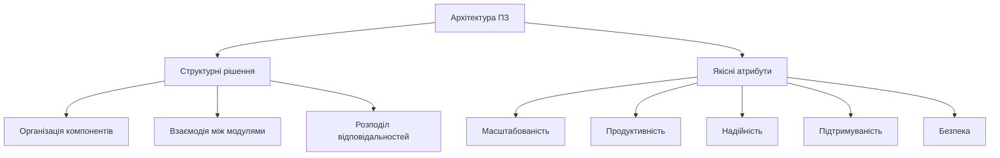
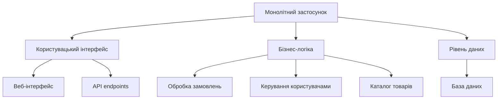
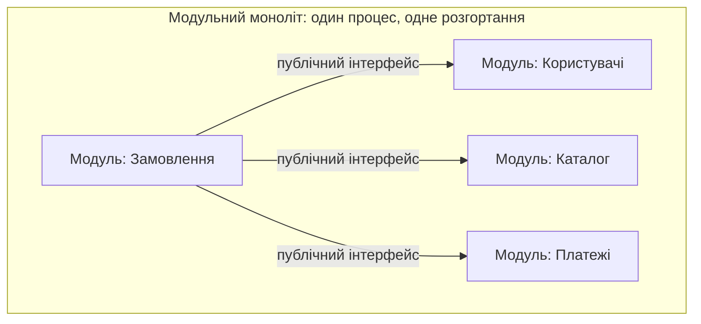
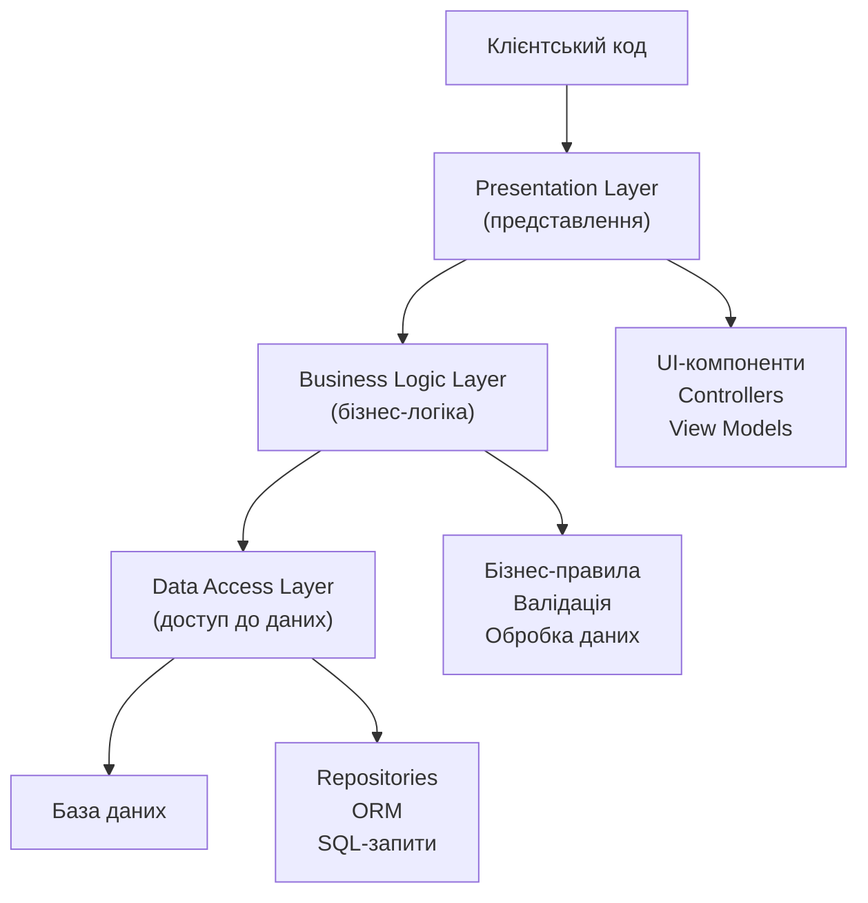
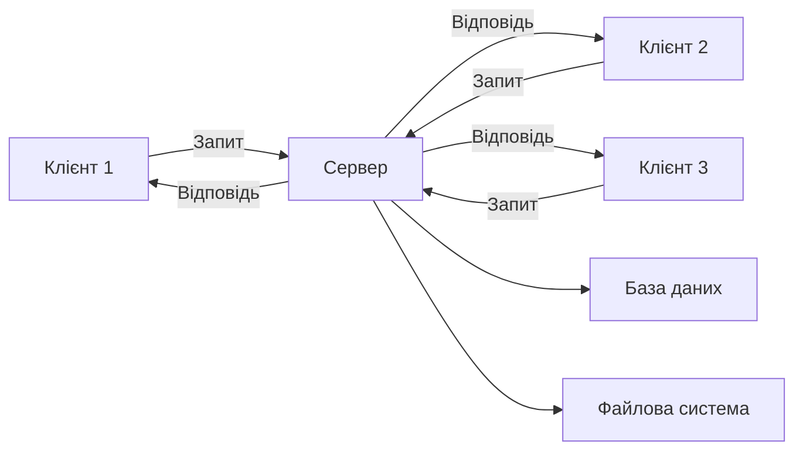
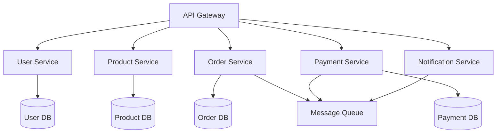
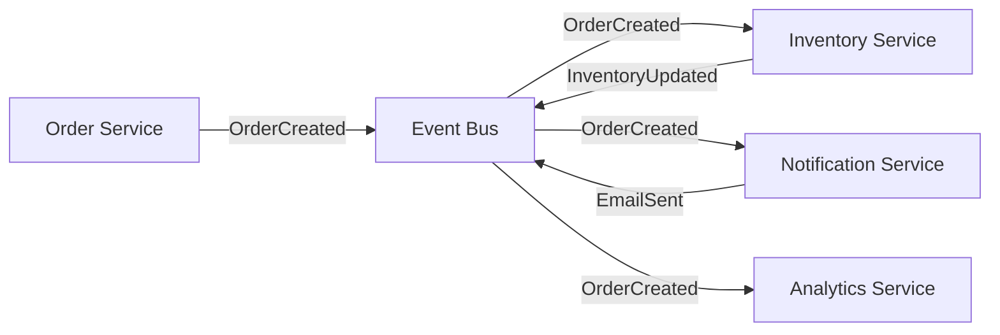
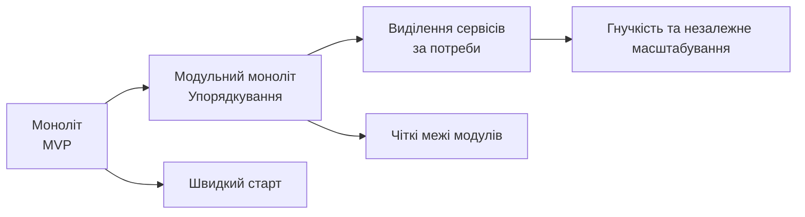

# Типи архітектур програмного забезпечення

## Основні поняття

- **Архітектура програмного забезпечення** — набір ключових рішень про структуру системи: з яких компонентів вона складається, як вони взаємодіють і за якими правилами побудовані. Це рішення, які найважче змінити пізніше.
- **Якісні атрибути (нефункціональні вимоги)** — властивості системи, що визначають, наскільки добре вона працює: масштабованість, продуктивність, надійність, підтримуваність, безпека.
- **Архітектурний стиль** — загальний підхід до організації системи, що задає типи компонентів і правила їхньої взаємодії (моноліт, шари, клієнт-сервер, мікросервіси, події).
- **Моноліт** — застосунок, який розробляють і розгортають як єдине ціле: усі компоненти працюють в одному процесі.
- **Шар (layer)** — логічний рівень застосунку з чіткою відповідальністю (представлення, бізнес-логіка, доступ до даних); шар використовує лише сусідній нижчий.
- **Мікросервіс** — невеликий автономний сервіс, що відповідає за одну бізнес-можливість, має власні дані й розгортається незалежно від інших.
- **Подія та шина подій** — подія фіксує факт, що вже сталося в системі; шина подій (брокер повідомлень) доставляє події від видавців до підписників.

## Вступ

Архітектура програмного забезпечення визначає фундаментальну структуру системи: як організовано її компоненти, як вони взаємодіють і за якими принципами побудовано систему загалом. У попередніх лекціях ми вчилися проєктувати окремі класи. Тепер піднімемося на рівень вище й запитаємо: як з цих класів скласти цілий застосунок і як розмістити його частини так, щоб система витримала зростання навантаження, зміну вимог і зміну команди?

Вибір архітектури — одне з найважливіших рішень під час створення програмного продукту, оскільки воно впливає на масштабованість, продуктивність, підтримуваність і загальну якість системи. Архітектура формує технічний фундамент проєкту й визначає, наскільки легко буде додавати нові функції, виправляти помилки й адаптувати систему до нових вимог. Відомий підхід до розуміння архітектури — вважати її сукупністю рішень, які дорого змінювати. Зміна коду всередині функції коштує хвилини, а зміна способу, у який поділено систему на частини, — місяців роботи. Тому помилка вибору архітектури на початку проєкту може призвести до серйозних проблем, коли система зросте й ускладниться.

Не існує універсальної архітектури, що підходить для всіх застосунків. Кожна має переваги та недоліки, і вибір залежить від вимог проєкту, технічних обмежень, очікуваного навантаження, розміру команди й багатьох інших чинників. У цій лекції розглянуто основні стилі: монолітну, багатошарову, клієнт-серверну, мікросервісну та подієву архітектури, їхні характеристики, переваги, недоліки й типові сценарії застосування. Окрему увагу приділено тому, як обирати архітектуру, як вона еволюціонує з розвитком продукту та які тенденції спостерігаються сьогодні. Ідеї попередньої лекції — слабка зв'язаність, висока зчепленість, залежність від абстракцій — залишаються тут головним мірилом: майже кожен архітектурний стиль є способом їх досягти на рівні цілої системи.

## Основні концепції архітектури програмного забезпечення

### Що таке архітектура ПЗ

Архітектура програмного забезпечення описує високорівневу структуру системи й визначає, як різні компоненти взаємодіють між собою. Вона охоплює рішення щодо організації коду, розподілу відповідальностей, способів спілкування між модулями та принципів побудови системи.

Архітектурні рішення впливають на ключові якості системи. Масштабованість — це здатність системи впоратися із зростанням навантаження. Продуктивність характеризує швидкість відгуку та ефективність використання ресурсів. Надійність — здатність працювати без збоїв і відновлюватися після них. Підтримуваність відображає, наскільки легко вносити зміни й виправляти помилки. Безпека забезпечує захист даних і функціональності від несанкціонованого доступу. Ці якості часто суперечать одна одній: наприклад, розподіл системи на багато частин покращує масштабованість, але ускладнює підтримку й може знизити швидкодію через мережеві виклики. Тому архітектура — це завжди пошук компромісів, а не пошук єдино правильної відповіді.



Архітектуру розглядають на різних рівнях абстракції. Системна архітектура описує розподіл функціональності між різними системами чи підсистемами. Архітектура застосунку визначає структуру окремого програмного продукту. Архітектура модуля або компонента деталізує внутрішню організацію окремих частин системи.

### Архітектурні стилі та шаблони

Архітектурний стиль — це загальний підхід до організації системи, що визначає набір типів компонентів і правила їхньої взаємодії. Стилі абстрактніші, ніж шаблони проєктування (патерни): вони задають філософію побудови системи й основні принципи її організації, тоді як патерни розв'язують конкретні локальні задачі.

Найпоширеніші стилі: монолітна архітектура, де весь застосунок є єдиним цілим; багатошарова архітектура з поділом на логічні рівні; клієнт-серверна архітектура з розподілом між клієнтською та серверною частинами; мікросервісна архітектура з розбиттям на невеликі незалежні сервіси; подієва архітектура, в якій компоненти взаємодіють через події.

Перш ніж вивчати їх по черзі, важливо зробити одне зауваження, яке часто ігнорують: ці стилі не є взаємовиключними варіантами одного вибору. Вони відповідають на різні запитання, а отже, належать до різних вимірів. Саме тому в одному застосунку зазвичай поєднується кілька стилів одночасно.

| Вимір | Запитання | Приклади стилів |
|-------|-----------|-----------------|
| Одиниця розгортання | Скільки окремо розгортуваних частин має система? | моноліт, мікросервіси |
| Внутрішня організація | Як структуровано код усередині частини? | шари, гексагональна архітектура |
| Взаємодія | Як частини спілкуються між собою? | клієнт-сервер (запит-відповідь), події |

Наприклад, типовий інтернет-магазин може бути монолітом (один вимір), усередині якого код поділено на шари (другий вимір), причому браузер звертається до нього за моделлю клієнт-сервер, а надсилання листів відбувається через події (третій вимір). Пам'ятайте про цю картину: вона допоможе не плутати «моноліт» та «багатошарову» як альтернативи. Багатошарову структуру можна успішно застосувати і в моноліті, і всередині кожного мікросервісу.

## Монолітна архітектура

### Характеристики монолітної архітектури

Монолітна архітектура — традиційний підхід до побудови програмного забезпечення, за якого весь застосунок розробляють як єдину неподільну одиницю. Усі компоненти системи — інтерфейс користувача, бізнес-логіка, робота з даними — об'єднані в один виконуваний файл чи пакет розгортання.



У монолітній архітектурі всі модулі працюють в одному процесі й спільно використовують пам'ять. Компоненти взаємодіють через виклики методів і функцій, без мережевої комунікації. Розгортання монолітного застосунку означає розгортання всієї системи цілком, навіть якщо змінено лише невелику частину коду.

Приклад монолітної архітектури — вебзастосунок електронної комерції, де клієнтська частина, серверна логіка обробки замовлень, керування каталогом, система користувачів та інтеграція з платіжними системами перебувають в одному проєкті.

```python
# Приклад структури монолітного застосунку
class MonolithicEcommerceApp:
    def __init__(self):
        self.user_service = UserService()
        self.product_service = ProductService()
        self.order_service = OrderService()
        self.payment_service = PaymentService()
        self.notification_service = NotificationService()

    def process_order(self, user_id, products):
        # Перевірка користувача
        user = self.user_service.get_user(user_id)
        if not user:
            return {"error": "Користувача не знайдено"}

        # Перевірка наявності товарів
        for product_id in products:
            product = self.product_service.get_product(product_id)
            if not product or product.stock < 1:
                return {"error": f"Товар {product_id} недоступний"}

        # Створення замовлення
        order = self.order_service.create_order(user_id, products)

        # Обробка платежу
        payment_result = self.payment_service.process_payment(
            order.total_amount,
            user.payment_method
        )

        if not payment_result.success:
            self.order_service.cancel_order(order.id)
            return {"error": "Помилка оплати"}

        # Відправка повідомлення
        self.notification_service.send_order_confirmation(user.email, order)

        # Оновлення запасів
        for product_id in products:
            self.product_service.decrease_stock(product_id, 1)

        return {"success": True, "order_id": order.id}
```

Зверніть увагу, наскільки простим є цей код. Весь сценарій оформлення замовлення — це послідовність звичайних викликів методів в одному процесі; якщо на будь-якому кроці виникне помилка, її легко обробити, а всі зміни в базі даних можна виконати в межах однієї транзакції (про транзакції — у лекції 10). Ми ще побачимо, як багато цієї простоти втрачається, коли ті самі сервіси розносять по різних процесах.

### Переваги монолітної архітектури

Простота розробки — одна з головних переваг моноліту. Розробники працюють з єдиною кодовою базою, одним стеком технологій та однією мовою програмування. Не потрібно налаштовувати складну взаємодію між сервісами чи піклуватися про узгодженість даних між розподіленими компонентами.

Легкість тестування — ще одна перевага. Усю систему можна запустити локально й перевірити взаємодію всіх компонентів, не піднімаючи кілька окремих сервісів. Наскрізні (end-to-end) тести виконуються в одному процесі, що спрощує налагодження та відтворення помилок.

Розгортання монолітного застосунку простіше, ніж розподілених систем. Достатньо зібрати один артефакт і розгорнути його на сервері (або в одному контейнері). Немає потреби координувати розгортання багатьох сервісів чи керувати складними залежностями між версіями компонентів.

Продуктивність за невеликих і середніх навантажень може бути вищою, адже взаємодія відбувається в пам'яті без накладних витрат на мережеві виклики. Транзакції можуть охоплювати всю систему без розподілених транзакцій.

### Недоліки монолітної архітектури

Складність підтримки зростає разом із кодовою базою. Коли застосунок сягає сотень тисяч рядків, важко охопити всі взаємозв'язки між компонентами. Якщо межі між частинами системи нічим не захищені, зміни в одній частині можуть непередбачувано вплинути на інші, а код поступово перетворюється на «велику кулю бруду» (big ball of mud) — хаотичну структуру, де все залежить від усього.

Обмежена масштабованість — серйозний недолік. Окремі компоненти неможливо масштабувати незалежно: можна лише підсилити сервер або запустити кілька повних копій усього застосунку. Якщо потужніший за решту потрібен лише один модуль, доводиться масштабувати всю систему.

Технологічна прив'язка означає, що всі компоненти використовують один стек. Складно чи неможливо застосувати різні мови для різних модулів, а перехід на нову технологію потребує переписування всього або великих частин застосунку.

Тривалий цикл розгортання виникає, бо навіть невелика зміна вимагає збирання й розгортання всього застосунку. У великих командах це створює конфлікти, коли кілька розробників одночасно намагаються випустити свої зміни.

### Модульний моноліт

Більшість описаних недоліків стосується не самого факту «єдиного розгортання», а тому, що всередині монолітної кодової бази немає порядку. Це усвідомлення привело до популярності підходу, який називають модульним монолітом. Застосунок і далі розробляють та розгортають як один процес, але код чітко поділяють на модулі, кожен з яких відповідає за окрему бізнес-область (користувачі, каталог, замовлення, платежі), має публічний інтерфейс і приховує свої внутрішні деталі. Модулі не мають права звертатися до внутрішніх класів і таблиць один одного, лише до публічного інтерфейсу.



```text
shop/
├── users/
│   ├── __init__.py      # публічний інтерфейс модуля: get_user(), register()
│   ├── service.py       # внутрішня логіка (використовувати ззовні заборонено)
│   └── repository.py
├── catalog/
├── orders/              # використовує лише users.get_user(), catalog.reserve() ...
└── payments/
```

Такий підхід поєднує простоту моноліту (один процес, прості виклики, одна транзакція) з головною перевагою мікросервісів — чіткими межами між частинами системи, які легко перевіряти автоматично (наприклад, інструментами, що забороняють «заборонені» імпорти між модулями). Якщо ж певний модуль колись справді потребуватиме незалежного масштабування, його буде значно легше виділити в окремий сервіс, адже він уже ізольований. Саме тому «модульний моноліт» нині вважають розумним стартом для більшості нових проєктів.

### Коли використовувати монолітну архітектуру

Монолітна архітектура добре підходить для невеликих і середніх проєктів, де складність системи керована й не очікується значного масштабування. Для стартапів та MVP (мінімально життєздатного продукту) монолітний підхід дозволяє швидко створити й випустити продукт без витрат на складну інфраструктуру.

Проєкти з невеликою командою можуть ефективно використовувати моноліт, оскільки координація простіша, коли всі працюють з однією кодовою базою. Для застосунків із чітко визначеною функціональністю, що рідко змінюється, монолітний підхід теж може бути оптимальним.

Внутрішні корпоративні системи з обмеженою кількістю користувачів та передбачуваним навантаженням часто реалізують як монолітні застосунки. Для навчальних проєктів монолітна архітектура дозволяє зосередитися на бізнес-логіці, не відволікаючись на питання розподілених систем.

## Багатошарова архітектура

### Концепція шарів у архітектурі

Багатошарова архітектура організовує застосунок у логічні горизонтальні шари, кожен з яких має власну відповідальність і взаємодіє лише із сусідніми шарами. Така організація забезпечує чітке розділення відповідальностей і полегшує розуміння структури системи. Терміни «шар» (layer) і «рівень» (tier) варто розрізняти: шар — це логічний поділ коду, а рівень (tier) — фізичний поділ на окремі вузли розгортання (наприклад, браузер, сервер застосунку, сервер бази даних). Трирівневий застосунок може мати багато шарів усередині кожного рівня.



Типова багатошарова архітектура включає рівень представлення для взаємодії з користувачем, рівень бізнес-логіки для реалізації правил і процесів, рівень доступу до даних для роботи з базою та саму базу даних для зберігання інформації. Кожен шар залежить лише від шару безпосередньо під ним, що створює односпрямований потік залежностей.

Принцип організації полягає в тому, що вищі шари використовують сервіси нижчих, але не навпаки. Рівень представлення може викликати методи бізнес-логіки, але бізнес-логіка не повинна безпосередньо взаємодіяти з елементами інтерфейсу. Це забезпечує слабку зв'язаність і можливість заміни реалізації окремих шарів. У прикладі нижче показано три шари для реєстрації користувача; зверніть увагу, як кожен шар «знає» лише про сусіда під собою.

```python
# Приклад багатошарової архітектури

# Data Access Layer
class UserRepository:
    def __init__(self, database):
        self.db = database

    def find_by_id(self, user_id):
        query = "SELECT * FROM users WHERE id = ?"
        result = self.db.execute(query, (user_id,))
        return self._map_to_user(result) if result else None

    def find_by_email(self, email):
        query = "SELECT * FROM users WHERE email = ?"
        result = self.db.execute(query, (email,))
        return self._map_to_user(result) if result else None

    def save(self, user):
        if user.id:
            query = "UPDATE users SET name=?, email=? WHERE id=?"
            self.db.execute(query, (user.name, user.email, user.id))
        else:
            query = "INSERT INTO users (name, email) VALUES (?, ?)"
            user.id = self.db.execute(query, (user.name, user.email))
        return user

    def _map_to_user(self, data):
        return User(data['id'], data['name'], data['email'])


# Business Logic Layer
class UserService:
    def __init__(self, user_repository, email_service):
        self.repository = user_repository
        self.email_service = email_service

    def register_user(self, name, email, password):
        # Валідація
        if not self._validate_email(email):
            raise ValueError("Некоректний email")

        if len(password) < 8:
            raise ValueError("Пароль занадто короткий")

        # Перевірка унікальності
        if self.repository.find_by_email(email):
            raise ValueError("Користувач уже існує")

        # Створення користувача
        user = User(None, name, email)
        user.password_hash = PasswordHasher.hash(password)  # див. лекцію 8

        # Збереження
        saved_user = self.repository.save(user)

        # Відправка вітального листа
        self.email_service.send_welcome_email(saved_user.email)

        return saved_user

    def _validate_email(self, email):
        return '@' in email and '.' in email


# Presentation Layer
class UserController:
    def __init__(self, user_service):
        self.service = user_service

    def register(self, request_data):
        try:
            user = self.service.register_user(
                request_data['name'],
                request_data['email'],
                request_data['password']
            )
            return {
                'status': 'success',
                'data': {'id': user.id, 'name': user.name, 'email': user.email}
            }
        except ValueError as e:
            return {'status': 'error', 'message': str(e)}
```

Помітьте, що клас `UserService` отримує репозиторій і сервіс листів через конструктор, а не створює їх сам: це впровадження залежностей із попередньої лекції, завдяки якому шар бізнес-логіки можна перевіряти тестами без реальної бази даних.

### Переваги багатошарової архітектури

Чітке розділення відповідальностей — основна перевага. Кожен шар має чітко визначену роль і не втручається в роботу інших. Логіка інтерфейсу відокремлена від бізнес-правил, а бізнес-логіка не залежить від конкретної технології зберігання даних.

Легкість тестування досягається можливістю перевіряти кожен шар незалежно. Бізнес-логіку можна перевірити без реальної бази даних, підставивши імітацію (mock) або підробку (fake) репозиторію. Інтерфейс можна тестувати окремо від складної бізнес-логіки.

Повторне використання коду спрощується, оскільки бізнес-логіка не прив'язана до конкретного інтерфейсу. Той самий сервісний шар можуть використовувати вебзастосунок, мобільний застосунок і API для партнерів.

Можливість заміни реалізації окремих шарів без впливу на решту робить архітектуру гнучкою: можна змінити базу даних чи ORM без модифікації бізнес-логіки або переробити інтерфейс, не торкаючись сервісного шару.

### Варіації багатошарової архітектури

Трирівнева архітектура — найпоширеніша реалізація: рівні представлення, бізнес-логіки та доступу до даних. Ця структура підходить для більшості вебзастосунків та бізнес-систем.

Чотирирівнева архітектура додає окремий шар для доменної моделі між бізнес-логікою та доступом до даних. Це дозволяє чіткіше відокремити об'єкти предметної області від деталей збереження й забезпечує кращу організацію складних доменних моделей.

Розширена багатошарова архітектура може включати додаткові шари для наскрізних аспектів, як-от безпека, журналювання, кешування.

Сучасним розвитком ідеї шарів є гексагональна («порти й адаптери»), чиста (clean) та цибулинна архітектури. Їхня спільна ідея — застосування принципу інверсії залежностей: у центрі перебуває доменна логіка, яка не залежить ні від бази даних, ні від вебфреймворку, ні від зовнішніх сервісів. Усе зовнішнє під'єднується через інтерфейси (порти), а конкретні реалізації (адаптери) залежать від центру, а не навпаки. Так центральну логіку можна тестувати без інфраструктури, а базу даних чи спосіб доставки повідомлень — замінювати, не змінюючи її.

Наостанок, про поширену помилку: шари можна нарізати «за технологією» (усі контролери в одній теці, усі репозиторії в іншій) або «за функціональністю» (теки users, orders, catalog, у кожній з яких є власні шари). У міру зростання проєкту другий спосіб зазвичай зручніший: він узгоджується з ідеєю модульного моноліту, описаного вище.

## Клієнт-серверна архітектура

### Основи клієнт-серверної моделі

Клієнт-серверна архітектура розподіляє функціональність між двома типами компонентів: клієнтами, які ініціюють запити, і серверами, які обробляють ці запити та повертають відповіді. Така архітектура лежить в основі більшості сучасних розподілених систем та мережевих застосунків.



Сервер централізує бізнес-логіку, керування даними та забезпечення безпеки. Клієнти зосереджуються на поданні інформації користувачеві та збиранні його вводу. Така організація дозволяє мати безліч клієнтів різних типів (вебсайт, мобільний застосунок, десктопна програма), які працюють з одним сервером.

Взаємодія клієнта із сервером зазвичай відбувається через мережу за стандартизованими протоколами. HTTP — найпоширеніший протокол для вебзастосунків. WebSocket використовують для двосторонньої взаємодії в реальному часі. gRPC застосовують для високопродуктивної взаємодії між сервісами. Для гнучких запитів до даних з боку клієнта популярний і GraphQL. Докладно про проєктування API на основі HTTP — у лекції 11.

```python
# Приклад простого клієнт-серверного застосунку

# Серверна частина (Flask)
from flask import Flask, request, jsonify

app = Flask(__name__)


class TaskService:
    def __init__(self):
        self.tasks = []
        self.next_id = 1

    def create_task(self, title, description):
        task = {
            'id': self.next_id,
            'title': title,
            'description': description,
            'completed': False
        }
        self.tasks.append(task)
        self.next_id += 1
        return task

    def get_all_tasks(self):
        return self.tasks

    def get_task(self, task_id):
        for task in self.tasks:
            if task['id'] == task_id:
                return task
        return None

    def update_task(self, task_id, completed):
        task = self.get_task(task_id)
        if task:
            task['completed'] = completed
            return task
        return None


task_service = TaskService()


@app.route('/api/tasks', methods=['GET'])
def get_tasks():
    return jsonify(task_service.get_all_tasks())


@app.route('/api/tasks', methods=['POST'])
def create_task():
    data = request.json
    task = task_service.create_task(data['title'], data['description'])
    return jsonify(task), 201


@app.route('/api/tasks/<int:task_id>', methods=['PUT'])
def update_task(task_id):
    data = request.json
    task = task_service.update_task(task_id, data['completed'])
    if task:
        return jsonify(task)
    return jsonify({'error': 'Task not found'}), 404
```

Сервер запускають командою `flask --app server run` (за замовчуванням він слухає порт 5000). Клієнтом може бути будь-яка програма, здатна надсилати HTTP-запити, зокрема інший Python-застосунок:

```python
# Клієнтська частина (Python, бібліотека requests)
import requests


class TaskClient:
    def __init__(self, base_url):
        self.base_url = base_url

    def get_tasks(self):
        # timeout обов'язковий: без нього клієнт може «зависнути» назавжди
        response = requests.get(f"{self.base_url}/api/tasks", timeout=5)
        response.raise_for_status()  # помилки HTTP → винятки
        return response.json()

    def create_task(self, title, description):
        data = {'title': title, 'description': description}
        response = requests.post(f"{self.base_url}/api/tasks", json=data, timeout=5)
        response.raise_for_status()
        return response.json()

    def complete_task(self, task_id):
        response = requests.put(
            f"{self.base_url}/api/tasks/{task_id}",
            json={'completed': True},
            timeout=5,
        )
        response.raise_for_status()
        return response.json()


# Використання клієнта
client = TaskClient('http://localhost:5000')
new_task = client.create_task('Вивчити архітектури', 'Прочитати лекцію про типи архітектур')
print(f"Створено завдання: {new_task}")

tasks = client.get_tasks()
print(f"Усього завдань: {len(tasks)}")
```

Звернімо увагу на два рядки, яких не було б у коді, що працює в одному процесі: `timeout=5` і `raise_for_status()`. Це наслідок того, що мережа ненадійна: запит може загубитися, сервер може відповісти дуже повільно або помилкою. Кожен мережевий виклик потребує від коду готовності до збою — це одна з головних платень за розподіленість, до якої ми повернемося в розділі про мікросервіси. Щоб не «розмазати» знання про формат запитів по всьому коду, їх зручно збирати в одному класі-клієнті, як `TaskClient` вище (принцип DRY).

### Типи клієнт-серверних архітектур

Тонкий клієнт містить мінімум логіки й здебільшого відповідає за відображення даних; уся обробка відбувається на сервері. Приклади: вебзастосунки, де браузер лише показує HTML, отриманий від сервера, та термінальні клієнти для мейнфреймів.

Товстий клієнт містить значну частину бізнес-логіки й може працювати частково або повністю автономно. Десктопні застосунки часто є товстими клієнтами: вони виконують складну обробку локально, а до сервера звертаються лише для синхронізації даних чи спеціальних операцій.

Гібридний підхід поєднує переваги обох моделей. Сучасні односторінкові застосунки (SPA) є прикладом: клієнтська частина містить логіку представлення й частину бізнес-логіки (наприклад, перевірку форм), але для всіх операцій з даними та складної обробки звертається до сервера. Різновидом гібрида є рендеринг на сервері (SSR) із «оживленням» сторінки в браузері: перший екран швидко приходить готовим від сервера, а далі сторінка працює як SPA. Мобільні застосунки здебільшого також є гібридними: вони кешують дані локально й синхронізуються із сервером, коли є мережа.

### Переваги та недоліки клієнт-серверної архітектури

Централізоване керування — головна перевага. Бізнес-логіка та дані перебувають на сервері, що спрощує їх оновлення та забезпечення узгодженості. Не потрібно розгортати зміни на всіх клієнтських пристроях, щоб оновити логіку.

Масштабованість досягається можливістю додавати серверні ресурси незалежно від кількості клієнтів. Кілька серверів (за балансувальником навантаження) можуть обслуговувати тисячі клієнтів, розподіляючи навантаження між собою.

Безпека покращується, адже чутливі дані й критична логіка зберігаються на сервері під контролем організації. Клієнти не мають прямого доступу до бази даних, а лише через контрольований API сервера. Разом з тим не можна довіряти клієнтові: усі перевірки прав і валідацію слід дублювати на сервері, бо клієнтський код перебуває в руках користувача.

Недолік — залежність від мережі. Клієнти не можуть працювати без з'єднання із сервером, що є проблемою за нестабільного інтернету. Навантаження на сервер за великої кількості одночасних клієнтів може бути значним і вимагає потужної інфраструктури, а сам сервер стає потенційною єдиною точкою відмови, якщо його не продубльовано.

## Мікросервісна архітектура

### Концепція мікросервісів

Мікросервісна архітектура організовує застосунок як набір невеликих незалежних сервісів, кожен з яких виконує певну бізнес-функцію. Кожен мікросервіс можна розробляти, розгортати й масштабувати незалежно від інших.



Кожен мікросервіс має власну базу даних і самостійно керує своїми даними. Це забезпечує слабку зв'язаність і дає сервісам змогу еволюціонувати незалежно: жоден сервіс не має права «зазирати» в таблиці іншого. Взаємодія між сервісами відбувається через чітко визначені API, зазвичай REST або gRPC, а також через повідомлення. Вхідні запити клієнтів приймає API Gateway — єдина точка входу, що маршрутизує запити до потрібних сервісів і бере на себе наскрізні функції (автентифікацію, обмеження частоти запитів).

Мікросервіси можуть використовувати різні технології й мови програмування залежно від потреб: один сервіс написано на Python, інший — на Java, третій — на Go. Це дає свободу обрати найкращий інструмент для кожної задачі, хоча на практиці більшість організацій свідомо обмежує різноманітність, щоб не ускладнювати супровід.

Нижче наведено спрощену демонстрацію: три окремі програми (у реальному проєкті — три окремі репозиторії чи теки), кожна зі своєю «базою» (у прикладі — словник у пам'яті, лише для наочності), які спілкуються між собою через HTTP. Їх запускають на різних портах: наприклад, `flask --app user_service run --port 5001`, `flask --app product_service run --port 5002` та `flask --app order_service run --port 5003`.

```python
# user_service.py — сервіс користувачів
from flask import Flask, jsonify, request

app = Flask(__name__)
users = {}  # власне сховище цього сервісу


@app.route('/users', methods=['POST'])
def create_user():
    user_id = len(users) + 1
    users[user_id] = {'id': user_id, **request.json}
    return jsonify(users[user_id]), 201


@app.route('/users/<int:user_id>', methods=['GET'])
def get_user(user_id):
    user = users.get(user_id)
    if user:
        return jsonify(user)
    return jsonify({'error': 'User not found'}), 404
```

```python
# product_service.py — сервіс товарів
from flask import Flask, jsonify, request

app = Flask(__name__)
products = {}  # власне сховище цього сервісу


@app.route('/products', methods=['POST'])
def create_product():
    product_id = len(products) + 1
    products[product_id] = {'id': product_id, **request.json}
    return jsonify(products[product_id]), 201


@app.route('/products/<int:product_id>', methods=['GET'])
def get_product(product_id):
    product = products.get(product_id)
    if product:
        return jsonify(product)
    return jsonify({'error': 'Product not found'}), 404
```

```python
# order_service.py — сервіс замовлень; звертається до двох інших сервісів
import requests
from flask import Flask, jsonify, request

app = Flask(__name__)
orders = {}

USER_SERVICE_URL = 'http://localhost:5001'
PRODUCT_SERVICE_URL = 'http://localhost:5002'


def create_order(user_id, product_ids):
    # Перевірка користувача — виклик іншого сервісу через мережу
    user_response = requests.get(f'{USER_SERVICE_URL}/users/{user_id}', timeout=3)
    if user_response.status_code != 200:
        return None

    # Перевірка товарів
    products = []
    for product_id in product_ids:
        response = requests.get(f'{PRODUCT_SERVICE_URL}/products/{product_id}', timeout=3)
        if response.status_code != 200:
            return None  # якщо хоч одного товару немає — замовлення не створюємо
        products.append(response.json())

    order_id = len(orders) + 1
    orders[order_id] = {
        'id': order_id,
        'user_id': user_id,
        'products': products,
        'status': 'created',
    }
    return orders[order_id]


@app.route('/orders', methods=['POST'])
def create_order_endpoint():
    data = request.json
    try:
        order = create_order(data['user_id'], data['product_ids'])
    except requests.RequestException:
        # Інший сервіс недоступний або відповів надто повільно
        return jsonify({'error': 'Dependent service unavailable'}), 503
    if order:
        return jsonify(order), 201
    return jsonify({'error': 'Failed to create order'}), 400
```

Порівняйте цей код із монолітним прикладом на початку лекції. Замість виклику методу `user_service.get_user(user_id)` тепер мережевий запит із тайм-аутом та обробкою збою. Сервіс замовлень має власне сховище і не бачить таблиць інших сервісів: усе, що йому потрібно, він отримує лише через їхні API.

### Переваги мікросервісної архітектури

Незалежне розгортання дозволяє оновлювати окремі частини системи без зупинки та перезапуску всього застосунку. Команда може випускати нові версії свого сервісу кілька разів на день, не узгоджуючи це з іншими командами.

Технологічна гнучкість дає змогу обирати найкращі інструменти для кожної задачі. Сервіс обробки зображень може використовувати Python зі спеціалізованими бібліотеками, а платіжний сервіс — Java з огляду на надійність і продуктивність.

Масштабованість окремих сервісів означає, що потужність нарощують лише там, де навантаження високе. Якщо сервіс каталогу отримує багато запитів, можна запустити його додаткові екземпляри, не масштабуючи всю систему.

Відмовостійкість підвищується через ізоляцію сервісів. Якщо один мікросервіс «падає», інші можуть продовжувати працювати. Правильно спроєктована система здатна деградувати частково, зберігаючи основну функціональність навіть за відмови деяких компонентів (наприклад, магазин працює, а рекомендації тимчасово не показуються).

Організаційна перевага не менш важлива: сервіси відповідають межам команд, тож кожна команда може повністю володіти своєю частиною — від коду до експлуатації, не чекаючи інших.

### Виклики мікросервісної архітектури

Складність розподіленої системи — головний виклик. Замість одного застосунку доводиться керувати десятками чи сотнями сервісів. Налагодження ускладнюється, бо запит може проходити через кілька сервісів, і потрібно відстежувати його шлях по всій системі: для цього використовують розподілене трасування (стандарт OpenTelemetry) і наскрізні ідентифікатори запитів.

Узгодженість даних важко забезпечити, коли кожен сервіс має власну базу. Транзакції, що охоплюють кілька сервісів, вимагають складних шаблонів, як-от «сага» (послідовність локальних транзакцій із компенсуючими діями на випадок збою). Замість негайної узгодженості нормою стає «зрештою узгоджена» (eventual consistency).

Мережева взаємодія між сервісами додає затримку й є додатковою точкою відмови. Кожен мережевий виклик може завершитися невдало, і система має бути до цього готова: потрібні тайм-аути, повторні спроби (retry) та «запобіжники» (circuit breaker) — механізм, що тимчасово припиняє звернення до сервісу, який постійно відмовляє, щоб не перевантажувати його і не «тягнути» за собою інших.

Операційна складність зростає через потребу моніторингу, журналювання й трасування запитів через багато сервісів. Потрібна інфраструктура для виявлення сервісів, балансування навантаження та API Gateway, зазвичай на основі контейнерів і оркестратора (де-факто стандарт — Kubernetes). Конвеєр розгортання ускладнюється необхідністю узгоджувати версії різних компонентів.

Особливо небезпечна помилка — «розподілений моноліт»: сервіси формально окремі, але настільки залежать один від одного, що їх неможливо змінювати чи розгортати незалежно. Такий варіант успадковує всі недоліки мікросервісів і всі недоліки моноліту одночасно й не дає жодної з переваг.

### Коли використовувати мікросервіси

Великі команди розробників можуть ефективно працювати з мікросервісами, коли кожна команда володіє одним чи кількома сервісами. Це дозволяє командам працювати незалежно й ухвалювати технічні рішення без узгодження з усією організацією. Орієнтовно, мікросервіси починають окупатися, коли над продуктом працюють кілька десятків розробників у кількох командах.

Застосунки з різними вимогами до масштабування виграють від мікросервісної архітектури. Якщо одну частину системи потрібно масштабувати горизонтально, а іншу ні, мікросервіси дозволяють масштабувати лише потрібні компоненти.

Довгострокові проєкти з очікуваною еволюцією можуть використовувати мікросервіси для гнучкості. Можливість поступово переписувати чи замінювати окремі сервіси без впливу на всю систему цінна для систем, що розвиваються роками.

Не варто використовувати мікросервіси для невеликих проєктів і стартапів на ранніх стадіях. Складність такої архітектури може уповільнити розробку й відволікти ресурси від створення бізнес-функціональності. Розумніша стратегія — почати з (модульного) моноліту й переходити до мікросервісів лише тоді, коли для цього з'являються конкретні причини. Цю стратегію відомий фахівець з архітектури Мартін Фаулер називає «спочатку моноліт». Показові й приклади з практики: деякі компанії свідомо повертали частини систем із розподіленої архітектури до монолітної, коли витрати на мережеву взаємодію перевищували користь. Так, у 2023 році команда Amazon Prime Video розповіла, що об'єднання одного зі своїх сервісів моніторингу з розподіленого набору компонентів в єдиний процес суттєво знизило витрати інфраструктури. Це не означає, що мікросервіси погані, але ілюструє: архітектуру обирають за потребами, а не за модою.

## Подієва архітектура (Event-Driven)

### Концепція подієвої архітектури

Подієва архітектура організовує взаємодію компонентів системи через генерацію, виявлення та обробку подій. Подія фіксує зміну стану або важливий факт у системі: «замовлення створено», «платіж отримано». Компоненти можуть генерувати події й підписуватися на події інших, не маючи прямої залежності один від одного.



Події є повідомленнями, які містять інформацію про те, що сталося в системі. Імена подій прийнято формулювати в минулому часі (`OrderCreated`), бо подія — це факт, який уже відбувся й змінити його не можна. На відміну від синхронних викликів, коли відправник чекає на відповідь, у подієвій архітектурі відправник просто публікує подію й продовжує роботу. Підписники отримують події й обробляють їх незалежно, у своєму темпі.

Шина подій (Event Bus), або брокер повідомлень, — центральний компонент подієвої архітектури. Вона приймає події від видавців (publishers) і доставляє їх підписникам (subscribers). Поширені реалізації: RabbitMQ, Apache Kafka (сучасні версії 4.x працюють без окремого ZooKeeper), NATS, а також хмарні сервіси на кшталт AWS SNS/SQS та EventBridge, Google Pub/Sub, Azure Service Bus. Брокер забезпечує надійну доставку подій, навіть якщо підписники тимчасово недоступні. Структуру подій та канали зручно документувати в специфікації AsyncAPI (це аналог OpenAPI для подієвих систем).

Наведений нижче код — навчальна модель: проста шина подій у пам'яті, яка допомагає зрозуміти ідею. Важливо: ця шина синхронна, тобто обробники виконуються один за одним усередині виклику `publish`. Справжня шина асинхронна й працює як окремий сервіс, тож наслідки для порядку виконання будуть іншими, і ми побачимо це на виході програми.

```python
# Приклад подієвої архітектури

# Проста шина подій у пам'яті
class EventBus:
    def __init__(self):
        self.subscribers = {}

    def subscribe(self, event_type, handler):
        self.subscribers.setdefault(event_type, []).append(handler)

    def publish(self, event_type, event_data):
        print(f"[EventBus] Публікація події: {event_type}")
        for handler in self.subscribers.get(event_type, []):
            try:
                handler(event_data)
            except Exception as e:
                print(f"[EventBus] Помилка обробки події: {e}")


# Order Service — видавець подій
class OrderService:
    def __init__(self, event_bus):
        self.event_bus = event_bus
        self.orders = {}
        event_bus.subscribe('PaymentProcessed', self.handle_payment_processed)

    def create_order(self, user_id, items):
        order_id = len(self.orders) + 1
        order = {
            'id': order_id,
            'user_id': user_id,
            'items': items,
            'status': 'created',
            'total': sum(item['price'] * item['quantity'] for item in items),
        }
        self.orders[order_id] = order

        # Публікація події
        self.event_bus.publish('OrderCreated', order)
        return order

    def handle_payment_processed(self, event_data):
        order_id = event_data['order_id']
        if order_id in self.orders:
            self.orders[order_id]['status'] = 'paid'
            print(f"[OrderService] Замовлення {order_id} оплачено")
            self.event_bus.publish('OrderPaid', self.orders[order_id])


# Inventory Service — підписник на події
class InventoryService:
    def __init__(self, event_bus):
        self.event_bus = event_bus
        self.inventory = {}
        event_bus.subscribe('OrderCreated', self.handle_order_created)

    def handle_order_created(self, order_data):
        print(f"[InventoryService] Обробка замовлення {order_data['id']}")

        # Резервування товарів
        for item in order_data['items']:
            if item['product_id'] in self.inventory:
                self.inventory[item['product_id']] -= item['quantity']

        self.event_bus.publish('InventoryReserved', {
            'order_id': order_data['id'],
            'items': order_data['items'],
        })


# Payment Service — підписник на події
class PaymentService:
    def __init__(self, event_bus):
        self.event_bus = event_bus
        event_bus.subscribe('InventoryReserved', self.handle_inventory_reserved)

    def handle_inventory_reserved(self, event_data):
        order_id = event_data['order_id']
        print(f"[PaymentService] Обробка оплати для замовлення {order_id}")

        payment_success = True  # імітація обробки платежу
        if payment_success:
            self.event_bus.publish('PaymentProcessed', {
                'order_id': order_id,
                'status': 'success',
            })


# Notification Service — підписник на події
class NotificationService:
    def __init__(self, event_bus):
        self.event_bus = event_bus
        event_bus.subscribe('OrderCreated', self.handle_order_created)
        event_bus.subscribe('OrderPaid', self.handle_order_paid)

    def handle_order_created(self, order_data):
        print(f"[NotificationService] Відправка підтвердження замовлення "
              f"користувачу {order_data['user_id']}")

    def handle_order_paid(self, order_data):
        print(f"[NotificationService] Відправка повідомлення про оплату "
              f"користувачу {order_data['user_id']}")


# Analytics Service — підписник на події
class AnalyticsService:
    def __init__(self, event_bus):
        self.event_bus = event_bus
        self.stats = {'orders': 0, 'revenue': 0}
        event_bus.subscribe('OrderPaid', self.handle_order_paid)

    def handle_order_paid(self, order_data):
        self.stats['orders'] += 1
        self.stats['revenue'] += order_data['total']
        print(f"[AnalyticsService] Оновлення статистики: {self.stats}")


# Використання
event_bus = EventBus()

order_service = OrderService(event_bus)
inventory_service = InventoryService(event_bus)
payment_service = PaymentService(event_bus)
notification_service = NotificationService(event_bus)
analytics_service = AnalyticsService(event_bus)

# Створення замовлення запускає ланцюжок подій
print("\n=== Створення замовлення ===\n")
order = order_service.create_order(
    user_id=1,
    items=[
        {'product_id': 101, 'quantity': 2, 'price': 500},
        {'product_id': 102, 'quantity': 1, 'price': 1000},
    ]
)
```

Виконання цього коду виведе таке:

```text
=== Створення замовлення ===

[EventBus] Публікація події: OrderCreated
[InventoryService] Обробка замовлення 1
[EventBus] Публікація події: InventoryReserved
[PaymentService] Обробка оплати для замовлення 1
[EventBus] Публікація події: PaymentProcessed
[OrderService] Замовлення 1 оплачено
[EventBus] Публікація події: OrderPaid
[NotificationService] Відправка повідомлення про оплату користувачу 1
[AnalyticsService] Оновлення статистики: {'orders': 1, 'revenue': 2000}
[NotificationService] Відправка підтвердження замовлення користувачу 1
```

Зверніть увагу: «підтвердження замовлення» надіслано останнім, після «повідомлення про оплату». Причина в тому, що наша шина синхронна: обробник `InventoryService` для події `OrderCreated` виконався раніше за обробник `NotificationService` і всередині себе запустив увесь подальший ланцюжок. У справжній асинхронній системі порядок обробки різних підписників не гарантується взагалі; тому подієві системи доводиться проєктувати так, щоб вони не залежали від порядку, у якому окремі підписники отримують подію.

### Переваги подієвої архітектури

Слабка зв'язаність між компонентами — основна перевага. Видавець події не знає, хто її оброблятиме, а підписники не знають, хто її генерує. Це дозволяє легко додавати нові обробники, не змінюючи наявного коду (принцип відкритості/закритості на рівні архітектури).

Асинхронна обробка дозволяє системі залишатися чутливою (responsive) навіть під час тривалих операцій. Користувач швидко отримує відповідь, а складна обробка відбувається у фоновому режимі. Це поліпшує досвід користувача й дозволяє ефективно використовувати ресурси.

Масштабованість досягається можливістю запускати кілька обробників для одного типу подій. Якщо обробка певної події стає вузьким місцем, можна запустити додаткові екземпляри обробника, розподіливши навантаження.

Розширюваність спрощується: нову функціональність можна додати створенням нового підписника на наявні події, не змінюючи код, який ці події генерує.

### Виклики подієвої архітектури

Складність відстеження потоку виконання виникає через асинхронність. Запит користувача може запустити ланцюжок подій через безліч сервісів, і важко відстежити весь шлях виконання. Потрібні спеціалізовані інструменти для розподіленого трасування.

Зрештою узгоджений стан (eventual consistency) означає, що система не завжди перебуває в узгодженому стані. Після публікації події потрібен час, поки всі підписники її обробять. Це створює проблеми для операцій, що потребують негайної узгодженості.

Обробка помилок ускладнюється в асинхронних системах. Якщо обробка події завершилась невдало, потрібна стратегія повторної обробки чи компенсуючих дій. Черги «мертвих листів» (dead letter queues), куди потрапляють повідомлення, які не вдалося обробити, і механізми повторних спроб — необхідні компоненти надійної подієвої системи.

Дублювання подій можливе через мережеві проблеми чи збої: більшість брокерів гарантують доставку «принаймні один раз», а не «рівно один раз». Тому обробники подій мають бути ідемпотентними, тобто повторна обробка тієї самої події не повинна призводити до небажаних побічних ефектів. Найпростіший спосіб — запам'ятовувати ідентифікатори вже оброблених подій:

```python
class PaymentHandler:
    def __init__(self):
        self.processed_event_ids = set()

    def handle(self, event):
        if event['event_id'] in self.processed_event_ids:
            return  # цю подію вже оброблено — повтор нічого не змінить
        self.charge_customer(event['order_id'])
        self.processed_event_ids.add(event['event_id'])
```

Окрема проблема — надійна публікація. Якщо сервіс спочатку записує зміни в базу даних, а потім публікує подію, збій між цими двома діями призведе до втрати події (дані змінено, а решта системи не дізналася). Стандартне рішення — шаблон «транзакційна скринька вихідних повідомлень» (transactional outbox): подію записують у ту саму транзакцію, що й зміну даних, а окремий процес пересилає її до брокера.

### Коли використовувати подієву архітектуру

Системи з асинхронними процесами природно підходять для подієвої архітектури. Обробка замовлень, генерація звітів, надсилання повідомлень — приклади завдань, які можна виконувати асинхронно після початкової дії користувача.

Інтеграція між незалежними системами спрощується завдяки подіям. Різні системи можуть обмінюватися інформацією через події, не створюючи прямих залежностей. Це особливо корисно в корпоративному середовищі з багатьма успадкованими (legacy) системами.

Системи реального часу — чати, ігри, фінансові платформи — можуть використовувати подієву архітектуру для швидкої реакції на зміни стану.

Аудит і журналювання природно вписуються в подієву архітектуру. Усі важливі дії в системі можуть породжувати події, які зберігаються для подальшого аналізу, аудиту чи відтворення стану системи (цей підхід називають event sourcing, і не варто плутати його із загальною подієвою взаємодією: у event sourcing події є основним сховищем стану).

## Порівняння архітектур та вибір

### Критерії вибору архітектури

Вибір архітектури залежить від багатьох чинників, які потрібно ретельно оцінити перед ухваленням рішення. Розмір і складність проєкту — перший з них. Невеликі проєкти з простою функціональністю можуть ефективно використовувати монолітну архітектуру, великі корпоративні системи можуть потребувати мікросервісної чи подієвої.

Розмір і досвід команди впливають на вибір архітектури. Невелика команда може не мати ресурсів для підтримки складної мікросервісної системи, тоді як велика організація з кількома командами виграє від розподілу відповідальності через мікросервіси. Тут діє спостереження, відоме як закон Конвея: структура системи неминуче відображає структуру комунікацій в організації, що її створює. Тому межі сервісів варто узгоджувати з межами відповідальності команд.

Очікуване навантаження та вимоги до масштабування визначають, наскільки гнучкою має бути архітектура. Якщо очікується значне зростання кількості користувачів або нерівномірне навантаження на різні частини системи, варто розглянути архітектури, що підтримують горизонтальне масштабування окремих компонентів.

Вимоги до продуктивності та часу відгуку також важливі. Деякі застосунки потребують мінімальної затримки, інші можуть допустити асинхронну обробку. Критичні для бізнесу транзакції можуть вимагати сильної узгодженості, а аналітичні системи — працювати із зрештою узгодженими даними.

Технологічні обмеження та наявна інфраструктура впливають на можливі варіанти. Якщо організація вже має досвід із певними технологіями, це варто враховувати; перехід на принципово нову архітектуру потребує значних інвестицій у навчання та інструменти.

### Порівняльна таблиця

| Критерій | Моноліт | Модульний моноліт | Мікросервіси | Подієва (Event-Driven) |
|----------|---------|-------------------|--------------|------------------------|
| **Складність** | Низька | Низька–середня | Висока | Висока |
| **Масштабованість** | Обмежена | Обмежена | Відмінна | Відмінна |
| **Розгортання** | Просте | Просте | Складне | Залежить від реалізації |
| **Розмір команди** | Мала | Мала–середня | Велика (кілька команд) | Середня–велика |
| **Підтримка** | Складна при рості без порядку | Керована завдяки межам модулів | Розподілена, потребує зрілих практик | Потребує спеціальних навичок |
| **Час до ринку** | Швидко | Швидко | Повільно на старті | Середньо |

Пам'ятайте, що багатошарова та клієнт-серверна архітектури в таблицю не потрапили не випадково: вони належать до інших вимірів (див. вище) і поєднуються з будь-яким із перелічених варіантів. Значення в таблиці — орієнтовні: реальний результат залежить від якості виконання.

### Еволюція архітектури

Архітектура системи не є статичною й може еволюціонувати разом із проєктом. Типовий шлях починається з моноліту для швидкого створення MVP та перевірки бізнес-ідеї. Коли продукт досягає відповідності ринку й аудиторія зростає, може виникнути потреба в кращій масштабованості.



Впорядкування коду в шари та модулі часто є першим кроком рефакторингу монолітного застосунку. Чіткий поділ полегшує подальшу модуляризацію й виділення окремих сервісів. Поступове виділення мікросервісів дозволяє отримувати переваги розподіленої архітектури, не переписуючи систему одразу.

Шаблон «Душитель» (Strangler Fig Pattern) — ефективна стратегія поступової міграції від моноліту до мікросервісів. Назва походить від фігових дерев-душителів, що поступово обплітають дерево-господаря. Нову функціональність додають як окремі сервіси, а наявну поступово виносять із монолітного ядра. Ядро продовжує існувати, але поступово зменшується, доки не зникне чи не стане мінімальним. Головна перевага — немає необхідності «переписувати все з нуля» (така стратегія відома як «Big Bang Rewrite» і має репутацію найризикованішої).

Гібридні підходи часто є найпрактичнішими. Не обов'язково обирати одну архітектуру для всього застосунку: критичні модулі можна реалізувати як мікросервіси, тоді як менш важливі частини залишаються в монолітному ядрі. Подієву архітектуру можна застосовувати для окремих підсистем, де це доречно.

### Сучасні тенденції

Кілька тенденцій останніх років варто знати, щоб не сприймати мікросервіси як єдину «сучасну» відповідь.

По-перше, повернення до простоти. Після періоду захоплення мікросервісами галузь стала обережнішою: усе частіше починають із модульного моноліту, а розподілену архітектуру вводять там, де для цього є виміряні причини. По-друге, безсерверні (serverless) обчислення: функції, що виконуються лише за потреби (наприклад, AWS Lambda), звільняють від керування серверами й підходять для епізодичних чи різко змінних навантажень, але мають власні обмеження (затримка холодного запуску, прив'язка до постачальника). По-третє, платформна інженерія: для великих систем створюють внутрішні платформи, які беруть на себе рутину розгортання, моніторингу й безпеки, щоб команди не повторювали цю роботу для кожного сервісу. По-четверте, дедалі більше використовують керовані хмарні сервіси (бази даних, черги, сховища) замість власного адміністрування інфраструктури.

Ще одна практика, корисна за будь-якої архітектури, — фіксувати архітектурні рішення в коротких записах ADR (Architecture Decision Record): що вирішили, які були альтернативи і чому обрано саме це. Через рік ці записи рятують команду від запитання «чому ми це зробили так?». Нарешті, у застосунках з'являються нові типи компонентів — модулі на основі великих мовних моделей та ШІ-агенти; їх підключають до системи як звичайні сервіси через API чи спеціальні протоколи (наприклад, MCP), а тривалі завдання агентів добре узгоджуються з подієвою моделлю. Проте це не скасовує головних архітектурних міркувань цієї лекції: слабка зв'язаність, чіткі межі й свідомий вибір компромісів.

## Висновки

Архітектура програмного забезпечення — фундаментальний аспект розробки, що визначає якість, підтримуваність і успіх системи. Не існує універсальної архітектури, придатної для всіх проєктів. Кожен стиль має переваги й недоліки, які слід зважувати у контексті конкретних вимог і обмежень. Важливо розрізняти виміри: спосіб розгортання (моноліт чи мікросервіси), внутрішню організацію (шари) і спосіб взаємодії (запит-відповідь чи події) — і не протиставляти те, що належить до різних вимірів.

Монолітна архітектура залишається актуальною для невеликих і середніх проєктів завдяки простоті й швидкості розробки, а її модульний варіант дає порядок без ціни розподіленості. Багатошарова архітектура забезпечує чітку організацію коду й полегшує підтримку. Клієнт-серверна архітектура лежить в основі більшості сучасних мережевих застосунків.

Мікросервісна архітектура надає максимальну гнучкість і масштабованість для великих систем, але вимагає значних ресурсів і досвіду. Подієва архітектура дозволяє створювати системи зі слабкою зв'язаністю між компонентами, але потребує ретельної роботи з узгодженістю, повторною доставкою й порядком подій.

Успішний вибір вимагає глибокого розуміння вимог, можливостей команди та довгострокових цілей. Архітектура може еволюціонувати разом із проєктом; розпочати з простої та поступово ускладнювати її в міру потреби зазвичай розумніше, ніж одразу створювати складну систему для невизначених майбутніх потреб.

Розуміння різних архітектур і вміння обирати відповідну для конкретної ситуації — ключова навичка інженера програмного забезпечення. Практичний досвід роботи з різними архітектурами допомагає розвивати інтуїцію щодо архітектурних рішень і бачити компроміси, що стоять за кожним вибором. У наступній лекції ми розглянемо роботу з даними: реляційні й нереляційні бази даних, вибір яких — теж архітектурне рішення.

## Питання для самоперевірки

1. Що таке архітектура програмного забезпечення і чому вона важлива? Чому її називають сукупністю рішень, які дорого змінювати?
2. Які основні характеристики монолітної архітектури? Коли вона є доречним вибором? Що таке модульний моноліт?
3. Поясніть принцип організації багатошарової архітектури. Які переваги вона надає? Чим шар відрізняється від рівня (tier)?
4. У чому різниця між тонким і товстим клієнтом у клієнт-серверній архітектурі? Чому не можна покладатися лише на перевірки на боці клієнта?
5. Які основні принципи мікросервісної архітектури? Які виклики вона створює? Що таке розподілений моноліт?
6. Як працює подієва архітектура? Які її переваги над синхронною взаємодією? Чому обробники подій мають бути ідемпотентними?
7. Чому «моноліт» і «багатошарова архітектура» не є альтернативами? До яких вимірів належить кожен стиль?
8. Які чинники потрібно враховувати під час вибору архітектури для нового проєкту?
9. Опишіть можливий шлях еволюції архітектури від монолітної до мікросервісної. У чому суть шаблону «Душитель»?
10. Чому гібридні підходи до архітектури часто є практичним рішенням?
11. Які якісні атрибути системи визначаються архітектурними рішеннями? Наведіть приклад, коли покращення одного атрибута погіршує інший.

