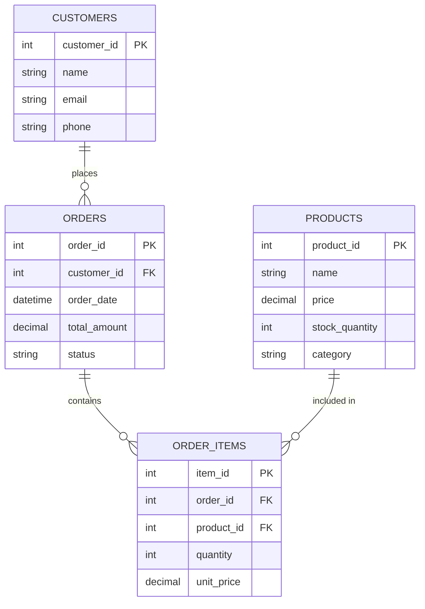
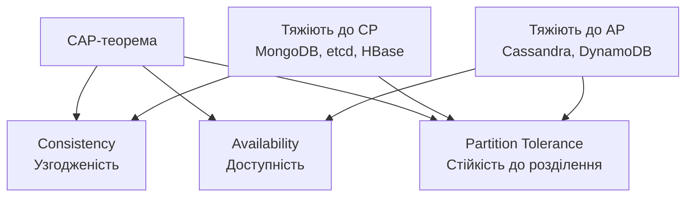
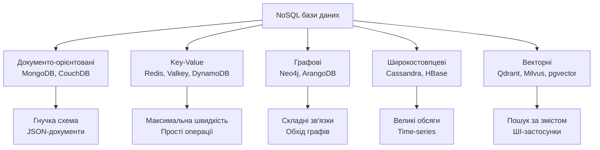
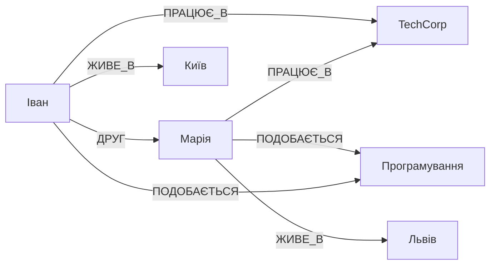
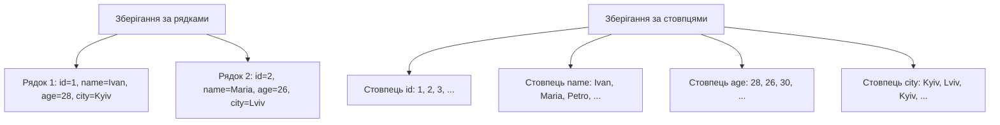
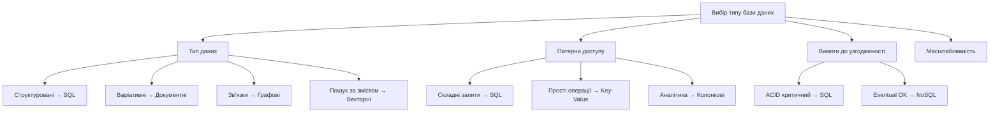
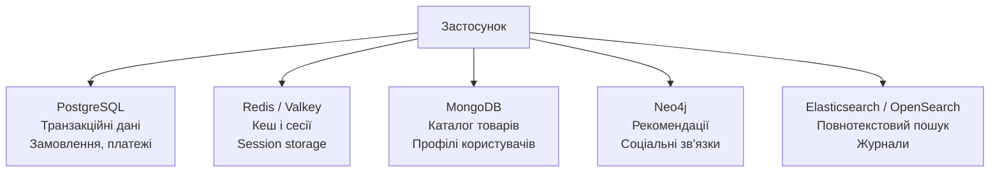

# Лекція 10. Робота з базами даних: реляційні та NoSQL

## Основні поняття

- **СУБД (система керування базами даних)** — програмне забезпечення, яке зберігає дані, забезпечує швидкий і безпечний доступ до них, підтримує одночасну роботу багатьох користувачів та захищає дані від втрат.
- **Реляційна модель** — модель, у якій дані організовано в таблиці (рядки й стовпці), а зв'язки між таблицями задаються через первинні та зовнішні ключі.
- **Транзакція та ACID** — транзакція є групою операцій, що виконується як одне ціле; ACID (атомарність, узгодженість, ізольованість, довговічність) — гарантії її надійності.
- **SQL** — декларативна мова запитів до реляційних баз даних: ми описуємо, які дані потрібні, а СУБД сама обирає, як їх отримати.
- **NoSQL («не лише SQL»)** — родина нереляційних баз даних (документні, «ключ-значення», графові, широкостовпцеві, векторні), оптимізованих під гнучку схему, горизонтальне масштабування або специфічні патерни доступу.
- **Теорема CAP** — твердження про те, що розподілена система під час розділення мережі змушена обирати між узгодженістю даних і доступністю. Її доповнює модель BASE, характерна для багатьох NoSQL-систем.
- **Індекс** — додаткова структура даних, що прискорює пошук записів, але уповільнює їх зміну та займає місце.

## Вступ

Бази даних є фундаментальним компонентом практично всіх сучасних програмних систем. Від простих мобільних застосунків до складних корпоративних платформ — усі вони потребують надійного зберігання, організації та обробки даних. У попередній лекції ми з'ясували, що вибір архітектури визначає, як частини системи взаємодіють між собою. Вибір бази даних — рішення того самого рівня: він безпосередньо впливає на продуктивність, масштабованість і надійність застосунку, а змінити його пізніше буває дуже дорого. Про це варто пам'ятати: у мікросервісній архітектурі, наприклад, кожен сервіс має власну базу, а отже, приймається не одне таке рішення, а кілька.

Протягом останніх десятиліть ландшафт баз даних суттєво змінився. Традиційні реляційні бази, що домінували з 1970-х років, отримали альтернативу у вигляді NoSQL-систем. Водночас реляційні бази не застаріли: сучасний PostgreSQL вміє зберігати JSON-документи, виконувати повнотекстовий пошук і навіть шукати за векторами, тому для багатьох проєктів він закриває більшість потреб. Останніми роками до цього додався ще один чинник: застосунки на основі великих мовних моделей потребують зберігати й шукати векторні представлення текстів, і це породило нові типи сховищ і нові можливості в старих.

Сучасний інженер повинен розуміти сильні та слабкі сторони різних підходів, уміти обирати оптимальне рішення для конкретної задачі й ефективно працювати з різними типами баз даних. У цій лекції ми розглянемо фундаментальні концепції реляційних і NoSQL-баз, їхні відмінності, сценарії використання та практичні аспекти роботи: індексацію, оптимізацію запитів, безпеку, резервне копіювання й міграцію. Особливу увагу приділено порівнянню підходів і методиці вибору рішення для конкретного проєкту. У наступній лекції ми побачимо, як дані з бази стають доступними іншим програмам через API.

## Реляційні бази даних

### Фундаментальні концепції

Реляційну модель даних запропонував Едгар Кодд у 1970 році. Вона ґрунтується на математичній теорії множин і відношень. В основі моделі лежить поняття таблиці, яка представляє певну сутність предметної області. Таблиця складається з рядків і стовпців: кожен рядок — окремий екземпляр сутності (наприклад, один клієнт), а стовпці визначають її атрибути (ім'я, електронна пошта, телефон).

Первинний ключ — критично важливий елемент реляційної моделі. Це стовпець або комбінація стовпців, значення яких однозначно ідентифікують кожен рядок таблиці. Первинний ключ не може містити NULL і має бути незмінним протягом життя запису. Правильний вибір первинного ключа забезпечує ефективний доступ до даних і підтримку цілісності. На практиці найчастіше використовують «штучні» ключі: автоінкрементні числа або UUID. Варто знати, що випадкові UUID (версії 4) погано поводяться в індексах великих таблиць, оскільки нові значення потрапляють у випадкові місця індексу. Тому дедалі популярнішими стають впорядковані за часом UUID версії 7; у PostgreSQL 18 для цього з'явилася вбудована функція `uuidv7()`.

Зв'язки між таблицями реалізуються через зовнішні ключі. Зовнішній ключ — це стовпець в одній таблиці, що посилається на первинний ключ іншої. Це дозволяє логічно пов'язувати різні сутності, не дублюючи дані фізично, а СУБД стежить, щоб посилання не «висіли в повітрі»: не можна створити замовлення для клієнта, якого не існує. Розрізняють три типи зв'язків: «один-до-багатьох» (один клієнт має багато замовлень; найпоширеніший), «багато-до-багатьох» (замовлення містить багато товарів, а товар входить у багато замовлень; реалізується через проміжну таблицю) та «один-до-одного» (трапляється рідше).



Цю схему в SQL описують командами `CREATE TABLE`. Зверніть увагу, що обмеження (`NOT NULL`, `UNIQUE`, `CHECK`, `REFERENCES`) переносять частину правил предметної області в саму базу: вона не дозволить записати некоректні дані, навіть якщо їх спробує додати помилковий застосунок.

```sql
CREATE TABLE customers (
    customer_id INTEGER GENERATED ALWAYS AS IDENTITY PRIMARY KEY,
    name        TEXT NOT NULL,
    email       TEXT NOT NULL UNIQUE,
    phone       TEXT
);

CREATE TABLE orders (
    order_id     INTEGER GENERATED ALWAYS AS IDENTITY PRIMARY KEY,
    customer_id  INTEGER NOT NULL REFERENCES customers (customer_id),
    order_date   TIMESTAMP NOT NULL DEFAULT CURRENT_TIMESTAMP,
    total_amount NUMERIC(12, 2) NOT NULL CHECK (total_amount >= 0),
    status       TEXT NOT NULL DEFAULT 'new'
);
```

Тут і далі приклади SQL наведено в діалекті PostgreSQL; в інших СУБД синтаксис окремих команд відрізняється (наприклад, автоінкремент у MySQL записують як `AUTO_INCREMENT`), але основні ідеї та більшість запитів однакові. Зауважимо також, що грошові суми зберігають у типі `NUMERIC`/`DECIMAL`, а не в числах з рухомою комою, — з тієї самої причини, що ми розглядали в лекції 7.

### ACID властивості

ACID-властивості визначають гарантії надійності транзакцій у реляційних базах даних. Транзакція — це послідовність операцій, яка виконується як єдине ціле. Класичний приклад — переказ грошей: списання з одного рахунку та зарахування на інший має відбутися разом, інакше гроші «зникнуть» або «з'являться».

Атомарність означає, що транзакція виконується повністю або не виконується взагалі. Якщо під час виконання виникає помилка, усі зміни відкочуються, а база повертається до стану перед початком транзакції.

Узгодженість (консистентність) гарантує, що транзакція переводить базу з одного коректного стану в інший. Усі обмеження цілісності, задані в схемі, мають виконуватися до й після транзакції. База не дозволить завершити транзакцію, що порушує встановлені правила.

Ізольованість забезпечує незалежність паралельних транзакцій. Результат виконання кількох одночасних транзакцій має бути таким, ніби вони виконувалися послідовно. Існують різні рівні ізоляції (зокрема Read Committed, який у PostgreSQL використовується за замовчуванням, Repeatable Read та Serializable), які балансують між суворістю гарантій і продуктивністю: чим суворіший рівень, тим менше аномалій (наприклад, «брудних» читань чи «фантомних» рядків), але тим більше конфліктів і очікувань між транзакціями.

Довговічність гарантує, що після успішного завершення транзакції її результати збережуться навіть у разі збою системи. Зміни фіксуються на постійному носії (у журналі транзакцій) і можуть бути відновлені після перезапуску.

Побачити атомарність і узгодженість у дії найпростіше на невеликому прикладі. Модуль `sqlite3` входить до стандартної бібліотеки Python, тож цей код можна запустити без встановлення чого-небудь:

```python
import sqlite3

conn = sqlite3.connect(":memory:")
conn.execute("""
    CREATE TABLE accounts (
        id      INTEGER PRIMARY KEY,
        balance INTEGER NOT NULL CHECK (balance >= 0)
    )
""")
conn.executemany("INSERT INTO accounts VALUES (?, ?)", [(1, 1500), (2, 200)])
conn.commit()


def transfer(conn, from_id, to_id, amount):
    with conn:  # успіх → COMMIT, виняток → автоматичний ROLLBACK
        conn.execute("UPDATE accounts SET balance = balance - ? WHERE id = ?",
                     (amount, from_id))
        conn.execute("UPDATE accounts SET balance = balance + ? WHERE id = ?",
                     (amount, to_id))


transfer(conn, 1, 2, 1000)        # успішно: 500 і 1200
try:
    transfer(conn, 1, 2, 1000)    # баланс став би від'ємним
except sqlite3.IntegrityError as error:
    print("Переказ скасовано:", error)

print(conn.execute("SELECT * FROM accounts").fetchall())  # [(1, 500), (2, 1200)]
```

Другий переказ порушує обмеження `CHECK (balance >= 0)`, база відхиляє його, а конструкція `with conn` відкочує транзакцію. У результаті стан рахунків залишається коректним. Так ACID працює на практиці.

### Structured Query Language

SQL — декларативна мова програмування для роботи з реляційними базами. На відміну від імперативних мов, де програміст описує послідовність дій, в SQL описують бажаний результат, а система сама визначає найефективніший спосіб його отримати. Мова стандартизована (актуальна редакція — SQL:2023), але кожна СУБД додає власні розширення. Вибірку даних виконує команда `SELECT`, яка дозволяє отримувати дані з однієї чи кількох таблиць за заданими критеріями.

```sql
SELECT
    c.name AS customer_name,
    o.order_date,
    o.total_amount,
    COUNT(oi.item_id) AS items_count
FROM customers c
INNER JOIN orders o ON c.customer_id = o.customer_id
INNER JOIN order_items oi ON o.order_id = oi.order_id
WHERE o.order_date >= '2026-01-01'
    AND o.status = 'completed'
GROUP BY c.customer_id, c.name, o.order_id, o.order_date, o.total_amount
HAVING COUNT(oi.item_id) > 2
ORDER BY o.order_date DESC
LIMIT 10;
```

Операції `JOIN` дозволяють комбінувати дані з кількох пов'язаних таблиць в одному запиті. `INNER JOIN` повертає лише ті записи, для яких знайдено відповідність в обох таблицях. `LEFT JOIN` повертає всі записи з лівої таблиці та відповідні з правої, підставляючи NULL там, де відповідності немає (так можна знайти, наприклад, клієнтів без жодного замовлення).

#### Агрегація та групування

Агрегатні функції (`COUNT`, `SUM`, `AVG`, `MIN`, `MAX`) обчислюють одне значення за набором рядків. Разом із `GROUP BY` вони дозволяють отримувати підсумки за групами, а `HAVING` фільтрує самі групи (тоді як `WHERE` фільтрує рядки до групування).

```sql
SELECT
    category,
    COUNT(*)            AS product_count,
    AVG(price)          AS average_price,
    MIN(price)          AS min_price,
    MAX(price)          AS max_price,
    SUM(stock_quantity) AS total_stock
FROM products
GROUP BY category
HAVING AVG(price) > 500
ORDER BY average_price DESC;
```

#### Модифікація даних і транзакції

Дані змінюють командами `INSERT` (додавання нових записів), `UPDATE` (зміна наявних) і `DELETE` (видалення). Критично важливо завжди обмежувати `UPDATE` та `DELETE` умовою `WHERE`, інакше зміни застосуються до всіх рядків таблиці. Кілька операцій, що мають виконатися разом, об'єднують у транзакцію.

```sql
-- Транзакція для переказу коштів
START TRANSACTION;

UPDATE accounts
SET balance = balance - 1000
WHERE account_id = 1 AND balance >= 1000;

UPDATE accounts
SET balance = balance + 1000
WHERE account_id = 2;

INSERT INTO transactions (from_account, to_account, amount, transaction_date)
VALUES (1, 2, 1000, CURRENT_TIMESTAMP);

COMMIT;
```

Зверніть увагу на тонкість цього прикладу. Якщо на рахунку 1 недостатньо коштів, перший `UPDATE` не змінить жодного рядка, але помилки не буде, а решта команд виконаються, і гроші «з'являться» на рахунку 2. Тому застосунок має перевірити кількість змінених рядків після першої команди й за нуля виконати `ROLLBACK`. Надійніше ж, як у Python-прикладі вище, переносити правило в саму базу через обмеження `CHECK (balance >= 0)`: тоді порушення неможливе за жодного коду застосунку.

### Нормалізація даних

Нормалізація — процес організації даних у базі для зменшення надлишковості та підвищення цілісності. Розглянемо таблицю замовлень, у якій усе зібрано «в купу»:

| order_id | customer_name | customer_email | products |
|----------|---------------|----------------|----------|
| 1 | Іван Петренко | ivan@example.com | ноутбук, миша |
| 2 | Іван Петренко | ivan@example.com | клавіатура |

Тут одразу видно проблеми: дані клієнта повторюються (якщо він змінить пошту, доведеться виправляти кілька рядків, а один можна пропустити), а в полі `products` міститься список значень, з яким незручно працювати (як порахувати, скільки разів продали мишу?).

Перша нормальна форма вимагає, щоб кожен атрибут таблиці містив лише атомарні (неподільні) значення. Не допускається зберігання списків чи наборів значень в одному полі: для товарів замовлення слід створити окрему таблицю `order_items`, де кожен товар займає власний рядок.

Друга нормальна форма стосується таблиць зі складеним первинним ключем. Вона вимагає, щоб усі неключові атрибути залежали від усього ключа, а не від його частини. Наприклад, у таблиці `order_items` з ключем `(order_id, product_id)` назва товару залежить лише від `product_id`, тому її слід тримати в таблиці `products`.

Третя нормальна форма усуває транзитивні залежності: неключові атрибути не повинні залежати від інших неключових атрибутів. Якщо в таблиці замовлень зберігати `customer_id` і `customer_email`, то пошта залежить не від замовлення, а від клієнта, тож її місце в таблиці `customers`. У результаті кожен факт зберігається лише один раз, а це прямий прояв принципу DRY з лекції 8.

Хоча нормалізація усуває надлишковість, іноді доцільна часткова денормалізація заради продуктивності. Додавання розрахункових полів (наприклад, збереженої загальної суми замовлення) чи дублювання деяких даних може суттєво пришвидшити складні запити, але вимагає дисципліни: копії треба підтримувати актуальними. Розумний підхід — нормалізувати за замовчуванням і денормалізувати свідомо, коли вимірювання показують реальну потребу.

### Популярні реляційні СУБД

PostgreSQL — одна з найпотужніших реляційних баз даних з відкритим кодом. Система відома надійністю, дотриманням стандартів SQL та широкими можливостями. PostgreSQL підтримує складні типи даних, зокрема JSON (тип `JSONB`), масиви, геопросторові дані, а завдяки розширенням — і векторний пошук (`pgvector`), що робить її універсальним рішенням. Актуальна стабільна версія — PostgreSQL 18 (вересень 2025), яка додала асинхронне введення-виведення, функцію `uuidv7()` та інші покращення; версія 19 наразі проходить бета-тестування, і з нею в PostgreSQL з'явиться підтримка запитів до графових даних (SQL/PGQ).

MySQL залишається однією з найпопулярніших СУБД з відкритим кодом завдяки простоті використання та продуктивності для типових вебзастосунків. Її часто застосовують у стеку LAMP/LEMP, вона лежить в основі багатьох систем керування вмістом (наприклад, WordPress). MySQL підтримує різні механізми зберігання (за замовчуванням використовують InnoDB). Зверніть увагу на життєвий цикл версій: гілка 8.0 у квітні 2026 року вийшла з підтримки, тож нові проєкти слід починати на версіях із довготривалою підтримкою (LTS), наприклад 8.4 чи 9.7. Поширений форк MySQL — MariaDB.

SQLite відрізняється відсутністю окремого серверного процесу. База зберігається в одному файлі, а бібліотека SQLite вбудовується безпосередньо в застосунок. Це робить SQLite ідеальним вибором для мобільних застосунків, настільних програм, вбудованих систем, тестів і навчальних проєктів (модуль `sqlite3` входить до стандартної бібліотеки Python). Вона є й однією з найпоширеніших баз у світі за кількістю встановлень.

Крім цих, варто знати про комерційні СУБД (Oracle Database, Microsoft SQL Server), які широко використовують у корпоративному середовищі, а також про розподілені реляційні бази нового покоління (їх називають NewSQL: CockroachDB, YugabyteDB, Google Spanner), які поєднують SQL і ACID із горизонтальним масштабуванням. Для аналітики на одному комп'ютері набула популярності вбудована аналітична база DuckDB. На практиці бази дедалі частіше використовують як керовані хмарні сервіси (Amazon RDS, Neon, Supabase та інші), де постачальник бере на себе встановлення, оновлення й резервне копіювання.

## NoSQL бази даних

### Передумови виникнення

Реляційні бази проєктували в епоху, коли дані були структурованими, обсяги — відносно невеликими, а масштабування означало купівлю потужнішого сервера. Проте інтернет-компанії зіткнулися з новими викликами, які було складно розв'язати традиційними засобами.

Експоненціальне зростання даних вимагало здатності зберігати й обробляти петабайти інформації. Вертикальне масштабування (потужніші сервери) досягло фізичних та економічних меж. Горизонтальне масштабування, коли навантаження розподіляється між багатьма серверами, виявилося складним для реляційних баз через необхідність підтримувати узгодженість і транзакції.

Гнучкість схеми даних стала критичною вимогою для швидкої розробки. У реляційних базах зміна структури таблиць у працюючій системі могла вимагати тривалих простоїв. Різні записи можуть мати різні набори атрибутів, що природно моделюється в NoSQL, але потребує складних рішень у реляційних системах.

Назву NoSQL зазвичай розшифровують як «Not Only SQL» — «не лише SQL». Це підкреслює, що йдеться не про заміну реляційних баз, а про доповнення їх інструментами для специфічних задач. До того ж розрив між підходами зменшується: NoSQL-бази отримали транзакції та потужніші мови запитів, а реляційні — JSON, секціонування таблиць і реплікацію для читання.

### CAP теорема

Теорема CAP формулює фундаментальне обмеження розподілених систем. Вона стосується трьох властивостей: узгодженості (Consistency) — усі вузли бачать однакові дані в один момент часу; доступності (Availability) — кожен запит до працюючого вузла отримує відповідь; стійкості до розділення мережі (Partition tolerance) — система продовжує працювати, коли зв'язок між вузлами порушено. Теорема стверджує, що під час розділення мережі система не може одночасно гарантувати і узгодженість, і доступність.

Слід точно розуміти зміст цього твердження, бо його часто переказують спрощено як «оберіть два з трьох». У розподіленій системі розриви мережі неминучі, тому стійкість до розділення фактично обов'язкова. Отже, реальний вибір стоїть між узгодженістю та доступністю, і виникає він лише в момент розриву мережі. Коли ж мережа працює нормально, система може забезпечити обидві властивості. Розширення теореми, відоме як PACELC, додає, що навіть без розривів доводиться обирати між затримкою відповіді та узгодженістю.



Діаграма показує лише типову схильність систем за замовчуванням: багато сучасних баз можна налаштувати в бік як узгодженості, так і доступності. Наприклад, Cassandra дозволяє для кожного запиту обрати рівень узгодженості (кількість реплік, що мають підтвердити операцію), а DynamoDB підтримує як зрештою узгоджене, так і строго узгоджене читання. Тому поділ на «CP-бази» й «AP-бази» — це спрощення, і дослідники (зокрема Мартін Клеппман) застерігають від бездумного навішування таких ярликів. Звичайний PostgreSQL на одному сервері під CAP узагалі не потрапляє, адже це не розподілена система.

На противагу ACID-властивостям реляційних баз, багато NoSQL-систем орієнтуються на модель BASE. Basically Available означає, що система гарантує доступність даних більшість часу. Soft State вказує, що стан системи може змінюватися навіть без нових запитів через синхронізацію реплік. Eventually Consistent гарантує, що якщо нових оновлень немає, то з часом усі вузли досягнуть узгодженого стану. Практичні наслідки такі: у соціальній мережі допустимо, щоб лічильник вподобань на різних серверах кілька секунд показував різні значення, але для залишку на банківському рахунку така поведінка неприпустима.

### Типи NoSQL баз даних



Цей поділ умовний: багато систем є мультимодельними (наприклад, Redis підтримує й рядки, і хеші, і векторні набори, а PostgreSQL — і таблиці, і документи). Розглянемо кожен тип докладніше.

## Документо-орієнтовані бази даних

### Концепція та MongoDB

Документо-орієнтовані бази зберігають дані у вигляді документів, зазвичай у форматі JSON або BSON. Документ — самодостатній об'єкт, що містить усю пов'язану інформацію. Це природний спосіб подання даних, який добре відповідає об'єктам у програмному коді: там, де реляційна модель розкладає замовлення на кілька таблиць, документ зберігає його цілком.

```json
{
  "_id": "507f1f77bcf86cd799439011",
  "name": "Ноутбук Dell XPS 15",
  "category": "Electronics",
  "price": 45999,
  "specifications": {
    "processor": "Intel Core i7",
    "ram": "16GB",
    "storage": "512GB SSD",
    "display": "15.6 inch 4K"
  },
  "reviews": [
    {
      "user": "user123",
      "rating": 5,
      "comment": "Чудовий ноутбук для розробки",
      "date": "2026-03-15"
    }
  ],
  "tags": ["laptop", "premium", "developer"],
  "in_stock": true,
  "last_updated": "2026-06-01T10:30:00Z"
}
```

Гнучка схема дозволяє різним документам у колекції мати різну структуру. Можна додавати нові поля без модифікації наявних документів, що дуже корисно для швидкої розробки та еволюції структури даних. Проте «гнучка схема» не означає «відсутність схеми»: структура даних усе одно існує, лише в коді застосунку, і без дисципліни колекція швидко перетворюється на звалище. Тому в MongoDB можна задавати правила перевірки документів (валідацію за схемою JSON Schema) і в такий спосіб зберігати гнучкість там, де вона потрібна, і порядок там, де він необхідний. Ще одне проєктне рішення в документних базах — вкладати пов'язані дані в документ (як `reviews` вище) чи зберігати в окремій колекції та посилатися на них: вкладення пришвидшує читання, але ускладнює зміну дублікатів і має обмеження на розмір документа.

MongoDB надає потужні можливості для запитів і агрегації даних.

```javascript
// Знайти всі електронні товари дорожче за 20000
db.products.find({
  category: "Electronics",
  price: { $gt: 20000 }
}).sort({ price: -1 }).limit(10)

// Оновлення: змінити ціну й додати тег
db.products.updateOne(
  { _id: ObjectId("507f1f77bcf86cd799439011") },
  { $set: { price: 42999 }, $push: { tags: "sale" } }
)

// Агрегація для обчислення середнього рейтингу
db.products.aggregate([
  { $unwind: "$reviews" },
  { $group: {
    _id: "$_id",
    name: { $first: "$name" },
    avgRating: { $avg: "$reviews.rating" },
    reviewCount: { $sum: 1 }
  }},
  { $sort: { avgRating: -1 }}
])
```

Реплікація через набори реплік (replica sets) забезпечує високу доступність і резервування даних. Кілька серверів зберігають копії даних, і якщо основний вузол (primary) відмовляє, автоматично обирається новий. Шардування дозволяє горизонтально масштабувати MongoDB для обробки великих обсягів даних. Починаючи з версії 4.0, MongoDB підтримує й багатодокументні ACID-транзакції, хоча в документній моделі їх потрібно значно рідше, бо пов'язані дані найчастіше лежать в одному документі (операції над одним документом атомарні завжди). Актуальна основна версія — MongoDB 8.0, а з версії 8.2 почали виходити й проміжні випуски для власних розгортань.

### Коли використовувати документні бази

Каталоги товарів ідеально підходять для документних баз через варіативність атрибутів різних категорій: електроніка має специфікації, одяг — розміри й кольори, книги — авторів і видавництва. Вкладені структури природно відображають такі різноманітні дані.

Системи керування вмістом часто працюють із документами різної структури. Статті, відео, зображення мають різні метадані, а гнучкість схеми дозволяє зберігати різні типи вмісту в одній колекції без складних ієрархій успадкування.

Аналітика в реальному часі та журналювання виграють від продуктивності документних баз під час запису й простоти зберігання структурованих подій. Кожна подія може містити довільний набір атрибутів залежно від її типу.

## Key-Value сховища

### Redis та принципи роботи

Сховища «ключ-значення» (key-value) — найпростіший тип NoSQL-баз. Дані зберігаються як пари «ключ-значення», де ключ однозначно ідентифікує значення. Значення може бути будь-яким: від простого рядка до складного об'єкта. Операції мінімальні: записати, прочитати, видалити за ключем, і саме тому такі системи надзвичайно швидкі.

Redis позиціонується як сервер структур даних, оскільки підтримує не лише прості рядки, а й складні структури в пам'яті: списки, множини, відсортовані множини, хеш-таблиці, з атомарними операціями над ними. Усі дані зберігаються в оперативній пам'яті, звідси мікросекундні затримки, а для збереження на диск є механізми знімків (RDB) та журналу операцій (AOF). Варто знати й про ліцензійні зміни: у 2024 році Redis перейшов на ліцензії, що не є відкритими, у відповідь на це спільнота під егідою Linux Foundation створила форк Valkey (ліцензія BSD), а з Redis 8 (2025) до ліцензій знову додано відкриту AGPLv3. Для користувача-початківця це майже непомітно: команди й клієнтські бібліотеки в обох системах спільні, але в організаціях вибір між ними може бути питанням ліцензійної політики.

```python
import json
import redis

r = redis.Redis(host='localhost', port=6379, decode_responses=True)

# Кешування результатів запитів (на 1 годину)
products = [{'id': 1, 'name': 'Ноутбук'}]
r.setex('cache:products:electronics', 3600, json.dumps(products))

# Черги завдань
r.lpush('queue:emails', json.dumps({'to': 'user@example.com', 'subject': 'Welcome'}))
task = r.rpop('queue:emails')

# Хеші для структурованих даних
r.hset('user:1000', mapping={
    'name': 'Іван Петренко',
    'email': 'ivan@example.com',
    'points': 150
})
r.hincrby('user:1000', 'points', 10)

# Таблиця лідерів через відсортовані множини
r.zadd('leaderboard', {'player1': 1500, 'player2': 1200})
top_players = r.zrevrange('leaderboard', 0, 9, withscores=True)
```

Кешування — найпоширеніше використання Redis. Результати складних запитів до бази даних або обчислень зберігаються в пам'яті для швидкого доступу, а механізм строку дії (TTL) автоматично видаляє застарілі дані. Типовий шаблон — «спершу кеш»: застосунок дивиться в кеш, а за відсутності даних читає їх із основної бази й кладе в кеш. Складність, яку слід враховувати, — інвалідація: коли дані в основній базі змінилися, кеш треба оновити чи видалити, інакше користувачі побачать застарілу інформацію.

Черги повідомлень реалізують через списки Redis (простий варіант) або спеціальну структуру Redis Streams (надійніший); для критичних завдань частіше використовують окремі брокери, про які йшлося в лекції 9. Сховище сесій у Redis дає змогу масштабувати вебзастосунки горизонтально, бо будь-який сервер може прочитати сесію користувача. Механізм Pub/Sub дозволяє реалізувати повідомлення в реальному часі. Redis і подібні системи не варто вважати основним сховищем критичних даних без розуміння налаштувань довговічності: типово вони передусім кеш.

## Графові бази даних

### Neo4j та модель графа

Графові бази даних спеціалізуються на зберіганні та обробці графів. Граф складається з вершин і ребер, що представляють сутності та зв'язки між ними; і вершини, і ребра можуть мати властивості. Ця модель природно відображає багато реальних систем, від соціальних мереж до логістичних маршрутів і транзакцій для виявлення шахрайства. Головна перевага: у реляційній базі запит «друзі друзів друзів» потребує ланцюга з кількох `JOIN`-ів, які швидко стають надто повільними, а графова база просто переходить від вершини до вершини вздовж ребер.



Neo4j — найвідоміша графова СУБД. Вона використовує мову запитів Cypher, синтаксис якої візуально нагадує структуру графа: вершини записують у круглих дужках, а зв'язки — у квадратних.

```cypher
// Створення вершин та зв'язків
CREATE (ivan:Person {name: 'Іван Петренко', age: 28})
CREATE (maria:Person {name: 'Марія Коваль', age: 26})
CREATE (petro:Person {name: 'Петро Сидоренко', age: 30})
CREATE (tech:Company {name: 'TechCorp', industry: 'IT'})
CREATE (python:Skill {name: 'Python'})

CREATE (ivan)-[:FRIEND_OF {since: '2020-01-15'}]->(maria)
CREATE (ivan)-[:WORKS_AT {position: 'Developer'}]->(tech)
CREATE (ivan)-[:HAS_SKILL]->(python)
CREATE (maria)-[:HAS_SKILL]->(python)
CREATE (petro)-[:HAS_SKILL]->(python)

// Пошук друзів друзів
MATCH (person:Person {name: 'Іван Петренко'})-[:FRIEND_OF]-(friend)-[:FRIEND_OF]-(foaf)
WHERE NOT (person)-[:FRIEND_OF]-(foaf)
RETURN DISTINCT foaf.name

// Рекомендації людей зі спільними навичками
MATCH (person:Person {name: 'Іван Петренко'})-[:HAS_SKILL]->(skill)<-[:HAS_SKILL]-(other)
WHERE NOT (person)-[:FRIEND_OF]-(other)
RETURN other.name, COUNT(skill) AS common_skills
ORDER BY common_skills DESC
```

Соціальні мережі природно моделюються графами. Запити на кшталт «друзі друзів», «люди, яких ви можете знати», «найкоротший шлях між користувачами» ефективно виконуються в графовій моделі. Рекомендаційні системи використовують графи для пошуку схожих користувачів чи товарів, а системи виявлення шахрайства — для пошуку підозрілих кілець платежів. Для графових баз з'явилися і стандарти: у 2024 році затверджено міжнародний стандарт мови запитів до графів GQL (ISO/IEC 39075), а стандарт SQL:2023 додав можливість описувати графові запити прямо в SQL (SQL/PGQ), який у PostgreSQL з'явиться у версії 19. Це ще один приклад зближення реляційного й нереляційного світів.

## Колонкові бази даних

### Колонкове зберігання

Слово «колонковий» у назві баз даних вживають у двох різних значеннях, які часто плутають. Розберімо спершу перше. Традиційні реляційні бази зберігають дані за рядками: рядок записується цілком, поруч усі його поля. Це зручно, коли потрібно швидко прочитати чи змінити один запис. Проте для аналітичних запитів (наприклад, «середній вік за мільйонами клієнтів») потрібен лише один стовпець, а читати доводиться всі. Колонкове зберігання розкладає дані за стовпцями: всі значення одного стовпця лежать поруч.



Такий формат дозволяє читати лише потрібні стовпці, а однотипні значення поруч чудово стискаються. Це основа аналітичних (OLAP) систем: ClickHouse, DuckDB, Google BigQuery, а також файлового формату Parquet, який широко використовують для зберігання великих наборів даних. Ці системи оптимізовано для швидкого підрахунку агрегатів над величезними обсягами даних, але не для частого точкового оновлення окремих записів. Поділ на транзакційне навантаження (OLTP: багато коротких операцій над окремими записами, тут виграють рядкові бази на кшталт PostgreSQL) і аналітичне (OLAP: рідкісні великі запити за багатьма рядками) — один із найважливіших при виборі сховища.

### Apache Cassandra: широкостовпцеве сховище

Друге значення слова «колонковий» стосується широкостовпцевих (wide-column) баз, до яких належать Apache Cassandra, HBase, ScyllaDB. Не варто плутати їх з аналітичними колонковими системами: попри схожу назву, це зовсім інший клас. У Cassandra дані організовані в таблиці, але кожен рядок належить до розділу, який визначається ключем розділу (partition key) й розподіляється між серверами кластера, а всередині розділу рядки впорядковано за ключами кластеризації. Така модель розрахована на величезні обсяги записів та лінійне масштабування додаванням серверів. Система не має головного вузла, усі вузли рівноправні, тому вона забезпечує високу доступність без єдиної точки відмови й дозволяє для кожного запиту обирати рівень узгодженості.

Ціна такої масштабованості — обмеження: немає `JOIN`, а запити можна виконувати ефективно лише так, як було передбачено при проєктуванні таблиці. Тому в Cassandra модель даних проєктують «від запитів»: спочатку визначають, які запити потрібні, і під кожен створюють окрему таблицю, свідомо дублюючи дані. Актуальна версія Apache Cassandra 5.0 додала індекси SAI (Storage Attached Indexes), що суттєво розширили можливості запитів за неключовими стовпцями, а також тип векторних даних із пошуком найближчих.

```cql
-- Створення простору ключів (keyspace) з реплікацією
CREATE KEYSPACE ecommerce
WITH replication = {
  'class': 'NetworkTopologyStrategy',
  'datacenter1': 3
};

-- Таблиця під запит «замовлення користувача, від нових до старих»
CREATE TABLE ecommerce.orders (
  user_id UUID,
  order_date TIMESTAMP,
  order_id UUID,
  total_amount DECIMAL,
  items LIST<TEXT>,
  PRIMARY KEY (user_id, order_date, order_id)
) WITH CLUSTERING ORDER BY (order_date DESC);
```

У цьому прикладі `user_id` є ключем розділу: усі замовлення одного користувача зберігаються разом, тому запит «дай замовлення користувача» читає дані з одного місця. `order_date` і `order_id` — ключі кластеризації, які впорядковують замовлення всередині розділу. Мова CQL зовні нагадує SQL, але це лише схожість синтаксису.

Широкостовпцеві бази використовують там, де потрібні величезні обсяги даних і висока швидкість запису: журнали та метрики, дані IoT-датчиків із регулярними вимірюваннями та мітками часу, історія подій, географічно розподілені системи з кількома центрами обробки даних.

## Векторні бази даних

Один із найпомітніших новачків останніх років — векторні бази даних. Сучасні моделі штучного інтелекту вміють перетворювати текст, зображення чи звук на вектор (набір із сотень чи тисяч чисел), який називають ембедингом (embedding): схожі за змістом об'єкти отримують близькі вектори. Тож пошук «за змістом» зводиться до пошуку найближчих векторів. Класична база з пошуком за ключовими словами такого не вміє: запит «як відновити пароль» не знайде статтю «скидання облікових даних», яка не містить цих слів. Векторний пошук знаходить її за схожістю змісту.

Це лежить в основі підходу RAG (retrieval-augmented generation): перед відповіддю мовної моделі система знаходить у базі знань найрелевантніші фрагменти документів і додає їх до запиту, щоб відповідь спиралася на актуальні дані, а не лише на те, чого модель навчилася раніше. Саме тут потрібна векторна база.

Векторний пошук реалізують по-різному. Спеціалізовані системи (Qdrant, Milvus, Weaviate, Pinecone) створено спеціально для цього. Але й «звичайні» бази отримали таку можливість: розширення `pgvector` для PostgreSQL, векторні індекси в MongoDB, Redis і Cassandra 5.0. Для багатьох проєктів достатньо саме такого варіанта, бо векторні дані лежать поруч із рештою даних і не потрібно підтримувати ще одну базу.

```sql
-- pgvector: розширення PostgreSQL для векторного пошуку
CREATE EXTENSION IF NOT EXISTS vector;

CREATE TABLE documents (
    id        BIGINT GENERATED ALWAYS AS IDENTITY PRIMARY KEY,
    content   TEXT NOT NULL,
    embedding VECTOR(1536)  -- розмірність залежить від моделі
);

-- Індекс для швидкого наближеного пошуку
CREATE INDEX ON documents USING hnsw (embedding vector_cosine_ops);

-- П'ять документів, найближчих за змістом до вектора запиту
SELECT id, content
FROM documents
ORDER BY embedding <=> :query_embedding
LIMIT 5;
```

Оператор `<=>` обчислює косинусну відстань між векторами. Зверніть увагу: пошук наближений (Approximate Nearest Neighbor): для швидкості індекс може не повернути абсолютно найближчі результати, і це свідомий компроміс між точністю та швидкістю.

## Порівняння та вибір рішення

### Критерії вибору



Тип даних і структура — перший чинник вибору. Документи з варіативною структурою підходять для документних баз. Прості пари «ключ-значення» ефективно зберігаються у key-value сховищах. Складні зв'язки природно моделюються графами. Аналітичні дані оптимально зберігати в колонкових аналітичних системах. Якщо потрібен пошук за змістом — потрібні векторні індекси.

Патерни доступу до даних визначають оптимальну модель зберігання. Якщо більшість запитів отримує цілий об'єкт за ключем, підходять key-value чи документні бази. Якщо потрібні складні обходи графа, ефективнішою буде графова база. Для аналітичних запитів з агрегаціями краща колонкова система. А якщо запити наперед невідомі й різноманітні, гнучкішою виявляється реляційна база з мовою SQL.

Вимоги до узгодженості впливають на вибір між CP- та AP-орієнтованими системами. Фінансові системи вимагають сильної узгодженості, тому доцільно обрати систему з транзакціями або залишитися на реляційній базі. Для соціальних мереж зрештою узгоджені дані часто прийнятні заради кращої доступності.

І, нарешті, чинники, про які часто забувають: досвід команди, вартість підтримки й зрілість інструментів. База даних, яку ніхто в команді не вміє адмініструвати, — це ризик, який може перевищити будь-які технічні переваги.

### Порівняльна таблиця

| Характеристика | Реляційні (SQL) | Документні | Key-Value | Графові | Широкостовпцеві | Векторні |
|----------------|-----------------|------------|-----------|---------|-----------------|----------|
| **Схема даних** | Фіксована | Гнучка | Немає | Гнучка | Фіксована (під запити) | Векторне поле + метадані |
| **Масштабування** | Переважно вертикальне; реплікація, секціонування | Горизонтальне | Горизонтальне | Вертикальне / горизонтальне | Горизонтальне | Горизонтальне |
| **Узгодженість** | ACID | Налаштовується (є транзакції) | Переважно зрештою узгоджена | ACID | Налаштовується | Залежить від системи |
| **Складні запити** | Відмінно | Добре | Обмежено | Відмінно для графів | Лише заздалегідь відомі запити | Пошук найближчих |
| **Продуктивність** | Висока | Дуже висока | Максимальна | Висока для зв'язків | Висока для запису | Висока для пошуку схожого |
| **Сценарії використання** | Транзакції, ERP | Каталоги, CMS | Кеш, сесії | Соціальні мережі, рекомендації | IoT, журнали | RAG, семантичний пошук |

Таблиця — узагальнення: конкретні продукти можуть відступати від «типового» профілю (див. попередні зауваження про CAP), тому перед ухваленням рішення варто перевіряти документацію обраної системи.

### Polyglot Persistence

Сучасні застосунки часто використовують кілька різних баз даних, кожну для своїх цілей. Цей підхід називають polyglot persistence («багатомовне зберігання») і він визнає, що універсального рішення для всіх видів даних і запитів не існує.



Основна реляційна база зберігає критичні транзакційні дані, де важлива узгодженість. Redis кешує часто запитувані дані та зберігає сесії користувачів. MongoDB містить каталог товарів зі змінною структурою. Neo4j обробляє графи зв'язків для рекомендацій. Elasticsearch чи OpenSearch забезпечує повнотекстовий пошук (це пошукові рушії, які зазвичай не використовують як основне сховище).

Такий підхід дозволяє використовувати сильні сторони кожної технології. Однак він додає складності в архітектурі, розгортанні та підтримці: потрібно вивчати, налаштовувати, захищати й резервно копіювати кілька систем, а також підтримувати узгодженість даних між ними. Тому часто розумно починати з однієї добре обраної бази й додавати нові лише тоді, коли з'являється конкретна проблема, якої вона не розв'язує. Для багатьох проєктів такою «універсальною» базою є PostgreSQL, який уміє зберігати JSON, шукати за текстом і за векторами. Це знову принцип KISS: не збільшуйте кількість технологій без потреби.

## Практичні аспекти роботи

### Індексація

Індекси критично важливі для продуктивності як реляційних, так і NoSQL-баз. Індекс створює додаткову структуру даних (у реляційних базах це переважно збалансоване дерево, B-tree), яка дозволяє швидко знаходити записи без сканування всієї таблиці чи колекції. Аналогія — покажчик у кінці підручника: замість гортання всіх сторінок ви одразу дізнаєтеся, де шукати потрібне слово.

```sql
-- SQL: індекси
CREATE INDEX idx_products_category ON products(category);
CREATE INDEX idx_orders_customer_date ON orders(customer_id, order_date);
```

```javascript
// MongoDB: індекси
db.products.createIndex({ category: 1 })
db.products.createIndex({ category: 1, price: -1 })
db.products.createIndex({ name: "text", description: "text" })
```

Проте індекси мають свою ціну. Кожен індекс займає місце на диску й уповільнює операції вставки, оновлення та видалення, бо разом із даними доводиться оновлювати й індекс. Тому важливо знайти баланс між кількістю індексів і їхнім впливом на продуктивність: індексувати варто стовпці, що часто трапляються в умовах `WHERE`, `JOIN` та `ORDER BY`. Порядок стовпців у складеному індексі теж має значення: індекс `(customer_id, order_date)` допомагає в запитах за клієнтом або за клієнтом і датою, але не допоможе в запиті лише за датою.

### Оптимізація запитів

Продуктивність запитів безпосередньо впливає на швидкість роботи застосунку. План виконання запиту показує, як система його обробляє, які індекси використовує та скільки рядків аналізує на кожному етапі.

```sql
-- SQL
EXPLAIN ANALYZE
SELECT
    c.name,
    COUNT(o.order_id) AS order_count
FROM customers c
LEFT JOIN orders o ON c.customer_id = o.customer_id
WHERE c.registration_date >= '2026-01-01'
GROUP BY c.customer_id, c.name;
```

```javascript
// MongoDB
db.products.find({ category: "Electronics" }).explain("executionStats")
```

Типові проблеми продуктивності: відсутність індексів на стовпцях у `WHERE` та `JOIN` (у плані це проявляється як послідовне сканування всієї таблиці, Sequential Scan), надмірне використання підзапитів там, де достатньо `JOIN`, вибірка непотрібних стовпців через `SELECT *`. Ще одна поширена проблема, особливо при роботі через ORM, — «проблема N+1»: щоб вивести 100 замовлень із іменами клієнтів, застосунок робить один запит за списком замовлень і ще 100 запитів за клієнтами. Вона розв'язується одним запитом із `JOIN` (або механізмами «жадібного завантаження» в ORM). Правило таке: спочатку виміряти (`EXPLAIN`), а потім оптимізувати, не вгадуючи.

### Безпека

SQL-ін'єкції залишаються одним із найпоширеніших типів атак. Уразливість виникає, коли введені користувачем дані підставляються в текст запиту, і зловмисник може «дописати» власні команди. Запобігти цьому можна використанням параметризованих запитів (підготовлених виразів): дані передають окремо від тексту запиту, і база завжди сприймає їх лише як значення.

```python
# Небезпечний підхід — схильний до SQL-ін'єкції
query = f"SELECT * FROM users WHERE email = '{user_input}'"

# Безпечний підхід — параметризований запит
query = "SELECT * FROM users WHERE email = %s"   # psycopg (PostgreSQL) використовує %s
cursor.execute(query, (user_input,))
# У sqlite3 плейсхолдер записують як ?:
# conn.execute("SELECT * FROM users WHERE email = ?", (user_input,))
```

ORM-бібліотеки (SQLAlchemy, Django ORM) за замовчуванням формують параметризовані запити, тому значно знижують цей ризик, але й вони не захищають, якщо збирати текст запиту вручну.

Керування правами доступу здійснюється через систему користувачів і ролей. Принцип найменших привілеїв означає, що кожен користувач чи застосунок має отримувати лише ті права, які потрібні для його завдань: наприклад, вебзастосунку не потрібно право видаляти таблиці. Ніколи не зберігайте паролі до бази прямо в коді чи в репозиторії: їх передають через змінні оточення чи спеціальні сховища секретів. Також слід шифрувати з'єднання з базою (TLS) та, за потреби, дані на диску, а паролі користувачів — зберігати лише у вигляді хешів (див. лекцію 8).

### Резервне копіювання

Стратегія резервного копіювання має забезпечувати можливість відновлення даних у разі збою обладнання, помилок користувачів чи кібератак. Для її планування використовують два показники: допустимий обсяг втрачених даних (RPO) і допустимий час відновлення (RTO).

```bash
# PostgreSQL: логічна копія (стиснутий формат придатний для pg_restore)
pg_dump -Fc mydb > backup.dump

# MongoDB
mongodump --db mydb --out /backup/

# Redis: фонове створення знімка (SAVE блокує сервер, тому в роботі його не використовують)
redis-cli BGSAVE
```

Повне резервне копіювання створює копію всієї бази. Інкрементне копіювання зберігає лише зміни з моменту останнього копіювання. Для критичних систем додатково налаштовують безперервне архівування журналу транзакцій, що дає змогу відновити базу на будь-який момент часу (у PostgreSQL це називають PITR). Поширене правило «3-2-1»: щонайменше три копії даних на двох різних типах носіїв, одна з яких зберігається в іншому місці. І найважливіше: копія, відновлення з якої не перевіряли, — це лише припущення, що копія існує. Тестування відновлення критично важливе.

## Міграція та інтеграція

### Міграція між типами баз даних

Слово «міграція» вживають у двох значеннях. Перше — міграція схеми: зміна структури бази (додавання таблиці чи стовпця) під час розвитку застосунку. Її виконують не вручну, а за допомогою інструментів (Alembic для Python/SQLAlchemy, Flyway, Liquibase): зміни описують у версіонованих файлах, які зберігаються в репозиторії разом із кодом, а тому розгортаються однаково на всіх середовищах.

Друге — міграція даних між базами, наприклад, із реляційної на NoSQL або між різними NoSQL-системами. Вона вимагає ретельного планування, бо структура даних може кардинально змінитися, особливо при переході на документну чи графову модель. Етапи: аналіз наявних даних і патернів доступу, проєктування нової схеми, розробка скриптів міграції, тестування на підмножині даних, поступовий перехід із можливістю повернення.

Подвійний запис (dual writing) дозволяє підтримувати обидві бази синхронізованими під час міграції: застосунок записує в обидві системи одночасно. Після перевірки коректності даних у новій базі читання поступово перемикають на неї. Проте цей підхід має вразливе місце: якщо запис у першу базу вдався, а в другу ні (або навпаки), бази розходяться. Надійніші варіанти — записувати зміни в одну базу, а в іншу переносити їх окремим процесом, наприклад, через відстеження змін у журналі транзакцій (change data capture, CDC).

### Синхронізація даних

Під час використання polyglot persistence критично важливою стає синхронізація даних між різними базами. Один зі способів — публікувати кожну зміну як подію, яку обробляють різні сервіси (див. подієву архітектуру в лекції 9).

```python
# Приклад синхронізації через події (спрощена версія)
def create_order(order_data):
    # Запис у реляційну БД
    order_id = postgres_db.create_order(order_data)

    # Публікація події
    event_bus.publish('order.created', {
        'order_id': order_id,
        'customer_id': order_data['customer_id'],
        'timestamp': datetime.now(timezone.utc)
    })

    # Інші сервіси слухають події й оновлюють власні БД:
    # MongoDB оновлює профіль користувача
    # Redis інвалідує кеш
    # Elasticsearch індексує для пошуку
```

Цей код має вразливе місце, описане в попередній лекції: якщо застосунок аварійно завершиться між записом у базу та публікацією події, замовлення збережено, а решта системи про нього не дізнається. Стандартне рішення — шаблон «транзакційна скринька вихідних повідомлень» (transactional outbox): подію записують у спеціальну таблицю в тій самій транзакції, що й саме замовлення, а окремий процес пересилає її до брокера. Так запис даних і публікація події або відбуваються обидва, або не відбувається жодне.

```python
def create_order(order_data):
    with postgres_db.transaction():
        order_id = postgres_db.create_order(order_data)
        postgres_db.add_outbox_event('order.created', {   # у ТІЙ САМІЙ транзакції
            'order_id': order_id,
            'customer_id': order_data['customer_id'],
        })
    # Окремий процес читає таблицю outbox і публікує події в брокер
```

## Висновки

Вибір між реляційними та NoSQL-базами даних не є бінарним. Обидва підходи мають сильні й слабкі сторони, і розуміння відмінностей дозволяє приймати обґрунтовані рішення для конкретних проєктів.

Реляційні бази залишаються оптимальним вибором для застосунків із чітко структурованими даними, складними транзакціями та вимогами до сильної узгодженості. ACID-властивості, потужні можливості SQL і зрілість технології роблять їх надійним фундаментом корпоративних систем, а сучасні реляційні СУБД (насамперед PostgreSQL) дедалі більше покривають і те, що раніше вважали територією NoSQL: JSON, повнотекстовий пошук, векторний пошук.

NoSQL-бази надають гнучкість для роботи з неструктурованими даними, можливості горизонтального масштабування та оптимізацію під специфічні патерни доступу. Документні бази ідеальні для каталогів та CMS, key-value сховища забезпечують максимальну швидкість для кешування, графові бази оптимізовані для складних зв'язків, широкостовпцеві — для великих обсягів записів, а аналітичні колонкові системи — для швидкої аналітики. Векторні бази й індекси стали основою застосунків із семантичним пошуком та RAG.

Polyglot persistence стає поширеною практикою в сучасних архітектурах, але кожна додаткова технологія коштує складності. Розуміння теореми CAP (з усіма її застереженнями), принципів індексації, методів оптимізації та практик безпеки — фундаментальні навички для роботи з будь-яким типом баз даних.

Успішний інженер має не лише володіти технічними навичками роботи з різними базами, а й розуміти бізнес-контекст та вміти обирати оптимальне рішення, що балансує між продуктивністю, надійністю, складністю підтримки та вартістю володіння. У наступній лекції ми побачимо, як дані з бази стають доступними іншим програмам і клієнтам через RESTful API.

## Питання для самоперевірки

1. Що таке первинний і зовнішній ключі? Як вони пов'язані з цілісністю даних?
2. Поясніть властивості ACID на прикладі переказу грошей між рахунками. Що станеться з переказом, якщо на півдорозі станеться помилка?
3. У чому різниця між `INNER JOIN` та `LEFT JOIN`? Чим `WHERE` відрізняється від `HAVING`?
4. Для чого потрібна нормалізація? Наведіть приклад таблиці, що порушує першу нормальну форму, і виправте її.
5. Що стверджує теорема CAP і чому вислів «оберіть два з трьох» є спрощенням? У чому різниця між ACID і BASE?
6. Назвіть основні типи NoSQL-баз і по одному сценарію, для якого кожен із них найдоречніший.
7. Чим колонкові аналітичні бази (наприклад, ClickHouse) відрізняються від широкостовпцевих (Cassandra)?
8. Що таке векторна база даних і навіщо вона потрібна в застосунках зі штучним інтелектом?
9. Які переваги й недоліки має polyglot persistence? Коли варто обмежитися однією базою?
10. Як індекси прискорюють пошук і чому їх не варто створювати «на всі випадки»?
11. Що таке SQL-ін'єкція і як параметризовані запити її запобігають?
12. Чому подвійний запис у дві бази ненадійний і як це розв'язує шаблон transactional outbox?

