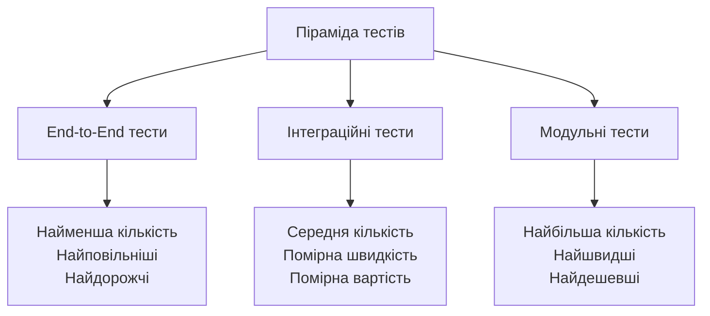
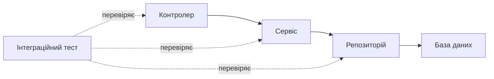
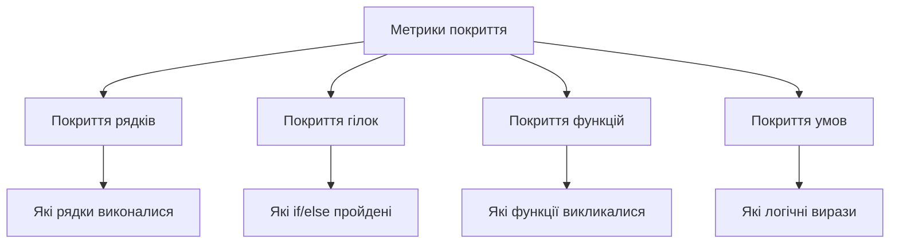
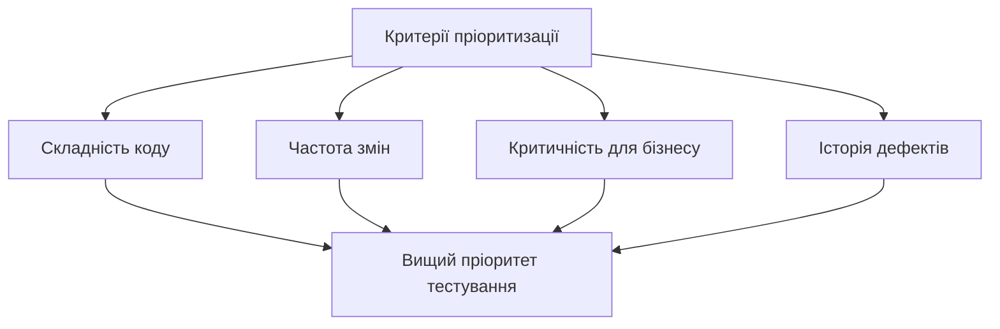

# Лекція 12. Стратегії тестування: піраміда тестів

## Вступ

У попередніх лекціях ми вчилися проєктувати й писати програмний код. Тепер постає питання, на яке рано чи пізно відповідає кожна команда: як переконатися, що написане працює правильно і що воно й надалі працюватиме після кожної наступної зміни? Тестування є відповіддю на це питання. Воно визначає якість кінцевого продукту та впевненість команди у його надійності, а вміння обрати правильний вид тестування для конкретної ситуації належить до ключових компетенцій професійного розробника.

Тестів можна написати безліч, але ресурси команди обмежені. Тест, який виконується годину, ніхто не запускатиме часто, а тест, який ламається без причини, швидко перестануть вважати. Тому важливо не просто «писати тести», а мати **стратегію**: знати, які тести потрібні, скільки їх має бути та на якому рівні системи їх доцільно розмістити. Саме цю задачу вирішує концепція піраміди тестів, яку ми розглянемо в цій лекції.

Ми детально розберемо рівні тестування, їхнє призначення та взаємодію, познайомимося з сучасними інструментами (pytest, Playwright, Testcontainers) і з практиками, що доповнюють класичну піраміду: мутаційним тестуванням, тестуванням на основі властивостей і контрактними тестами. Наприкінці розглянемо, як створити цілісну стратегію тестування, і побачимо, чому вона є передумовою для наступної теми курсу, безперервної інтеграції та розгортання (лекція 13). Автоматичні тести виконуються в конвеєрі CI, і саме вони дають команді впевненість випускати зміни часто й безпечно. Також від тестів залежить рефакторинг (лекція 15): змінювати структуру коду без тестів ризиковано.

## Основні поняття

- **Тестування програмного забезпечення** — систематичний процес виконання програми з метою виявити помилки та перевірити, що фактична поведінка відповідає очікуваній.
- **Верифікація і валідація** — дві різні перевірки. Верифікація відповідає на питання «чи правильно ми створюємо продукт?» (відповідність специфікації), валідація — «чи створюємо ми правильний продукт?» (відповідність потребам користувача).
- **Піраміда тестів** — модель розподілу тестів за рівнями: багато швидких модульних тестів унизу, менше інтеграційних посередині і найменше наскрізних угорі.
- **Модульний тест (unit-тест)** — тест, що перевіряє найменшу ізольовану частину програми, зазвичай функцію або метод, без залучення зовнішніх ресурсів.
- **Інтеграційний тест** — тест, що перевіряє взаємодію кількох компонентів системи, наприклад коду, бази даних і HTTP-інтерфейсу.
- **Наскрізний тест (end-to-end, E2E)** — тест, що проходить сценарій користувача через усю систему, від інтерфейсу до бази даних.
- **Тестовий дублер** — об'єкт, що замінює реальну залежність у тесті (стаб, мок, фейк, спай, dummy).
- **Покриття коду** — метрика, яка показує, яку частину коду було виконано під час запуску тестів.

## Фундаментальні концепції тестування

### Що таке тестування програмного забезпечення

Тестування програмного забезпечення є систематичним процесом виконання програми з метою виявлення помилок та перевірки відповідності фактичних результатів очікуваним. Це не просто пошук дефектів, а комплексна діяльність, спрямована на забезпечення якості продукту на всіх етапах його створення: від аналізу вимог, коли можна «протестувати» саму специфікацію на суперечності, до супроводу вже випущеної системи.

Основна мета тестування полягає у **верифікації** того, що програма працює правильно, та **валідації** того, що вона вирішує потрібні проблеми користувачів. Верифікація відповідає на питання «чи створюємо ми продукт правильно», тоді як валідація з'ясовує «чи створюємо ми правильний продукт». Програма може бездоганно виконувати специфікацію (пройти верифікацію) і водночас бути нікому не потрібною, бо специфікація описувала не ту проблему (не пройти валідацію). Обидві перевірки необхідні.

Ефективне тестування допомагає виявити проблеми на ранніх етапах розробки, коли їх виправлення коштує значно дешевше. Загальновідомим є твердження, що вартість виправлення помилки різко зростає залежно від етапу, на якому її знайдено: помилку у вимогах виправити в документі набагато дешевше, ніж після випуску продукту. Варто, однак, знати, що популярні «криві вартості» з конкретними коефіцієнтами (у десятки чи сотні разів) ґрунтуються на давніх даних і в такому вигляді не мають надійного емпіричного підтвердження. Безперечним лишається якісний висновок: ціна помилки зростає з часом, тож знаходити її слід якомога раніше.

### Принципи ефективного тестування

Спільнота тестувальників сформулювала кілька принципів, що вважаються фундаментальними (найвідоміший їхній перелік із сімох пунктів міститься в програмі сертифікації ISTQB). Розглянемо ті з них, що найважливіші для розробника.

Перший принцип: тестування демонструє наявність дефектів, але не може довести їх відсутність. Навіть найретельніше тестування не гарантує, що програма повністю вільна від помилок. Однак воно значно підвищує впевненість у якості продукту та зменшує ймовірність критичних проблем у продакшені.

Вичерпне тестування неможливе для більшості реальних систем через величезну кількість можливих комбінацій вхідних даних та станів програми. Навіть проста функція з двома цілочисельними параметрами має мільярди комбінацій. Замість спроб протестувати все, ефективна стратегія фокусується на найбільш ризикових областях та критичних сценаріях використання.

Раннє тестування є критично важливим для успіху проєкту. Діяльність з тестування має розпочинатися якомога раніше в життєвому циклі розробки, ідеально ще на етапі аналізу вимог. Це дозволяє виявити неузгодженості та неясності в специфікаціях до того, як вони перетворяться на дорогі в усуненні дефекти коду.

Концентрація дефектів означає, що більшість помилок зазвичай зосереджена в невеликій кількості модулів. Це явище пов'язують із принципом Парето: приблизно 80 відсотків проблем виникає у 20 відсотках коду. Співвідношення умовне, але сама закономірність підтверджується практикою, і її розуміння допомагає ефективніше розподіляти зусилля з тестування.

Пестицидний парадокс стверджує, що коли той самий набір тестів виконується знову і знову, він поступово перестає знаходити нові помилки, подібно до того, як шкідники набувають стійкості до одного й того самого пестициду. Тести потрібно регулярно переглядати й доповнювати новими сценаріями, особливо після змін у коді та після кожного виявленого дефекту, який «прослизнув» повз тести.

Нарешті, тестування залежить від контексту: систему керування медичним обладнанням тестують інакше, ніж мобільну гру. Ступінь ретельності, набір видів тестів і допустимий ризик визначаються тим, що саме ми створюємо.

### Типи тестування за знанням системи

Тестування за методом білого ящика передбачає повне знання внутрішньої структури системи. Тестувальник має доступ до вихідного коду та розуміє логіку роботи програми. Цей підхід дозволяє перевірити внутрішні структури даних, логічні шляхи виконання та інші аспекти реалізації. Такий тип тестування особливо характерний для модульних тестів, де перевіряються окремі функції та методи.

Тестування за методом чорного ящика не потребує знання внутрішньої реалізації системи. Тестувальник взаємодіє з програмою виключно через її зовнішній інтерфейс, як це робив би звичайний користувач. Такий підхід дозволяє зосередитися на функціональності системи та перевірці відповідності вимогам, не заглиблюючись у деталі реалізації. Наскрізні тести в основному належать до цього типу.

Тестування за методом сірого ящика поєднує обидва підходи, коли тестувальник має часткове знання внутрішньої структури. Це дозволяє створювати більш ефективні тестові сценарії, враховуючи як функціональні вимоги, так і особливості реалізації. Інтеграційні тести часто мають саме такий характер: тест звертається до системи через API (чорний ящик), але перевіряє стан бази даних (знання внутрішньої будови).

Ці відповідності («білий ящик — модульні тести» тощо) є радше типовими, ніж жорсткими. Один і той самий рівень тестів може використовувати різні підходи.

## Концепція піраміди тестів

### Походження та еволюція концепції

Концепція піраміди тестів була вперше представлена Майком Коном у його книзі про гнучку (Agile) розробку «Succeeding with Agile» (2009). Ця модель візуалізує ідеальний розподіл різних типів тестів у програмному проєкті, де форма піраміди відображає як кількість тестів кожного типу, так і швидкість їх виконання.



Основна ідея полягає в тому, що більшість тестів має бути на нижньому рівні піраміди, де тести швидкі, дешеві у створенні та підтримці, та надають швидкий зворотний зв'язок. По мірі руху вгору піраміди кількість тестів зменшується, оскільки вони стають повільнішими та дорожчими у створенні та виконанні.

Як орієнтир часто наводять співвідношення приблизно 70 % модульних, 20 % інтеграційних і 10 % наскрізних тестів. Воно походить із практики компанії Google, де тести також розрізняють за розміром: малі (один процес, без мережі та диска), середні (в межах однієї машини) і великі (кілька машин). Це саме орієнтир, а не закон: реальний розподіл залежить від типу системи.

З часом концепція піраміди еволюціонувала та адаптувалася під різні контексти розробки. Для клієнтської частини вебзастосунків набула поширення модель «трофея тестування» (Testing Trophy) Кента Ч. Доддса, яка робить акцент на інтеграційних тестах і додає нижній рівень статичного аналізу (типи, лінтери). З'явилися також «соти» для мікросервісів, де основна цінність зосереджена в тестах взаємодії сервісів. Базові принципи залишаються актуальними: ключова ідея полягає в балансі між різними типами тестів для досягнення оптимального співвідношення покриття, швидкості та вартості.

### Антипатерни в тестуванні

Перевернута піраміда тестів, або «крижаний ріжок», є поширеним антипатерном, коли команда покладається переважно на наскрізні тести, маючи мало модульних. Такий підхід призводить до повільного виконання тестів, складності в підтримці та ускладнює діагностику проблем, оскільки наскрізний тест лише повідомляє, що «щось зламалося», але не вказує, де саме.

Годинникове скло виникає, коли є багато модульних тестів і багато наскрізних, але мало інтеграційних посередині. Це створює розрив у покритті, де взаємодія між компонентами залишається недостатньо перевіреною.

Повна відсутність структурованого підходу до тестування, коли тести пишуться хаотично без чіткої стратегії, призводить до неефективного використання ресурсів та неповного покриття критичних сценаріїв.

## Модульні тести: основа піраміди

### Призначення та характеристики

Модульні тести (unit-тести) перевіряють найменші ізольовані частини програми, зазвичай окремі функції або методи класів. Кожен тест фокусується на одному аспекті поведінки тестованого коду, що дозволяє швидко ідентифікувати джерело проблеми при падінні тесту.

Основні характеристики якісних unit-тестів включають швидкість виконання, ізольованість, детермінованість та незалежність від зовнішніх ресурсів. Тести мають виконуватися за мілісекунди, що дозволяє запускати їх часто під час розробки. Вони не повинні залежати від баз даних, файлової системи, мережі або інших зовнішніх ресурсів, використовуючи замість них дублери. Детермінованість означає, що тест завжди дає однаковий результат за однакових вхідних даних, тож у ньому не місце випадковим числам без фіксованого зерна, поточному часу та іншим неконтрольованим чинникам.

Ізоляція досягається через тестування одиниці коду окремо від її залежностей. Якщо функція використовує інші модулі чи сервіси, ці залежності замінюються тестовими дублерами, що дозволяє сфокусуватися виключно на логіці тестованого коду.

### Структура модульного тесту

Широко визнаним підходом до структурування тестів є патерн Arrange-Act-Assert («підготувати — виконати — перевірити»), також відомий як Given-When-Then. Цей патерн чітко розділяє тест на три секції, роблячи його зрозумілішим та легшим у підтримці.

У секції Arrange підготовлюються всі необхідні передумови для тесту. Це включає створення тестових об'єктів, налаштування моків, підготовку вхідних даних та встановлення початкового стану системи.

Секція Act виконує дію, яку перевіряє цей тест. Зазвичай це один виклик методу або функції, яка є предметом тестування. Важливо, щоб ця секція була мінімальною та фокусувалася на одній конкретній дії.

Секція Assert перевіряє результати виконаної дії. Тут використовуються твердження для порівняння фактичних результатів з очікуваними. Якісний тест має мінімальну кількість тверджень, в ідеалі одне, що перевіряє один конкретний аспект поведінки.

### Практичні приклади модульних тестів

У світі Python стандартом де-факто для написання тестів є фреймворк **pytest**. Він дозволяє писати тести як звичайні функції з простими `assert` (без класів і спеціальних методів перевірки), а повідомлення про помилки показують, яке саме значення не збіглося з очікуваним. Вбудований модуль `unittest` також існує і широко використовується в застарілих проєктах, але для нових проєктів зазвичай обирають pytest.

Розглянемо простий приклад функції, яка обчислює знижку на товар залежно від кількості:

```python
def calculate_discount(price, quantity):
    if quantity >= 100:
        return price * 0.2
    elif quantity >= 50:
        return price * 0.1
    elif quantity >= 10:
        return price * 0.05
    return 0
```

Модульні тести для цієї функції перевірять різні випадки, зокрема граничні:

```python
def test_no_discount_for_small_quantity():
    # Arrange
    price = 100
    quantity = 5

    # Act
    discount = calculate_discount(price, quantity)

    # Assert
    assert discount == 0


def test_five_percent_discount():
    # Arrange
    price = 100
    quantity = 15

    # Act
    discount = calculate_discount(price, quantity)

    # Assert
    assert discount == 5


def test_boundary_condition_at_fifty():
    # Arrange
    price = 100
    quantity = 50

    # Act
    discount = calculate_discount(price, quantity)

    # Assert
    assert discount == 10
```

Такі тести покривають різні шляхи виконання коду, включаючи граничні умови, що є критично важливим для виявлення потенційних помилок. Помилки «на одиницю» (`>` замість `>=`) найчастіше ховаються саме на межах діапазонів, тому варто перевіряти значення на самій межі та по обидва її боки (9, 10, 49, 50, 99, 100).

Коли тести відрізняються лише вхідними даними й очікуваним результатом, замість копіювання коду зручно скористатися **параметризацією** pytest:

```python
import pytest


@pytest.mark.parametrize(
    "quantity, expected",
    [
        (5, 0),
        (9, 0),
        (10, 5),
        (49, 5),
        (50, 10),
        (99, 10),
        (100, 20),
    ],
)
def test_discount_for_quantity(quantity, expected):
    assert calculate_discount(100, quantity) == expected
```

Кожен рядок таблиці виконується як окремий тест, і при падінні pytest покаже, яке саме значення `quantity` спричинило проблему. Запуск усіх тестів виконується командою `pytest` у корені проєкту.

### Тестові дублери: моки, стаби та фейки

Тестові дублери є замінниками реальних об'єктів, які використовуються для ізоляції тестованого коду від його залежностей. Класифікацію дублерів запропонував Джерард Мезарош; найчастіше на практиці трапляються такі різновиди.

Стаби надають заздалегідь визначені відповіді на виклики методів під час тестування. Вони використовуються, коли тестованому коду потрібні дані від залежності, але сама логіка цієї залежності не є предметом тестування.

Моки є більш складними дублерами, які не лише надають відповіді, але й перевіряють, чи були викликані певні методи з очікуваними параметрами. Моки дозволяють верифікувати взаємодію між об'єктами, а не лише перевіряти стан.

Фейки є робочими реалізаціями залежностей, але спрощеними порівняно з продакшн-версією. Наприклад, замість реальної бази даних можна використовувати реалізацію в пам'яті, яка працює швидше та не потребує зовнішніх ресурсів.

Спай (spy) записує, як його викликали, не підміняючи поведінку повністю, а dummy («пустушка») лише заповнює обов'язковий параметр і в тесті жодним чином не використовується.

У Python стандартна бібліотека містить модуль `unittest.mock`, яким зручно користуватися і в тестах pytest:

```python
from unittest.mock import Mock


class OrderService:
    def __init__(self, email_service):
        self.email_service = email_service

    def place_order(self, customer_email, items):
        # ... збереження замовлення ...
        self.email_service.send(customer_email, "Замовлення прийнято")


def test_order_sends_confirmation_email():
    # Arrange
    email_service = Mock()
    service = OrderService(email_service)

    # Act
    service.place_order("student@example.com", ["книга"])

    # Assert
    email_service.send.assert_called_once_with(
        "student@example.com", "Замовлення прийнято"
    )
```

Тут ми перевіряємо не результат обчислення, а сам факт правильної взаємодії: сервіс листів має бути викликаний рівно один раз із потрібними аргументами. Водночас надмірне використання моків небезпечне: тести, що повторюють структуру реалізації, ламаються при будь-якому рефакторингу. Мокати варто лише межі системи (пошту, зовнішні API, годинник), а не кожен внутрішній клас.

## Інтеграційні тести: середній рівень

### Роль інтеграційного тестування

Інтеграційні тести перевіряють взаємодію між різними модулями або компонентами системи. На відміну від модульних тестів, які ізолюють кожну одиницю коду, інтеграційні перевіряють, як компоненти працюють разом як єдине ціле.

Ці тести виявляють проблеми, які не можна знайти модульними тестами, такі як неправильна передача даних між модулями, несумісність інтерфейсів, проблеми з конфігурацією або неочікувана поведінка при взаємодії компонентів. Типовий приклад: SQL-запит, який синтаксично правильний у коді, але не працює з реальною схемою бази даних.



Інтеграційне тестування може здійснюватися на різних рівнях деталізації. Вузьке інтеграційне тестування перевіряє взаємодію невеликої групи тісно пов'язаних компонентів (наприклад, репозиторій і реальна база даних), тоді як широке інтеграційне тестування може охоплювати цілі підсистеми.

### Стратегії інтеграційного тестування

Підхід «знизу вгору» починає з тестування найнижчих рівнів системи та поступово рухається до вищих. Спочатку тестуються базові модулі, потім модулі, які на них покладаються, і так далі до верхніх рівнів архітектури.

Підхід «зверху вниз» працює в протилежному напрямку, починаючи з верхнього рівня та поступово рухаючись до нижніх шарів. При цьому підході нижні рівні можуть бути замінені стабами на початкових етапах тестування.

Сендвіч-підхід, або гібридна стратегія, поєднує обидва методи, дозволяючи тестувати критичні модулі на різних рівнях паралельно. Це може прискорити процес тестування та раніше виявити критичні проблеми інтеграції.

### Тестування API та баз даних

Тестування RESTful API є важливим аспектом інтеграційного тестування для вебзастосунків. Такі тести перевіряють правильність роботи ендпоінтів, коректність обробки HTTP-запитів, валідацію вхідних даних, формування відповідей та обробку помилок. Більшість вебфреймворків надають вбудований тестовий клієнт, який викликає застосунок без запуску справжнього сервера. Наприклад, у Flask це `app.test_client()`, у FastAPI `TestClient`.

Приклад інтеграційного тесту для API-ендпоінта з фікстурою pytest, яка створює застосунок і чисту базу даних для кожного тесту:

```python
import pytest

from app import create_app, db
from app.models import User


@pytest.fixture
def client():
    app = create_app({
        "TESTING": True,
        "SQLALCHEMY_DATABASE_URI": "sqlite:///:memory:",
    })
    with app.app_context():
        db.create_all()
        yield app.test_client()
        db.drop_all()


def test_create_user_endpoint(client):
    # Arrange
    user_data = {
        "username": "testuser",
        "email": "test@example.com",
        "password": "securepassword",
    }

    # Act
    response = client.post("/api/users", json=user_data)

    # Assert
    assert response.status_code == 201
    assert "id" in response.get_json()

    # Перевіряємо стан бази даних
    user = db.session.execute(
        db.select(User).filter_by(email="test@example.com")
    ).scalar_one_or_none()
    assert user is not None
    assert user.username == "testuser"
```

Тестування роботи з базами даних потребує особливої уваги до управління тестовими даними. Кожен тест повинен працювати з чистим, передбачуваним станом бази даних. Це досягається через використання транзакцій, які відкочуються після тесту, або через повне очищення та повторну ініціалізацію тестової бази.

Тест на SQLite у пам'яті швидкий, але має суттєвий недолік: продакшн зазвичай працює на іншій СУБД (наприклад, PostgreSQL), яка має власні типи даних, обмеження та особливості SQL. Тест може проходити на SQLite і падати на реальній базі. Сучасне рішення цієї проблеми — бібліотека **Testcontainers**: вона на час тестів запускає справжню базу даних (або чергу повідомлень, кеш) у контейнері Docker і знищує її після завершення.

```python
import pytest
from testcontainers.postgres import PostgresContainer


@pytest.fixture(scope="session")
def database_url():
    with PostgresContainer("postgres:17") as postgres:
        yield postgres.get_connection_url()
```

Така фікстура створює контейнер один раз на всю тестову сесію, а окремі тести можуть отримувати чистий стан за допомогою транзакцій. Таким чином інтеграційні тести працюють із тією самою СУБД, що й у продакшені, а розробнику не потрібно нічого встановлювати вручну, окрім Docker.

### Управління тестовими даними

Фікстури є наборами даних, які використовуються для ініціалізації стану системи перед виконанням тестів. Вони забезпечують передбачуваність та повторюваність тестів, створюючи однакові початкові умови для кожного запуску. (Слово «фікстура» в pytest означає ширше поняття: функцію, яка готує ресурс для тесту.)

Фабрики тестових даних генерують об'єкти з реалістичними, але контрольованими даними. Замість жорстко закодованих значень, фабрики можуть створювати дані динамічно, що робить тести більш гнучкими та зручними в підтримці. Для Python популярні бібліотеки factory_boy та Faker.

Важливо забезпечити ізоляцію тестів один від одного. Кожен тест повинен мати можливість виконуватися незалежно в будь-якому порядку без впливу на результати інших тестів. Це досягається через належне очищення стану після кожного тесту або використання окремих екземплярів бази даних.

## End-to-End тести: вершина піраміди

### Призначення та характеристики

Наскрізні тести (End-to-End, E2E) перевіряють систему повністю, від інтерфейсу користувача до бази даних, імітуючи реальні сценарії використання. Ці тести забезпечують найвищий рівень впевненості в тому, що система працює правильно з точки зору користувача.

На відміну від модульних та інтеграційних тестів, E2E тести не ізолюють компоненти, а натомість перевіряють їх роботу разом у реальному або максимально наближеному до реального середовищі. Це включає справжню базу даних, реальні мережеві запити та повну ініціалізацію всіх компонентів системи.

Основні характеристики E2E тестів включають повільність виконання, складність у налаштуванні та підтримці, крихкість через залежність від багатьох компонентів, але водночас високу цінність через перевірку реальних користувацьких сценаріїв. Через високу вартість E2E тестами покривають лише найважливіші сценарії («золоті шляхи»): реєстрацію, вхід, оформлення замовлення, а не кожну дрібницю інтерфейсу.

### Інструменти для E2E тестування

Selenium довгий час залишався головним інструментом автоматизації браузера. Він підтримує всі основні браузери та дозволяє писати тести різними мовами програмування. Його недоліки — необхідність окремих драйверів і схильність до нестабільності, якщо самостійно не налаштовувати очікування.

Cypress є сучасною альтернативою, створеною спеціально для тестування вебзастосунків. Cypress виконується безпосередньо в браузері разом із застосунком, що надає йому більше контролю та робить тести швидшими та надійнішими. Основна мова — JavaScript/TypeScript.

Playwright від Microsoft на сьогодні є одним із найпоширеніших вибрів для нових проєктів. Він підтримує автоматизацію Chromium, Firefox та WebKit з єдиним API та має офіційні пакети для Python, JavaScript, Java і .NET. Playwright надає автоматичне очікування елементів, перехоплення мережевих запитів, запис відео та «слідів» виконання (trace) для розбору помилок, а також тестування в різних контекстах браузера. Ці можливості значною мірою розв'язують проблему нестабільності. Puppeteer, створений для керування Chrome, лишається популярним для автоматизації, але як тестовий інструмент поступається Playwright.

### Проєктування E2E тестів

Патерн Page Object Model є найкращою практикою для організації E2E тестів. Ідея полягає в тому, щоб створити окремий клас для кожної сторінки застосунку, який інкапсулює всі елементи та дії, можливі на цій сторінці. Тести тоді описують сценарій мовою користувача («увійти», «відкрити кошик»), а деталі пошуку елементів приховані в одному місці.

Нижче наведено приклад на Playwright для Python з плагіном `pytest-playwright`, який надає готову фікстуру `page`:

```python
from playwright.sync_api import Page, expect


class LoginPage:
    def __init__(self, page: Page):
        self.page = page
        self.username_input = page.get_by_label("Ім'я користувача")
        self.password_input = page.get_by_label("Пароль")
        self.login_button = page.get_by_role("button", name="Увійти")

    def open(self):
        self.page.goto("/login")

    def login(self, username: str, password: str):
        self.username_input.fill(username)
        self.password_input.fill(password)
        self.login_button.click()


class DashboardPage:
    def __init__(self, page: Page):
        self.page = page
        self.welcome_message = page.get_by_test_id("welcome")


def test_successful_login(page: Page):
    # Arrange
    login_page = LoginPage(page)
    login_page.open()

    # Act
    login_page.login("testuser", "password123")

    # Assert
    dashboard = DashboardPage(page)
    expect(dashboard.welcome_message).to_contain_text("Ласкаво просимо")
```

Зверніть увагу на дві речі. По-перше, локатори в Playwright «ліниві»: вони не шукають елемент у момент створення, а роблять це під час дії, тому створювати їх у конструкторі безпечно. (У старіших прикладах із Selenium `find_element` у конструкторі викликається негайно й ламається, якщо сторінка ще не завантажилась.) По-друге, метод `expect(...)` автоматично чекає, поки умова стане істинною, тож жодних «сплячих» пауз у тестах не потрібно. Локатори за роллю та підписом (`get_by_role`, `get_by_label`) стійкіші до змін розмітки, ніж CSS-селектори.

Цей підхід робить тести більш читабельними та зручними в підтримці. Коли інтерфейс змінюється, потрібно оновити лише відповідний Page Object, а не кожен тест, який використовує цю сторінку.

### Виклики E2E тестування

Нестабільність, або «flakiness» (англ. flaky — «ненадійний»), є однією з найбільших проблем E2E тестів. Тести можуть падати через тимчасові проблеми з мережею, затримки в завантаженні елементів або проблеми синхронізації, навіть коли застосунок працює правильно. Нестабільний тест небезпечний: команда звикає ігнорувати червоні результати, і одного дня ігнорує справжню помилку.

Боротьба з нестабільністю вимагає продуманих стратегій очікування. Замість жорстко закодованих затримок, сучасні інструменти надають «розумне очікування», яке автоматично чекає, поки елементи стануть доступними або виконається певна умова. Додатково корисно ізолювати дані кожного тесту, не залежати від стороннього зовнішнього сервісу та карантинити нестабільні тести (виводити з основного набору, доки їх не виправлять).

Час виконання E2E тестів може стати проблемою при зростанні їх кількості. Тести, які виконуються годинами, уповільнюють цикл розробки та зменшують продуктивність команди. Паралелізація виконання тестів та вибіркове запускання можуть допомогти управляти цим викликом.

## Додаткові рівні та типи тестів

### Компонентні тести

Компонентні тести займають проміжне положення між модульними та інтеграційними, фокусуючись на тестуванні окремих компонентів інтерфейсу в ізоляції від решти системи. Для клієнтських фреймворків це означає тестування React, Vue або Angular компонентів з їхньою логікою та рендерингом. Такі інструменти, як Testing Library, Vitest або Playwright Component Testing, дозволяють відрендерити компонент і перевірити його так, як бачить користувач.

Такі тести перевіряють, як компонент реагує на різні вхідні властивості (пропси) та стани, чи правильно відображається інтерфейс, чи коректно обробляються користувацькі події. Компонентні тести швидші за E2E тести, але надають більшу впевненість порівняно з простими модульними тестами.

### Тести продуктивності

Тести продуктивності перевіряють, як система поводиться під навантаженням та чи відповідає вона вимогам до швидкодії. Навантажувальне тестування імітує очікуване навантаження на систему, перевіряючи час відповіді та використання ресурсів за типових умов використання.

Стрес-тестування виводить систему за межі нормального навантаження, щоб визначити точку відмови та поведінку в екстремальних умовах. Тест сплесків (spike testing) перевіряє реакцію системи на раптові стрибки навантаження. Для написання таких сценаріїв поширені інструменти k6 та Locust; докладніше про них ми поговоримо в лекції 16.

### Тести безпеки

Тестування безпеки спрямоване на виявлення вразливостей, які могли б бути використані зловмисниками. Це включає перевірку на поширені вразливості, такі як SQL-ін'єкції, міжсайтовий скриптинг (XSS), небезпечна десеріалізація та інші загрози зі списку OWASP Top 10, який ми розглянемо в лекції 14.

Автоматизовані сканери безпеки можуть виявляти багато відомих вразливостей, але повноцінне тестування безпеки часто вимагає ручного проникнення та аналізу з боку експертів з кібербезпеки.

## Сучасні техніки, що доповнюють піраміду

Класична піраміда описує рівні тестів, але сама по собі не відповідає на питання, наскільки добрі самі тести. Кілька сучасних технік допомагають підвищити їхню якість.

**Тестування на основі властивостей (property-based testing).** Замість того щоб вручну вигадувати приклади, ми описуємо властивість, яка має виконуватися для будь-яких даних, а бібліотека генерує сотні випадкових вхідних значень і намагається знайти контрприклад. У Python для цього використовують бібліотеку Hypothesis:

```python
from hypothesis import given, strategies as st


@given(st.integers(min_value=0, max_value=10_000))
def test_discount_never_exceeds_price(quantity):
    discount = calculate_discount(100, quantity)
    assert 0 <= discount <= 100
```

Знайшовши збійний випадок, Hypothesis автоматично спрощує його до мінімального прикладу. Такий підхід добре виявляє граничні випадки, про які автор тестів не подумав.

**Мутаційне тестування.** Ця техніка перевіряє якість тестів через свідоме внесення в код невеликих змін («мутацій»): `>=` замінюється на `>`, `+` на `-`, `True` на `False`. Після кожної мутації запускаються тести. Якщо жоден тест не впав, мутант «вижив», а отже, тести цю поведінку не перевіряють. Інструменти: mutmut та cosmic-ray для Python, Stryker для JavaScript. Мутаційний показник (частка «убитих» мутантів) значно чесніше відображає якість тестів, ніж покриття рядків.

**Контрактні тести.** У системі з кількох сервісів наскрізні тести повільні й крихкі. Контрактне тестування (інструмент Pact) вирішує проблему інакше: споживач сервісу фіксує «контракт», тобто які запити він надсилає і яких відповідей очікує, а постачальник автоматично перевіряє, що його API цей контракт дотримується. Так команди виявляють несумісні зміни інтерфейсів без запуску всієї системи.

**Тести з підтримкою ШІ.** Асистенти розробки на основі великих мовних моделей (GitHub Copilot, Claude Code, Cursor та інші) сьогодні здатні швидко згенерувати початкові набори тестів і навіть пропонувати граничні випадки. Це прискорює рутинну роботу, але не знімає відповідальності з розробника. Згенеровані тести часто повторюють реалізацію (і тому «проходять» навіть за помилкового коду), перевіряють очевидне й дають хибне відчуття покриття. Перевіряйте їх так само уважно, як код колеги: чи тест справді впаде, якщо зламати поведінку? Для цього якраз і придатне мутаційне тестування.

## Покриття коду тестами

### Що таке покриття коду

Покриття коду є метрикою, яка показує, яка частина коду виконується під час запуску тестів. Існують різні типи покриття, кожен з яких вимірює різні аспекти виконання коду.

Покриття рядків показує відсоток рядків коду, які були виконані. Покриття гілок перевіряє, чи були виконані всі можливі гілки умовних операторів. Покриття функцій визначає, які функції були викликані під час тестів. Покриття умов розглядає окремі складові логічних виразів.



У Python покриття вимірюють бібліотекою coverage.py, яка інтегрується з pytest через плагін `pytest-cov`:

```bash
pip install pytest pytest-cov
pytest --cov=app --cov-branch --cov-report=term-missing
```

Прапорець `--cov-branch` вмикає вимірювання гілок, а `term-missing` виводить номери рядків, яких тести не торкнулися.

### Інтерпретація показників покриття

Високе покриття коду не гарантує відсутність помилок або високу якість тестів. Можна досягти стовідсоткового покриття, але при цьому не перевіряти жодних корисних сценаріїв або граничних випадків. Тести можуть виконувати код, але не робити жодних перевірок результатів.

Покриття коду краще використовувати як інструмент для виявлення неперевіреного коду, а не як самоціль. Якщо критична частина системи має низьке покриття, це сигнал про потенційний ризик та необхідність додаткових тестів. Відомий закон Гудхарта стосується й тут: коли метрика стає ціллю, вона перестає бути хорошою метрикою.

Різні частини системи можуть потребувати різного рівня покриття. Критична бізнес-логіка має прагнути до максимального покриття, тоді як деякі утилітні функції або згенерований код можуть мати нижчий пріоритет.

### Досягнення балансу

Замість фокусування виключно на показниках покриття, команди мають зосередитися на якості тестів. Кожен тест повинен перевіряти щось значуще та надавати цінність. Тести, написані лише для підвищення покриття без реальної перевірки функціональності, є марною тратою часу.

Важливо тестувати критичні шляхи виконання та граничні випадки, а не просто прагнути виконати кожен рядок коду. Добре продумані тести для найважливіших сценаріїв надають більшу цінність, ніж поверхневі тести для досягнення високих показників покриття. Як орієнтири на практиці часто називають 90–100 % для критичної логіки, 70–80 % для решти коду та ще менше для допоміжних утиліт, проте ці числа мають бути наслідком аналізу ризиків, а не вимогою на папері.

## Створення ефективної стратегії тестування

### Визначення пріоритетів

Не весь код потребує однакового рівня тестування. Критична бізнес-логіка, функції обробки платежів, системи автентифікації та інші компоненти з високим ризиком мають найвищий пріоритет для ретельного тестування.

Аналіз ризиків допомагає визначити, які частини системи потребують найбільшої уваги. Фактори ризику включають складність коду, частоту змін, критичність для бізнесу та історію дефектів.



### Баланс між швидкістю та покриттям

Ефективна стратегія тестування знаходить баланс між швидкістю отримання зворотного зв'язку та повнотою перевірки. Швидкі модульні тести надають негайну відповідь під час розробки, тоді як повільніші E2E тести запускаються рідше, наприклад перед релізом.

Організація тестів у групи або тестові набори дозволяє запускати різні набори в різних ситуаціях. Димові тести (smoke tests) перевіряють базову функціональність і виконуються дуже швидко. Регресійні тести повніші й запускаються перед кожним релізом. Найважчі набори (довгі E2E, тести продуктивності) можна запускати за розкладом, наприклад щоночі. У pytest групи тестів позначають маркерами (`@pytest.mark.smoke`) і запускають вибірково: `pytest -m smoke`.

Типова стратегія запуску: модульні тести запускаються при кожному коміті, інтеграційні при відкритті запиту на злиття (Pull Request), наскрізні перед релізом і за розкладом.

### Інтеграція в процес розробки

Тестування має бути інтегроване в щоденний процес розробки, а не залишатися окремою активністю в кінці циклу. Практика розробки через тестування (Test-Driven Development, TDD) передбачає написання тестів перед написанням коду: спочатку тест, який падає («червоний»), потім мінімальний код, щоб він пройшов («зелений»), потім рефакторинг. Це змушує розробників думати про дизайн та вимоги заздалегідь.


Автоматизація запуску тестів через конвеєри CI/CD забезпечує, що тести виконуються послідовно при кожній зміні коду. Це виявляє проблеми рано та запобігає регресіям. Саме цій темі присвячена наступна лекція.

## Висновки

Піраміда тестів надає структурований підхід до створення комплексної стратегії тестування, де більшість тестів знаходяться на нижньому рівні модульних тестів, меншість на рівні інтеграційних тестів, та найменша кількість на рівні наскрізних. Цей баланс забезпечує швидкий зворотний зв'язок, хороше покриття та прийнятні витрати на підтримку. Для конкретних систем модель можна адаптувати (трофей, соти), але принцип «більше швидких і дешевих, менше повільних і дорогих» лишається в силі.

Якість тестів важливіша за їх кількість або показники покриття коду. Ефективні тести перевіряють значущу функціональність, легко читаються та підтримуються, виконуються швидко та надають чіткі повідомлення при падінні. Мутаційне тестування, тести на основі властивостей та критичний перегляд згенерованих ШІ тестів допомагають цю якість підтримувати.

Тестування має бути інтегроване в культуру команди та процес розробки з самого початку. Команди, які розглядають тестування як невід'ємну частину розробки, а не як додаткову активність, створюють більш якісне програмне забезпечення та мають вищу продуктивність.

Сучасні інструменти та фреймворки (pytest, Playwright, Testcontainers) значно спрощують написання та підтримку тестів. Інвестиції в налаштування хорошої тестової інфраструктури окупаються через підвищення впевненості в якості коду та зменшення часу на виправлення помилок.

## Питання для самоперевірки

1. У чому різниця між верифікацією та валідацією? Наведіть приклад програми, яка проходить одну перевірку, але не проходить іншу.
2. Чому вичерпне тестування неможливе і як це впливає на вибір тестів?
3. Що таке піраміда тестів? Чому більшість тестів має бути на нижньому рівні?
4. Які антипатерни розподілу тестів ви знаєте («крижаний ріжок», «годинникове скло») і до яких проблем вони призводять?
5. Які характеристики має якісний модульний тест? Поясніть структуру Arrange-Act-Assert.
6. Чим відрізняються стаб, мок і фейк? У яких випадках надмірне використання моків шкодить?
7. Навіщо в інтеграційних тестах використовують Testcontainers замість бази даних у пам'яті?
8. Що таке Page Object Model і які проблеми E2E тестів він допомагає розв'язати?
9. Чому 100 % покриття коду не гарантує якості тестів? Як мутаційне тестування допомагає оцінити тести краще?
10. Як би ви розподілили тести між рівнями для вебзастосунку із входом, каталогом товарів і оплатою? Що покрили б наскрізними тестами?
