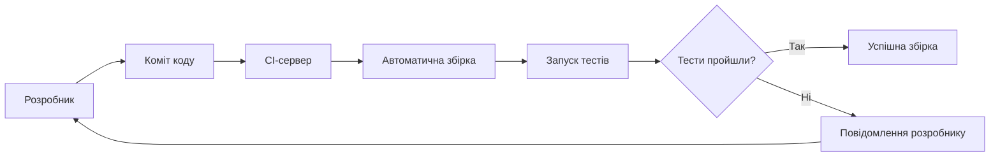
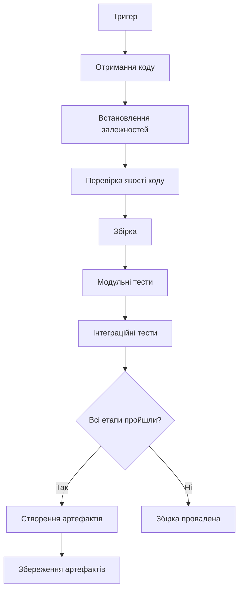
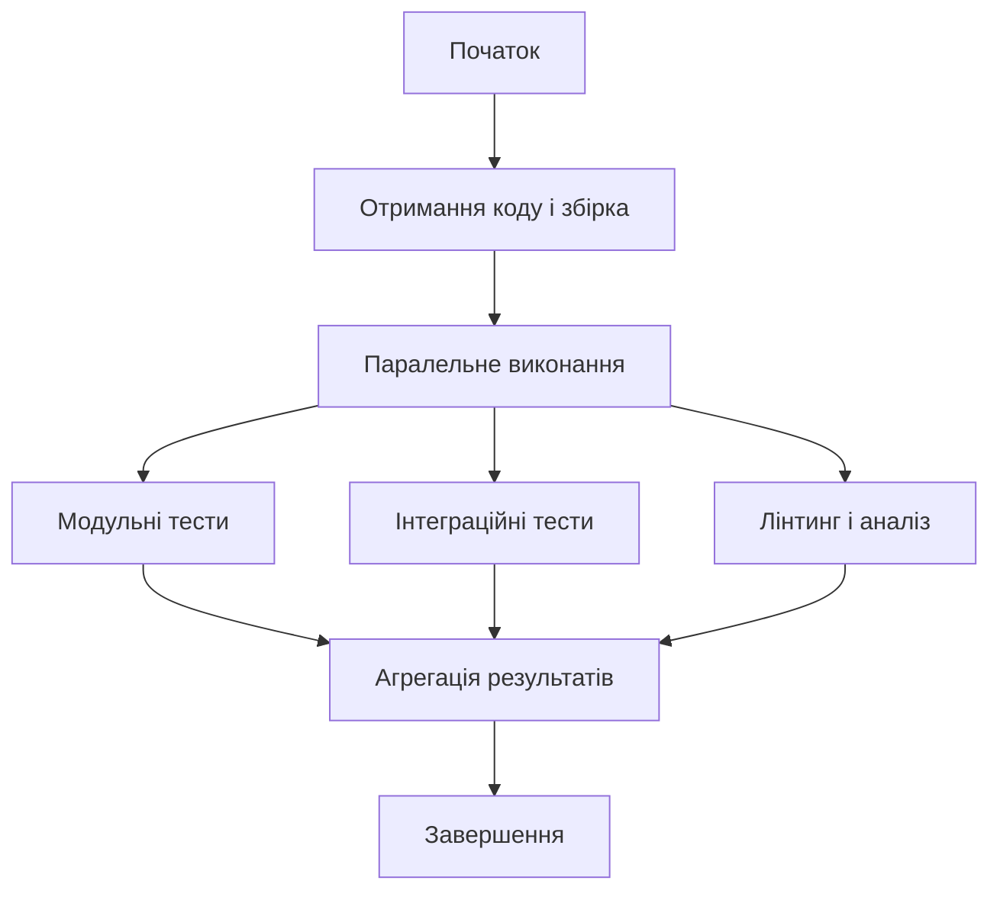
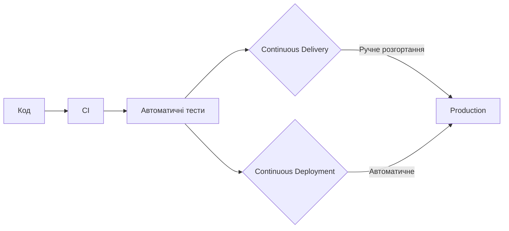
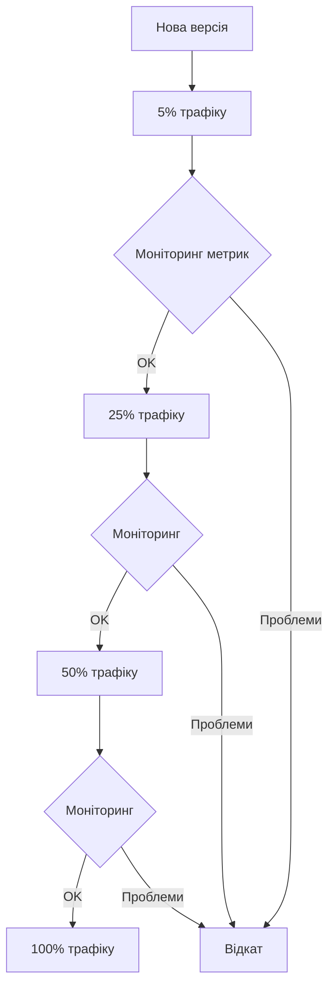
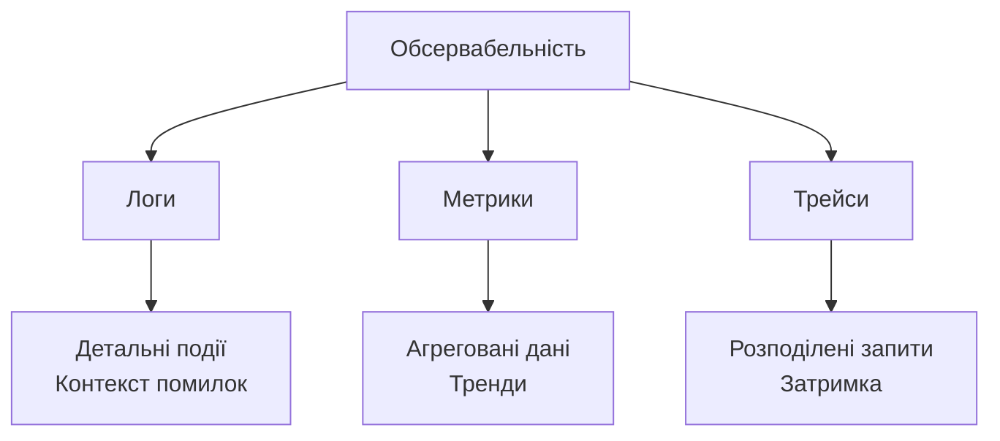
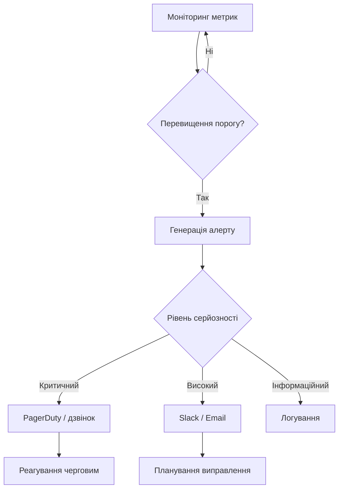
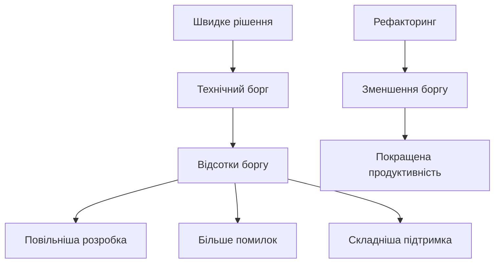
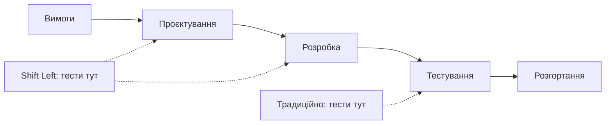
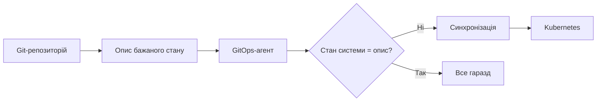

# Лекція 13. CI/CD, моніторинг та підтримка якості коду

## Вступ

Сучасна програмна інженерія немислима без автоматизації процесів доставки коду від розробника до кінцевого користувача. У попередній лекції ми розглянули, як тестами перевіряти правильність програми. Але тести, які запускають вручну «коли не забули», дають небагато користі. Справжню цінність вони отримують тоді, коли виконуються автоматично при кожній зміні коду. Саме цю задачу вирішують безперервна інтеграція та безперервна доставка (Continuous Integration та Continuous Delivery/Deployment, CI/CD). Разом із постійним моніторингом та контролем якості коду вони формують основу ефективної культури DevOps: практик, у яких розробка та експлуатація працюють як одна команда. Ці практики дозволяють командам швидко випускати нові функції, зберігаючи при цьому високу якість та стабільність продукту.

У цій лекції ми детально розглянемо, як побудувати ефективний CI/CD-конвеєр, які інструменти та практики допомагають підтримувати якість коду на високому рівні, та як моніторинг допомагає виявляти проблеми до того, як вони вплинуть на користувачів. Нова важлива тема порівняно з попередніми роками — обсервабельність на основі відкритого стандарту OpenTelemetry. Матеріал цієї лекції безпосередньо пов'язаний із сусідніми темами: конвеєр виконує тести з лекції 12, у нього вбудовуються перевірки безпеки з лекції 14, а зміни, які він доставляє, мають бути чистими й підтримуваними (лекція 15). Метрики, зібрані під час експлуатації, дозволяють оптимізувати продуктивність, про що йтиметься в лекції 16.

## Основні поняття

- **Безперервна інтеграція (Continuous Integration, CI)** — практика, за якої розробники часто (щонайменше щодня) зливають зміни в спільну гілку, а кожна така зміна автоматично збирається та тестується.
- **CI/CD-конвеєр (pipeline)** — автоматизована послідовність етапів (збірка, перевірки, тести, розгортання), яку проходить кожна зміна коду на шляху до користувача.
- **Continuous Delivery і Continuous Deployment** — безперервна доставка (код завжди готовий до випуску, а рішення про розгортання приймає людина) та безперервне розгортання (кожна успішна зміна потрапляє до користувачів автоматично).
- **Стратегії розгортання** — способи безпечного випуску нової версії: blue-green, canary, rolling та керування функціями за допомогою feature flags.
- **Обсервабельність (observability)** — властивість системи, що дозволяє з'ясувати її внутрішній стан за зовнішніми даними: логами, метриками та трейсами.
- **SLI, SLO і бюджет помилок** — показник рівня сервісу (наприклад, частка успішних запитів), цільове значення цього показника і допустима частка «невдач», яку команда може «витратити» на зміни та експерименти.
- **Інфраструктура як код (Infrastructure as Code, IaC)** — опис серверів, мереж і сервісів у файлах, які зберігаються у системі контролю версій і застосовуються автоматично.

## Основи Continuous Integration

### Концепція та принципи

Безперервна інтеграція є практикою розробки, коли розробники регулярно інтегрують свої зміни в спільну кодову базу, зазвичай кілька разів на день. Кожна інтеграція автоматично перевіряється збіркою та тестами, що дозволяє виявити проблеми якомога раніше.

Головна мета CI полягає в тому, щоб знайти та виправити помилки швидко, покращити якість програмного забезпечення та скоротити час перевірки й випуску нових оновлень. Замість довгих циклів інтеграції наприкінці проєкту, команда постійно інтегрує невеликі порції коду, що значно знижує ризики.



Основні принципи CI включають підтримку єдиного репозиторію коду, автоматизацію збірки, самотестування збірки, щоденні коміти, збірку кожного коміту, швидку збірку, тестування в клоні продакшн-середовища, легкий доступ до останньої збірки та прозорість процесу для всієї команди. Цей перелік узагальнено з класичної статті Мартіна Фаулера про безперервну інтеграцію, і хоча інструменти з того часу змінилися, принципи залишаються тими самими.

### Переваги впровадження CI

Впровадження безперервної інтеграції надає численні переваги для команди розробки та якості продукту. Раннє виявлення помилок дозволяє виправляти їх тоді, коли контекст ще свіжий у пам'яті розробника, що робить процес виправлення швидшим та дешевшим.

Зменшення інтеграційних проблем відбувається через часту інтеграцію невеликих змін. Замість «інтеграційного пекла» наприкінці спринту, коли потрібно зливати великі гілки з конфліктами, команда працює з постійно інтегрованим кодом.

Підвищення впевненості в коді досягається через автоматичне тестування кожної зміни. Команда знає, що якщо збірка проходить, код відповідає базовим вимогам якості. Прозорість стану проєкту дозволяє кожному члену команди бачити, чи працює поточна версія коду та які тести падають.

### Виклики при впровадженні CI

Перехід до CI може зустріти опір від команди, особливо якщо розробники звикли до довгих циклів роботи в ізольованих гілках. Культурна зміна вимагає часу та навчання, щоб команда зрозуміла переваги частих інтеграцій.

Підтримка швидких тестів є критично важливою для ефективного CI. Якщо виконання всіх тестів займає години, розробники не отримають швидкого зворотного зв'язку, і процес стане неефективним. Необхідна стратегія організації тестів у швидкі та повільні набори, у чому нам допомагає піраміда тестів із лекції 12.

Управління залежностями може ускладнюватися при частих інтеграціях. Важливо мати надійний спосіб керування зовнішніми бібліотеками та забезпечити відтворюваність збірки в будь-якому середовищі, наприклад, зафіксувавши точні версії залежностей у lock-файлах.

## Побудова CI-конвеєра

### Компоненти CI-конвеєра

Типовий CI-конвеєр складається з послідовності етапів, кожен з яких виконує певні перевірки та підготовку коду. Початковий етап включає клонування репозиторію та підготовку робочого середовища.

Етап збірки компілює код, завантажує залежності та створює артефакти, готові до розгортання. Для інтерпретованих мов, таких як Python або JavaScript, цей етап може включати перевірку синтаксису та підготовку пакетів або збірку контейнерного образу.

Етап тестування запускає різні типи тестів у певному порядку. Зазвичай спочатку виконуються швидкі модульні тести, потім інтеграційні, і нарешті більш повільні тести, якщо попередні етапи пройшли успішно. Такий порядок називають принципом «швидкої відмови» (fail fast): чим раніше конвеєр зупиниться на помилці, тим менше ресурсів і часу буде витрачено.



Етапи аналізу коду перевіряють дотримання стандартів кодування, виявляють потенційні помилки через статичний аналіз та вимірюють покриття коду тестами. Ці перевірки допомагають підтримувати високу якість кодової бази. У сучасних конвеєрах до них додають і перевірки безпеки: сканування залежностей та пошук випадково закомічених секретів (докладніше в лекції 14).

### Популярні CI-системи

GitHub Actions інтегрований безпосередньо в GitHub та надає зручний спосіб автоматизації процесів. Конфігурація описується у YAML-файлах у каталозі `.github/workflows` репозиторію, що робить налаштування прозорим та версійованим. Розглянемо приклад конвеєра для Python-проєкту:

```yaml
name: CI

on:
  push:
    branches: [main, develop]
  pull_request:
    branches: [main]

# Мінімальні права для токена конвеєра
permissions:
  contents: read

# Скасовувати попередній запуск для тієї ж гілки
concurrency:
  group: ci-${{ github.ref }}
  cancel-in-progress: true

jobs:
  test:
    runs-on: ubuntu-latest
    strategy:
      matrix:
        python-version: ["3.12", "3.13", "3.14"]

    steps:
      - uses: actions/checkout@v6

      - name: Встановлення Python
        uses: actions/setup-python@v6
        with:
          python-version: ${{ matrix.python-version }}
          cache: pip

      - name: Встановлення залежностей
        run: |
          python -m pip install --upgrade pip
          pip install -r requirements.txt

      - name: Перевірка якості коду
        run: |
          ruff check app/
          ruff format --check app/

      - name: Запуск тестів
        run: pytest tests/ --cov=app --cov-report=xml
```

Кілька особливостей цього прикладу заслуговують на увагу. Матриця (`matrix`) запускає завдання на кількох версіях Python паралельно, щоб переконатися, що застосунок працює на всіх підтримуваних версіях. Параметр `cache: pip` кешує завантажені пакети між запусками. Блок `permissions` обмежує права автоматично виданого токена мінімально необхідними (принцип найменших привілеїв, який ми докладніше розглянемо в лекції 14). Секція `concurrency` скасовує застарілі запуски, коли в ту саму гілку надходить новий коміт.

Стосовно версій дій (`actions/checkout@v6` тощо) слід пам'ятати, що вони регулярно оновлюються: старі мажорні версії (`@v2`, `@v3`) залишаються з застарілими середовищами виконання і з часом припиняють підтримку. Актуальні номери завжди варто звіряти на сторінці дії у GitHub Marketplace, а для автоматичного оновлення налаштувати Dependabot. З міркувань безпеки для сторонніх дій рекомендують фіксувати не тег, а повний хеш коміту (SHA), адже тег можна перемістити на змінений код.

Версії Python у прикладі — актуальні станом на час написання. Python 3.9 досяг кінця життя в жовтні 2025 року, тому нові проєкти на ньому починати не слід.

GitLab CI/CD також використовує конфігураційний файл (`.gitlab-ci.yml`) у репозиторії та надає потужні можливості для організації складних конвеєрів із паралельним виконанням та умовною логікою. Він є частиною платформи GitLab, тож для команд, що вже використовують цю платформу, це природний вибір.

Jenkins є більш традиційним та гнучким рішенням з величезною екосистемою плагінів, яке розгортається на власних серверах. Хоча налаштування може бути складнішим, Jenkins надає максимальну гнучкість для складних сценаріїв і досі широко використовується на підприємствах.

CircleCI є хмарним рішенням, яке цінують за швидкість і гнучкість. Раніше популярний Travis CI втратив позиції після того, як 2020 року скасував безкоштовні тарифи для відкритих проєктів, тому нині в нових проєктах він майже не зустрічається. Загалом вибір системи залежить від того, де розміщено код, від бюджету, наявної інфраструктури та досвіду команди.

### Оптимізація швидкості конвеєра

Швидкість виконання CI-конвеєра критично важлива для продуктивності команди. Довгі конвеєри уповільнюють цикл розробки та зменшують ефективність зворотного зв'язку.

Паралелізація є ключовою технікою для прискорення конвеєра. Незалежні завдання, такі як різні групи тестів або аналіз коду, можуть виконуватися одночасно на різних серверах.



Кешування залежностей значно економить час, уникаючи повторного завантаження бібліотек, які не змінилися. Сучасні CI-системи надають вбудовані механізми кешування для популярних менеджерів пакетів. Швидші інструменти теж допомагають: наприклад, Ruff перевіряє код на порядки швидше за попередників, а менеджер пакетів uv суттєво прискорює встановлення залежностей.

Інкрементальна збірка будує лише ті частини проєкту, які змінилися з попереднього разу. Це особливо ефективно для великих монорепозиторіїв з багатьма незалежними модулями.

Вибіркове запускання тестів на основі змінених файлів може значно прискорити конвеєр. Якщо зміни стосувалися лише певного модуля, немає необхідності запускати всі тести для всієї системи. Типовий орієнтир для швидкого конвеєра: результат для розробника протягом кількох (5–10) хвилин.

## Continuous Delivery та Continuous Deployment

### Відмінності між Continuous Delivery та Continuous Deployment

Абревіатура CD використовується для двох різних, хоча й близьких понять, тому важливо їх розрізняти.

Continuous Delivery (безперервна доставка) означає, що код завжди знаходиться в стані, готовому до розгортання у продакшн. Кожна успішна збірка проходить через всі етапи тестування та підготовки, але фінальне розгортання у продакшн відбувається вручну за рішенням команди (натисканням кнопки).

Continuous Deployment (безперервне розгортання) іде далі, автоматизуючи також і розгортання у продакшн. Кожна зміна, яка проходить всі етапи конвеєра, автоматично розгортається користувачам без ручного втручання.



Вибір між ними залежить від контексту проєкту, вимог до відповідності регуляторним нормам, зрілості процесів та готовності організації до ризику. Багато команд починають із безперервної доставки та поступово переходять до безперервного розгортання по мірі зростання впевненості у своїх тестах.

### Метрики ефективності доставки (DORA)

Як зрозуміти, що ваш процес доставки хороший? Дослідницька програма DORA (DevOps Research and Assessment), яку тепер веде Google Cloud, багато років вивчає тисячі команд і виділила чотири метрики, що добре передбачають ефективність. Швидкість характеризують частота розгортань (як часто ми випускаємо зміни) та час від коміту до продакшену (lead time for changes). Стабільність характеризують частка невдалих змін (change failure rate, тобто скільки випусків призводять до збою чи відкату) і час відновлення після збою.

Головне спостереження цих досліджень полягає в тому, що швидкість та стабільність не суперечать одна одній: найкращі команди випускають зміни і частіше, і надійніше. Це добре узгоджується з ідеєю, що часті малі зміни менш ризиковані за рідкісні великі. Метрики DORA корисно відстежувати в динаміці, але не варто перетворювати їх на мету для окремих людей: як і покриття тестами, вони добре працюють як індикатор, а не як план.

### Стратегії розгортання

Blue-Green (синьо-зелене) розгортання передбачає наявність двох ідентичних продакшн-середовищ. Нова версія розгортається в неактивне середовище, де може бути протестована. Після успішної перевірки трафік переключається на нове середовище миттєво. Якщо щось пішло не так, достатньо переключити трафік назад. Недолік — потреба в подвійних ресурсах.

Canary-розгортання (від «канарки в шахті») поступово випускає нову версію невеликій частині користувачів, збільшуючи відсоток. Це дозволяє виявити проблеми на невеликій аудиторії перед повним розгортанням.



Rolling-розгортання (поступове оновлення) послідовно замінює екземпляри старої версії новою, підтримуючи доступність сервісу протягом усього процесу. Це природна стратегія для систем із балансуванням навантаження, і саме вона є типовою для Kubernetes.

Feature flags (перемикачі функцій) дозволяють розгортати код із новими функціями, які спочатку вимкнені. Функції можна активувати вибірково для певних користувачів або поступово для всіх, незалежно від циклу розгортання коду. Це розділяє два поняття, які часто плутають: розгортання коду (технічна подія) та випуск функції для користувачів (бізнес-рішення).

```python
if feature_flags.is_enabled("new_checkout", user=current_user):
    return new_checkout_flow()
return old_checkout_flow()
```

### Управління конфігурацією

Конфігурація застосунку не повинна бути захардкоджена в коді. Принцип «конфігурація як код» (а також відповідний пункт методології «Дванадцять факторів», Twelve-Factor App) передбачає зберігання параметрів середовища окремо від коду та можливість їх зміни без перезбірки застосунку.

Змінні середовища є найпростішим способом управління конфігурацією для різних середовищ. Застосунок отримує параметри підключення до бази даних, API-ключі та інші налаштування через змінні середовища (environment variables).

Секрети, такі як паролі та API-ключі, потребують особливої уваги. Їх не можна зберігати в репозиторії коду або конфігураційних файлах. Сучасні рішення, як HashiCorp Vault, AWS Secrets Manager або Azure Key Vault, надають безпечні способи зберігання та доступу до секретів. У самих CI-конвеєрах секрети зберігають у захищеному сховищі платформи (наприклад, GitHub Secrets), а для доступу до хмарних сервісів дедалі частіше використовують короткоживучі токени через OIDC-автентифікацію замість довготривалих ключів, які можуть витекти.

## Моніторинг та обсервабельність

### Концепція обсервабельності

Обсервабельність є властивістю системи, яка дозволяє розуміти її внутрішній стан на основі зовнішніх виходів. У контексті програмних систем це означає можливість відповісти на будь-яке питання про поведінку системи через аналіз телеметричних даних.

Три стовпи обсервабельності включають логи, метрики та трейси. Логи надають детальну інформацію про окремі події в системі. Метрики показують агреговані числові показники, такі як кількість запитів за секунду або використання пам'яті. Трейси відстежують шлях окремих запитів через розподілену систему.



Моніторинг відрізняється від обсервабельності тим, що він зазвичай фокусується на відомих проблемах та заздалегідь визначених метриках. Обсервабельність дозволяє досліджувати невідомі проблеми та ставити нові питання без необхідності завчасно інструментувати систему для кожного можливого питання.

Сьогодні галузевим стандартом збору телеметрії став відкритий проєкт **OpenTelemetry** (OTel). Він визначає єдині API, SDK та протокол передачі даних (OTLP) для логів, метрик і трейсів, не прив'язуючи вас до конкретного постачальника: одну й ту саму телеметрію можна надсилати у Prometheus, Grafana, Jaeger або комерційні платформи. Практичний висновок для розробника: інструментуйте застосунок через OpenTelemetry, а бекенд для зберігання й перегляду даних можна обрати або змінити пізніше.

### Ключові метрики для моніторингу

Золоті сигнали (Golden Signals) із книги Google SRE надають чотири ключові категорії метрик, які мають відстежуватися для кожного сервісу. Затримка (latency) вимірює час, необхідний для обробки запиту. Трафік показує кількість запитів до системи. Помилки відстежують частоту невдалих запитів. Насиченість (saturation) вказує на використання ресурсів системи.

Метод USE фокусується на ресурсах системи. Для кожного ресурсу відстежується Utilization (наскільки зайнятий ресурс), Saturation (наскільки він перевантажений) та Errors (кількість помилок при роботі з ресурсом).

Метод RED зосереджується на сервісах. Rate вимірює кількість запитів за одиницю часу, Errors відстежує частоту помилок, Duration показує час обробки запитів.

### SLI, SLO та бюджет помилок

Щоб «надійність» не залишалася розмитим поняттям, у практиці SRE її вимірюють числами. **SLI** (Service Level Indicator) — це вимірюваний показник, наприклад частка запитів, оброблених успішно і швидше за 300 мс. **SLO** (Service Level Objective) — цільове значення цього показника, наприклад 99,9 % за 30 днів. Різниця між ідеалом і SLO називається **бюджетом помилок**: якщо ми дозволяємо 0,1 % невдалих запитів, то це та «кількість ненадійності», яку команда може витратити на випуски й експерименти. Поки бюджет не вичерпано, команда випускає нові функції, а коли вичерпано, зусилля переключаються на стабільність. Такий підхід перетворює суперечку «швидше чи надійніше?» на об'єктивну розмову за даними. Для користувачів усе це закріплюється в SLA (угоді про рівень сервісу), яка зазвичай менш жорстка, ніж внутрішні SLO.

### Інструменти моніторингу

Prometheus є популярною open-source системою моніторингу та сповіщення, спроєктованою для збору та зберігання метрик часових рядів. Prometheus періодично опитує цілі для збору метрик, зберігає їх в ефективному форматі та надає потужну мову запитів PromQL для аналізу даних.

```yaml
# prometheus.yml
scrape_configs:
  - job_name: 'webapp'
    metrics_path: '/metrics'
    scrape_interval: 15s
    static_configs:
      - targets: ['localhost:8080']
```

Grafana надає візуалізацію для метрик з різних джерел, включаючи Prometheus. Панелі (dashboards) у Grafana дозволяють створювати інформативні представлення з графіками, таблицями та сповіщеннями для моніторингу стану системи в реальному часі.

Для логів класичним рішенням є ELK Stack, що складається з Elasticsearch, Logstash та Kibana: Logstash збирає та обробляє логи з різних джерел, Elasticsearch зберігає та індексує їх, а Kibana надає інтерфейс для пошуку та візуалізації. Альтернативою є Grafana Loki, який індексує лише мітки логів і тому простіший та дешевший в експлуатації, особливо в парі з Grafana.

Jaeger та Zipkin є системами розподіленого трейсингу, які допомагають відстежувати запити через мікросервісну архітектуру, виявляючи вузькі місця продуктивності та проблеми із затримкою. Сучасні застосунки надсилають трейси в них через OpenTelemetry (протокол OTLP), а не через застарілі клієнтські бібліотеки Jaeger.

Типова панель для вебсервісу показує кількість запитів за секунду, час відповіді за перцентилями (p50, p95, p99), частку помилок, використання процесора й пам'яті та кількість з'єднань із базою даних. Мета такої панелі — одним поглядом оцінити здоров'я системи. Докладніше про перцентилі та інструментування коду ми поговоримо в лекції 16.

### Сповіщення та реагування на інциденти

Ефективні сповіщення (алерти) інформують команду про проблеми, які потребують негайної уваги, не перевантажуючи зайвими повідомленнями. Кожен алерт має бути дієвим (actionable), тобто вказувати на проблему, яку можна та треба виправити. Надлишок хибних сповіщень призводить до «втоми від алертів»: команда починає ігнорувати навіть справжні проблеми. Рекомендується налаштовувати алерти на симптоми, що відчувають користувачі (зросла частка помилок, впала доступність), а не на кожну технічну дрібницю.

Рівні серйозності алертів допомагають визначити пріоритет реагування. Критичні алерти вимагають негайної реакції та можуть будити команду вночі. Попередження інформують про потенційні проблеми, які слід розглянути в робочий час. Інформаційні повідомлення корисні для аналізу після інциденту, але не вимагають негайних дій.



Ротація чергових (on-call) забезпечує наявність відповідальної особи для реагування на критичні проблеми в будь-який час. Інструменти на кшталт PagerDuty або Opsgenie управляють розкладом чергувань та ескалаціями, якщо перша особа не реагує.

Інструкції для реагування (runbooks) документують процедури реагування на типові проблеми, надаючи покрокові інструкції для їх вирішення. Це особливо корисно для нових членів команди або під час стресових ситуацій. Після серйозного інциденту доброю практикою є аналіз без пошуку винних (blameless postmortem): команда з'ясовує, які системні причини призвели до збою, і що змінити, щоб він не повторився.

## Підтримка якості коду

### Статичний аналіз коду

Статичний аналіз перевіряє код без його виконання, виявляючи потенційні помилки, порушення стандартів кодування та проблеми безпеки. Це потужний інструмент для підтримки якості коду на високому рівні, який легко вбудовується в конвеєр CI.

Лінтери перевіряють код на відповідність стандартам стилю та виявляють поширені помилки, а форматувальники автоматично приводять код до єдиного вигляду. Для Python сьогодні найпоширенішим вибором став Ruff, який поєднує функції лінтера та форматувальника й працює дуже швидко; раніше для цього використовували кілька окремих інструментів (flake8, pylint, black, isort), які ще трапляються в наявних проєктах. Для JavaScript використовуються ESLint та Prettier. Для Java — Checkstyle та SpotBugs, а платформа SonarQube аналізує код кількома мовами й показує якість у вигляді єдиних звітів.

Приклад конфігурації Ruff у файлі `pyproject.toml`:

```toml
[tool.ruff]
line-length = 88
exclude = [".git", "__pycache__", "migrations"]

[tool.ruff.lint]
# E, W — стиль PEP 8; F — помилки; I — порядок імпортів; B — типові пастки
select = ["E", "W", "F", "I", "B"]
ignore = ["E203"]
```

Для порівняння, еквівалентна конфігурація класичного flake8 (файл `.flake8`) має такий вигляд:

```ini
[flake8]
max-line-length = 88
exclude = .git,__pycache__,migrations
ignore = E203, W503
```

Статичні аналізатори типів, такі як mypy або Pyright для Python та TypeScript для JavaScript, виявляють помилки типізації, які могли б призвести до помилок під час виконання. Вони особливо корисні для великих кодових баз, де важко відстежити всі можливі типи даних.

Інструменти аналізу безпеки виявляють вразливості у коді та залежностях. Bandit для Python, `npm audit` для Node.js та Dependabot для GitHub автоматично перевіряють наявність відомих вразливостей у використовуваних бібліотеках. Докладно ці інструменти розглядаються в лекції 14.

### Практики рецензування коду

Рецензування коду (code review) є критично важливим процесом для підтримки якості коду та обміну знаннями в команді. Кожна зміна коду має бути переглянута принаймні одним іншим розробником перед злиттям у основну гілку.

Pull Request (у GitLab — Merge Request) є стандартним механізмом для пропонування та перегляду змін. Автор створює запит, описує зроблені зміни та їхнє призначення. Рецензенти аналізують код, залишають коментарі та схвалюють або запитують зміни. Автоматичні перевірки CI виконуються ще до того, як людина почне читати код: якщо конвеєр червоний, рецензент не витрачає час на код, що не збирається. Щоб злиття було неможливим без проходження перевірок і схвалення, в репозиторії налаштовують захист гілки (branch protection).

Ефективне рецензування фокусується на важливих аспектах: правильності логіки, дотриманні архітектурних принципів, читабельності та підтримуваності коду, потенційних проблемах продуктивності та безпеки, наявності тестів для змін. Дріб'язкові питання стилю краще делегувати автоматизованим інструментам. Про те, на що саме дивитися і як формулювати зауваження, докладніше йдеться в лекції 15.

Останніми роками в процес рецензування дедалі частіше вбудовують ШІ-помічників, які автоматично залишають коментарі до запитів на злиття. Вони добре знаходять типові помилки та пропущені перевірки, але не розуміють бізнес-контексту й можуть помилятися. Тому їх варто розглядати як додатковий фільтр, а не заміну людині: відповідальність за схвалену зміну несе рецензент.

### Технічний борг

Технічний борг є метафорою для опису наслідків швидких рішень у розробці, які полегшують життя зараз, але створюють додаткову роботу в майбутньому. Подібно до фінансового боргу, технічний борг накопичує «відсотки» у вигляді додаткових зусиль на підтримку та розвиток системи.



У контексті CI/CD технічний борг проявляється як повільний і нестабільний конвеєр, застарілі залежності, ручні кроки розгортання, відсутність тестів. Як виникає борг, які його різновиди та як ним керувати, докладно розглянуто в лекції 15. Тут наголосимо лише на практичній стороні: команди зазвичай закладають частину часу кожного спринту на погашення боргу й використовують автоматичні порогові значення в конвеєрі (наприклад, «не допускати падіння покриття нижче заданого рівня»), щоб борг не накопичувався непомітно.

### Метрики якості коду

Метрики складності коду допомагають ідентифікувати складні ділянки, які важко підтримувати та тестувати. Цикломатична складність вимірює кількість незалежних шляхів через код. Високі значення вказують на необхідність рефакторингу для спрощення логіки.

Дублювання коду виявляє повторювані фрагменти, які варто виділити в окремі функції або модулі. Дублювання збільшує складність підтримки, оскільки зміни треба вносити в кількох місцях.

Покриття тестами показує, яка частина коду покрита тестами, але саме по собі не гарантує якість (див. лекцію 12). Важливо аналізувати не лише загальне покриття, але й якість тестів та покриття критичних шляхів виконання.

Індекс підтримуваності (maintainability index) об'єднує різні метрики для оцінки загальної підтримуваності коду. Низькі значення сигналізують про необхідність рефакторингу для покращення структури та читабельності коду. Пам'ятайте, що будь-які метрики є індикаторами, а не абсолютними істинами.

## Інтеграція практик у процес розробки

### Shift Left Testing

Концепція Shift Left («зсув ліворуч») передбачає перенесення активностей з тестування та забезпечення якості на ранні етапи розробки, тобто ліворуч на часовій осі проєкту. Замість тестування готового продукту в кінці циклу, якість вбудовується в процес з самого початку.



Тестування на етапі проєктування включає рецензування архітектурних рішень на предмет тестованості та виявлення потенційних проблем до написання коду. Статичний аналіз та лінтинг виконуються ще під час написання коду в IDE розробника (а також як git-хуки перед комітом, наприклад через інструмент pre-commit).

Модульні тести пишуться одночасно з кодом або навіть до нього за підходом Test-Driven Development. Це забезпечує, що код створюється з урахуванням тестованості та має чіткі інтерфейси. З тим самим принципом пов'язаний і термін DevSecOps: перевірки безпеки також «зсуваються ліворуч» і виконуються в конвеєрі при кожній зміні, а не перед випуском.

### Культура якості в команді

Якість коду є відповідальністю всієї команди, а не окремих спеціалістів із тестування. Кожен розробник має відчувати відповідальність за якість коду, який він створює, включаючи написання тестів, виправлення помилок та участь у рецензуванні.

Парне програмування (pair programming) та групове програмування (mob programming) є практиками, де кілька розробників працюють над одним завданням одночасно. Це природним чином включає рецензування в процес розробки та сприяє обміну знаннями.

Регулярні ретроспективи дозволяють команді обговорювати, що працює добре, а що потребує покращення в процесах розробки та забезпечення якості. Це створює культуру постійного вдосконалення.

### Баланс між швидкістю та якістю

Існує поширене переконання, що якість та швидкість є взаємовиключними, але насправді інвестиції в якість підвищують довгострокову швидкість розробки. Чистий, добре протестований код легше модифікувати та розширювати. Дослідження DORA, згадані вище, підтверджують це: найшвидші команди водночас є й найстабільнішими.


Мінімально життєздатний продукт (MVP) не означає погану якість. MVP має фокусуватися на мінімальному наборі функцій, але ці функції мають бути реалізовані якісно. Технічний борг, накопичений заради швидкого випуску, уповільнює подальший розвиток.

Автоматизація рутинних перевірок через CI/CD дозволяє підтримувати високу якість без сповільнення розробки. Те, що колись вимагало годин ручного тестування, тепер відбувається автоматично за хвилини.

## Сучасні тренди та практики

### Infrastructure as Code

Управління інфраструктурою через код дозволяє застосовувати до неї ті ж практики, що й до програмного коду, включаючи контроль версій, рецензування та автоматизоване тестування. Інструменти на кшталт Terraform (та його відкритого форку OpenTofu, створеного після зміни ліцензії Terraform), Ansible або AWS CloudFormation описують бажаний стан інфраструктури декларативно.

```hcl
# Приклад на Terraform
resource "aws_instance" "web" {
  ami           = "ami-0123456789abcdef0"
  instance_type = "t3.micro"

  tags = {
    Name        = "WebServer"
    Environment = "Production"
  }
}
```

Переваги IaC включають відтворюваність середовищ, можливість швидко створювати ідентичні копії для різних цілей, документування інфраструктури у вигляді коду та можливість відкату змін через систему контролю версій.

### GitOps

GitOps є підходом до управління інфраструктурою та застосунками, де Git-репозиторій є єдиним джерелом істини для бажаного стану системи. Зміни в інфраструктурі або конфігурації застосунку проходять через Pull Request, забезпечуючи відстеження всіх змін та можливість їх перегляду.



Автоматичні агенти (наприклад, Argo CD або Flux) постійно звіряють фактичний стан системи з описаним у Git-репозиторії та автоматично синхронізують їх. Це забезпечує, що продакшн-середовище завжди відповідає конфігурації у репозиторії.

### Chaos Engineering

Інженерія хаосу є дисципліною експериментування з розподіленими системами для побудови впевненості в їхній здатності витримувати турбулентні умови. Замість очікування збоїв у продакшені, команди свідомо вводять відмови в контрольованих умовах для перевірки стійкості системи.

Приклади включають симуляцію відмов серверів, мережевих проблем, високого навантаження або пошкодження даних. Інструменти на кшталт Chaos Monkey від Netflix, Gremlin або LitmusChaos надають можливості для організованого проведення таких експериментів. Мета — виявити слабкі місця до реального інциденту.

### Платформна інженерія

Із зростанням кількості інструментів (CI, реєстри образів, Kubernetes, моніторинг, секрети) кожній команді стає важко налаштовувати все самостійно. Відповіддю стала платформна інженерія: окрема команда створює внутрішню платформу розробника з готовими «золотими шляхами» (шаблони проєктів, готові конвеєри, стандартні панелі моніторингу), а команди продуктів користуються ними за принципом самообслуговування. Для розробника це означає, що значну частину описаного в цій лекції налаштовувати доведеться не з нуля, а на основі корпоративних шаблонів.

### Приклад: повний конвеєр для вебзастосунку

Об'єднаємо все розглянуте в один наскрізний сценарій. Розробник створює коміт і відкриває Pull Request у GitHub. GitHub Actions запускає лінтинг, модульні та інтеграційні тести, а також збирає образ Docker. Після злиття в основну гілку образ публікується в реєстр контейнерів. Агент GitOps (наприклад, Argo CD) виявляє зміну версії в конфігураційному репозиторії та синхронізує кластер Kubernetes за стратегією поступового або canary-розгортання. Застосунок, інструментований через OpenTelemetry, надсилає метрики й трейси, Prometheus та Grafana відображають стан сервісу, а при порушенні SLO система сповіщень (наприклад, PagerDuty) викликає чергового інженера.

### Екосистема інструментів

Для орієнтації в екосистемі корисно мати перед очима типовий набір інструментів за категоріями. CI/CD: GitHub Actions, GitLab CI, Jenkins. Контейнери й оркестрація: Docker, Kubernetes, Helm. Інфраструктура як код: Terraform/OpenTofu, Ansible, CloudFormation. Моніторинг: Prometheus, Grafana, Datadog. Логування: ELK, Loki, Splunk. Безпека: Vault, Trivy, SonarQube. Не потрібно вивчати все одразу: важливіше розуміти, яку задачу вирішує кожна категорія.

## Висновки

CI/CD, моніторинг та підтримка якості коду є взаємопов'язаними практиками, які разом формують основу сучасної культури розробки програмного забезпечення. Автоматизація процесів доставки коду дозволяє командам швидко реагувати на зміни та регулярно випускати нові функції, зберігаючи при цьому високу якість. Метрики DORA показують, що швидкість і стабільність не суперечать одна одній.

Ефективний моніторинг надає необхідну видимість стану системи, дозволяючи виявляти та вирішувати проблеми до того, як вони вплинуть на користувачів. Обсервабельність виходить за рамки простого моніторингу, надаючи можливість розуміти поведінку складних систем, а стандарт OpenTelemetry робить збір телеметрії незалежним від конкретних інструментів. Цілі за надійністю (SLO) і бюджет помилок допомагають приймати рішення на основі даних.

Підтримка якості коду через автоматизовані перевірки, рецензування та управління технічним боргом є інвестицією в довгострокову продуктивність команди. Високоякісний код легше розуміти, модифікувати та розширювати, що прискорює розробку нових функцій.

Успішне впровадження цих практик вимагає не лише технічних інструментів, але й культурних змін у команді та організації. Створення культури якості, де кожен член команди відчуває відповідальність за якість продукту, є ключовим фактором успіху.

## Питання для самоперевірки

1. Що таке безперервна інтеграція і які проблеми вона розв'язує? Чому важливо інтегрувати зміни часто?
2. Із яких етапів складається типовий CI-конвеєр? Чому швидкі тести запускають раніше за повільні?
3. У чому різниця між Continuous Delivery та Continuous Deployment? Від чого залежить вибір між ними?
4. Порівняйте стратегії blue-green, canary та rolling. У яких ситуаціях доречна кожна?
5. Які способи прискорення CI-конвеєра ви знаєте?
6. Чому секрети не можна зберігати в репозиторії? Які альтернативи існують?
7. Чим обсервабельність відрізняється від моніторингу? Що таке три стовпи обсервабельності і яку роль відіграє OpenTelemetry?
8. Що таке SLI, SLO та бюджет помилок? Як вони допомагають балансувати між швидкістю випусків і надійністю?
9. Якими ознаками характеризується «дієвий» алерт і чому надлишок сповіщень шкодить?
10. Що означає принцип Shift Left і як він проявляється в практиках CI/CD та DevSecOps?
