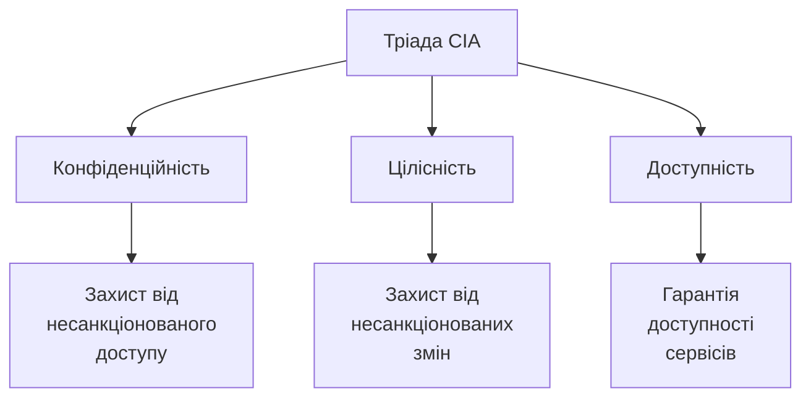
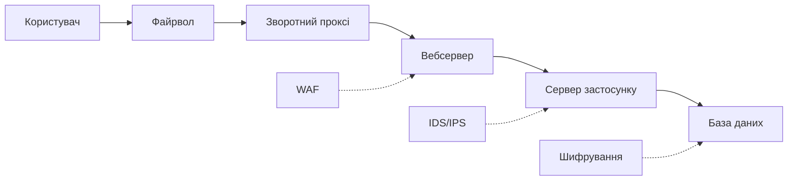
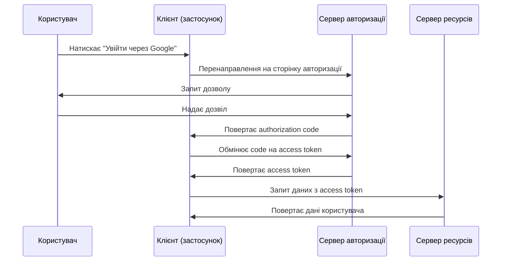

# Лекція 14. Інформаційна безпека в розробці ПЗ

## Вступ

Інформаційна безпека стала невід'ємною частиною процесу розробки програмного забезпечення. У сучасному цифровому світі, де дані є найціннішим активом організацій, а кіберзагрози стають дедалі складнішими та частішими, розробники повинні інтегрувати практики безпеки на всіх етапах життєвого циклу програмного забезпечення. Більше не достатньо додавати безпеку як окремий компонент наприкінці розробки. Сучасний підхід вимагає, щоб безпека була вбудована в архітектуру, код та процеси з самого початку.

У попередній лекції ми побачили, як конвеєри CI/CD автоматизують збірку, тестування й розгортання. Те, що конвеєр доставляє код швидко, означає й те, що вразливість також потрапить до користувачів швидко, якщо її не зупинити. Тому безпека стає ще однією групою автоматичних перевірок у тому самому конвеєрі (підхід DevSecOps), а розробник відповідає за неї нарівні з працездатністю та швидкодією.

Ця лекція розглядає фундаментальні принципи інформаційної безпеки в контексті розробки програмного забезпечення, найпоширеніші вразливості та загрози, методи їх виявлення та запобігання, а також сучасні практики та інструменти для створення безпечних застосунків. Особливу увагу приділено практичному застосуванню знань з безпеки в повсякденній роботі розробника, а також двом темам, що набули особливої ваги останніми роками: безпеці ланцюга постачання програмного забезпечення та безпеці коду, який створюється за допомогою ШІ.

## Основні поняття

- **Тріада CIA** — три базові властивості захищеної інформації: конфіденційність (Confidentiality), цілісність (Integrity) та доступність (Availability).
- **Аутентифікація і авторизація** — аутентифікація встановлює, *хто* звертається до системи; авторизація визначає, *що саме* цьому користувачеві дозволено робити.
- **Принцип найменших привілеїв** — кожен користувач, процес чи компонент має лише ті права, які необхідні для виконання його завдань.
- **Захист в глибину (defense in depth)** — побудова кількох незалежних рівнів захисту, щоб компрометація одного рівня не означала компрометації всієї системи.
- **Ін'єкція** — клас атак, у яких зловмисні дані інтерпретуються системою як команди (SQL-ін'єкція, ін'єкція команд ОС тощо).
- **OWASP Top 10** — перелік десяти найкритичніших категорій ризиків безпеки вебзастосунків, який регулярно оновлює спільнота OWASP; актуальна редакція — 2025 року.
- **Ланцюг постачання ПЗ (software supply chain)** — усе, що потрапляє у ваш продукт ззовні або впливає на його збірку: бібліотеки, інструменти збірки, образи контейнерів, дії CI.

## Основи інформаційної безпеки

### Тріада CIA

Фундаментом інформаційної безпеки є три основні принципи, відомі як тріада CIA: конфіденційність (Confidentiality), цілісність (Integrity) та доступність (Availability). Ці три принципи формують основу для всіх рішень у галузі безпеки та повинні враховуватися при проєктуванні кожної системи.



Конфіденційність забезпечує, що інформація доступна лише тим особам, які мають відповідні права доступу. Це передбачає використання механізмів аутентифікації для ідентифікації користувачів, авторизації для визначення їхніх прав та шифрування для захисту даних під час передачі та зберігання. Порушення конфіденційності може призвести до витоку персональних даних, комерційної таємниці або іншої чутливої інформації. Приклад: лише власник облікового запису може бачити свої особисті дані.

Цілісність гарантує, що дані не були змінені несанкціонованим способом. Система повинна мати механізми для виявлення будь-яких несанкціонованих модифікацій даних та забезпечувати можливість їх відновлення. Це включає використання контрольних сум, цифрових підписів, журналювання змін та інших технік для перевірки автентичності даних. Приклад: банківська транзакція не може бути змінена після виконання.

Доступність означає, що авторизовані користувачі можуть отримати доступ до інформації та ресурсів тоді, коли це необхідно. Система повинна бути захищена від атак типу «відмова в обслуговуванні» (DoS/DDoS), мати механізми резервного копіювання та відновлення, а також забезпечувати належну продуктивність навіть під навантаженням. Приклад: вебсайт лишається доступним цілодобово навіть при високому навантаженні. Про масштабування й стійкість до навантажень йтиметься в лекції 16.

### Принцип найменших привілеїв

Принцип найменших привілеїв стверджує, що кожен компонент системи, користувач або процес повинен мати лише ті права доступу, які абсолютно необхідні для виконання його функцій. Це один з найважливіших принципів безпечного проєктування, який значно обмежує потенційні наслідки успішної атаки або помилки в коді.

Застосування цього принципу передбачає створення детальної моделі прав доступу, де кожна роль в системі має чітко визначені дозволи. Замість надання широких прав за замовчуванням, система повинна починати з мінімальних прав та надавати додаткові привілеї лише за явним запитом та обґрунтуванням. Наприклад, вебзастосунок не повинен підключатися до бази даних з правами адміністратора, якщо йому потрібно лише читати та записувати дані в конкретні таблиці. З тієї ж причини токену конвеєра CI (лекція 13) надають лише ті права, які потрібні для його завдання, а контейнер запускають не від імені root.

Близький до нього принцип «безпечних значень за замовчуванням» (fail-safe defaults): якщо для ресурсу не задано явного дозволу, доступ має бути заборонений. Помилка в налаштуванні тоді призведе до того, що щось не працює (це швидко помітять і виправлять), а не до того, що відкритим виявиться те, що мало бути закритим.

### Захист в глибину

Концепція захисту в глибину передбачає створення кількох рівнів безпеки, де кожен рівень є незалежним бар'єром для потенційного зловмисника. Якщо один рівень захисту буде скомпрометований, інші рівні все ще забезпечуватимуть захист системи. Це схоже на середньовічний замок з кількома стінами, ровами та воротами.



У вебзастосунках захист в глибину може включати файрвол на мережевому рівні, вебсервер із налаштованими правилами безпеки, вебфреймворк із вбудованими механізмами захисту, рівень бізнес-логіки з валідацією даних та базу даних із контролем доступу. Кожен рівень перевіряє та фільтрує запити, додаючи додатковий шар захисту. Практичний наслідок: не покладайтеся на одну перевірку. Навіть якщо клієнтська частина перевіряє форму, сервер повинен перевірити ті самі дані ще раз.

### Безпека через дизайн і моделювання загроз

Безпека через дизайн означає інтеграцію вимог безпеки на етапі проєктування системи, а не додавання їх пізніше як латок. Цей підхід є набагато ефективнішим та економічнішим, оскільки виправлення вразливостей на пізніх етапах розробки або після випуску продукту коштує значно дорожче. Тією ж категорією в переліку OWASP стоїть «небезпечний дизайн» (Insecure Design): помилку в задумі неможливо виправити досконалою реалізацією.

Проєктування з урахуванням безпеки включає аналіз загроз, моделювання можливих атак, визначення поверхні атаки та створення архітектури, яка мінімізує ризики. Розробники повинні задавати питання про безпеку на кожному етапі: хто може отримати доступ до цих даних? Що станеться, якщо цей компонент буде скомпрометований? Як система поводитиметься в разі атаки?

Систематизує ці питання **моделювання загроз** (threat modeling). Простий і поширений метод — STRIDE, який нагадує про шість категорій загроз: підміна особи (Spoofing), підробка даних (Tampering), відмова від авторства (Repudiation), розкриття інформації (Information disclosure), відмова в обслуговуванні (Denial of service) та підвищення привілеїв (Elevation of privilege). Команда малює схему потоків даних (клієнт, сервер, база даних, зовнішні сервіси, межі довіри) і для кожного елемента запитує, які з шести загроз можливі і чим вони блокуються. Навіть півгодинне обговорення такої схеми часто виявляє проблеми, які згодом коштували б дуже дорого.

## Поширені вразливості вебзастосунків

### OWASP Top 10

OWASP Top 10 є стандартним документом, який описує десять найкритичніших ризиків безпеки вебзастосунків. Цей список оновлюється приблизно раз на кілька років на основі даних про реальні вразливості, виявлені в застосунках по всьому світу. Розуміння цих ризиків є фундаментальною вимогою для кожного розробника.

Актуальною є редакція **OWASP Top 10:2025**, оприлюднена наприкінці 2025 року (остаточна версія вийшла в січні 2026 року). Вона замінила редакцію 2021 року, яка все ще часто згадується в навчальних матеріалах.

| № | Категорія (2025) | Що означає |
|---|---|---|
| A01 | Порушення контролю доступу (Broken Access Control) | Користувач може виконати дію або побачити дані, на які не має права; тепер сюди входить і SSRF |
| A02 | Неправильна конфігурація безпеки (Security Misconfiguration) | Небезпечні налаштування за замовчуванням, зайві сервіси, відкриті інтерфейси адміністрування |
| A03 | Збої безпеки ланцюга постачання ПЗ (Software Supply Chain Failures) | Уразливі чи скомпрометовані залежності, інструменти збірки, образи |
| A04 | Криптографічні збої (Cryptographic Failures) | Відсутнє або слабке шифрування, витік ключів |
| A05 | Ін'єкції (Injection) | SQL-ін'єкції, ін'єкції команд, XSS та подібні |
| A06 | Небезпечний дизайн (Insecure Design) | Помилки в задумі, невраховані загрози |
| A07 | Збої автентифікації (Authentication Failures) | Слабкі паролі, вразливі сесії, відсутність MFA |
| A08 | Збої цілісності ПЗ та даних (Software or Data Integrity Failures) | Довіра до неперевірених оновлень і даних |
| A09 | Збої журналювання та сповіщення (Security Logging & Alerting Failures) | Атаки не фіксуються, а якщо й фіксуються, то ніхто про це не дізнається |
| A10 | Неправильна обробка виняткових ситуацій (Mishandling of Exceptional Conditions) | Помилки обробки збоїв, що призводять до відкритого доступу або витоку відомостей |

Порівняно з 2021 роком з'явилися дві нові категорії (A03 і A10), неправильна конфігурація піднялася з п'ятого місця на друге, а SSRF, що був окремим пунктом, об'єднано з контролем доступу. Помітна тенденція: усе більше уваги приділяється не окремим помилкам у коді, а процесам і ланцюгу постачання. Далі ми докладно розглянемо найтиповіші з цих вразливостей: ін'єкції (A05), контроль доступу (A01), автентифікацію (A07), криптографію (A04), залежності (A03), журналювання (A09) та конфігурацію (A02).

### SQL-ін'єкції

SQL-ін'єкція залишається однією з найнебезпечніших вразливостей, хоча методи її запобігання добре відомі. Ця атака відбувається, коли зловмисник може вставити власний SQL-код в запит до бази даних через невалідовані вхідні дані. Успішна SQL-ін'єкція може дозволити читання, модифікацію або видалення даних, обхід автентифікації або навіть виконання команд операційної системи.

Розглянемо небезпечний код, який вразливий до SQL-ін'єкції:

```python
# Небезпечний код — НЕ ВИКОРИСТОВУЙТЕ
username = request.form['username']
password = request.form['password']

query = f"SELECT * FROM users WHERE username = '{username}' AND password = '{password}'"
cursor.execute(query)
```

Якщо зловмисник введе як `username` значення `admin' --`, результуючий SQL-запит стане:

```sql
SELECT * FROM users WHERE username = 'admin' -- ' AND password = ''
```

Частина після `--` є коментарем у SQL, тому перевірка пароля ігнорується. Правильний спосіб запобігти SQL-ін'єкціям полягає у використанні підготовлених виразів із параметризованими запитами. Зверніть увагу, що в безпечному варіанті ми також відмовляємося від порівняння пароля в самому запиті: користувача знаходять за іменем, а пароль перевіряють за хешем (докладніше в розділі про паролі).

```python
# Безпечний код
from werkzeug.security import check_password_hash

username = request.form['username']
password = request.form['password']

# Плейсхолдер залежить від драйвера: ? (sqlite3), %s (psycopg)
cursor.execute("SELECT id, password_hash FROM users WHERE username = ?", (username,))
row = cursor.fetchone()

if row and check_password_hash(row["password_hash"], password):
    ...  # автентифікація успішна
```

Параметризовані запити гарантують, що вхідні дані завжди трактуються як дані, а не як частина SQL-команди. Драйвер бази даних передає текст запиту та значення окремо, тому ін'єкція неможлива. Те саме забезпечують ORM-бібліотеки, якщо не будувати запити конкатенацією рядків:

```python
from sqlalchemy import select

user = session.execute(
    select(User).where(User.username == username)
).scalar_one_or_none()
```

Найпоширеніша помилка при користуванні ORM — вставляти змінні у сирі рядки (`text(f"... {value}")`). Ін'єкції бувають не лише в SQL: ті самі принципи стосуються команд операційної системи (`subprocess` із `shell=True` та неперевіреним введенням), запитів до NoSQL-баз, LDAP та шаблонізаторів.

### Cross-Site Scripting

Міжсайтовий скриптинг (Cross-Site Scripting, XSS) дозволяє зловмисникам виконувати JavaScript-код у браузері жертви в контексті вразливого вебсайту. Існує три основні типи XSS-атак: відбитий (reflected) XSS, де шкідливий код приходить з HTTP-запиту, збережений (stored) XSS, де код зберігається на сервері (наприклад, у коментарі), та DOM-based XSS, де вразливість знаходиться в клієнтському коді.

XSS-атаки можуть призвести до крадіжки сесійних cookies, перенаправлення користувачів на фішингові сайти, модифікації вмісту сторінки або виконання дій від імені користувача. Навіть здавалося б нешкідливий вивід даних користувача може стати вектором атаки.

Приклад вразливого коду на Flask:

```python
# Небезпечний код — НЕ ВИКОРИСТОВУЙТЕ
@app.route("/greet")
def greet():
    name = request.args.get("name", "")
    return f"<div>Привіт, {name}!</div>"
```

Якщо параметр `name` містить `<script>alert('XSS')</script>`, цей код буде виконаний у браузері. Правильний підхід вимагає екранування всіх даних перед виводом. Шаблонізатор Jinja2 у Flask робить це автоматично:

```python
# Безпечний код: шаблонізатор екранує значення
from flask import render_template_string

@app.route("/greet")
def greet():
    name = request.args.get("name", "")
    return render_template_string("<div>Привіт, {{ name }}!</div>", name=name)
```

Сучасні фреймворки зазвичай мають вбудовані механізми автоматичного екранування. React, наприклад, автоматично екранує всі значення перед їх рендерингом. Однак розробники повинні бути обережними при використанні функцій, які обходять цей захист: фільтр `|safe` у Jinja2, `Markup()` у Python або `dangerouslySetInnerHTML` у React. Якщо потрібно виводити HTML від користувача, його слід очищати спеціальною бібліотекою (наприклад, `nh3` чи `bleach` у Python, DOMPurify у браузері), а не самостійно «фільтрувати» небезпечні теги.

Додатковим рівнем захисту слугує заголовок Content-Security-Policy (CSP), який вказує браузеру, з яких джерел дозволено завантажувати скрипти. Навіть якщо зловмиснику вдасться вставити тег `<script>`, браузер його не виконає:

```python
@app.after_request
def set_security_headers(response):
    response.headers["Content-Security-Policy"] = "default-src 'self'; script-src 'self'"
    response.headers["X-Content-Type-Options"] = "nosniff"
    response.headers["Referrer-Policy"] = "strict-origin-when-cross-origin"
    return response
```

Ще один важливий захід: cookies сесії повинні мати прапорець `HttpOnly`, який робить їх недоступними для JavaScript, тож навіть за успішного XSS крадіжка сесії ускладнюється.

### Cross-Site Request Forgery

CSRF-атаки (підробка міжсайтових запитів) змушують автентифікованого користувача виконати небажану дію на вебсайті, де він автентифікований. Зловмисник створює шкідливу сторінку, яка відправляє запити до цільового сайту, використовуючи сесію жертви. Оскільки браузер автоматично відправляє cookies з кожним запитом до домену, атака виконується від імені користувача.

```html
<!-- Шкідлива сторінка зловмисника -->

```

Коли жертва відкриває цю сторінку, будучи автентифікованою на bank.com, браузер автоматично відправить запит разом із сесійними cookies, і переказ може бути виконаний без відома користувача. Цей приклад показує й іншу типову помилку проєктування: операції, що змінюють стан, не повинні виконуватися методом GET, для цього призначені POST, PUT, DELETE.

Захист від CSRF вимагає використання токенів, які перевіряють, що запит дійсно походить від легітимної форми на вашому сайті:

```python
import hmac
from secrets import token_urlsafe

# Генерація CSRF-токена при відображенні форми
csrf_token = token_urlsafe(32)
session['csrf_token'] = csrf_token

# Перевірка при обробці форми: порівняння за сталий час
sent_token = request.form.get('csrf_token', '')
if not hmac.compare_digest(sent_token, session.get('csrf_token', '')):
    abort(403)
```

Порівняння токенів слід виконувати функцією `hmac.compare_digest`, а не оператором `==`: звичайне порівняння завершується на першому невідповідному символі, і за часом відповіді атакувальник теоретично може вгадувати токен посимвольно.

Сучасні вебфреймворки зазвичай включають вбудовану підтримку CSRF-захисту. Django автоматично перевіряє CSRF-токени для всіх POST-запитів, якщо захист не вимкнений явно, а у Flask цю роль виконує розширення Flask-WTF (`CSRFProtect`). Додатковий захист надає атрибут cookie `SameSite`: браузери за замовчуванням трактують cookies без цього атрибута як `SameSite=Lax`, тобто не надсилають їх у міжсайтових запитах, що змінюють стан. Проте покладатися лише на це не слід: токени лишаються основним механізмом, а `SameSite` є додатковим рівнем захисту в глибину.

## Контроль доступу

Порушення контролю доступу (Broken Access Control) очолює список OWASP уже кілька редакцій поспіль. Помилка полягає не в тому, що користувач не пройшов вхід, а в тому, що система не перевіряє, чи має *цей* користувач право на *цю* дію над *цим* об'єктом.

Типова помилка — перевіряти лише роль, забуваючи перевірити належність об'єкта. Якщо ендпоінт `/api/orders/123` повертає замовлення за числовим ідентифікатором, будь-який автентифікований користувач може перебрати інші номери й побачити чужі замовлення (ця атака називається BOLA або IDOR). Перевірка власності має виконуватися на сервері для кожного запиту:

```python
@app.get("/api/orders/<int:order_id>")
@login_required
def get_order(order_id):
    order = db.get_or_404(Order, order_id)

    # Перевірка не лише входу, але й належності об'єкта
    if order.user_id != current_user.id and current_user.role != "admin":
        abort(404)  # 404 не розкриває, що такий запис існує

    return jsonify(order.to_dict())
```

До цієї ж категорії належить SSRF (Server-Side Request Forgery, підробка запитів на стороні сервера): застосунок отримує від користувача URL і сам звертається за ним, а зловмисник підставляє внутрішню адресу (наприклад, службу метаданих хмарного сервера) та отримує доступ до внутрішніх ресурсів. Захист — не дозволяти звернення за довільними адресами: використовувати список дозволених доменів і забороняти внутрішні діапазони IP.

Загальне правило: контроль доступу треба реалізовувати централізовано (декоратори, політики, проміжні шари), а не розкидати перевірки по коду, і за замовчуванням забороняти доступ.

## Аутентифікація та авторизація

### Безпечне зберігання паролів

Паролі ніколи не повинні зберігатися у відкритому вигляді або з використанням двонаправленого шифрування. Замість цього використовуються криптографічні хеш-функції, які перетворюють пароль на незворотний хеш. Навіть якщо база даних буде скомпрометована, зловмисник не зможе безпосередньо відновити паролі користувачів.

Проста хеш-функція (MD5, SHA-1, навіть SHA-256) недостатня для безпечного зберігання паролів. Вона занадто швидка, тож зловмисник із сучасною відеокартою перебиратиме мільярди варіантів за секунду, а однакові паролі дають однаковий хеш, що дозволяє користуватися заздалегідь обчисленими таблицями (rainbow tables). Сучасний підхід вимагає використання **солі** (salt), унікального випадкового значення для кожного пароля, та повільних хеш-функцій, розроблених спеціально для паролів. Ці функції навмисно «дорогі» за часом і пам'яттю, що робить масовий підбір нездійсненним.

Бібліотека Werkzeug, на якій побудований Flask, надає готові функції, які самі генерують сіль і зберігають параметри в рядку результату:

```python
from werkzeug.security import generate_password_hash, check_password_hash

# Створення хешу пароля (за замовчуванням використовується scrypt)
hashed = generate_password_hash(password)

# hashed виглядає приблизно так:
# scrypt:32768:8:1$сіль$хеш

# Перевірка пароля
is_valid = check_password_hash(hashed, password)
```

Для нових проєктів за замовчуванням тут використовується scrypt, алгоритм, який вимагає значного обсягу пам'яті й тому стійкий до атак на спеціалізованому обладнанні. Старіший алгоритм PBKDF2, який досі підтримується, застосовує хеш-функцію багато разів (у поточних версіях Werkzeug за замовчуванням 1 000 000 ітерацій) і лишається прийнятним, зокрема там, де за нормативами потрібна сумісність із FIPS. Параметри (кількість ітерацій, обсяг пам'яті) слід періодично переглядати, бо обчислювальні потужності зростають.

На сьогодні рекомендованим вибором для нових систем вважається **Argon2id** (переможець конкурсу Password Hashing Competition 2015 року), а bcrypt і scrypt також залишаються прийнятними. Для Python є бібліотека `argon2-cffi`:

```python
from argon2 import PasswordHasher
from argon2.exceptions import VerifyMismatchError

ph = PasswordHasher()

hash_value = ph.hash(password)

try:
    ph.verify(hash_value, password)
    # Якщо параметри хешування застаріли, оновлюємо хеш при вході
    if ph.check_needs_rehash(hash_value):
        hash_value = ph.hash(password)
except VerifyMismatchError:
    ...  # пароль невірний
```

Зверніть увагу на `check_needs_rehash`: щоб перейти на новіші параметри чи алгоритм, не потрібно просити всіх користувачів змінити пароль. Хеш оновлюється в момент успішного входу, коли пароль відомий у відкритому вигляді.

Сучасні рекомендації щодо самих паролів (наприклад, американського інституту NIST у стандарті SP 800-63B) також змінилися порівняно з тим, чого традиційно вчили. Довжина важливіша за «складність»: правила на кшталт «обов'язково велика літера, цифра і спецсимвол» більше не радять. Не слід вимагати примусової зміни пароля через фіксований час без ознак компрометації. Варто дозволяти довгі паролі та вставлення з менеджерів паролів, а нові паролі перевіряти на наявність у списках скомпрометованих (наприклад, через сервіс Have I Been Pwned).

### Багатофакторна аутентифікація

Багатофакторна аутентифікація (MFA) додає додатковий рівень безпеки, вимагаючи від користувача надати два або більше факторів підтвердження особи. Фактори поділяються на три категорії: щось, що ви знаєте (пароль або PIN), щось, що ви маєте (смартфон або апаратний ключ), та щось, що ви є (відбиток пальця або розпізнавання обличчя).

Найпоширенішою формою MFA є одноразовий пароль на основі часу (Time-based One-Time Password, TOTP), де користувач має застосунок на смартфоні, який генерує шестизначний код, що змінюється кожні 30 секунд. Цей підхід реалізується за допомогою бібліотек, які імплементують алгоритм TOTP згідно з RFC 6238.

```python
import pyotp
import qrcode

# Генерація секретного ключа для користувача
secret = pyotp.random_base32()
user.mfa_secret = secret  # зберігайте зашифрованим

# Створення QR-коду для налаштування застосунку
totp_uri = pyotp.totp.TOTP(secret).provisioning_uri(
    name=user.email,
    issuer_name='YourApp'
)

img = qrcode.make(totp_uri)
img.save('qr_code.png')

# Перевірка TOTP-коду при вході
totp = pyotp.TOTP(user.mfa_secret)
is_valid = totp.verify(user_provided_code, valid_window=1)
```

Параметр `valid_window` дозволяє прийняти коди з попереднього та наступного часових вікон, компенсуючи можливе розсинхронізування годинників між сервером та пристроєм користувача. Секрет TOTP є таким самим чутливим, як і пароль, тож зберігати його слід зашифрованим, а кількість спроб введення коду обмежувати (rate limiting, про який нижче).

Не всі другі фактори однаково надійні. Коди в SMS найслабші: їх можна перехопити через підміну SIM-картки або фішинг, тож вони прийнятні лише як мінімальний захід. TOTP краще, але користувача все одно можна обманом змусити ввести код на фішинговому сайті. Найстійкіші до фішингу — апаратні ключі та passkeys, розглянуті нижче.

### Passkeys і WebAuthn

Паролі мають системні недоліки: користувачі їх повторно використовують, забувають і вводять на фішингових сайтах. Сучасною відповіддю є **passkeys** («ключі доступу»), що базуються на стандарті W3C WebAuthn і використовуються в екосистемах Apple, Google та Microsoft. Замість пароля пристрій користувача створює пару криптографічних ключів для конкретного сайту: приватний ключ ніколи не залишає пристрою (зберігається в захищеному модулі й розблоковується відбитком пальця, розпізнаванням обличчя або PIN-кодом), а сервер зберігає лише відкритий ключ.

Passkeys вигідно відрізняються від паролів. Сервер не зберігає жодного секрету, який можна викрасти з бази даних, а відкритий ключ для зловмисника марний. Passkey прив'язаний до домену сайту, тому його неможливо ввести на фішинговій сторінці. Користувачеві не потрібно нічого запам'ятовувати. Реалізація на стороні сервера вимагає перевірених бібліотек (наприклад, `py_webauthn` для Python), самостійно писати цю криптографію не варто. Багато великих сервісів уже пропонують passkeys як основний спосіб входу, тож знати про їхню наявність необхідно кожному розробникові.

### OAuth 2.0 та OpenID Connect

OAuth 2.0 є стандартом авторизації, який дозволяє застосункам отримувати обмежений доступ до облікових записів користувачів на інших сервісах без розголошення паролів. Це той механізм, який дозволяє увійти на вебсайт через Google, GitHub або інші провайдери ідентичності.



OpenID Connect розширює OAuth 2.0, додаючи рівень ідентичності поверх авторизації. Замість лише отримання дозволу на доступ до ресурсів, OpenID Connect також надає інформацію про автентифікованого користувача у вигляді ID-токена, який є JSON Web Token.

Впровадження OAuth 2.0 у власному застосунку вимагає розуміння різних потоків (flows). Для вебзастосунків і односторінкових застосунків (SPA), а також мобільних застосунків рекомендується потік Authorization Code з розширенням **PKCE**: клієнт генерує одноразовий секрет, надсилає його хеш на початку потоку і пред'являє оригінал під час обміну коду на токен, тому перехоплений код без цього секрету марний. Потік Implicit, який раніше використовувався для односторінкових застосунків, вважається застарілим і небезпечним, його не слід застосовувати. Ці зміни закріплено в проєкті специфікації OAuth 2.1, яка збирає в одному документі поточні найкращі практики: обов'язковий PKCE та відмова від Implicit. Потік Client Credentials призначений для автентифікації між службами без участі користувача (machine-to-machine).

### JWT та безпека токенів

JSON Web Token є компактним самодостатнім способом безпечної передачі інформації між сторонами у вигляді JSON-об'єкта. JWT складається з трьох частин, розділених крапками: заголовок, який містить тип токена та алгоритм підпису, корисне навантаження (payload) з твердженнями (claims) про користувача та інші дані, та підпис, який забезпечує цілісність токена.

```python
import jwt
from datetime import datetime, timedelta, timezone

now = datetime.now(timezone.utc)

# Створення JWT-токена
payload = {
    'sub': str(user.id),
    'iat': now,
    'exp': now + timedelta(minutes=15),
}

secret_key = app.config['SECRET_KEY']
token = jwt.encode(payload, secret_key, algorithm='HS256')

# Верифікація та декодування токена
try:
    decoded = jwt.decode(token, secret_key, algorithms=['HS256'])
    user_id = decoded['sub']
except jwt.ExpiredSignatureError:
    # Токен прострочений
    return None
except jwt.InvalidTokenError:
    # Токен невалідний
    return None
```

Зверніть увагу, що ми використовуємо `datetime.now(timezone.utc)`: метод `datetime.utcnow()`, який часто трапляється в старих прикладах, застарів починаючи з Python 3.12.

При роботі з JWT важливо дотримуватися кількох принципів безпеки. Токени повинні мати обмежений час життя, зазвичай від 15 хвилин до години для access-токенів. Чутлива інформація не повинна зберігатися в payload, оскільки вміст JWT може бути легко декодований (він лише закодований у Base64, а не зашифрований). Під час перевірки завжди слід явно вказувати допустимі алгоритми (`algorithms=[...]`), інакше можливі атаки з підміною алгоритму. Для симетричного підпису HS256 ключ має бути довгим випадковим значенням, а для систем із багатьма сервісами краще асиметричні алгоритми (RS256, EdDSA), де підписує приватний ключ, а перевіряють відкритим.

Для додаткової безпеки можна використовувати refresh-токени з довшим терміном дії, які зберігаються безпечніше та використовуються лише для отримання нових access-токенів. Головний недолік JWT у порівнянні зі звичайними серверними сесіями полягає в тому, що видати токен просто, а відкликати до завершення терміну дії складно. Тому для звичайних вебзастосунків із одним сервером сесії в захищеному cookie (з прапорцями `HttpOnly`, `Secure`, `SameSite`) часто простіші й безпечніші, ніж «JWT у localStorage», який доступний будь-якому скрипту на сторінці й тому вразливий до XSS.

## Безпека API

### Авторизація та контроль доступу

API повинні мати чітку модель контролю доступу, яка визначає, які ресурси доступні кожному користувачу або ролі. Role-Based Access Control (RBAC), керування доступом на основі ролей, є найпоширенішим підходом, де користувачі призначаються до ролей, а ролі мають певні дозволи.

```python
from functools import wraps
from flask import request, jsonify

def require_role(*roles):
    def decorator(f):
        @wraps(f)
        def decorated_function(*args, **kwargs):
            auth_header = request.headers.get('Authorization', '')
            if not auth_header.startswith('Bearer '):
                return jsonify({'error': 'Missing token'}), 401

            user = verify_token(auth_header.removeprefix('Bearer '))
            if not user or user.role not in roles:
                return jsonify({'error': 'Insufficient permissions'}), 403

            return f(*args, **kwargs)
        return decorated_function
    return decorator

@app.get('/admin/users')
@require_role('admin')
def get_all_users():
    # Тільки адміністратори можуть бачити всіх користувачів
    users = db.session.scalars(db.select(User)).all()
    return jsonify([u.to_dict() for u in users])
```

Пам'ятайте, що перевірка ролі не замінює перевірки належності об'єкта, описаної в розділі про контроль доступу. Більш гнучкою альтернативою RBAC є Attribute-Based Access Control (ABAC), де рішення про доступ приймаються на основі атрибутів користувача, ресурсу та контексту. Це дозволяє створювати складні правила доступу, наприклад, користувач може редагувати документ, якщо він є його автором або якщо документ має статус чернетки.

### Обмеження частоти запитів (Rate Limiting)

Rate limiting захищає API від зловживань, обмежуючи кількість запитів, які користувач може зробити за певний період часу. Це запобігає атакам типу «відмова в обслуговуванні», захищає від автоматичного підбору паролів та забезпечує справедливий розподіл ресурсів між користувачами.

```python
from flask import request
from flask_limiter import Limiter
from flask_limiter.util import get_remote_address

limiter = Limiter(
    key_func=get_remote_address,
    app=app,
    default_limits=["200 per day", "50 per hour"],
    storage_uri="redis://localhost:6379",
)

@app.post('/api/login')
@limiter.limit("5 per minute")
def login():
    # Дозволяємо лише 5 спроб входу за хвилину
    username = request.json.get('username')
    password = request.json.get('password')
    # логіка автентифікації
```

Зверніть увагу на синтаксис: у сучасних версіях Flask-Limiter (3.x) функцію визначення ключа передають першим аргументом, а застосунок через `app=`; приклади зі старим порядком аргументів більше не працюють. Параметр `storage_uri` вказує спільне сховище (Redis), необхідне, коли застосунок працює у кількох процесах або на кількох серверах: інакше кожен процес рахуватиме запити окремо. Якщо застосунок стоїть за зворотним проксі, `get_remote_address` побачить адресу проксі, а не клієнта, тож потрібно налаштувати довірені проксі, інакше обмеження спрацює на всіх користувачів одночасно.

Стратегії rate limiting можуть варіюватися від простих фіксованих вікон до складніших алгоритмів, таких як ковзне вікно (sliding window) або «відро токенів» (token bucket). Вибір стратегії залежить від специфіки застосунку та очікуваних патернів використання.

### Валідація вхідних даних

Всі дані, що надходять до API, повинні бути ретельно валідовані на сервері, незалежно від наявності валідації на клієнті. Клієнтська валідація може бути легко обійдена, тому серверна валідація є критичною для безпеки.

```python
from marshmallow import Schema, fields, validate, ValidationError

class UserRegistrationSchema(Schema):
    username = fields.Str(
        required=True,
        validate=[
            validate.Length(min=3, max=50),
            validate.Regexp(r'^[a-zA-Z0-9_]+$')
        ]
    )
    email = fields.Email(required=True)
    password = fields.Str(
        required=True,
        validate=validate.Length(min=12)
    )
    age = fields.Int(
        validate=validate.Range(min=18, max=120)
    )

@app.post('/api/register')
def register():
    schema = UserRegistrationSchema()
    try:
        data = schema.load(request.json)
    except ValidationError as err:
        return jsonify({'errors': err.messages}), 400

    # Обробка валідних даних
    user = create_user(data)
    return jsonify(user.to_dict()), 201
```

Замість marshmallow у сучасних проєктах (особливо на FastAPI) часто використовують Pydantic, який описує структуру даних через анотації типів. Принцип однаковий: розділяти вхідні дані на «дозволене» і «все інше», а невідомі поля відкидати. Валідація повинна перевіряти не лише формат даних, але й їх бізнес-логіку. Наприклад, при оновленні даних користувача система повинна перевірити, що користувач має право змінювати саме ці дані, а не дані іншого користувача. Валідація також захищає від масового присвоєння (mass assignment): якщо оновлювати модель безпосередньо з JSON-запиту, зловмисник може передати зайві поля, наприклад `"role": "admin"`.

## Шифрування та криптографія

### Транспортне шифрування

HTTPS є обов'язковим для всіх сучасних вебзастосунків. Transport Layer Security (TLS) шифрує всі дані між клієнтом та сервером, захищаючи від перехоплення та модифікації даних у процесі передачі. Навіть якщо трафік буде перехоплений, зловмисник не зможе його прочитати або змінити без виявлення.

Сучасні практики вимагають використання TLS 1.2 або вище (переважно TLS 1.3), оскільки старіші версії мають відомі вразливості. Налаштування серверів повинні вимикати слабкі шифри та використовувати Forward Secrecy, що забезпечує, що навіть якщо приватний ключ сервера буде скомпрометований, попередні сесії залишаться захищеними. Сучасні браузери й сервери вже починають застосовувати гібридний обмін ключами, стійкий до майбутніх квантових комп'ютерів, тож TLS 1.3 і оновлені бібліотеки дають цей захист без додаткових зусиль.

```nginx
# Приклад конфігурації Nginx для безпечного HTTPS
server {
    listen 443 ssl;
    http2 on;
    server_name example.com;

    ssl_certificate /path/to/fullchain.pem;
    ssl_certificate_key /path/to/privkey.pem;

    ssl_protocols TLSv1.2 TLSv1.3;

    add_header Strict-Transport-Security "max-age=31536000; includeSubDomains" always;
}

# Перенаправлення з HTTP на HTTPS
server {
    listen 80;
    server_name example.com;
    return 301 https://$host$request_uri;
}
```

Зверніть увагу, що директива `http2` тепер вказується окремим рядком: запис `listen 443 ssl http2;`, який поширений у старих інструкціях, у нових версіях Nginx вважається застарілим. Набір шифрів (`ssl_ciphers`) не слід складати вручну: розумніше скористатися генератором конфігурацій Mozilla SSL Configuration Generator, який пропонує перевірені набори налаштувань для різних рівнів сумісності.

Заголовок Strict-Transport-Security (HSTS) вказує браузерам завжди використовувати HTTPS при доступі до сайту, навіть якщо користувач вводить адресу без `https`. Це захищає від атак типу SSL stripping.

Сертифікати для HTTPS можна безкоштовно отримати в центрі сертифікації Let's Encrypt. Оскільки індустрія поступово скорочує допустимий термін дії сертифікатів, їх поновлення має бути автоматичним (протокол ACME, клієнти Certbot або вбудована підтримка в сервері Caddy та хмарних платформах), а не ручним щорічним ритуалом.

### Шифрування даних у спокої

Чутливі дані повинні бути зашифровані не лише під час передачі, але й під час зберігання в базі даних або файловій системі. Це захищає дані у випадку фізичного доступу до серверів або витоку резервних копій.

```python
from cryptography.fernet import Fernet

# Генерація ключа шифрування (зберігається окремо від даних)
key = Fernet.generate_key()
cipher = Fernet(key)

# Шифрування чутливих даних
sensitive_data = "Паспортні дані користувача: ..."
encrypted = cipher.encrypt(sensitive_data.encode())

# Збереження в базі даних
user.encrypted_personal_info = encrypted

# Розшифрування при потребі
decrypted = cipher.decrypt(user.encrypted_personal_info)
original_data = decrypted.decode()
```

Ключі шифрування повинні зберігатися окремо від зашифрованих даних, ідеально в спеціалізованих системах управління ключами, таких як AWS KMS, Azure Key Vault або HashiCorp Vault. Жорстке кодування ключів у коді або зберігання їх у тій же базі даних, що й зашифровані дані, робить шифрування марним. Не варто вигадувати власні криптографічні алгоритми чи протоколи: використовуйте перевірені бібліотеки (як `cryptography`) і їхні високорівневі інтерфейси, подібні до Fernet, де небезпечні параметри вже обрано правильно.

Найкращий спосіб захистити дані — не зберігати їх узагалі. Особливо це стосується платіжних карток: номери карток не слід зберігати у власній базі, для їх обробки використовують сертифікованих платіжних провайдерів, які повертають застосунку лише «токен» (посилання на картку), а вимоги стандарту PCI DSS до систем, що зберігають картки, дуже суворі.

### Цифрові підписи

Цифрові підписи забезпечують автентичність та цілісність даних. Вони гарантують, що дані не були змінені після підписання та дійсно походять від заявленого відправника. Це особливо важливо для критичних операцій, таких як фінансові транзакції, обмін медичними даними чи підписання релізів програмного забезпечення.

```python
from cryptography.exceptions import InvalidSignature
from cryptography.hazmat.primitives import hashes
from cryptography.hazmat.primitives.asymmetric import rsa, padding

# Генерація пари ключів
private_key = rsa.generate_private_key(
    public_exponent=65537,
    key_size=3072
)
public_key = private_key.public_key()

# Підписання даних приватним ключем
message = b"Important transaction data"
signature = private_key.sign(
    message,
    padding.PSS(
        mgf=padding.MGF1(hashes.SHA256()),
        salt_length=padding.PSS.MAX_LENGTH
    ),
    hashes.SHA256()
)

# Перевірка підпису публічним ключем
try:
    public_key.verify(
        signature,
        message,
        padding.PSS(
            mgf=padding.MGF1(hashes.SHA256()),
            salt_length=padding.PSS.MAX_LENGTH
        ),
        hashes.SHA256()
    )
    print("Підпис валідний")
except InvalidSignature:
    print("Підпис невалідний або дані змінені")
```

У прикладі перехоплюється саме виняток `InvalidSignature`, а не «голий» `except:`, який приховав би й помилки зовсім іншого роду. Довжину ключа RSA сьогодні рекомендують не менше 3072 біт, а для нових систем значно швидшою й компактнішою альтернативою є алгоритми на еліптичних кривих, зокрема Ed25519.

## Безпека залежностей та ланцюга постачання

### Управління вразливостями

Використання сторонніх бібліотек та фреймворків є невід'ємною частиною сучасної розробки, але це також створює ризики безпеки. Вразливості в залежностях можуть зробити весь застосунок вразливим, навіть якщо власний код написаний бездоганно. Типовий проєкт містить десятки прямих і сотні транзитивних залежностей (залежностей залежностей), і про більшість із них розробник ніколи не чув.

Регулярне сканування залежностей на предмет відомих вразливостей є критичним. Інструменти на кшталт `pip-audit` (для Python), `npm audit` (для JavaScript), OWASP Dependency-Check (для Java) або універсальний OSV-Scanner автоматично перевіряють залежності проти баз даних вразливостей.

```bash
# Перевірка вразливостей у Python-проєкті
pip install pip-audit
pip-audit -r requirements.txt

# Перевірка вразливостей у Node.js-проєкті
npm audit
npm audit fix
```

Автоматизація цих перевірок у конвеєрі CI/CD (лекція 13) забезпечує, що вразливі залежності не потраплять у продакшн. Сервіси на кшталт Dependabot та Renovate додатково створюють запити на злиття з оновленнями, коли виходить виправлена версія.

### Безпека ланцюга постачання ПЗ

Категорію «збої безпеки ланцюга постачання» винесено на третє місце в OWASP Top 10:2025, що відображає реальність останніх років: зловмисники дедалі частіше атакують не ваш код, а компоненти, яким ви довіряєте. Відомі приклади: приховане шкідливе доповнення в бібліотеці стиснення xz (2024), масова компрометація популярних npm-пакетів та створення пакетів із назвами, подібними до популярних (typosquatting), у яких зловмисники розміщують шкідливий код. Атаки можуть торкатися й інструментів збірки чи дій CI, які мають доступ до секретів.

Основні заходи захисту такі. Фіксувати точні версії залежностей у lock-файлах (`package-lock.json`, `poetry.lock`, `requirements.txt` з хешами), щоб збірка була відтворюваною, а несподіване оновлення не принесло шкідливий код. Обережно ставитися до нових залежностей і перевіряти назву пакета. Створювати та зберігати перелік складників програми (SBOM, Software Bill of Materials): коли з'явиться нова вразливість, за цим переліком швидко видно, чи ви її використовуєте. Фіксувати в CI сторонні дії за хешем коміту, використовувати короткоживучі токени та мінімальні права. Ставитися до згенерованого ШІ коду з обережністю: асистенти іноді «вигадують» назви неіснуючих пакетів, а зловмисники реєструють пакети з такими назвами, розраховуючи, що розробник встановить їх довірливо.

### Принцип мінімальних залежностей

Кожна додаткова залежність збільшує поверхню атаки застосунку. Перед додаванням нової бібліотеки варто оцінити її необхідність та альтернативи. Невелика функціональність, яку можна легко реалізувати самостійно, не завжди виправдовує додавання цілої бібліотеки з усіма її транзитивними залежностями.

При виборі залежностей важливо враховувати кілька факторів: активність розробки та підтримки проєкту, розмір спільноти та кількість контриб'юторів, історію безпеки та швидкість реагування на вразливості, якість коду та покриття тестами, ліцензію та юридичні аспекти використання.

## Логування та моніторинг безпеки

### Що логувати

Ефективне логування є критичним для виявлення та розслідування інцидентів безпеки. Логи повинні фіксувати всі події, пов'язані з безпекою: спроби автентифікації, успішні та невдалі, зміни конфігурації та прав доступу, доступ до чутливих даних, помилки валідації та відхилені запити, незвичайні шаблони поведінки. Перелік OWASP наголошує на тому, що мало логувати: потрібно ще й **сповіщати**, бо журнал, який ніхто не читає, не врятує від атаки.

```python
import logging
from functools import wraps
from flask import request

# Налаштування логера безпеки
security_logger = logging.getLogger('security')
security_logger.setLevel(logging.INFO)

handler = logging.FileHandler('security.log')
formatter = logging.Formatter(
    '%(asctime)s - %(levelname)s - %(message)s'
)
handler.setFormatter(formatter)
security_logger.addHandler(handler)

def log_security_event(event_type):
    def decorator(f):
        @wraps(f)
        def decorated_function(*args, **kwargs):
            user_id = get_current_user_id()
            ip_address = request.remote_addr

            security_logger.info(
                "Event: %s, User: %s, IP: %s, Function: %s",
                event_type, user_id, ip_address, f.__name__,
            )

            return f(*args, **kwargs)
        return decorated_function
    return decorator

@app.get('/api/sensitive-data')
@log_security_event('SENSITIVE_DATA_ACCESS')
def get_sensitive_data():
    # Доступ до чутливих даних
    return jsonify(data)
```

Важливо не логувати чутливу інформацію, таку як паролі, токени або повні номери кредитних карток. Логи самі по собі можуть стати джерелом витоку даних, якщо не захищені належним чином. Також слід пам'ятати про «ін'єкцію в лог»: якщо записувати в журнал введені користувачем дані як є, зловмисник може вставити в них символи переходу на новий рядок і підробити записи. Тому значення бажано передавати через параметри форматування (як у прикладі), а в структурованих логах (JSON) ці символи екранує сама бібліотека.

### Моніторинг та реагування

Збір логів є лише першим кроком. Ефективний моніторинг вимагає автоматичного аналізу логів для виявлення підозрілих шаблонів та аномалій. Системи SIEM (Security Information and Event Management) агрегують логи з різних джерел, аналізують їх та генерують сповіщення при виявленні потенційних загроз. Загальні принципи побудови сповіщень і реагування на інциденти ми розглядали в лекції 13.

```python
# Приклад детектора аномалій для спроб підбору паролів
from collections import defaultdict
from datetime import datetime, timedelta

failed_login_attempts = defaultdict(list)

def check_brute_force(username, ip_address):
    key = f"{username}:{ip_address}"
    current_time = datetime.now()

    # Видаляємо старі спроби
    failed_login_attempts[key] = [
        timestamp for timestamp in failed_login_attempts[key]
        if current_time - timestamp < timedelta(minutes=5)
    ]

    # Додаємо поточну спробу
    failed_login_attempts[key].append(current_time)

    # Якщо більше 5 спроб за 5 хвилин
    if len(failed_login_attempts[key]) > 5:
        security_logger.warning(
            "Possible brute force attack: User: %s, IP: %s",
            username, ip_address,
        )
        # Можна також заблокувати IP або акаунт
        return True

    return False
```

Цей приклад навчальний: лічильник у пам'яті процесу не працюватиме, якщо застосунок запущений у кількох процесах або на кількох серверах, бо кожен вестиме власну статистику. У реальній системі такий лічильник зберігають у спільному сховищі (наприклад, Redis), а готове рішення надає розширення на кшталт Flask-Limiter, розглянуте вище.

## Безпечне розгортання

### Конфігурація середовища

Правильна конфігурація продакшн-середовища є критичною для безпеки; недбала конфігурація посідає друге місце в OWASP Top 10:2025. Режим налагодження (debug) повинен бути вимкнений у продакшені, оскільки він може розкривати чутливу інформацію про структуру застосунку та виводити трасування стека з деталями коду.

```python
# Приклад безпечної конфігурації Flask-застосунку
import os
from datetime import timedelta

class Config:
    # Секрети завжди зі змінних середовища; без значення — зупинка
    SECRET_KEY = os.environ["SECRET_KEY"]

    # Безпечні cookies
    SESSION_COOKIE_SECURE = True      # Тільки через HTTPS
    SESSION_COOKIE_HTTPONLY = True    # Недоступні для JavaScript
    SESSION_COOKIE_SAMESITE = 'Lax'   # Додатковий захист від CSRF

    # База даних
    SQLALCHEMY_DATABASE_URI = os.environ["DATABASE_URL"]
    SQLALCHEMY_TRACK_MODIFICATIONS = False

    # Безпека
    WTF_CSRF_ENABLED = True
    PERMANENT_SESSION_LIFETIME = timedelta(hours=1)

class ProductionConfig(Config):
    DEBUG = False
    TESTING = False
```

Зверніть увагу, що `SECRET_KEY` читається через `os.environ["SECRET_KEY"]`, а не через `os.environ.get(...) or os.urandom(32)`. У варіанті з випадковим значенням «про запас» кожен процес отримував би власний ключ, і сесії користувачів ламалися б при кожному перезапуску чи при роботі кількох процесів, а помилка конфігурації лишалася б непоміченою. Краще, щоб застосунок зупинився одразу з очевидною помилкою (принцип «швидкої відмови»), ніж працював у небезпечному стані.

Змінні середовища повинні використовуватися для всіх конфігураційних параметрів, особливо секретів. Жорстке кодування паролів, API-ключів або токенів у коді є серйозною вразливістю, оскільки вони можуть потрапити в систему контролю версій. Для виявлення таких випадків існують сканери секретів (gitleaks, TruffleHog), а GitHub пропонує «захист від надсилання» (push protection), який блокує коміт із розпізнаним ключем. Якщо секрет усе-таки потрапив до репозиторію, його слід негайно вважати скомпрометованим і замінити на новий: видалення з історії не допоможе, бо він міг бути вже скопійований.

### Безпека контейнерів

При використанні Docker або інших контейнерних технологій важливо дотримуватися практик безпеки. Контейнери повинні запускатися від імені непривілейованих користувачів, базові образи повинні бути мінімальними та регулярно оновлюватися, секрети не повинні зберігатися в образах, а самі образи слід сканувати на вразливості (наприклад, інструментами Trivy чи Docker Scout).

```dockerfile
FROM python:3.14-slim

# Створюємо непривілейованого користувача
RUN useradd -m -u 1000 appuser

WORKDIR /app

# Копіюємо та встановлюємо залежності
COPY requirements.txt .
RUN pip install --no-cache-dir -r requirements.txt

# Копіюємо код застосунку з правильним власником
COPY --chown=appuser:appuser . .

# Перемикаємося на непривілейованого користувача
USER appuser

# Відкриваємо порт
EXPOSE 8000

CMD ["gunicorn", "--bind", "0.0.0.0:8000", "app:app"]
```

Для зменшення поверхні атаки застосовують багатоетапну збірку (multi-stage build): інструменти збірки залишаються на першому етапі, а в кінцевий образ потрапляє лише готовий застосунок. Файл `.dockerignore` не дає випадково скопіювати в образ секрети та службові файли (`.env`, `.git`). Не варто фіксувати теґ образу лише як `latest`: точна версія (а для критичних систем і хеш образу) робить збірку відтворюваною.

## Безпека та штучний інтелект

Штучний інтелект впливає на безпеку у двох напрямках, і про обидва розробнику треба знати.

Перший напрямок — **код, створений за допомогою ШІ-асистентів**. Асистенти суттєво прискорюють роботу, але моделі можуть відтворювати небезпечні шаблони з навчальних даних: пропонувати SQL-запити з конкатенацією, слабку криптографію чи застарілі бібліотеки, або вигадувати неіснуючі пакети. Такий код слід перевіряти так само ретельно, як і код людини, а автоматичні перевірки (статичний аналіз, сканування залежностей, тести) у конвеєрі залишаються обов'язковими незалежно від того, хто написав код. Не передавайте асистентам секрети, персональні дані та закритий код без розуміння політики їхнього використання.

Другий напрямок — **безпека застосунків, які самі використовують великі мовні моделі**. Для них виділяють специфічні ризики, зібрані в окремий перелік OWASP Top 10 for LLM Applications. Найвідоміший з них — ін'єкція промптів (prompt injection): модель отримує інструкції не лише від розробника, а й із даних, які вона обробляє (лист, вебсторінка, документ), і зловмисник може сховати в цих даних команду, що змусить модель порушити заплановану поведінку. Це схоже на SQL-ін'єкцію, де дані змішуються з командами, але вирішити проблему одним «екрануванням» не вдається. Тому діє звичний принцип найменших привілеїв: модель, що працює з недовіреними даними, не повинна мати доступу до чутливих операцій без підтвердження людиною, а її відповіді слід трактувати як недовірений ввід.

## Практичні рекомендації

### Security Checklist для розробників

Перед випуском будь-якого застосунку в продакшн варто пройти через контрольний перелік безпеки.

Вхідні дані та дані користувачів: усі вхідні дані валідуються на сервері; усі SQL-запити параметризуються; користувацький вміст екранується перед виводом і діє політика CSP; для всіх форм реалізовано захист від CSRF.

Автентифікація та доступ: паролі зберігаються з використанням Argon2id, bcrypt, scrypt або PBKDF2 з достатніми параметрами; для адміністраторів (а краще для всіх) доступна MFA або passkeys; кожен запит перевіряє права на конкретний об'єкт; сесії мають обмежений час життя, а cookies налаштовані з прапорцями `Secure`, `HttpOnly` та `SameSite`; для критичних ендпоінтів встановлено rate limiting.

Інфраструктура та конфігурація: використовується HTTPS для всього трафіку, налаштовано HSTS; режим debug вимкнений у продакшені; секрети зберігаються в змінних середовища або сховищах секретів; контейнери запускаються від непривілейованого користувача.

Залежності та процеси: залежності регулярно перевіряються на вразливості, версії зафіксовано у lock-файлах, ведеться SBOM; налаштовано журналювання безпекових подій і сповіщення про них; безпекові перевірки виконуються в конвеєрі CI/CD.

### Навчання та культура безпеки

Безпека є відповідальністю всієї команди розробки, а не лише окремих спеціалістів із безпеки. Регулярне навчання та підвищення обізнаності команди про безпекові практики є інвестицією, яка окупається запобіганням інцидентів.

Рецензування коду (лекції 13 та 15) повинно включати перевірку безпекових аспектів. Варто створити перелік безпекових питань, які рецензент має перевірити. Автоматизоване тестування безпеки має бути частиною конвеєра CI/CD і включати кілька видів перевірок: SAST (статичний аналіз вихідного коду, наприклад Bandit чи Semgrep), SCA (аналіз залежностей) та DAST (динамічне сканування працюючого застосунку). Готуючись до інцидентів, слід заздалегідь визначити, хто і як реагує на витік, де зберігаються резервні копії і як швидко можна замінити скомпрометовані ключі.

Нарешті, безпека має правовий вимір. Розробники, які обробляють персональні дані громадян України, мають зважати на вимоги Закону України «Про захист персональних даних», а при роботі з користувачами з Євросоюзу — на регламент GDPR. Для продуктів на ринку ЄС набуває чинності Акт про кіберстійкість (Cyber Resilience Act), що вимагає від виробників цифрових продуктів безпечної розробки та оперативного усунення вразливостей. Міжнародні стандарти управління інформаційною безпекою (серія ISO/IEC 27000) використовують компанії для сертифікації своїх процесів. Це підкріплює головну думку лекції: безпека — це не тільки код, а й процеси.

## Висновки

Інформаційна безпека є інтегральною частиною процесу розробки програмного забезпечення, а не додатковою функцією, яку можна додати пізніше. Сучасні загрози вимагають проактивного підходу, де безпека враховується на всіх етапах життєвого циклу розробки, від проєктування до розгортання та підтримки.

Розробники повинні розуміти основні принципи безпеки та поширені вразливості, знати методи їх запобігання та виявлення. Актуальний перелік OWASP Top 10:2025 показує, що поряд із класичними помилками в коді (ін'єкції, порушення контролю доступу) дедалі більшу роль відіграють конфігурація, ланцюг постачання та процеси. Використання сучасних інструментів автоматизації та дотримання найкращих практик значно знижує ризики безпеки, але не замінює фундаментального розуміння принципів захисту інформації.

Безпека є постійним процесом, а не одноразовою дією. Нові вразливості виявляються регулярно, методи атак постійно еволюціонують (нині, зокрема, за участі штучного інтелекту), тому важливо постійно навчатися, оновлювати знання та адаптувати практики до нових реалій. Інвестиції в безпеку на ранніх етапах розробки є набагато дешевшими та ефективнішими, ніж виправлення наслідків успішної атаки.

## Питання для самоперевірки

1. Що таке тріада CIA та як кожен компонент застосовується в розробці вебзастосунків?
2. Які основні методи захисту від SQL-ін'єкцій та чому параметризовані запити є ефективними?
3. У чому різниця між автентифікацією та авторизацією? Наведіть приклади обох процесів.
4. Чому паролі не можна зберігати у відкритому вигляді або з використанням звичайного шифрування? Чим Argon2id та scrypt кращі за SHA-256?
5. Як працює багатофакторна автентифікація з використанням TOTP? Чим passkeys відрізняються від паролів і чому вони стійкі до фішингу?
6. Які три основні типи XSS-атак існують та як від них захиститися? Яку роль відіграє CSP?
7. Що таке CSRF-атака та які методи захисту від неї ви знаєте? Чому токени порівнюють функцією `compare_digest`?
8. Що таке порушення контролю доступу на рівні об'єктів (BOLA/IDOR)? Наведіть приклад і спосіб захисту.
9. Навіщо потрібен rate limiting та які стратегії його реалізації існують?
10. Що таке безпека ланцюга постачання ПЗ? Які заходи допомагають знизити цей ризик?
11. Які події повинні обов'язково логуватися з точки зору безпеки і чого в логах не має бути?
12. Які нові категорії з'явилися в OWASP Top 10:2025 порівняно з редакцією 2021 року і що це говорить про тенденції в безпеці?
