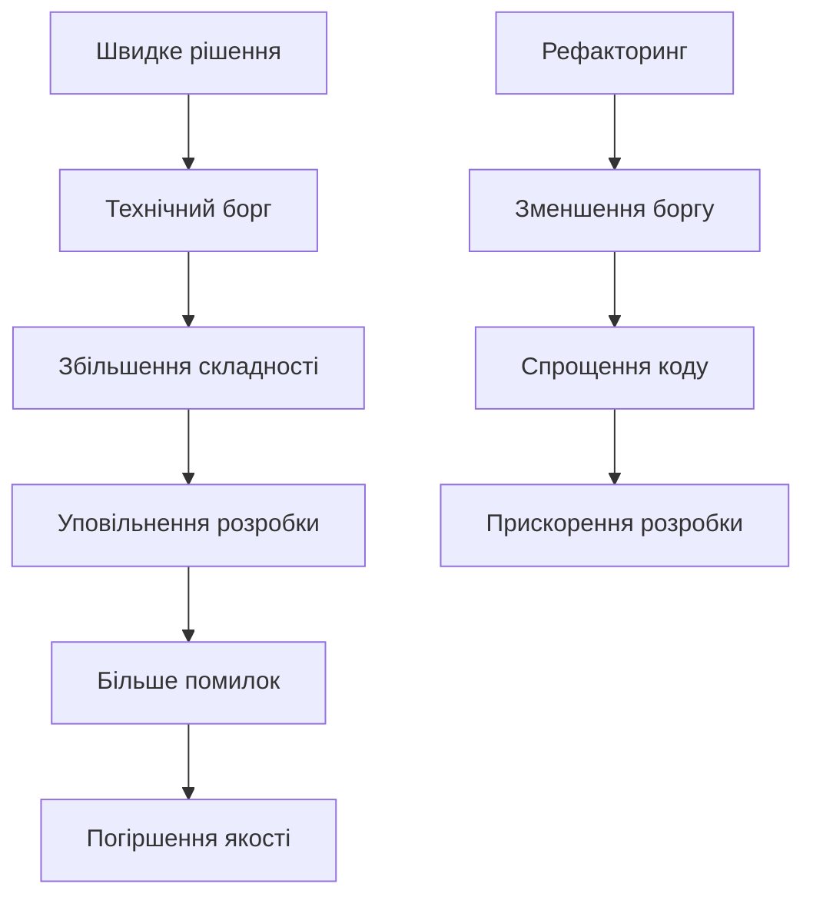
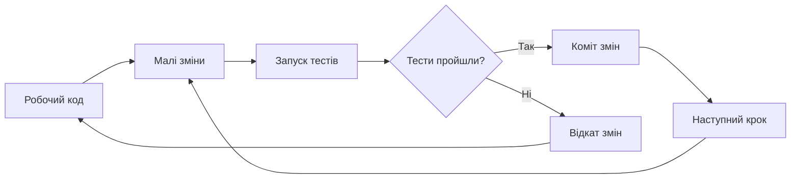

# Лекція 15. Рефакторинг та чистий код

## Вступ

Написання коду, який працює, є лише першим кроком у створенні якісного програмного забезпечення. Код, який легко читати, розуміти та підтримувати, часто є більш цінним за складний, але функціональний код. У професійній розробці програмісти витрачають значно більше часу на читання коду, ніж на його написання: Роберт Мартін оцінює це співвідношення приблизно як десять до одного. Тому якість коду безпосередньо впливає на продуктивність команди та довгострокову життєздатність проєкту.

Упродовж попередніх лекцій ми вивчали, як перевірити, що код працює (тести, лекція 12), як автоматично збирати й доставляти його (CI/CD, лекція 13) і як захистити його від зловмисників (безпека, лекція 14). Усі ці практики працюють значно краще, якщо код добре структурований. Тести легко писати для невеликих функцій із чіткими залежностями, конвеєри швидко проходять для проєкту, який не розростається неконтрольовано, а вразливості легше помітити в коді, який можна прочитати. Тепер зосередимося на самому коді: як писати його чистим і як покращувати вже наявний.

Рефакторинг та практики чистого коду допомагають створювати програмне забезпечення, яке легко розвивається разом із зміною вимог бізнесу. Код, написаний з дотриманням принципів чистоти, зменшує кількість помилок, спрощує тестування та полегшує входження нових членів команди в проєкт. Ця лекція розглядає філософію чистого коду, конкретні техніки рефакторингу та практичні підходи до покращення якості кодової бази, а також те, як ці практики змінюються в епоху ШІ-асистентів. Це остання лекція, присвячена якості самого коду; у заключній лекції курсу ми подивимося, як такий код поводитиметься під навантаженням.

## Основні поняття

- **Чистий код (clean code)** — код, який легко читати, розуміти й змінювати: він ясно виражає наміри автора, не містить зайвої складності та дублювання.
- **Рефакторинг** — зміна внутрішньої структури коду без зміни його зовнішньої поведінки, що виконується малими кроками під захистом тестів.
- **Технічний борг** — метафора для накопичених наслідків швидких, але не оптимальних рішень, за які згодом доводиться «платити відсотки» додатковими зусиллями.
- **Запах коду (code smell)** — ознака в коді, яка вказує на ймовірну проблему в дизайні й слугує сигналом, що варто подумати про рефакторинг.
- **Принцип єдиної відповідальності (SRP)** — кожна функція чи клас має лише одну причину для змін.
- **SOLID** — набір із п'яти принципів об'єктно-орієнтованого проєктування (SRP, OCP, LSP, ISP, DIP), що допомагають створювати гнучкі системи.
- **KISS, YAGNI, DRY** — прості евристики проєктування: не ускладнюй, не додавай того, що поки не потрібно, не дублюй знання.

## Філософія чистого коду

### Що таке чистий код

Чистий код є концепцією, яка виходить за межі просто працюючого коду. Роберт Мартін, автор книги «Clean Code» (2008), описує чистий код як код, який легко читається, як добре написана проза. Схожі думки висловлювали й інші відомі автори: Грейді Буч зазначає, що чистий код простий і прямий, Бьярне Страуструп пов'язує його з елегантністю та ефективністю, а Майкл Фезерс каже, що такий код завжди виглядає так, ніби його писала людина, якій не байдуже. Чистий код виражає наміри програміста ясно та недвозначно, мінімізуючи когнітивне навантаження на тих, хто його читає.

Характеристики чистого коду включають простоту та зрозумілість. Код повинен бути настільки простим, наскільки це можливо, але не простішим. Кожна частина коду виконує одну чітко визначену функцію. Код є виразним, використовуючи значущі імена та структуру, яка відображає бізнес-логіку. Чистий код легко тестується, оскільки має чіткі межі та мінімальні залежності.

Чистий код також передбачає відсутність дублювання. Принцип DRY (Don't Repeat Yourself, «не повторюйся») стверджує, що кожен фрагмент знання повинен мати єдине, недвозначне, авторитетне представлення в системі. Дублювання коду створює проблеми при внесенні змін, оскільки кожне місце з дубльованим кодом потребує окремого оновлення, і одне з них легко забути.

Варто одразу зауважити, що «чистий код» не є набором законів, а радше сукупністю досвіду, яка доповнюється й дискутується. Наприклад, дослідник Джон Оустерхаут у книзі «A Philosophy of Software Design» застерігає, що надмірне дроблення на крихітні функції може розпорошити логіку по десятках місць і зробити код важчим для розуміння. Він пропонує орієнтуватися на «глибокі модулі»: прості інтерфейси, за якими прихована суттєва функціональність. Обидва погляди мають рацію в тому, що метою є зрозумілість, а не механічне дотримання правил. Далі в лекції ви зустрінете конкретні числа (наприклад, «не більше трьох параметрів»), і їх слід сприймати як орієнтири, а не як вимоги.

### Технічний борг

Технічний борг є метафорою, яку запропонував Ворд Каннінгем 1992 року для опису довгострокових наслідків швидких, але не оптимальних рішень у розробці. Подібно до фінансового боргу, технічний борг дозволяє швидше досягти короткострокових цілей, але вимагає постійних платежів у вигляді додаткових зусиль на підтримку та розвиток системи.



Технічний борг може виникати з різних причин. Навмисний борг виникає, коли команда свідомо приймає рішення на користь швидкості замість якості, розуміючи майбутні наслідки. Ненавмисний борг виникає через недостатнє розуміння проблеми або відсутність досвіду. Борг через еволюцію виникає, коли зміна вимог робить попередні рішення застарілими: рішення було слушним, але контекст змінився.

Мартін Фаулер уточнив метафору за допомогою «квадранта технічного боргу», який ділить борг за двома осями: навмисний чи ненавмисний, обачний чи безрозсудний.

| | Навмисний | Ненавмисний |
|---|---|---|
| **Обачний** | «Випускаємо зараз, а недоліки виправимо після релізу» — свідомий компроміс із планом погашення | «Тепер ми знаємо, як слід було зробити» — знання прийшло вже після реалізації |
| **Безрозсудний** | «Ніколи не маємо часу на дизайн» — свідоме нехтування якістю | «А що таке шари архітектури?» — нехтування через брак знань |

Лише обачний борг можна вважати виправданим інструментом: як і фінансовий кредит, він корисний, якщо ви розумієте умови й маєте план повернення. Безрозсудний борг є просто поганим кодом із гарною назвою. Тому відповідь на питання «чи завжди технічний борг є поганим?» — ні, але тільки за умови, що про борг знають і ним керують.

Управління технічним боргом вимагає його постійного відстеження та планомірного погашення. Команди повинні виділяти час на рефакторинг та покращення якості коду поряд з розробкою нових функцій, наприклад, закладаючи частину кожного спринту на погашення боргу та фіксуючи відомі проблеми в трекері завдань. Ігнорування технічного боргу призводить до накопичення проблем, які врешті-решт можуть зробити подальший розвиток системи практично неможливим. У контексті CI/CD (лекція 13) допомагає автоматизація: пороги якості в конвеєрі не дають боргу накопичуватися непомітно.

### Читабельність коду

Код пишеться один раз, але читається багато разів. Інвестиція в читабельність окупається кожного разу, коли хтось відкриває файл для розуміння, налагодження або модифікації коду. Читабельний код зменшує час, необхідний для входження в контекст, та знижує ймовірність помилок при внесенні змін.

Читабельність досягається через послідовність у стилі коду. Команда повинна дотримуватися єдиного стилю форматування, іменування та організації коду. Для Python таким стилем є настанова PEP 8, а сучасні інструменти автоматизують її дотримання: Ruff чи Black для Python, Prettier для JavaScript. Вони усувають суб'єктивність і дискусії про стиль: форматування виконує програма, а не рецензент під час перегляду коду.

Коментарі повинні пояснювати чому, а не що. Код сам по собі повинен бути достатньо виразним, щоб пояснити, що він робить. Коментарі потрібні для пояснення причин прийняття певних рішень, обмежень або неочевидної бізнес-логіки.

```python
# Погано — коментар описує очевидне
# Збільшуємо лічильник на 1
counter += 1

# Добре — коментар пояснює чому
# Додаємо 1 до лічильника для компенсації індексації з нуля
# при відображенні номера сторінки користувачу
counter += 1
```

## Іменування

### Значущі імена

Імена змінних, функцій, класів та інших елементів коду є основним засобом комунікації між програмістами. Добре обрані імена роблять код самодокументованим, зменшуючи потребу в коментарях та полегшуючи розуміння логіки програми.

Імена повинні розкривати наміри. Читаючи назву змінної або функції, програміст повинен розуміти її призначення без необхідності вивчати реалізацію. Замість абревіатур та скорочень, які можуть бути незрозумілими, слід використовувати повні описові назви.

```python
# Погано — незрозумілі абревіатури
def calc(d):
    r = d * 0.1
    return r

# Добре — чіткі, описові імена
def calculate_discount(price):
    discount_rate = 0.1
    discount_amount = price * discount_rate
    return discount_amount
```

Імена повинні бути такими, щоб їх легко було вимовити та обговорювати. Код часто обговорюється в команді, і складні або незрозумілі назви ускладнюють комунікацію (ім'я на кшталт `genymdhms` доведеться «читати» по літерах). Імена повинні бути шуканими, тобто їх легко знайти в кодовій базі за допомогою пошуку: константа `DAYS_IN_WEEK` знаходиться миттєво, а цифра `7` — ні.

У Python діють усталені конвенції PEP 8: змінні та функції називають у стилі `snake_case`, класи в `PascalCase`, константи в `UPPER_CASE`. Дотримання конвенцій мови робить ваш код зрозумілим для будь-якого іншого Python-розробника. Мовою імен у коді за замовчуванням є англійська: так вимагає більшість команд і проєктів, а українські слова, записані латиницею («rozrakhunok»), варто уникати.

### Іменування функцій

Функції виконують дії, тому їх імена зазвичай повинні бути дієсловами або фразами, що починаються з дієслова. Це робить код більш схожим на природну мову та полегшує розуміння потоку виконання програми.

```python
# Погано — неясно, що робить функція
def user(id):
    return database.query(id)

# Добре — дієслово чітко показує дію
def get_user_by_id(user_id):
    return database.query(user_id)

# Добре — булева функція починається з is/has/can
def is_user_authenticated(user):
    return user.session_token is not None

def has_permission(user, resource):
    return resource in user.permissions
```

Імена функцій повинні відповідати рівню абстракції. Високорівневі функції можуть мати більш загальні назви, тоді як низькорівневі функції повинні бути більш конкретними. Довжина імені часто корелює з обсягом області видимості: короткі імена прийнятні для локальних змінних з малою областю видимості (наприклад, `i` у короткому циклі), тоді як публічні API повинні мати більш описові назви.

### Іменування класів та змінних

Класи представляють сутності або концепції, тому їх імена зазвичай є іменниками або іменними фразами. Добра назва класу описує, чим є об'єкт, а не що він робить.

```python
# Погано — назва описує дію, а не сутність
class DataProcessor:
    pass

# Добре — назва описує сутність
class CustomerOrder:
    pass

class PaymentGateway:
    pass
```

Змінні повинні мати імена, які описують їх вміст або призначення. Уникайте загальних назв на кшталт `data`, `info`, `temp`, крім випадків, коли контекст робить їх значення очевидним. Використовуйте конкретні, описові назви, які передають семантику змінної.

```python
# Погано — загальні, непоказові імена
def process(data):
    temp = data + 10
    result = temp * 2
    return result

# Добре — описові імена розкривають логіку
def calculate_final_price(base_price):
    price_with_delivery = base_price + 10
    final_price = price_with_delivery * 2
    return final_price
```

## Функції

### Принцип єдиної відповідальності

Кожна функція повинна робити одну річ і робити її добре. Це один з найважливіших принципів написання чистого коду. Функції з єдиною відповідальністю легше тестувати, розуміти та повторно використовувати. Вони також більш стійкі до змін, оскільки зміна однієї відповідальності не впливає на інші.

```python
# Погано — функція робить занадто багато
def process_user_registration(user_data):
    # Валідація
    if not user_data.get('email'):
        raise ValueError("Email required")

    # Хешування пароля
    password_hash = hash_password(user_data['password'])

    # Збереження в БД
    user = User(
        email=user_data['email'],
        password_hash=password_hash
    )
    database.save(user)

    # Надсилання листа
    send_welcome_email(user.email)

    # Логування
    logger.info(f"User {user.email} registered")

    return user

# Добре — розділення на окремі функції з єдиною відповідальністю
def validate_user_data(user_data):
    if not user_data.get('email'):
        raise ValueError("Email required")
    if not user_data.get('password'):
        raise ValueError("Password required")

def create_user_account(user_data):
    password_hash = hash_password(user_data['password'])
    user = User(
        email=user_data['email'],
        password_hash=password_hash
    )
    database.save(user)
    return user

def complete_user_registration(user):
    send_welcome_email(user.email)
    logger.info(f"User {user.email} registered")

def register_user(user_data):
    validate_user_data(user_data)
    user = create_user_account(user_data)
    complete_user_registration(user)
    return user
```

Зверніть увагу, що функція `register_user` тепер читається як короткий опис процесу: валідація, створення, завершення. Деталі приховані у функціях нижчого рівня. Це і є «один рівень абстракції на функцію»: не змішувати в одній функції високорівневу послідовність кроків і низькорівневі подробиці.

### Розмір функцій

Функції повинні бути короткими. Ідеальна функція займає всього кілька рядків коду. Якщо функція не вміщається на одному екрані без прокрутки, це сигнал, що вона, найімовірніше, робить занадто багато і повинна бути розділена на менші функції. Короткі функції легше розуміти, тестувати та повторно використовувати. Пам'ятайте про застереження Оустерхаута: мета не в максимальній кількості функцій, а в тому, щоб кожну з них можна було зрозуміти без вивчення інших.

Короткі функції природним чином мають одну відповідальність. Коли ви намагаєтеся написати коротку функцію, ви автоматично виділяєте окремі блоки логіки в окремі функції. Це створює ієрархію абстракцій, де високорівневі функції викликають низькорівневі, створюючи зрозумілу структуру програми.

```python
# Погано — довга функція з багатьма рівнями абстракції
def generate_report(data):
    # Підготовка даних
    filtered_data = []
    for item in data:
        if item['status'] == 'active':
            filtered_data.append(item)

    # Обчислення статистики
    total = 0
    for item in filtered_data:
        total += item['value']
    average = total / len(filtered_data) if filtered_data else 0

    # Форматування виводу
    report = f"Report Generated: {datetime.now()}\n"
    report += f"Total Items: {len(filtered_data)}\n"
    report += f"Average Value: {average:.2f}\n"

    return report

# Добре — розділення на функції з чіткими відповідальностями
def filter_active_items(data):
    return [item for item in data if item['status'] == 'active']

def calculate_average_value(items):
    if not items:
        return 0
    total = sum(item['value'] for item in items)
    return total / len(items)

def format_report_header():
    return f"Report Generated: {datetime.now()}\n"

def format_report_statistics(items, average):
    return f"Total Items: {len(items)}\nAverage Value: {average:.2f}\n"

def generate_report(data):
    active_items = filter_active_items(data)
    average = calculate_average_value(active_items)

    report = format_report_header()
    report += format_report_statistics(active_items, average)

    return report
```

### Параметри функцій

Кількість параметрів функції повинна бути мінімальною. Ідеально, якщо функція має нуль параметрів, один або два параметри є прийнятними, три параметри потребують особливого обґрунтування, а чотири чи більше параметрів слід уникати. Велика кількість параметрів ускладнює розуміння функції та збільшує кількість можливих комбінацій вхідних даних, які потрібно тестувати.

Коли функція потребує багато параметрів, це часто сигнал, що вона робить занадто багато або що параметри природним чином групуються в об'єкт. Створення об'єкта або структури даних для групування пов'язаних параметрів робить код більш читабельним та гнучким. У сучасному Python для цього зручно використовувати `dataclass`: він автоматично генерує конструктор та інші службові методи, тож опис структури даних займає кілька рядків.

```python
# Погано — забагато параметрів
def create_user(
    email, password, first_name, last_name,
    phone, address, city, country, postal_code
):
    # Складно зрозуміти порядок параметрів
    pass

# Добре — групування пов'язаних параметрів
from dataclasses import dataclass

@dataclass
class PersonalInfo:
    first_name: str
    last_name: str
    phone: str

@dataclass
class AddressInfo:
    address: str
    city: str
    country: str
    postal_code: str

@dataclass
class UserData:
    email: str
    password: str
    personal_info: PersonalInfo
    address_info: AddressInfo

def create_user(user_data: UserData):
    # Чітка структура даних, легко розширювати
    pass
```

Крім того, у Python є ще один інструмент: іменовані аргументи. Виклик `create_user(email="a@b.ua", country="UA")` читається краще за позиційний, а прапорець `*` у сигнатурі (`def f(*, email, country)`) вимагає обов'язково вказувати імена.

Булеві прапорці як параметри зазвичай є поганою практикою, оскільки вони вказують, що функція робить більше однієї речі. Замість передачі булевого прапорця, краще створити дві окремі функції з виразними назвами.

```python
# Погано — булевий прапорець змінює поведінку
def render_user(user, include_details=False):
    if include_details:
        return render_detailed_user(user)
    else:
        return render_basic_user(user)

# Добре — окремі функції з чіткими намірами
def render_basic_user(user):
    return f"{user.name}"

def render_detailed_user(user):
    return f"{user.name}\n{user.email}\n{user.phone}"
```

## Коментарі та документація

### Коли писати коментарі

Коментарі не завжди є ознакою доброго коду. Часто потреба в коментарях вказує на те, що код недостатньо виразний і потребує рефакторингу. Ідеальний код є самодокументованим через виразні назви та чітку структуру. Однак є ситуації, коли коментарі дійсно додають цінності.

Коментарі корисні для пояснення причин прийняття нестандартних рішень. Якщо код реалізує обхідний шлях для специфічної проблеми або використовує незвичайний підхід через певні обмеження, коментар повинен пояснити чому.

```python
from decimal import Decimal

# Добре — пояснює нестандартне рішення
def calculate_price(items):
    # Використовуємо Decimal замість float для грошових обчислень,
    # щоб уникнути проблем з округленням, які можуть виникнути
    # при роботі з дробовими числами
    return sum(Decimal(str(item.price)) for item in items)
```

Коментарі важливі для документування складних алгоритмів або бізнес-правил, які не можуть бути виражені виключно через код. Якщо алгоритм базується на специфічній математичній формулі або бізнес-логіці, коментар з поясненням або посиланням на джерело інформації є цінним.

```python
# Добре — документація складного алгоритму
def calculate_shipping_cost(weight, distance, is_express):
    """
    Розрахунок вартості доставки на основі формули:
    base_cost = (weight * 0.5) + (distance * 0.1)

    Експрес-доставка збільшує вартість на 50% згідно з
    бізнес-правилами від 15.03.2024 (див. SHIP-234)
    """
    base_cost = (weight * 0.5) + (distance * 0.1)
    if is_express:
        return base_cost * 1.5
    return base_cost
```

### Чого уникати в коментарях

Коментарі, які описують очевидні речі, створюють шум і зменшують читабельність коду. Якщо код говорить сам за себе, коментар не потрібен. Особливо шкідливі коментарі, які просто перефразовують код іншими словами без додавання нової інформації.

```python
# Погано — коментар не додає інформації
# Отримуємо користувача з бази даних
user = database.get_user(user_id)

# Перевіряємо чи користувач активний
if user.is_active:
    # Повертаємо true
    return True

# Добре — код говорить сам за себе, коментарі не потрібні
user = database.get_user(user_id)
if user.is_active:
    return True
```

Закоментований код ніколи не повинен залишатися в кодовій базі. Системи контролю версій зберігають історію всіх змін, тому немає потреби зберігати старий код у коментарях на всяк випадок. Закоментований код створює плутанину та змушує читачів гадати, чому він там і чи має він якесь значення.

Застарілі або неточні коментарі гірші за відсутність коментарів. Коли код змінюється, а коментарі не оновлюються, вони стають джерелом неправдивої інформації, яка може ввести в оману розробників. Якщо ви змінюєте код, обов'язково оновіть відповідні коментарі або видаліть їх, якщо вони більше не актуальні. Коментар, потреба в якому виникла лише через незрозумілу назву чи надто складну функцію, слід вважати запахом коду (про це далі): краще виправити причину, ніж пояснювати наслідки.

### Docstrings та документація API

Публічні API, бібліотеки та модулі повинні мати якісну документацію. Рядки документації Python (docstrings), JavaDoc, JSDoc та подібні інструменти дозволяють документувати інтерфейси безпосередньо в коді. Ця документація повинна описувати, що робить функція, які параметри вона приймає, що повертає та які виключення може викинути. У сучасному Python до цього додаються анотації типів, які самі по собі документують очікувані типи й перевіряються інструментами на кшталт mypy.

```python
def calculate_discount(
    price: float,
    discount_percent: int,
    max_discount: float | None = None,
) -> float:
    """
    Розраховує остаточну ціну товару після знижки.

    Args:
        price: Початкова ціна товару в гривнях.
        discount_percent: Відсоток знижки (0-100).
        max_discount: Максимальна сума знижки.
            Якщо None, обмеження не застосовується.

    Returns:
        Остаточна ціна після застосування знижки.

    Raises:
        ValueError: Якщо discount_percent не в діапазоні 0-100.
        ValueError: Якщо price від'ємна.

    Examples:
        >>> calculate_discount(100, 10)
        90.0
        >>> calculate_discount(100, 50, max_discount=40)
        60.0
    """
    if not 0 <= discount_percent <= 100:
        raise ValueError("Discount must be between 0 and 100")
    if price < 0:
        raise ValueError("Price cannot be negative")

    discount = price * (discount_percent / 100)

    if max_discount is not None:
        discount = min(discount, max_discount)

    return price - discount
```

Зверніть увагу: після додавання анотацій типів у docstring уже немає потреби повторювати типи в дужках (`price (float)`), достатньо змістовного опису. Приклади в секції `Examples` можна автоматично перевіряти командою `python -m doctest`, тож вони не застарівають непомітно.

## Рефакторинг

### Що таке рефакторинг

Рефакторинг є процесом зміни внутрішньої структури коду без зміни його зовнішньої поведінки. Це дисциплінована техніка реструктуризації коду через серію малих змін, кожна з яких зберігає функціональність системи. Рефакторинг не додає нових функцій і не виправляє помилки, він покращує дизайн існуючого коду. Класичним джерелом є книга Мартіна Фаулера «Refactoring» (друге видання 2018 року), де каталогізовано десятки прийомів із назвами.

Ключова відмінність рефакторингу від переписування полягає в підході. Рефакторинг відбувається поступово, крок за кроком, з постійною перевіркою, що система продовжує працювати правильно після кожної зміни. Це дозволяє зберігати систему в робочому стані на всіх етапах покращення коду. Переписування «з нуля», навпаки, на тривалий час залишає систему без робочої версії та часто втрачає накопичені знання про крайні випадки, закладені в старому коді.



Рефакторинг повинен підтримуватися всебічним тестуванням (лекція 12). Тести гарантують, що зміни в структурі коду не порушують функціональності. Без тестів рефакторинг стає ризикованим, оскільки немає автоматизованого способу перевірити, що поведінка системи залишилася незмінною. Що робити, якщо тестів у застарілому коді немає? Тоді спочатку пишуть «фіксуючі» тести (characterization tests), які просто записують поточну поведінку коду, якою б вона не була, і лише після цього починають рефакторинг. Сучасні IDE (PyCharm, VS Code та інші) також мають вбудовані автоматичні рефакторинги (перейменування, виділення методу), які змінюють код у всіх місцях узгоджено й тим самим безпечніші за ручне редагування.

### Коли рефакторити

Рефакторинг не є окремою фазою розробки, а інтегрованою частиною щоденної роботи програміста. Правило бойскаутів стверджує: завжди залишай код чистішим, ніж ти його знайшов. Навіть невеликі покращення, зроблені регулярно, накопичуються з часом і значно покращують якість кодової бази.

Перед додаванням нової функціональності часто корисно відрефакторити існуючий код, щоб нова функція природно вписалася в архітектуру. Це може включати виділення спільного коду, перейменування методів для кращої виразності або реорганізацію класів для покращення структури. Відомий вислів Кента Бека: «Спочатку зроби зміну легкою (це може бути складно), потім зроби легку зміну».

Під час рецензування коду також є хорошим моментом для ідентифікації можливостей рефакторингу. Свіжий погляд часто помічає можливості для покращення, які автор коду міг пропустити. Однак важливо збалансувати між покращенням коду та своєчасною доставкою функціональності. Одне з практичних правил: не змішуйте рефакторинг і зміну поведінки в одному коміті чи запиті на злиття, тоді рецензент бачить, що змінилась лише структура, а помилку легше відшукати.

### Запахи коду

Як зрозуміти, що код потребує рефакторингу? Допомагає поняття «запах коду» (code smell), яке ввели Кент Бек і Мартін Фаулер. Запах не є помилкою: код може працювати правильно, але певна ознака вказує на глибшу проблему в дизайні. Запахи слугують чутливим індикатором, який підказує, куди подивитися.

| Запах | Ознака | Типовий прийом рефакторингу |
|---|---|---|
| Довга функція | Не вміщається на екрані, кілька рівнів абстракції, коментарі-«заголовки» всередині | Виділення методу |
| Великий клас | Клас має багато полів і методів, робить «все» | Виділення класу (SRP) |
| Довгий список параметрів | Чотири й більше параметрів | Введення об'єкта-параметра |
| Дублювання коду | Однакові чи майже однакові фрагменти в різних місцях | Виділення спільної функції |
| Магічні числа | Літерали з неочевидним змістом | Заміна іменованою константою |
| «Заздрість до чужих даних» (feature envy) | Метод активно працює з даними іншого класу, а не власними | Перенесення методу |
| Примітивна одержимість (primitive obsession) | Складні поняття (гроші, адреса, телефон) подано рядками та числами | Введення власного типу |
| «Хірургія дробовиком» (shotgun surgery) | Одна логічна зміна вимагає правок у багатьох місцях | Зведення розпорошеної логіки разом |
| Мертвий код | Функції, гілки та змінні, що ніколи не виконуються | Видалення |
| Коментар-милиця | Коментар пояснює заплутаний код замість того, щоб його виправити | Перейменування, виділення методу |

Запах — це привід замислитися, а не автоматичний вирок: іноді довга функція є цілком виправданою (наприклад, послідовний лінійний сценарій без розгалужень). Але якщо вам щоразу доводиться пояснювати колегам, що «цей шматок краще не чіпати», це вже добра підстава для рефакторингу.

### Техніки рефакторингу

Виділення методу є однією з найпоширеніших та найкорисніших технік рефакторингу. Коли ви бачите фрагмент коду, який може бути згрупований разом, виділіть його в окремий метод з назвою, яка пояснює його призначення.

```python
# До рефакторингу
def print_invoice(invoice):
    print("*" * 50)
    print(f"Invoice #{invoice.number}")
    print(f"Date: {invoice.date}")
    print("*" * 50)

    for item in invoice.items:
        print(f"{item.name}: ${item.price}")

    total = sum(item.price for item in invoice.items)
    tax = total * 0.2

    print("-" * 50)
    print(f"Subtotal: ${total}")
    print(f"Tax: ${tax}")
    print(f"Total: ${total + tax}")

# Після рефакторингу — виділення методів
def print_invoice(invoice):
    print_header(invoice)
    print_items(invoice.items)
    print_totals(invoice)

def print_header(invoice):
    print("*" * 50)
    print(f"Invoice #{invoice.number}")
    print(f"Date: {invoice.date}")
    print("*" * 50)

def print_items(items):
    for item in items:
        print(f"{item.name}: ${item.price}")

def print_totals(invoice):
    total = calculate_subtotal(invoice.items)
    tax = calculate_tax(total)

    print("-" * 50)
    print(f"Subtotal: ${total}")
    print(f"Tax: ${tax}")
    print(f"Total: ${total + tax}")

def calculate_subtotal(items):
    return sum(item.price for item in items)

def calculate_tax(amount):
    return amount * 0.2
```

Заміна магічних чисел на іменовані константи покращує читабельність та полегшує внесення змін. Магічні числа є літералами, які мають специфічне значення, але це значення не є очевидним з контексту.

```python
# До рефакторингу
def calculate_employee_bonus(salary, years_of_service):
    if years_of_service >= 5:
        return salary * 0.1
    elif years_of_service >= 3:
        return salary * 0.05
    else:
        return salary * 0.02

# Після рефакторингу
SENIOR_EMPLOYEE_YEARS = 5
MID_LEVEL_EMPLOYEE_YEARS = 3
SENIOR_BONUS_RATE = 0.1
MID_LEVEL_BONUS_RATE = 0.05
JUNIOR_BONUS_RATE = 0.02

def calculate_employee_bonus(salary, years_of_service):
    if years_of_service >= SENIOR_EMPLOYEE_YEARS:
        return salary * SENIOR_BONUS_RATE
    elif years_of_service >= MID_LEVEL_EMPLOYEE_YEARS:
        return salary * MID_LEVEL_BONUS_RATE
    else:
        return salary * JUNIOR_BONUS_RATE
```

Спрощення умовних виразів робить логіку програми більш зрозумілою. Складні булеві вирази можна розбити на окремі змінні з виразними назвами або виділити в окремі функції. Окрім того, замість глибоко вкладених `if` корисно застосовувати «охоронні умови» (guard clauses): спочатку відсіяти нестандартні випадки раннім поверненням, а основну логіку залишити без зайвих відступів.

```python
# До рефакторингу
def should_send_notification(user, message):
    if user.is_active and user.email_verified and \
       not user.notifications_disabled and \
       message.priority >= 3:
        return True
    return False

# Після рефакторингу
IMPORTANT_PRIORITY_THRESHOLD = 3

def should_send_notification(user, message):
    return (
        is_user_eligible_for_notifications(user)
        and is_message_important(message)
    )

def is_user_eligible_for_notifications(user):
    return (
        user.is_active
        and user.email_verified
        and not user.notifications_disabled
    )

def is_message_important(message):
    return message.priority >= IMPORTANT_PRIORITY_THRESHOLD
```

```python
# Охоронні умови — замість вкладених if
def get_discount(user, order):
    if user is None:
        return 0
    if not user.is_active:
        return 0
    if order.total < 1000:
        return 0

    # Основна логіка без вкладеності
    return order.total * 0.05
```

Зверніть увагу, що конструкція `if умова: return True; return False` завжди спрощується до `return умова`, що й зроблено в прикладі вище.

## Принципи проєктування

### SOLID принципи в контексті чистого коду

SOLID є акронімом п'яти принципів об'єктно-орієнтованого проєктування, які допомагають створювати більш гнучкі та підтримувані системи. Ці принципи тісно пов'язані з концепцією чистого коду та є основою якісної архітектури програмного забезпечення. Розглянемо кожен із них.

**S — Single Responsibility Principle (принцип єдиної відповідальності)** стверджує, що клас повинен мати лише одну причину для зміни. Це означає, що клас повинен мати лише одну відповідальність або роль в системі. Коли клас робить занадто багато, зміни в одній частині функціональності можуть непередбачувано вплинути на іншу частину.

```python
# Порушення SRP — клас робить занадто багато
class User:
    def __init__(self, name, email):
        self.name = name
        self.email = email

    def save_to_database(self):
        # Робота з базою даних
        pass

    def send_welcome_email(self):
        # Надсилання листа
        pass

    def generate_report(self):
        # Генерація звіту
        pass

# Дотримання SRP — розділення відповідальностей
class User:
    def __init__(self, name, email):
        self.name = name
        self.email = email

class UserRepository:
    def save(self, user):
        # Робота з базою даних
        pass

class EmailService:
    def send_welcome_email(self, user):
        # Надсилання листа
        pass

class ReportGenerator:
    def generate_user_report(self, user):
        # Генерація звіту
        pass
```

**O — Open-Closed Principle (принцип відкритості/закритості)** стверджує, що програмні сутності повинні бути відкриті для розширення, але закриті для модифікації. Це означає, що ви повинні мати можливість додавати нову функціональність без зміни існуючого коду.

```python
import math
from abc import ABC, abstractmethod

# Порушення OCP — потрібно змінювати клас для додавання нової фігури
class AreaCalculator:
    def calculate_area(self, shape):
        if isinstance(shape, Rectangle):
            return shape.width * shape.height
        elif isinstance(shape, Circle):
            return math.pi * shape.radius ** 2
        # Потрібно додавати нові умови для кожної фігури

# Дотримання OCP — використання поліморфізму
class Shape(ABC):
    @abstractmethod
    def calculate_area(self):
        pass

class Rectangle(Shape):
    def __init__(self, width, height):
        self.width = width
        self.height = height

    def calculate_area(self):
        return self.width * self.height

class Circle(Shape):
    def __init__(self, radius):
        self.radius = radius

    def calculate_area(self):
        return math.pi * self.radius ** 2

class AreaCalculator:
    def calculate_total_area(self, shapes):
        return sum(shape.calculate_area() for shape in shapes)
```

**L — Liskov Substitution Principle (принцип підстановки Ліскоу)** вимагає, щоб об'єкти підкласу можна було використовувати замість об'єктів базового класу без порушення коректності програми. Підклас не повинен «скасовувати» поведінку, яку обіцяє базовий клас, чи вимагати від клієнта більшого, ніж вимагав базовий клас.

```python
# Порушення LSP — Penguin обіцяє вміти літати, але не вміє
class Bird:
    def fly(self):
        return "Летить"

class Penguin(Bird):
    def fly(self):
        raise NotImplementedError("Пінгвіни не літають")

def make_birds_fly(birds: list[Bird]):
    for bird in birds:
        bird.fly()  # впаде на пінгвіні

# Дотримання LSP — базовий тип не обіцяє зайвого
class Bird:
    pass

class FlyingBird(Bird):
    def fly(self):
        return "Летить"

class Penguin(Bird):
    def swim(self):
        return "Пливе"
```

Ознакою порушення LSP є код, який перевіряє конкретний тип об'єкта (`isinstance`) або підклас, що кидає виняток замість реалізації методу, успадкованого від батьківського класу.

**I — Interface Segregation Principle (принцип розділення інтерфейсів)** стверджує, що клієнт не повинен залежати від методів, які він не використовує. Замість одного великого інтерфейсу краще кілька малих, спеціалізованих. У Python для опису таких контрактів зручні протоколи (`typing.Protocol`).

```python
from typing import Protocol

# Порушення ISP — один великий інтерфейс змушує реалізовувати зайве
class MultiFunctionDevice(Protocol):
    def print_document(self, doc): ...
    def scan_document(self, doc): ...
    def send_fax(self, doc): ...

# Дотримання ISP — малі інтерфейси, які комбінуються за потреби
class Printer(Protocol):
    def print_document(self, doc): ...

class Scanner(Protocol):
    def scan_document(self, doc): ...

class SimplePrinter:
    def print_document(self, doc):
        print(f"Друк: {doc}")
```

**D — Dependency Inversion Principle (принцип інверсії залежностей)** стверджує, що модулі високого рівня не повинні залежати від модулів низького рівня, обидва мають залежати від абстракцій. На практиці це означає, що бізнес-логіка працює з абстрактним інтерфейсом (наприклад, «сховище користувачів» чи «служба сповіщень»), а конкретна реалізація (PostgreSQL, SMTP) підставляється ззовні. Цей принцип реалізується через впровадження залежностей, про яке йтиметься в розділі про організацію коду, і саме він робить можливим підставлення тестових дублерів із лекції 12.

```python
from typing import Protocol

class Notifier(Protocol):
    def send(self, recipient: str, text: str) -> None: ...

class EmailNotifier:
    def send(self, recipient: str, text: str) -> None:
        ...  # надсилання листа

class OrderService:
    # Залежить від абстракції Notifier, а не від конкретного EmailNotifier
    def __init__(self, notifier: Notifier):
        self.notifier = notifier

    def complete_order(self, order):
        ...
        self.notifier.send(order.customer_email, "Замовлення виконано")
```

Не сприймайте SOLID як догму. Це евристики, які допомагають помітити проблеми проєктування, а їх механічне застосування «на всяк випадок» породжує надлишкову складність, з якою борються наступні два принципи.

### KISS та YAGNI

Keep It Simple, Stupid, або KISS, є принципом, який закликає зберігати рішення простими. Складність є ворогом чистого коду. Прості рішення легше зрозуміти, протестувати, підтримувати та модифікувати. Часто розробники створюють надмірно складні рішення, передбачаючи майбутні потреби, які можуть ніколи не виникнути.

Принцип YAGNI (You Aren't Gonna Need It, «вам це не знадобиться») тісно пов'язаний з KISS. Він стверджує, що ви не повинні додавати функціональність, поки вона не є справді необхідною. Передчасна оптимізація та проєктування для гіпотетичних майбутніх вимог часто призводять до непотрібної складності.

```python
# Погано — надмірно складне рішення для простої задачі
class ConfigurationManagerFactory:
    @staticmethod
    def create_configuration_manager(config_type):
        if config_type == 'json':
            return JSONConfigurationManager(
                FileSystemConfigurationLoader(),
                ConfigurationValidator(),
                ConfigurationCacheManager()
            )
        # Ще багато коду для інших типів...

# Добре — просте рішення для поточних потреб
import json

def load_config(filepath):
    with open(filepath) as f:
        return json.load(f)

# Якщо в майбутньому знадобиться більше функціональності,
# її можна додати поступово
```

### DRY та DAMP у тестах

Принцип DRY є фундаментальним для виробничого коду, але в тестах іноді краще дотримуватися DAMP (Descriptive And Meaningful Phrases, «описові та змістовні фрази»). Тести повинні бути самодостатніми та легко зрозумілими, навіть якщо це означає деяке дублювання коду. Тест, який читається зверху вниз без переходів до допоміжних функцій, значно легше зрозуміти, коли він падає.

```python
# DRY-підхід у тестах — може бути незрозумілим
class TestUserService:
    def setup(self):
        self.user = create_test_user()
        self.service = UserService()

    def test_user_creation(self):
        result = self.service.create(self.user)
        assert_user_valid(result)

    def test_user_update(self):
        result = self.service.update(self.user)
        assert_user_valid(result)

# DAMP-підхід — більш читабельний та явний
class TestUserService:
    def test_creates_user_with_valid_email(self):
        # Arrange
        user_data = {
            'email': 'test@example.com',
            'name': 'Test User'
        }
        service = UserService()

        # Act
        user = service.create(user_data)

        # Assert
        assert user.email == 'test@example.com'
        assert user.name == 'Test User'
        assert user.id is not None

    def test_updates_user_name(self):
        # Arrange
        user = User(id=1, email='test@example.com', name='Old Name')
        service = UserService()

        # Act
        updated_user = service.update_name(user, 'New Name')

        # Assert
        assert updated_user.name == 'New Name'
        assert updated_user.email == 'test@example.com'
```

Ще одне застереження щодо DRY: усунення дублювання без розуміння його причини може шкодити. Якщо два фрагменти коду однакові випадково, а змінюватимуться з різних причин, їх об'єднання створить зайву зв'язаність: зміна для одного випадку зламає інший. Тому існує практичне правило «трьох повторень»: спершу допустити дублювання, а виділяти спільну абстракцію, коли закономірність проявилася кілька разів.

## Організація коду

### Структура проєкту

Добре організована структура проєкту полегшує навігацію по кодовій базі та допомагає підтримувати чіткі межі між модулями. Структура повинна відображати архітектуру застосунку та робити взаємозв'язки між компонентами очевидними.

```
project/
├── src/
│   ├── domain/          # Бізнес-логіка та моделі
│   │   ├── models/
│   │   ├── services/
│   │   └── repositories/
│   ├── api/             # HTTP endpoints
│   │   ├── controllers/
│   │   ├── middlewares/
│   │   └── validators/
│   ├── infrastructure/  # Технічні деталі
│   │   ├── database/
│   │   ├── cache/
│   │   └── email/
│   └── utils/           # Допоміжні функції
├── tests/               # Тести
│   ├── unit/
│   ├── integration/
│   └── e2e/
├── config/              # Конфігурація
└── docs/                # Документація
```

Модулі повинні мати чіткі інтерфейси та мінімальні залежності. Високорівневі модулі не повинні залежати від низькорівневих деталей реалізації (принцип інверсії залежностей). Використання принципів чистої архітектури допомагає зберігати бізнес-логіку незалежною від фреймворків, баз даних та інших технічних деталей. Не варто сліпо копіювати наведену структуру: для невеликого проєкту достатньо кількох файлів, а поділ на шари має з'являтися тоді, коли в ньому виникає реальна потреба (знову YAGNI).

### Управління залежностями

Явні залежності роблять код більш тестованим та гнучким. Замість створення залежностей всередині класу, вони повинні передаватися ззовні, зазвичай через конструктор. Цей прийом називається впровадженням залежностей (dependency injection). Він дозволяє легко замінювати реальні імплементації на тестові дублери (моки, стаби, фейки) в тестах.

```python
# Погано — неявні залежності
class UserService:
    def __init__(self):
        self.database = Database()           # Жорстка залежність
        self.email_service = EmailService()  # Жорстка залежність

    def register_user(self, user_data):
        user = self.database.save(user_data)
        self.email_service.send_welcome(user)
        return user

# Добре — явні залежності через впровадження
class UserService:
    def __init__(self, user_repository, email_service):
        self.user_repository = user_repository
        self.email_service = email_service

    def register_user(self, user_data):
        user = self.user_repository.save(user_data)
        self.email_service.send_welcome(user)
        return user

# Легко тестувати з mock-об'єктами
from unittest.mock import Mock

def test_register_user():
    mock_repository = Mock()
    mock_email = Mock()
    service = UserService(mock_repository, mock_email)

    service.register_user({'email': 'test@example.com'})

    mock_repository.save.assert_called_once()
    mock_email.send_welcome.assert_called_once()
```

Зверніть увагу, що для перевірки викликів використовуються `assert_called_once()`, а не атрибут `.called`: перший спосіб дає зрозуміле повідомлення при падінні тесту та перевіряє кількість викликів. У невеликих застосунках вручну передавати залежності через конструктор достатньо; у великих використовують контейнери залежностей, які збирають об'єкти автоматично.

## Обробка помилок

### Використання виключень

Виключення є кращим способом обробки помилок, ніж коди помилок. Вони роблять код більш читабельним, відокремлюючи нормальний потік виконання від обробки помилок. Код, який може генерувати помилки, стає більш очевидним та легшим для розуміння. Python до того ж заохочує стиль EAFP («легше попросити пробачення, ніж дозволу»): виконати дію й обробити виняток, ніж заздалегідь перевіряти всі можливі умови.

```python
# Погано — використання кодів помилок
def divide(a, b):
    if b == 0:
        return None, "Division by zero"
    return a / b, None

result, error = divide(10, 0)
if error:
    print(error)
else:
    print(result)

# Добре — використання виключень
def divide(a, b):
    if b == 0:
        raise ValueError("Cannot divide by zero")
    return a / b

try:
    result = divide(10, 0)
    print(result)
except ValueError as e:
    print(f"Error: {e}")
```

Виключення повинні бути специфічними та інформативними. Замість загальних виключень створюйте власні класи виключень для різних типів помилок. Це дозволяє більш точно обробляти різні ситуації та надає краще розуміння причин помилок. Уникайте «голого» `except:` та надто широкого `except Exception:`, які «ковтають» усе підряд разом із помилками програмування, а якщо потрібно перетворити виняток на інший, зберігайте оригінальну причину за допомогою `raise NewError(...) from e`.

```python
import logging

logger = logging.getLogger(__name__)

class UserNotFoundError(Exception):
    def __init__(self, user_id):
        self.user_id = user_id
        super().__init__(f"User with ID {user_id} not found")

class InsufficientPermissionsError(Exception):
    def __init__(self, user, action):
        self.user = user
        self.action = action
        super().__init__(
            f"User {user.email} does not have permission to {action}"
        )

def get_user(user_id):
    user = database.find(user_id)
    if not user:
        raise UserNotFoundError(user_id)
    return user

def show_profile(user_id):
    try:
        user = get_user(user_id)
    except UserNotFoundError as e:
        logger.warning("User lookup failed: %s", e)
        return None
    return render_profile(user)
```

Обробка помилок має й аспект безпеки, який ми бачили в лекції 14: у списку OWASP Top 10:2025 з'явилася окрема категорія неправильної обробки виняткових ситуацій. Помилка не повинна «відкривати» доступ (наприклад, при збої перевірки прав система має за замовчуванням відмовляти) і не повинна показувати користувачеві внутрішні подробиці (трасування стека, тексти SQL-запитів).

### Fail Fast принцип

Принцип швидкої відмови (Fail Fast) стверджує, що система повинна виявляти та повідомляти про помилки якомога раніше. Замість продовження роботи з невалідними даними, що може призвести до непередбачуваних наслідків, система повинна негайно зупинитися та повідомити про проблему. Виявити помилку відразу на вході значно легше, ніж розслідувати, чому через годину «десь глибоко» замовлення виявилося порожнім.

```python
# Погано — тихий збій, проблема виявиться пізніше
def process_order(order):
    # Не перевіряємо валідність
    calculate_total(order.items)
    charge_customer(order.customer, order.total)
    # Може виникнути помилка набагато пізніше

# Добре — рання валідація з явними помилками
def process_order(order):
    if not order.items:
        raise ValueError("Order must contain at least one item")
    if not order.customer:
        raise ValueError("Order must have a customer")
    if not order.customer.payment_method:
        raise ValueError("Customer must have a payment method")

    total = calculate_total(order.items)
    charge_customer(order.customer, total)
```

## Чистий код в епоху ШІ-асистентів

Інструменти на основі великих мовних моделей (GitHub Copilot, Claude Code, Cursor та інші) змінили те, як пишеться код: значну частину коду тепер створює не людина, а модель за її запитом. Чи робить це принципи чистого коду менш важливими? Радше навпаки, і ось чому.

По-перше, код, згенерований за секунди, все одно потрібно **прочитати та зрозуміти** людині, яка за нього відповідає. Асистент дуже швидко виробляє багато коду, і вузьким місцем стає рецензування. Читабельний, послідовний код з хорошими іменами й невеликими функціями перевіряти набагато легше, ніж «полотно» на кілька сотень рядків. Отже, значення читабельності зростає: код, який ви не можете прочитати, ви не можете відповідально схвалити.

По-друге, моделі мають типові слабкості: вони схильні генерувати надлишковий код, дублювати схожі фрагменти замість повторного використання наявних, додавати непотрібні абстракції та не знають неявних домовленостей вашого проєкту. Це означає, що ШІ-асистент може непомітно збільшувати технічний борг швидше, ніж людина. Хорошою практикою є ставити асистентові невеликі, чітко сформульовані завдання, описувати в конфігураційних файлах проєкту прийняті конвенції, просити його враховувати наявні функції, а результат обов'язково рецензувати.

По-третє, ШІ-асистенти можуть допомагати з самим рефакторингом: пропонувати виділення функцій, перейменування, генерувати фіксуючі тести для успадкованого коду. Але тут особливо важливі тести (лекція 12): без них ви не можете перевірити, що поведінка справді не змінилася. Правило залишається таким самим, як і для ручного рефакторингу: малі кроки, автоматична перевірка після кожного, окремий коміт.

Нарешті, відповідальність за код завжди лишається за людиною. Слова «це згенерував асистент» не є виправданням для вразливості, помилки чи нечитабельного коду в проєкті. Автоматичні перевірки якості й безпеки в конвеєрі (лекції 13 і 14) однаково поширюються на будь-який код, незалежно від його походження.

## Висновки

Чистий код та рефакторинг є фундаментальними навичками професійного розробника програмного забезпечення. Вони не є додатковими опціями або розкішшю, а необхідною частиною створення довгострокових, підтримуваних систем. Інвестиції в якість коду окупаються через зменшення часу на розробку нових функцій, полегшення виявлення та виправлення помилок, покращення можливості тестування та підвищення задоволеності розробників від роботи з кодом.

Шлях до майстерності в написанні чистого коду вимагає постійної практики та свідомих зусиль. Кожен написаний рядок коду є можливістю застосувати принципи, описані в цій лекції. З часом ці практики стають другою натурою, і написання чистого коду стає природним способом роботи. Водночас принципи, від SOLID до «коротких функцій», є евристиками, які потрібно застосовувати з розумінням мети: зрозумілості й простоти змін.

Важливо пам'ятати, що чистий код не означає досконалий код. Мета полягає в постійному покращенні, а не в досягненні ідеалу. Правило бойскаутів, залишати код трохи чистішим, ніж ви його знайшли, є практичним підходом до поступового підвищення якості кодової бази. Навіть невеликі покращення, зроблені регулярно, накопичуються з часом і призводять до значних результатів. Тести, автоматизація й рецензування, розглянуті в попередніх лекціях, є тією страховкою, яка дозволяє змінювати код сміливо.

## Питання для самоперевірки

1. У чому різниця між технічним боргом та поганим кодом? Чи завжди технічний борг є негативним явищем? Поясніть на прикладі квадранта боргу.
2. Які характеристики має функція з єдиною відповідальністю? Наведіть приклад функції, яка порушує цей принцип.
3. Чому довгі списки параметрів вважаються проблемою? Які підходи можна використати для їх скорочення?
4. Що таке запах коду? Назвіть три запахи й відповідні прийоми рефакторингу.
5. Коли коментарі справді додають цінності до коду, а коли вони є запахом коду?
6. Що таке рефакторинг і чим він відрізняється від переписування коду з нуля? Яку роль відіграють тести?
7. Поясніть кожну літеру SOLID коротким прикладом. Який принцип порушує підклас, що кидає `NotImplementedError` замість реалізації методу?
8. Чому принцип KISS є важливим? Наведіть приклад, коли складне рішення було замінено простим.
9. Яка різниця між принципами DRY та DAMP? Коли варто використовувати кожен з них?
10. Як явні залежності покращують тестованість коду?
11. Чому використання виключень краще за коди помилок? Чому слід уникати «голого» `except:`?
12. Що означає принцип Fail Fast і як він допомагає у виявленні помилок?
13. Чому в епоху ШІ-асистентів читабельність коду стає ще важливішою? Які ризики створює згенерований код?
