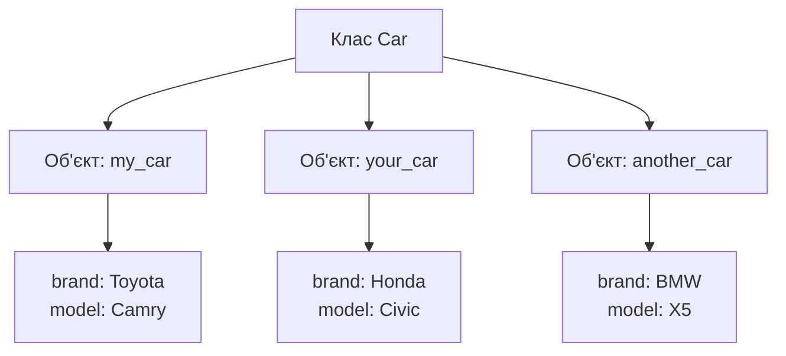
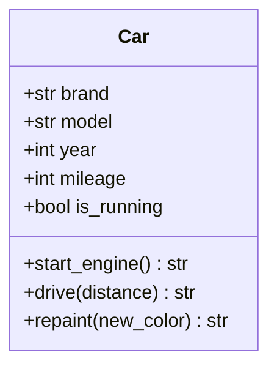
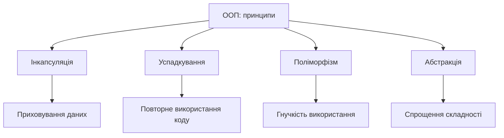
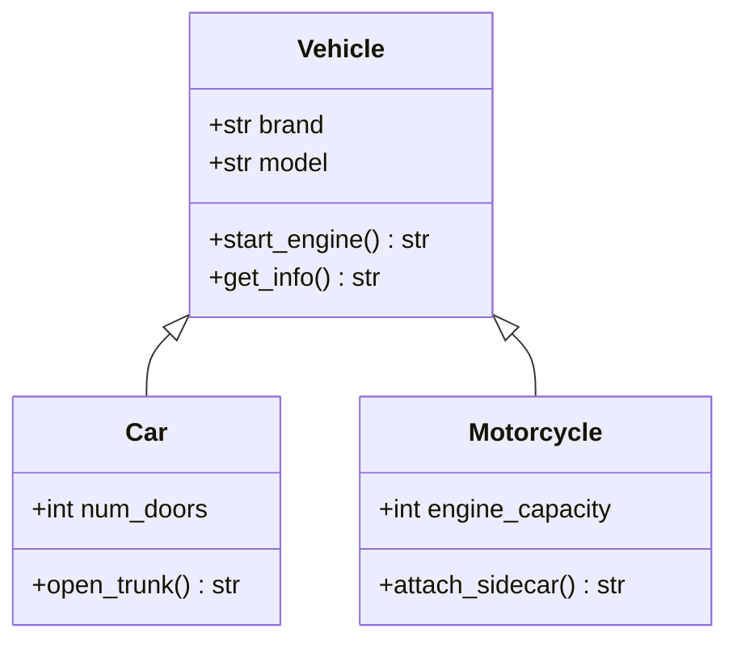

# Основи об'єктно-орієнтованого програмування

## План презентації

1. Вступ до ООП
2. Об'єкти та класи
3. Чотири принципи ООП
4. Практичні аспекти

## Основні поняття

- **Об'єкт** — модель сутності: дані (стан) + методи (поведінка)
- **Клас** — шаблон для створення об'єктів
- **Інкапсуляція** — дані й методи разом + приховування внутрішнього стану
- **Успадкування** — новий клас на основі наявного
- **Поліморфізм** — однаковий виклик, різна реакція об'єктів
- **Абстракція** — суттєве видно, деталі приховано
- **Композиція** — об'єкт складається з інших об'єктів («має»)

## 1. Вступ до ООП

## Що таке ООП?

**Об'єктно-орієнтоване програмування** — парадигма, яка організовує код навколо об'єктів, що поєднують дані та методи роботи з ними.

### 🎯 Основна ідея:
- Моделювання предметної області через програмні об'єкти
- Дані та поведінка — в єдиній сутності
- Програма = система об'єктів, що взаємодіють

### 📊 Історична довідка:
- **1960-ті**: Simula — перші класи та об'єкти
- **1970-ті**: Smalltalk — усе є об'єктом
- **1980–1990-ті**: C++, Python, Java — ООП стає мейнстримом
- **Сьогодні**: Java, C#, Python, JavaScript/TypeScript, Kotlin, Swift

## Чому ООП важливе?

### ✅ Переваги ООП:
- **Модульність** — код розділений на незалежні частини
- **Повторне використання** — спільний код пишемо один раз
- **Гнучкість** — легко розширювати функціональність
- **Підтримуваність** — зміни локалізовані

### 🔧 Застосування:
- Застосунки з графічним інтерфейсом
- Розробка ігор
- Веб-застосунки та фреймворки
- Корпоративні системи

### 🤖 Чому це важливо саме зараз:
ШІ-асистенти генерують класи та ієрархії — потрібно вміти оцінити, чи вони доречні

## 2. Об'єкти та класи

## Об'єкт — програмна модель

**Об'єкт** поєднує дані (атрибути) та методи (поведінку)

### 🚗 Приклад: Автомобіль

**Характеристики (стан):**
- Марка: Toyota
- Модель: Camry
- Рік: 2020
- Пробіг: 15000 км

**Поведінка (методи):**
- Запустити двигун
- Їхати
- Перефарбувати

## Ідентичність об'єкта

```python
car_a = {'brand': 'Toyota', 'model': 'Camry'}
car_b = {'brand': 'Toyota', 'model': 'Camry'}

print(car_a == car_b)  # True  — значення однакові
print(car_a is car_b)  # False — це різні об'єкти
```

### 🎯 Запам'ятайте:
- `==` — порівняння **значень**
- `is` — це **той самий** об'єкт?
- Два однакових за даними автомобілі — усе одно два автомобілі

## Клас — шаблон для об'єктів

**Клас** визначає структуру та поведінку об'єктів



**Клас** = креслення будинку
**Об'єкт** = збудований будинок

## Діаграма класу



### 🔎 Складові:
- **Атрибути** — зберігають стан
- **Методи** — визначають поведінку
- `__init__` — конструктор, викликається при створенні
- `self` — посилання на поточний екземпляр

## Приклад класу та об'єктів

```python
class Car:
    def __init__(self, brand: str, model: str, year: int) -> None:
        self.brand = brand
        self.model = model
        self.year = year
        self.mileage = 0

    def drive(self, distance: int) -> str:
        self.mileage += distance
        return f"Проїхано {distance} км"

    def get_info(self) -> str:
        return f"{self.year} {self.brand} {self.model}"

# Створення об'єктів
my_car = Car('Toyota', 'Camry', 2020)
your_car = Car('Honda', 'Civic', 2021)

print(my_car.get_info())
print(my_car.drive(50))
```

**Результат:**
```
2020 Toyota Camry
Проїхано 50 км
```

## Клас для зберігання даних: dataclass

```python
from dataclasses import dataclass

@dataclass
class Point:
    x: float
    y: float

p1 = Point(1.5, 2.0)
p2 = Point(1.5, 2.0)

print(p1)        # Point(x=1.5, y=2.0)
print(p1 == p2)  # True
```

### ✅ Що генерується автоматично:
- Конструктор `__init__`
- Текстове представлення
- Порівняння за значеннями
- `frozen=True` — незмінний об'єкт

## 3. Чотири принципи ООП

## Чотири стовпи ООП



Кожен принцип розв'язує конкретні проблеми розробки

## Інкапсуляція

**Об'єднання даних та методів + приховування реалізації**

### 🔒 Рівні доступу:
- **Публічні** — доступні звідусіль
- **Захищені** (`_attribute`) — для класу та нащадків
- **Приватні** (`__attribute`) — лише всередині класу

### ⚠️ Особливість Python:
Це **угода**, а не жорстка заборона: `__balance` лише перейменовується на `_BankAccount__balance`

### ✅ Переваги:
- Захист даних від неконтрольованих змін
- Зміна реалізації без впливу на зовнішній код
- Простіше використання класу

## Приклад інкапсуляції

```python
class BankAccount:
    def __init__(self, owner: str, initial_balance: int = 0) -> None:
        self.owner = owner
        self.__balance = initial_balance  # «приватний» атрибут

    @property
    def balance(self) -> int:  # лише для читання
        return self.__balance

    def deposit(self, amount: int) -> None:
        if amount <= 0:
            raise ValueError("Сума має бути додатною")
        self.__balance += amount

    def withdraw(self, amount: int) -> None:
        if not 0 < amount <= self.__balance:
            raise ValueError("Недостатньо коштів")
        self.__balance -= amount

account = BankAccount("Іван", 1000)
account.deposit(500)
# account.balance = 999999  ❌ AttributeError
print(account.balance)      # ✅ 1500
```

## Помилки: винятки, а не рядки

### ❌ Погано:
```python
return "Недостатньо коштів"  # легко сприйняти як успіх
```

### ✅ Добре:
```python
raise InsufficientFundsError("Недостатньо коштів")
```

### 💡 Чому:
- Виняток **неможливо випадково проігнорувати**
- Код виклику явно обробляє помилку (`try / except`)
- Для грошей — цілі числа або `Decimal`, **не** `float`

## Успадкування

**Створення нових класів на основі наявних (відношення «є»)**



### ✅ Переваги:
- Повторне використання коду
- Ієрархії класів
- Логічна організація коду

## Приклад успадкування

```python
# Базовий клас
class Vehicle:
    def __init__(self, brand: str, model: str) -> None:
        self.brand = brand
        self.model = model

    def start_engine(self) -> str:
        return f"{self.brand} {self.model}: двигун запущено"

# Дочірній клас
class Car(Vehicle):
    def __init__(self, brand: str, model: str, num_doors: int) -> None:
        super().__init__(brand, model)
        self.num_doors = num_doors

    def open_trunk(self) -> str:
        return "Багажник відкрито"

# Використання
sedan = Car('Toyota', 'Camry', 4)
print(sedan.start_engine())  # Успадкований метод
print(sedan.open_trunk())    # Власний метод
```

## Множинне успадкування

```python
class Flyer:
    def move(self): return "летить"

class Swimmer:
    def move(self): return "пливе"

class Duck(Flyer, Swimmer):
    pass

print(Duck().move())  # летить
print([c.__name__ for c in Duck.__mro__])
# ['Duck', 'Flyer', 'Swimmer', 'object']
```

### ⚠️ Обережно:
- Python підтримує, але це джерело заплутаних конфліктів
- Порядок вибору методів — **MRO**
- Використовують переважно для невеликих класів-домішок

## Поліморфізм

**Об'єкти різних класів по-різному реагують на однаковий виклик**

### 🎭 Механізми:
- **Перевизначення методів** — у нащадках
- **Качина типізація** — важливо, що об'єкт *вміє*, а не чий він нащадок

### ❗ У Python немає перевантаження методів
Гнучкість — через параметри за замовчуванням, `*args`, `functools.singledispatch`

### ✅ Переваги:
- Гнучкість коду
- Робота з різними типами через єдиний інтерфейс
- Розширюваність без зміни наявного коду

## Приклад поліморфізму

```python
import math

class Shape:
    def area(self) -> float:
        raise NotImplementedError

class Rectangle(Shape):
    def __init__(self, width: float, height: float) -> None:
        self.width = width
        self.height = height

    def area(self) -> float:
        return self.width * self.height

class Circle(Shape):
    def __init__(self, radius: float) -> None:
        self.radius = radius

    def area(self) -> float:
        return math.pi * self.radius ** 2

# Поліморфне використання
shapes = [Rectangle(5, 3), Circle(4)]

for shape in shapes:
    print(f"Площа: {shape.area():.2f}")
```

**Результат:**
```
Площа: 15.00
Площа: 50.27
```

## Абстракція

**Виділення суттєвого та приховування деталей**

### 🎯 Абстрактні класи (`ABC`):
- Визначають загальний інтерфейс
- Не можна створити екземпляр
- Змушують нащадків реалізувати методи

### 🎯 Протоколи (`Protocol`):
- Описують, що об'єкт **має вміти**
- Успадковувати нічого не потрібно
- Перевіряються mypy / Pyright

### ✅ Переваги:
- Чіткі контракти між компонентами
- Полегшення розробки модульних систем

## Приклад абстракції

```python
from abc import ABC, abstractmethod

class Database(ABC):
    @abstractmethod
    def connect(self) -> str: ...

    @abstractmethod
    def execute_query(self, query: str) -> str: ...

class MySQLDatabase(Database):
    def connect(self) -> str:
        return "Підключено до MySQL"

    def execute_query(self, query: str) -> str:
        return f"Виконано запит MySQL: {query}"

class MongoDatabase(Database):
    def connect(self) -> str:
        return "Підключено до MongoDB"

    def execute_query(self, query: str) -> str:
        return f"Виконано запит MongoDB: {query}"

# db = Database()  ❌ TypeError
mysql = MySQLDatabase()  # ✅ OK
```

## Протокол замість успадкування

```python
from typing import Protocol

class Notifier(Protocol):
    def send(self, message: str) -> None: ...

class EmailNotifier:  # нічого не успадковує
    def send(self, message: str) -> None:
        print(f"Email: {message}")

class SmsNotifier:
    def send(self, message: str) -> None:
        print(f"SMS: {message}")

def alert(notifier: Notifier, text: str) -> None:
    notifier.send(text)

alert(EmailNotifier(), "Сервер недоступний")
alert(SmsNotifier(), "Сервер недоступний")
```

## 4. Практичні аспекти

## Коли використовувати ООП?

### ✅ Підходить для:
- **Складних застосунків** з багатьма компонентами
- **Графічних інтерфейсів** — кнопки, вікна як об'єкти
- **Розробки ігор** — персонажі, предмети
- **Симуляцій** реального світу
- **Довгострокових проєктів** з потребою підтримки

### ❌ Може бути надмірним для:
- Простих скриптів та утиліт
- Невеликих завдань без складної логіки
- Прототипів та експериментів

### 💡 Пам'ятайте:
Функція без стану не мусить ставати класом

## Композиція краща за успадкування

```python
class Engine:
    def __init__(self, power_hp: int) -> None:
        self.power_hp = power_hp

    def start(self) -> str:
        return f"двигун {self.power_hp} к.с. запущено"

class Car:
    def __init__(self, brand: str, engine: Engine) -> None:
        self.brand = brand
        self.engine = engine  # Car МАЄ Engine

    def start(self) -> str:
        return f"{self.brand}: {self.engine.start()}"

print(Car("Toyota", Engine(150)).start())
```

- **Успадкування** — відношення «є»
- **Композиція** — відношення «має»
- Двигун можна замінити без зміни `Car`

## Найкращі практики ООП

### 🎯 Принципи проєктування:

- **Єдина відповідальність** — один клас, одна задача
- **Інкапсуляція** — приховуйте внутрішні деталі
- **Композиція над успадкуванням** — уникайте глибоких ієрархій

### 📝 Іменування (PEP 8):

- **Класи** — іменники в PascalCase (`UserAccount`)
- **Методи** — дієслова в snake_case (`get_balance()`)
- **Внутрішні члени** — префікс `_` або `__`

### 🛠️ Інструменти:

- **Ruff** — лінтер і форматувальник
- **mypy / Pyright** — перевірка типів

## Документування коду

```python
class ShoppingCart:
    """
    Клас для керування кошиком покупок.

    Attributes:
        customer_id: Ідентифікатор покупця.
        items: Список товарів у кошику.
    """

    def __init__(self, customer_id: str) -> None:
        """Ініціалізує кошик для покупця."""
        self.customer_id = customer_id
        self.items: list[dict] = []

    def add_item(self, name: str, price: int, quantity: int = 1) -> dict:
        """
        Додає товар до кошика.

        Raises:
            ValueError: Якщо ціна або кількість не є додатними.
        """
        ...
```

### 💡 Поради:
- Docstring пояснює **що**, а не **як**
- Типи вже в анотаціях — не дублюйте
- З docstring можна генерувати документацію (mkdocstrings)

## Переваги та недоліки ООП

### ✅ Переваги:
- **Модульність** — легко організувати код
- **Повторне використання** — успадкування та композиція
- **Гнучкість** — поліморфізм та абстракція
- **Підтримуваність** — зміни локалізовані в класах

### ❌ Недоліки:
- **Складність** — може бути надмірною для простих задач
- **Продуктивність** — накладні витрати на об'єкти
- **Крива навчання** — потребує часу для освоєння
- **Надмірне проєктування** — ризик зайвих ієрархій

## Висновки

### 🎓 Головне:

- Об'єкт = стан + поведінка; клас = шаблон
- Чотири принципи: інкапсуляція, успадкування, поліморфізм, абстракція
- «Є» — успадкування, «має» — композиція
- Помилки — винятками, а не рядками
- ООП — інструмент, а не самоціль

### ➡️ Далі:
Лекція 8 — принципи проєктування SOLID, DRY, KISS
