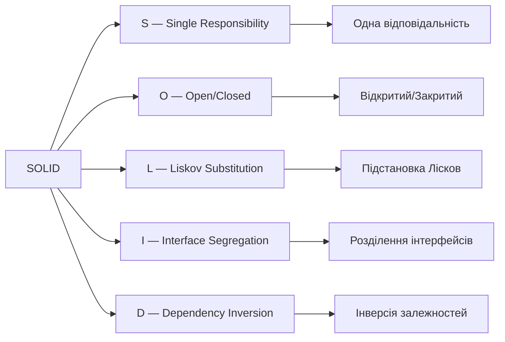
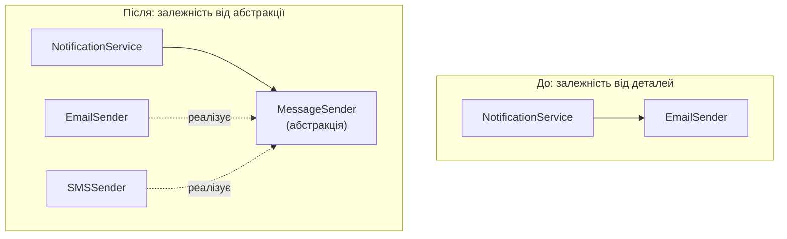
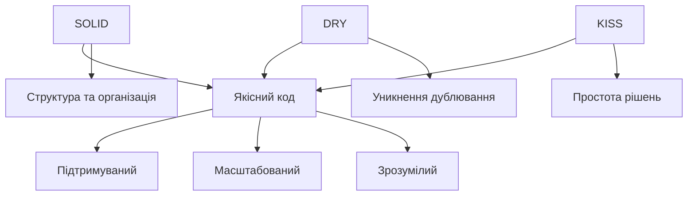

# Принципи проєктування: SOLID, DRY, KISS

## План презентації

1. Вступ до принципів проєктування
2. SOLID принципи
3. Принцип DRY
4. Принцип KISS
5. Взаємодія принципів
6. Практичне застосування

## Основні поняття

- **Принцип проєктування** — орієнтир, а не закон
- **Зв'язаність (coupling)** — наскільки модулі залежать один від одного
- **Зчепленість (cohesion)** — наскільки споріднене все всередині модуля
- **SOLID** — п'ять принципів об'єктно-орієнтованого проєктування
- **DRY** — кожне знання має єдине представлення
- **KISS** — обирайте найпростіше рішення, що працює
- **Рефакторинг** — зміна структури коду без зміни поведінки

## 1. Вступ

## Чому важливі принципи проєктування?

### 🎯 Основна мета:

Створювати код, який легко:

- **Читати** та розуміти
- **Модифікувати** та розширювати
- **Тестувати** та налагоджувати
- **Підтримувати** протягом років

### 📊 Проблеми поганого коду:

- Заплутана логіка
- Дублювання коду
- Жорсткі залежності
- Складність змін
- Високі витрати на підтримку

### 💡 Головне:
Більшість життя програми — це супровід, а не перше написання

## 2. SOLID принципи

## SOLID — п'ять правил ООП



- **Мейєр** — OCP (1988), **Лісков** — LSP (1987–1994)
- **Мартін** зібрав принципи; акронім запропонував **Феверс** (≈2004)

## S — Single Responsibility Principle

**Кожен клас має одну причину для зміни**

### ❌ Погано — багато відповідальностей:

```python
class User:
    def validate_email(self): ...
    def save_to_database(self): ...
    def send_welcome_email(self): ...
    def hash_password(self): ...
```

### ✅ Добре — кожен клас має одну роль:

```python
class User:            # лише дані
class UserValidator:   # лише валідація
class PasswordHasher:  # лише паролі
class UserRepository:  # лише збереження
class EmailService:    # лише листи
```

## Переваги SRP

### ✅ Що отримуємо:

- **Модульність** — зрозуміле призначення класу
- **Тестування** — окремі функції тестуються окремо
- **Повторне використання** — класи з чіткими ролями
- **Підтримка** — зміни локалізовані

### 🎯 Практичне правило:

Опишіть клас одним реченням. Якщо потрібне «**і**» — принцип порушено!

*«Перевіряє дані **і** зберігає їх»* ❌
*«Перевіряє дані користувача»* ✅

### ⚠️ Не перегинайте:
Клас на кожен метод — теж погано

## Безпека: паролі

### ❌ Ніколи так:

```python
return f"hashed_{password}"   # це не хешування!
```

### ✅ Хеш зі «сіллю» повільним алгоритмом:

```python
salt = os.urandom(16)
digest = hashlib.scrypt(password.encode(), salt=salt,
                        n=2**14, r=8, p=1)
```

- Пароль **ніколи** не зберігають відкритим текстом
- У реальних проєктах — `argon2-cffi`, `bcrypt`
- Власну криптографію не пишемо

## O — Open/Closed Principle

**Відкритий для розширення, закритий для модифікації**

### ❌ Погано — зміна наявного коду:

```python
class DiscountCalculator:
    def calculate(self, type, amount):
        if type == 'regular':
            return amount * 0.05
        elif type == 'premium':
            return amount * 0.10
        elif type == 'vip':
            return amount * 0.20
        # Новий тип = зміна класу!
```

### ✅ Добре — розширення через нові класи:

```python
class DiscountStrategy(ABC):
    @abstractmethod
    def calculate(self, amount): ...

class VIPDiscount(DiscountStrategy):
    def calculate(self, amount):
        return amount * 0.20
# Новий тип = новий клас!
```

## Переваги OCP

### ✅ Що отримуємо:

- **Стабільність** — старий код не змінюється
- **Безпека** — менший ризик внести помилки
- **Розширюваність** — легко додавати функції
- **Тестування** — наявні тести залишаються чинними

### 🔧 Механізми реалізації:

- Абстракції та інтерфейси
- Поліморфізм
- Патерн «Стратегія»
- Впровадження залежностей

### 💡 KISS нагадує:
Якщо різниця лише в числі — достатньо словника `{'vip': 0.20}`

## L — Liskov Substitution Principle

**Підтипи можуть замінювати базові типи без порушення коректності**

### ❌ Класична проблема: Квадрат та Прямокутник

```python
class Rectangle:
    def set_width(self, w): self.width = w
    def set_height(self, h): self.height = h

class Square(Rectangle):
    def set_width(self, w):
        self.width = w
        self.height = w  # Порушує очікування!
    def set_height(self, h):
        self.width = h
        self.height = h

def process(rect):
    rect.set_width(5)
    rect.set_height(4)
    assert rect.area() == 20  # Для Square — помилка!
```

**Проблема:** `Square` порушує поведінку `Rectangle`

## Правильне рішення LSP

### ✅ Добре — окремі незалежні класи:

```python
class Shape(ABC):
    @abstractmethod
    def area(self): ...

class Rectangle(Shape):
    def __init__(self, width, height):
        self.width = width
        self.height = height

    def area(self):
        return self.width * self.height

class Square(Shape):
    def __init__(self, side):
        self.side = side

    def area(self):
        return self.side ** 2
```

### 🔎 Ознаки порушення LSP:
- Підклас кидає `NotImplementedError`
- Код перевіряє `isinstance`, щоб обійти «особливий» підклас
- Або зробіть фігури **незмінними** (`frozen=True`)

## I — Interface Segregation Principle

**Багато специфічних інтерфейсів краще, ніж один загальний**

### ❌ Погано — один великий інтерфейс:

```python
class Worker(ABC):
    @abstractmethod
    def work(self): ...
    @abstractmethod
    def eat(self): ...
    @abstractmethod
    def sleep(self): ...

class Robot(Worker):
    def work(self): return "Працює"
    def eat(self): raise NotImplementedError    # ❌
    def sleep(self): raise NotImplementedError  # ❌
```

**Проблема:** робот змушений реалізувати непотрібні методи

## Рішення ISP

### ✅ Добре — кілька малих інтерфейсів:

```python
class Workable(ABC):
    @abstractmethod
    def work(self): ...

class Eatable(ABC):
    @abstractmethod
    def eat(self): ...

class Sleepable(ABC):
    @abstractmethod
    def sleep(self): ...

class Human(Workable, Eatable, Sleepable):
    def work(self): return "Працює"
    def eat(self): return "Їсть"
    def sleep(self): return "Спить"

class Robot(Workable):
    def work(self): return "Працює"
    # Реалізує тільки те, що потрібно!
```

`feed(robot)` — помилку покаже **перевірка типів** (mypy / Pyright)

## D — Dependency Inversion Principle

**Залежність від абстракцій, а не від конкретних реалізацій**



**Проблема «до»:** неможливо замінити спосіб відправки чи протестувати без реальних листів

## Рішення DIP

### ✅ Добре — залежність від абстракції:

```python
class MessageSender(ABC):
    @abstractmethod
    def send(self, message, recipient): ...

class EmailSender(MessageSender):
    def send(self, message, recipient):
        print(f"Email: {message}")

class SMSSender(MessageSender):
    def send(self, message, recipient):
        print(f"SMS: {message}")

class NotificationService:
    def __init__(self, sender: MessageSender):
        self.sender = sender  # Залежність від абстракції!

    def notify(self, message, recipient):
        self.sender.send(message, recipient)

# Легко змінювати реалізацію
service = NotificationService(EmailSender())
service = NotificationService(SMSSender())
```

## DIP і тестування

```python
class FakeSender(MessageSender):
    def __init__(self):
        self.sent = []

    def send(self, message, recipient):
        self.sent.append((message, recipient))

def test_notify():
    fake = FakeSender()
    NotificationService(fake).notify("Привіт", "a@b.ua")
    assert fake.sent == [("Привіт", "a@b.ua")]
```

### 🎯 Не плутайте:
- **DIP** — принцип: спирайтеся на абстракції
- **DI (впровадження залежностей)** — прийом: передавати залежності ззовні
- **Контейнери / `Depends`** — інструменти автоматизації DI

## SOLID — Підсумок

### 🎯 П'ять принципів:

| Принцип | Суть | Результат |
|---------|------|-----------|
| **S** | Одна відповідальність | Модульність |
| **O** | Відкритий для розширення, закритий для модифікації | Розширюваність |
| **L** | Підстановка Лісков | Коректність успадкування |
| **I** | Розділення інтерфейсів | Гнучкість |
| **D** | Інверсія залежностей | Слабка зв'язаність |

### 💡 Головне:

SOLID — це не догма, а керівництво для прийняття рішень!

## 3. Принцип DRY

## Don't Repeat Yourself

**Кожна частина знань має єдине представлення в системі**

### ❌ Проблема дублювання:

```python
class OrderService:
    def process_online_order(self, order):
        if not order.items:
            raise ValueError("Порожнє")
        if order.total > 1000:
            discount = order.total * 0.1
        # ...

    def process_store_order(self, order):
        # ТА САМА валідація повторюється
        if not order.items:
            raise ValueError("Порожнє")
        # ТА САМА знижка повторюється
        if order.total > 1000:
            discount = order.total * 0.1
        # ...
```

## Рішення DRY

### ✅ Винесення в окремі компоненти:

```python
class OrderValidator:
    @staticmethod
    def validate(order):
        if not order.items:
            raise ValueError("Порожнє")

class DiscountCalculator:
    @staticmethod
    def calculate(total):
        return total * 0.1 if total > 1000 else 0

class OrderService:
    def process_order(self, order, order_type):
        OrderValidator.validate(order)
        discount = DiscountCalculator.calculate(order.total)
        # Логіка існує в одному місці!
```

**Зміна в одному місці = зміна скрізь!**

## Рівні застосування DRY

### 📝 На рівні коду:

- Винести повторювану логіку у функції
- Спільна поведінка — у базових класах
- Утилітарні модулі

### 💾 На рівні даних:

- Нормалізація бази даних
- Централізована конфігурація
- Єдине джерело даних

### 📚 На рівні документації:

- Самодокументовані назви, типи — в анотаціях
- Коментарі пояснюють «чому», не «що»
- Документація генерується з коду / єдиної специфікації

## Баланс DRY та читабельності

### ⚠️ Коли DRY може зашкодити:

**DRY — про дублювання знань, а не схожих рядків:**

- Поріг знижки 1000 ≠ поріг безкоштовної доставки 1000
- Схожі фрагменти можуть еволюціонувати по-різному

**Передчасна абстракція:**

- Ускладнює розуміння
- Обростає прапорцями та винятками

**Правило трьох:**

1. Написати код
2. Повторити при потребі
3. На третьому повторенні — рефакторити!

## 4. Принцип KISS

## Keep It Simple, Stupid

**Найпростіше рішення, що розв'язує задачу, зазвичай найкраще**

### 🎯 Основна ідея:

- Складність — ворог надійності
- Прості рішення легше:
    - Розуміти
    - Тестувати
    - Підтримувати
    - Модифікувати

### 📊 Джерело:

Приписують інженеру Келлі Джонсону (Lockheed): літак має бути під силу полагодити звичайному механіку

### 🤝 Союзник — YAGNI:
*«Вам це не знадобиться»* — не пишіть код про запас

## Приклади порушення KISS

### ❌ Надмірна складність:

```python
class AbstractDataProcessorFactory:
    @staticmethod
    def create_processor(type):
        if type == 'basic':
            return BasicDataProcessorBuilder().build()
        # Багато рівнів абстракції для простої задачі

class DataProcessorBuilder:
    def __init__(self):
        self.validators = []
        self.transformers = []
        # Складна система для простої обробки
```

### ✅ Просте рішення:

```python
def process(data: list[str]) -> list[str]:
    if not data:
        raise ValueError("Дані порожні")
    return [item.upper() for item in data if item]
```

## Ознаки порушення KISS

### 🚨 Червоні прапорці:

**Довгі методи:**

- Більше одного екрана
- Багато рівнів вкладеності
- Десятки параметрів
- Цикломатична складність > ~10

**Складні умови:**
```python
# ❌ Погано
if (user.is_active and user.has_permission('admin')
    and not user.is_banned and user.email_verified
    and user.subscription_active):
    # Складно читати!
```

```python
# ✅ Добре
def can_access_admin(user):
    return (user.is_active and
            user.has_permission('admin') and
            not user.is_banned)

if can_access_admin(user):
    # Зрозуміло!
```

## Як застосовувати KISS?

### 📝 Практичні поради:

**1. Почніть просто:**

- Реалізуйте найпростіше рішення
- Додавайте складність лише коли потрібно

**2. Уникайте передчасної оптимізації:**

- Спочатку зробіть правильно
- Виміряйте, де повільно
- Оптимізуйте лише це (Кнут: ≈97% дрібних оптимізацій не варті зусиль)

**3. Використовуйте стандартні рішення:**

- Стандартні бібліотеки
- Перевірені патерни
- Не винаходьте велосипед (особливо в безпеці)

**4. Пишіть для людей:**

- Описові назви
- Зрозумілі коментарі
- Логічна структура

## 5. Взаємодія принципів

## Як принципи доповнюють один одного



Принципи працюють разом для досягнення якості

## Синергія принципів

### 🔄 Взаємопідтримка:

**SRP + DRY:**

- Класи з єдиною відповідальністю легше використовувати повторно
- Менше дублювання логіки

**OCP + KISS:**

- Просте розширення без складної модифікації
- Нові функції — через нові класи

**DIP + DRY:**

- Абстракції дозволяють повторно використовувати код
- Менше дублювання через впровадження залежностей

**ISP + KISS:**

- Малі інтерфейси простіші для розуміння
- Менше складності у реалізації

## Баланс між принципами

### ⚖️ Коли виникають конфлікти:

| Ситуація | Принцип пропонує | Компроміс |
|----------|------------------|-----------|
| Дві схожі функції | DRY: об'єднати | KISS/YAGNI: почекати |
| Кілька типів знижок | OCP: класи-стратегії | KISS: словник |
| Залежність від БД | DIP: абстракція | Для простого скрипту — зайва |
| Великий клас | SRP: розділити | Не дробити до нечитабельності |

### 💡 Правило:
Принципи — це **керівництво**, не **догма**.
Завжди враховуйте контекст проєкту!

## 6. Практичне застосування

## Рефакторинг наявного коду

### 🔧 Процес покращення:

**1. Додайте тести:**
```python
def test_order_processing():
    order = Order(items=["ноутбук"], total=1500)
    assert OrderService().process_online_order(order)
```

**2. Виявіть порушення:**

| «Запах коду» | Порушено |
|--------------|----------|
| Довгий метод/клас | SRP, KISS |
| Однакові фрагменти | DRY |
| Довгий `if-elif` за типом | OCP |
| `NotImplementedError` у підкласі | LSP, ISP |
| Клас створює свої залежності | DIP |

**3. Рефакторте поступово:**

- Маленькі кроки, один коміт на зміну
- Після кожного кроку — тести
- Один принцип за раз

## Рецензування коду з принципами

### 📋 Чек-лист для перегляду:

**SOLID:**

- ☐ Кожен клас має одну відповідальність?
- ☐ Можна розширити без модифікації?
- ☐ Успадкування не порушує поведінку?
- ☐ Інтерфейси не надто великі?
- ☐ Залежності від абстракцій?

**DRY:**

- ☐ Немає дублювання логіки?
- ☐ Повторювані шаблони винесені?

**KISS:**

- ☐ Рішення не надто складне?
- ☐ Код легко зрозуміти?

## Код від ШІ-асистентів

### 🤖 Типові вади згенерованого коду:

- **Дублювання** — дописує нову функцію замість використати наявну (DRY)
- **Зайві абстракції** «про всяк випадок» (KISS, YAGNI)
- **Надто широкі інтерфейси** (ISP)

### ✅ Запитання перед прийняттям коду:

- Чи розумію я, навіщо тут кожен клас?
- Чи немає вже такої функції в проєкті?
- Чи можна зробити простіше?
- Чи можна протестувати без БД та мережі?

Принципи — це ще й **критерії оцінки чужого коду**

## Інструменти для забезпечення якості

### 🛠️ Автоматизація:

**Лінтери:**

- **Ruff**, **Pylint** для Python
- **ESLint** для JavaScript
- Виявляють стильові та логічні проблеми

**Аналізатори складності:**

- **Ruff (C901)**, **radon** — циклічна складність
- **SonarQube** — технічний борг
- Знаходять надто складні функції

**Детектори дублювання:**

- **SonarQube**, **Pylint** (duplicate-code)
- **jscpd** — для багатьох мов
- Знаходять copy-paste код

## Розвиток команди

### 📚 Навчання та практика:

**Регулярні активності:**

- **Технічні доповіді** — обмін досвідом
- **Code kata** — практика рефакторингу
- **Парне програмування** — навчання в процесі
- **Аналіз кейсів** — розбір реальних прикладів

**Настанови з кодування:**
```markdown
# Наші стандарти коду

## SOLID
- Клас — до ~200 рядків
- Один публічний метод = одна відповідальність

## DRY
- Не більше 2 повторень перед рефакторингом
- Спільна логіка — в utils

## KISS
- Не більше 3 рівнів вкладеності
- Не більше 5 параметрів у методі
```
Автоматичні перевірки — у конвеєрі CI

## Антипатерни — чого уникати

### 🚫 Типові помилки:

**God Object (об'єкт-всезнайка):**

```python
class Application:
    def __init__(self):
        self.users = []
        self.products = []
        self.orders = []
    def create_user(self): pass
    def process_payment(self): pass
    def send_email(self): pass
    def generate_report(self): pass
    # Клас робить ВСЕ! ❌
```

**Spaghetti Code (заплутаний код):**

- Заплутана логіка без структури
- Багато залежностей
- Важко зрозуміти потік виконання

**Copy-Paste Programming:**

- Дублювання коду замість абстракції
- Порушення DRY

## Висновки

### 🎓 Ключові принципи якісного коду:

**SOLID — структура:**

- S: Єдина відповідальність
- O: Відкритий/Закритий
- L: Підстановка Лісков
- I: Розділення інтерфейсів
- D: Інверсія залежностей

**DRY — ефективність:**

- Уникайте дублювання знань
- Централізуйте логіку
- Підтримуйте єдине джерело правди

**KISS — простота:**

- Найпростіше рішення найкраще
- Складність — ворог надійності
- Пишіть для людей

### ➡️ Далі:
Лекція 9 — типи архітектур програмного забезпечення
