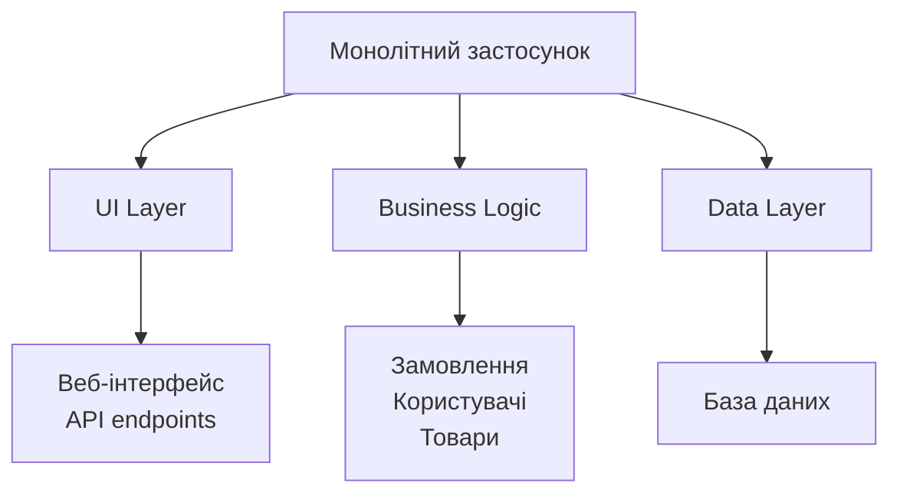
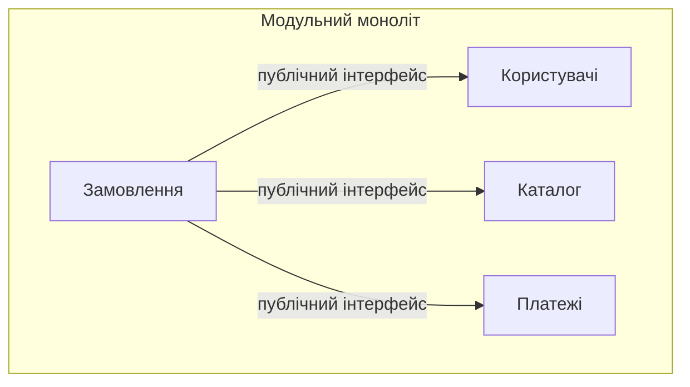
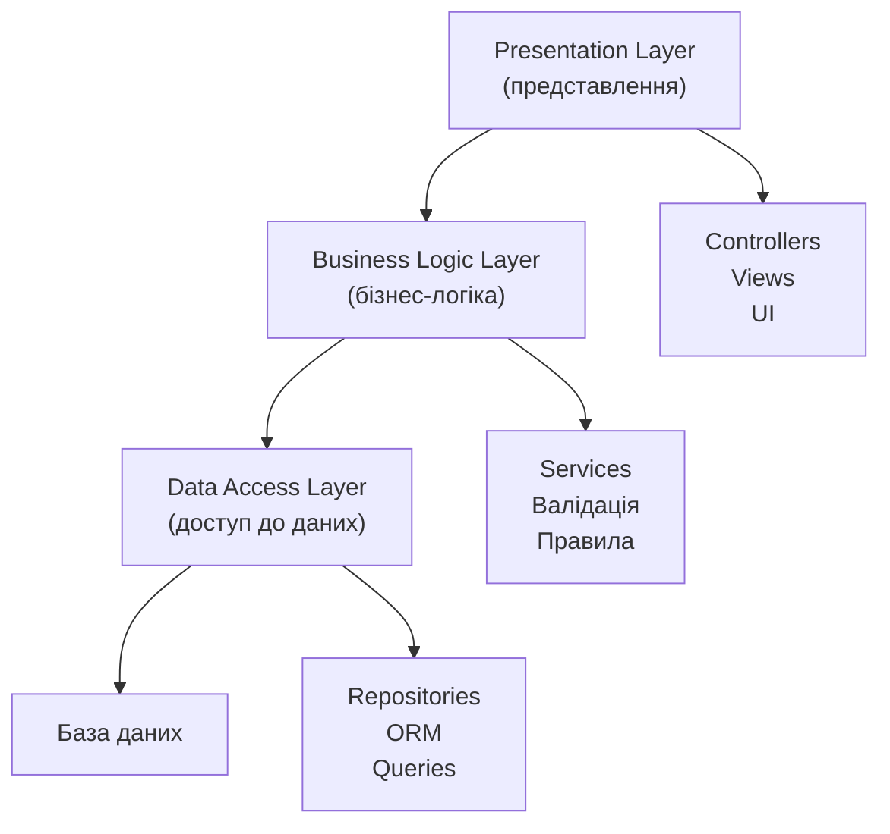
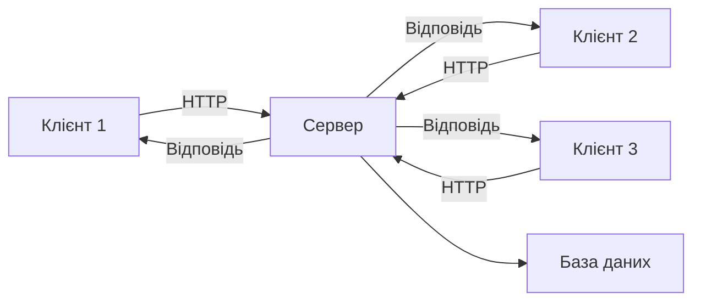
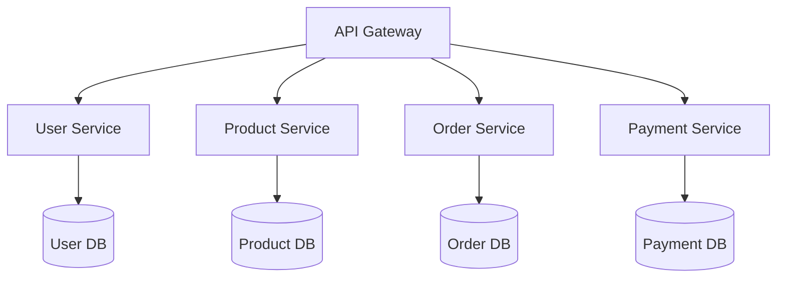
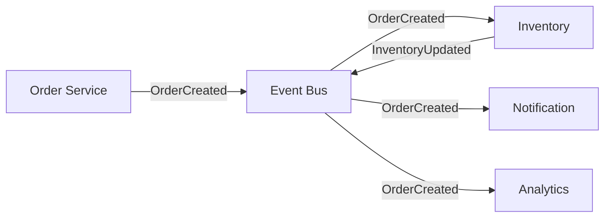
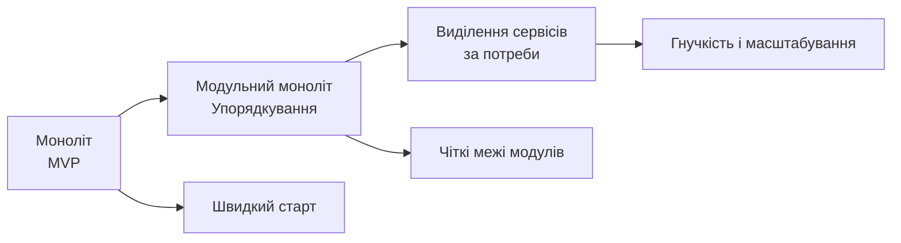

# Типи архітектур програмного забезпечення

## План презентації

1. Основи архітектури ПЗ
2. Монолітна архітектура
3. Багатошарова архітектура
4. Клієнт-серверна архітектура
5. Мікросервісна архітектура
6. Подієва архітектура (Event-Driven)
7. Порівняння та вибір

## Основні поняття

- **Архітектура ПЗ** — ключові рішення про структуру системи, які дорого змінювати
- **Якісні атрибути** — масштабованість, продуктивність, надійність, підтримуваність, безпека
- **Архітектурний стиль** — загальний підхід до організації системи
- **Моноліт** — застосунок, що розгортається як єдине ціле
- **Шар (layer)** — логічний рівень із чіткою відповідальністю
- **Мікросервіс** — автономний сервіс з власними даними й розгортанням
- **Подія та шина подій** — факт, що вже стався, і канал його доставки

## 1. Основи архітектури ПЗ

## Що таке архітектура програмного забезпечення?

**Архітектура ПЗ** — це високорівнева структура системи, яка визначає:

- Організацію компонентів
- Взаємодію між модулями
- Розподіл відповідальностей
- Принципи побудови системи

### 🎯 Чому це важливо?

- Визначає **масштабованість** системи
- Впливає на **продуктивність**
- Забезпечує **підтримуваність**
- Гарантує **надійність**

**Неправильна архітектура = технічний борг!**

## Рівні архітектури

### 📊 Три рівні абстракції:

**Системна архітектура:**

- Розподіл між системами
- Взаємодія підсистем
- Точки інтеграції

**Архітектура застосунку:**

- Структура програмного продукту
- Організація модулів
- Основні компоненти

**Архітектура компонента:**

- Внутрішня організація
- Деталі реалізації
- Локальні рішення

## Стилі — це різні виміри!

### 🧭 Стилі не є взаємовиключними:

| Вимір | Запитання | Приклади |
|-------|-----------|----------|
| **Одиниця розгортання** | Скільки окремо розгортуваних частин? | моноліт, мікросервіси |
| **Внутрішня організація** | Як структуровано код усередині? | шари, гексагональна |
| **Взаємодія** | Як частини спілкуються? | клієнт-сервер, події |

### 💡 Приклад — інтернет-магазин:
- **Моноліт**, усередині — **шари**
- Браузер звертається за моделлю **клієнт-сервер**
- Листи надсилаються через **події**

Шари можливі і в моноліті, і в мікросервісі!

## 2. Монолітна архітектура

## Характеристики монолітної архітектури

**Увесь застосунок = єдина неподільна одиниця**



### 🔧 Особливості:
- Один виконуваний файл
- Спільна пам'ять
- Виклики методів (не мережа)
- Розгортання всієї системи

## Переваги монолітної архітектури

### ✅ Чому монолітна архітектура хороша:

**Простота розробки:**

- Єдина кодова база
- Один стек технологій
- Проста взаємодія між модулями

**Легкість тестування:**

- Запуск усієї системи локально
- Наскрізні тести в одному процесі
- Просте відтворення помилок

**Швидке розгортання:**

- Один артефакт
- Немає координації сервісів
- Прості інструменти розгортання

**Хороша продуктивність:**

- Взаємодія в пам'яті
- Без мережевих накладних витрат
- Прості транзакції

## Недоліки монолітної архітектури

### ❌ Проблеми монолітів:

**Складність підтримки:**

```python
# Без порядку моноліт перетворюється
# на «велику кулю бруду» (big ball of mud):
# все залежить від усього,
# зміна в одному місці ламає інше
```

**Обмежена масштабованість:**

- Неможливо масштабувати окремі частини
- Треба копіювати весь застосунок
- Неефективне використання ресурсів

**Технологічна прив'язка:**

- Один стек для всього
- Складно мігрувати на нові технології

**Тривалий цикл розгортання:**

- Повторне збирання всього застосунку
- Конфлікти між розробниками
- Ризиковані релізи

## Модульний моноліт

**Один процес, одне розгортання — але з чіткими межами модулів**



### ✅ Чому це вигідно:
- Простота моноліту + межі, як у мікросервісів
- Модуль ховає внутрішні класи й таблиці
- Межі можна перевіряти автоматично
- Пізніше модуль легко виділити в сервіс

**Розумний старт для більшості нових проєктів**

## Коли використовувати монолітну архітектуру?

### ✅ Ідеально для:

**Невеликих проєктів:**

- Стартапи та MVP
- Прототипи
- Внутрішні інструменти

**Невеликих команд:**

- Простіша координація
- Спільна кодова база

**Стабільних систем:**

- Рідкі зміни
- Передбачуване навантаження
- Чітка функціональність

**Навчальних проєктів:**

- Фокус на бізнес-логіці
- Без складної інфраструктури

## 3. Багатошарова архітектура

## Концепція шарів

**Організація в горизонтальні логічні шари**



### 🎯 Принципи:
- Кожен шар має свою роль
- Взаємодія лише із сусідніми шарами
- Односпрямований потік залежностей

**Шар** = логічний поділ коду, **рівень (tier)** = фізичний вузол розгортання

## Три основні шари

### 📊 Рівень представлення (Presentation):
- Взаємодія з користувачем
- UI-компоненти
- Controllers та Views
- **Що робить:** показує дані користувачу

### 💼 Рівень бізнес-логіки (Business Logic):
- Правила обробки
- Валідація даних
- Бізнес-процеси
- **Що робить:** реалізує правила системи

### 💾 Рівень доступу до даних (Data Access):
- Робота з БД
- SQL-запити
- ORM
- **Що робить:** зберігає та отримує дані

## Переваги багатошарової архітектури

### ✅ Що отримуємо:

**Чітке розділення відповідальностей:**

- UI відокремлений від бізнес-логіки
- Бізнес-логіка не залежить від БД
- Легко зрозуміти структуру

**Легкість тестування:**

```python
# Кожен шар тестується окремо
def test_business_logic():
    service = UserService(FakeRepository(), FakeEmail())
    # Тестуємо без реальної БД!
```

**Повторне використання:**

- Той самий шар бізнес-логіки для web та mobile
- Репозиторії використовуються різними сервісами

**Гнучкість заміни:**

- Змінити БД без зміни бізнес-логіки
- Переробити UI без торкання сервісів

## Варіації шарів

### 🔢 Кількість шарів:

**3-шарова (найпопулярніша):**

- Presentation
- Business Logic
- Data Access

**4-шарова:**

- Presentation
- Application (координація)
- Domain (бізнес-об'єкти)
- Infrastructure (БД, файли)

**Гексагональна / чиста архітектура:**

- Домен у центрі, без залежності від БД і фреймворку
- Зовнішнє підключається через інтерфейси (порти й адаптери)
- Це принцип інверсії залежностей (DIP) на рівні архітектури

**Шари «за технологією» чи «за функціональністю»?**
Зі зростанням проєкту зручніше другий варіант

## 4. Клієнт-серверна архітектура

## Основи клієнт-серверної моделі

**Розподіл між клієнтами та сервером**



### 🎯 Ролі:

- **Клієнт:** ініціює запити, показує дані
- **Сервер:** обробляє запити, керує даними

### 🔌 Протоколи:
HTTP, WebSocket, gRPC, GraphQL

## Мережа ненадійна

```python
# Виклик у моноліті:
user = user_service.get_user(1)

# Виклик через мережу:
response = requests.get(url, timeout=5)  # без timeout — ризик «зависнути»
response.raise_for_status()              # помилки HTTP → винятки
```

### ⚠️ Кожен мережевий виклик може:
- Загубитися
- Відповісти повільно
- Повернути помилку

Код клієнта має бути готовий до збою

## Типи клієнтів

### 🖥️ Тонкий клієнт:

**Мінімум логіки, усі обчислення на сервері**

```
Браузер → HTTP → Сервер
         ← HTML ←
```

**Приклади:**

- Традиційні вебсайти
- Термінали

**Переваги:** легке оновлення, контроль на сервері
**Недоліки:** потрібне постійне з'єднання

### 💻 Товстий клієнт:

**Багато логіки на клієнті**

```
Desktop App ↔ API ↔ Сервер
(локальна обробка)
```

**Приклади:**

- Десктопні застосунки
- IDE (VS Code, IntelliJ)
- Ігри

**Переваги:** швидкість, робота офлайн
**Недоліки:** складне оновлення

### 🔀 Гібрид: SPA, SSR, мобільні застосунки

## Переваги клієнт-серверної архітектури

### ✅ Основні переваги:

**Централізоване керування:**

- Дані на сервері
- Логіка контролюється централізовано
- Легке оновлення

**Масштабованість:**

- Додавати серверні ресурси
- Балансування навантаження
- Тисячі клієнтів → кілька серверів

**Безпека:**

- Дані під контролем
- Авторизація на сервері
- Немає прямого доступу до БД
- **Клієнтові не можна довіряти** — перевірки дублюємо на сервері

**Різноманітність клієнтів:**

- Web, mobile, desktop
- Один сервер для всіх

## 5. Мікросервісна архітектура

## Концепція мікросервісів

**Застосунок = набір невеликих незалежних сервісів**



### 🎯 Характеристики:

- Кожен сервіс — окрема програма
- Власна база даних
- Незалежне розгортання
- Взаємодія через API та повідомлення

## Принципи мікросервісів

### 📋 Ключові правила:

**Незалежність:**

- Кожен сервіс розгортається окремо
- Власний життєвий цикл
- Незалежні команди

**Слабка зв'язаність:**

- Взаємодія через API
- Немає спільних баз даних
- Асинхронна взаємодія, де можливо

**Бізнес-фокус:**

- Один сервіс = одна бізнес-можливість
- User Service, Order Service, Payment Service
- Відображає предметну область

**Технологічна свобода:**

- Python для ML-сервісу
- Java для платежів
- Go для високонавантажених API
- (на практиці різноманітність обмежують)

## Переваги мікросервісів

### ✅ Що отримуємо:

**Незалежне розгортання:**

```
User Service v2.3 ─┐
Product Service v1.5├─→ Production
Order Service v3.1 ─┘
```

Кожен сервіс випускається окремо!

**Технологічна гнучкість:**

- Найкращі інструменти для кожної задачі
- Легко експериментувати

**Масштабованість:**

```
Order Service x 10 екземплярів (високе навантаження)
User Service x 2 екземпляри (низьке навантаження)
```

**Відмовостійкість:**

- Падіння одного сервісу ≠ падіння всієї системи
- Ізоляція проблем
- Часткова деградація замість повної відмови

## Виклики мікросервісів

### ❌ Складнощі:

**Розподілена складність:**

- Десятки/сотні сервісів
- Складне відстеження запитів
- Розподілене трасування (OpenTelemetry)

**Узгодженість даних:**

- Кожен сервіс має свою БД
- Немає глобальних транзакцій
- «Сага», eventual consistency

**Мережева взаємодія:**

```python
# Кожен виклик може зазнати невдачі!
response = requests.get('http://user-service/users/1', timeout=3)
# Тайм-аут? Повторна спроба? Запобіжник (circuit breaker)?
```

**Операційна складність:**

- Виявлення сервісів
- Балансування навантаження
- Моніторинг багатьох сервісів
- Конвеєри розгортання, Kubernetes

**Розподілений моноліт** — усі недоліки обох світів

## Коли використовувати мікросервіси?

### ✅ Ідеально для:

**Великих організацій:**

- Кілька команд (орієнтовно — десятки розробників)
- Кожна команда володіє сервісом
- Закон Конвея: система відображає структуру команд

**Різних вимог до масштабування:**

```
Catalog Service: 10000 req/sec
Checkout Service: 100 req/sec
```

Масштабуємо тільки те, що потрібно!

**Довгострокових проєктів:**

- Еволюція системи роками
- Поступова заміна компонентів

### ❌ НЕ використовувати для:

- Стартапів та MVP
- Невеликих команд
- Простих застосунків

**Принцип «спочатку моноліт»**

## 6. Подієва архітектура (Event-Driven)

## Концепція подій

**Компоненти взаємодіють через події**



### 🎯 Основна ідея:

- **Подія** = щось важливе вже сталося (`OrderCreated`)
- **Видавець (publisher)** генерує події
- **Підписники (subscribers)** реагують на події
- **Шина подій (event bus)** доставляє повідомлення

### 🛠️ Брокери: RabbitMQ, Kafka, NATS, хмарні сервіси

## Асинхронна природа

### ⚡ Синхронний виклик:
```python
# Відправник чекає на відповідь
result = payment_service.process_payment(order)
# Блокування!
```

### 🔄 Асинхронна подія:
```python
# Відправник НЕ чекає
event_bus.publish('OrderCreated', order)
# Продовжує роботу одразу!

# Інші сервіси обробляють пізніше
def handle_order_created(order):
    # Обробка у фоні
```

**Переваги:** чутлива система, паралельна обробка

### ⚠️ Наша навчальна шина синхронна — у реальності порядок обробки різними підписниками не гарантується

## Переваги подієвої архітектури

### ✅ Що отримуємо:

**Слабка зв'язаність:**

- Видавець не знає про підписників
- Легко додавати нові обробники
- Незалежна еволюція

**Асинхронна обробка:**

```
Користувач → Швидка відповідь ✓
    ↓
Довга обробка у фоні...
```

**Масштабованість:**

```
Подія OrderCreated
    ↓
10 екземплярів обробників
(розподіл навантаження)
```

**Розширюваність:**

- Нова функція = новий підписник
- Не змінюємо видавця
- Додаємо можливості без ризику

## Виклики подієвої архітектури

### ❌ Складнощі:

**Відстеження потоку:**

```
Запит → Event1 → Event2 → Event3 → ?
Де помилка? Складно знайти!
```
**Рішення:** розподілене трасування (OpenTelemetry, Jaeger)

**Eventual consistency:**

```
t=0: OrderCreated
t=1: Склад зменшено
t=2: Лист відправлено
t=3: Аналітику оновлено

Короткий проміжок неузгодженості!
```

**Обробка помилок та дублікатів:**

- Черги «мертвих листів» (dead letter queues)
- Повторні спроби
- **Ідемпотентність** — повторна обробка не шкодить
- **Transactional outbox** — надійна публікація подій

## Коли використовувати події?

### ✅ Підходить для:

**Асинхронних процесів:**

- Обробка замовлень
- Відправка листів
- Генерація звітів

**Інтеграції систем:**

- CRM ↔ ERP ↔ Склад
- Обмін даними без прямих залежностей

**Систем реального часу:**

- Чати
- Живі оновлення
- Фінансові платформи

**Аудиту та журналювання:**

- Усі події зберігаються
- Event sourcing
- Повне відтворення стану

## 7. Порівняння та вибір

## Порівняння архітектур

| Критерій | Моноліт | Модульний моноліт | Мікросервіси | Подієва |
|----------|---------|-------------------|--------------|---------|
| **Складність** | Низька | Низька–середня | Висока | Висока |
| **Масштабованість** | Обмежена | Обмежена | Відмінна | Відмінна |
| **Розгортання** | Просте | Просте | Складне | Залежить від реалізації |
| **Розмір команди** | Мала | Мала–середня | Кілька команд | Середня–велика |
| **Підтримка** | Складна при рості без порядку | Керована завдяки межам | Розподілена, потребує зрілих практик | Потребує спеціальних навичок |
| **Час до ринку** | Швидко | Швидко | Повільно на старті | Середньо |

Шари та клієнт-сервер поєднуються з будь-яким варіантом

## Критерії вибору архітектури

### 🎯 На що звертати увагу:

**Розмір проєкту:**

- Невеликий → моноліт (за потреби — модульний)
- Великий, з різним навантаженням → розглянути мікросервіси

**Розмір і структура команди:**

- Одна невелика команда → моноліт
- Кілька незалежних команд → мікросервіси

**Вимоги до масштабування:**

- Передбачуване → моноліт
- Нерівномірне по частинах → мікросервіси, події

**Терміни:**

- Швидкий MVP → моноліт
- Довгостроковий проєкт → модульний моноліт із можливістю виділення сервісів

**Значення в цих порадах — орієнтири, не закони**

## Еволюція архітектури

### 🔄 Типовий шлях розвитку:



**Шаблон «Душитель» (Strangler Fig):**

1. Залишити монолітне ядро
2. Нові функції — як окремі сервіси
3. Поступово виносити зі старого
4. Ядро зменшується

**Не потрібно одразу мікросервіси!**

## Гібридні підходи

### 🔀 Комбінування архітектур:

**Приклад реальної системи:**

```
┌─────────────────────────┐
│   Монолітне ядро        │
│   (основний функціонал) │
└─────────────────────────┘
         │
    ┌────┼────┬────────┐
    │    │    │        │
  Image  ML  Payment  Analytics
Service  API Service  Service
(мікро) (мікро) (мікро) (подієвий)
```

**Переваги:**

- Стабільність ядра
- Гнучкість для нових функцій
- Поступова міграція

## Сучасні тенденції

### 📈 Що змінилося останніми роками:

**Повернення до простоти:**

- Дедалі частіше починають із модульного моноліту
- Розподіл — за виміряною потребою

**Безсерверні обчислення (serverless):**

- Функції за потреби, без керування серверами
- Обмеження: холодний запуск, прив'язка до постачальника

**Платформна інженерія та керовані сервіси:**

- Внутрішні платформи беруть на себе рутину
- Бази, черги, сховища — як хмарні сервіси

**ШІ-компоненти:**

- Моделі та агенти підключаються як звичайні сервіси через API/протоколи
- Тривалі завдання агентів добре пасують подієвій моделі

### 📝 ADR — записи архітектурних рішень:
що вирішили, які були альтернативи, чому обрали це

## Практичні рекомендації

### 💡 Поради для вибору:

**Для стартапів:**

1. Почніть із (модульного) моноліту
2. Організуйте код у шари й модулі
3. Готуйтеся до виділення модулів
4. Мігруйте, коли дійсно потрібно

**Для корпорацій:**

1. Оцініть поточний стан
2. Визначте болючі точки
3. Виберіть пілотний сервіс
4. Поступово розширюйте

**Для всіх:**

- Не женіться за модою
- Враховуйте контекст
- Вимірюйте та аналізуйте
- Фіксуйте рішення (ADR)
- Будьте готові до змін

## Антипатерни в архітектурі

### 🚫 Чого уникати:

**Передчасна оптимізація:**

```
"Давайте одразу зробимо мікросервіси
на випадок, якщо колись..."
❌ Надмірна складність без потреби
```

**Big Bang Rewrite:**

```
"Перепишемо все з нуля на новій архітектурі!"
❌ Ризиковано, довго немає результату
```

**Розподілений моноліт:**

```
Мікросервіси, які тісно пов'язані між собою
❌ Усі недоліки мікросервісів + монолітна зв'язаність
```

**Architecture by Resume (архітектура «для резюме»):**

```
"Хочу вивчити Kubernetes, давайте використаємо!"
❌ Вибір технологій не за потребою проєкту
```

## Інструменти та технології

### 🛠️ Що допомагає:

**Для монолітів:**

- Фреймворки: Django, FastAPI, Flask, Spring Boot, Ruby on Rails
- Розгортання: PaaS-платформи, Docker / Docker Compose

**Для мікросервісів:**

- Оркестрація: Kubernetes
- Service Mesh: Istio, Linkerd
- API Gateway: Kong, хмарні шлюзи
- Обмін повідомленнями: RabbitMQ, Kafka

**Для подієвої архітектури:**

- Брокери: Kafka, RabbitMQ, NATS, хмарні черги (SQS, Pub/Sub)
- Опис подій: AsyncAPI
- CQRS / Event sourcing: Axon, EventStoreDB

**Моніторинг:**

- Журнали: ELK Stack, Loki
- Метрики: Prometheus, Grafana
- Трасування: OpenTelemetry, Jaeger

## Висновки

### 🎓 Ключові думки:

**Не існує ідеальної архітектури!**

Кожна має переваги та недоліки:

- **Моноліт** (і модульний) — простота для старту
- **Багатошарова** — організація коду
- **Клієнт-сервер** — розподіл обов'язків
- **Мікросервіси** — масштабованість і гнучкість
- **Подієва** — асинхронність і слабка зв'язаність

### 💡 Вибирайте за:
- Вимогами проєкту
- Розміром і структурою команди
- Терміном розробки
- Довгостроковими цілями

## Практичні поради

### 📝 Як приймати рішення:

**1. Оцініть поточний стан:**

- Які вимоги?
- Який розмір команди?
- Які ресурси?

**2. Починайте просто:**

- MVP як моноліт
- Додавайте складність поступово
- Не перепроєктовуйте

**3. Вимірюйте та аналізуйте:**

- Метрики продуктивності
- Час розробки
- Складність підтримки

**4. Будьте готові еволюціонувати:**

- Архітектура не вічна
- Рефакторинг — норма
- Технології змінюються

**Архітектура — це компроміси**

Немає правильної чи неправильної,
є доречна чи недоречна для вашого проєкту!

### ➡️ Далі:
Лекція 10 — робота з базами даних
