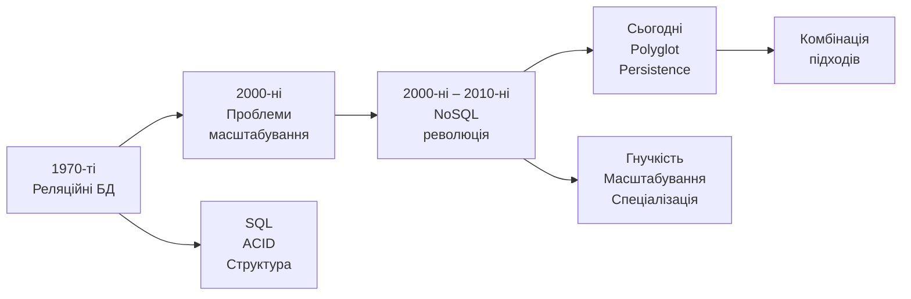
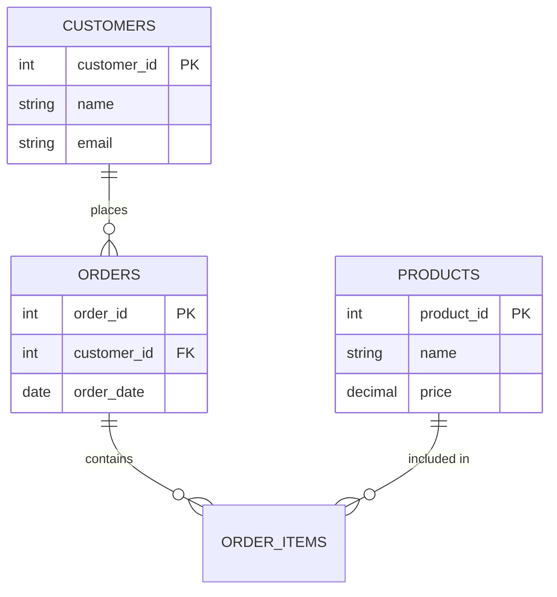
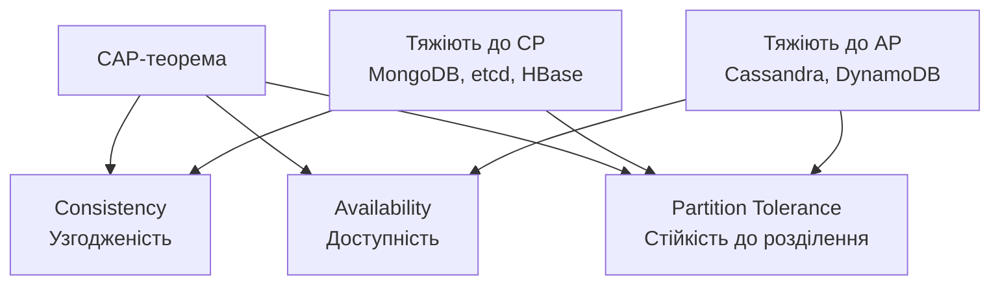
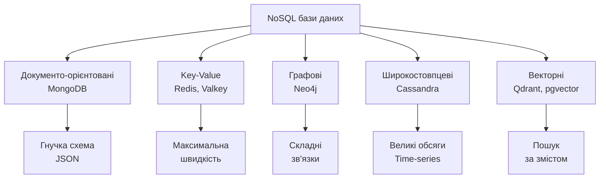
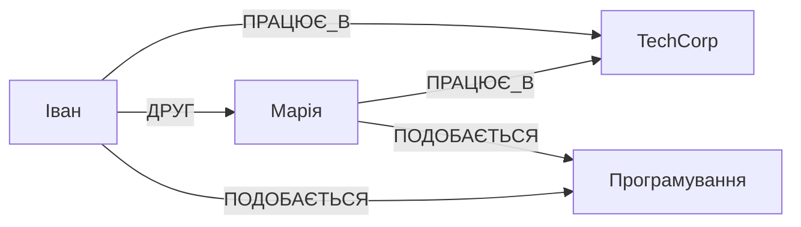
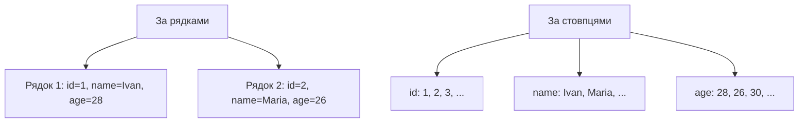
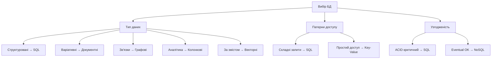
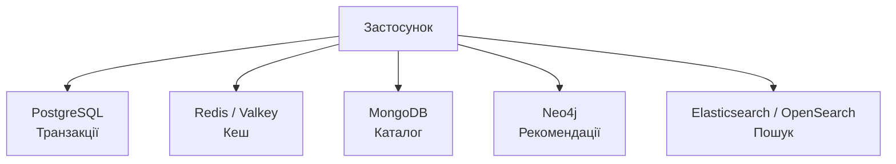
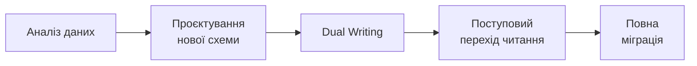

# Робота з базами даних: реляційні та NoSQL

## План лекції

1. Огляд баз даних та їх роль
2. Реляційні бази даних
3. SQL: мова запитів
4. NoSQL: альтернативний підхід
5. Типи NoSQL баз
6. Порівняння та вибір
7. Практичні аспекти

## Основні поняття

- **СУБД** — програма для зберігання, пошуку й захисту даних
- **Реляційна модель** — таблиці + первинні й зовнішні ключі
- **Транзакція та ACID** — «все або нічого» + гарантії надійності
- **SQL** — декларативна мова запитів
- **NoSQL** — «не лише SQL»: документні, key-value, графові, широкостовпцеві, векторні
- **CAP / BASE** — вибір між узгодженістю й доступністю під час розриву мережі
- **Індекс** — прискорює пошук, уповільнює запис

## 1. Огляд баз даних

## Навіщо потрібні бази даних?

### 💾 Кожен застосунок потребує:

- **Зберігання даних** — надійне та довготривале
- **Організація інформації** — структуроване зберігання
- **Швидкий доступ** — ефективний пошук та вибірка
- **Цілісність даних** — запобігання втратам і пошкодженню
- **Паралельний доступ** — багато користувачів одночасно

### 🎯 Типи застосунків:

- Вебсайти та мобільні застосунки
- Корпоративні системи (ERP, CRM)
- Аналітичні платформи
- IoT та системи реального часу
- ШІ-застосунки (пошук за змістом, RAG)

## Еволюція баз даних



### 💡 Сьогодні:
Підходи зближуються: PostgreSQL вміє JSON і векторний пошук, а NoSQL-бази отримали транзакції

## 2. Реляційні бази даних

## Реляційна модель даних

### 📊 Організація у вигляді таблиць:



**Таблиця** = набір рядків з однаковою структурою

**Рядок** = окремий запис (екземпляр сутності)

**Стовпець** = атрибут сутності

## Ключові концепції

### 🔑 Первинний ключ (Primary Key):

- Однозначно ідентифікує кожен рядок
- Не може бути NULL
- Незмінний протягом життя запису
- Випадкові UUID v4 погано для індексів → **UUID v7** (у PostgreSQL 18 — `uuidv7()`)

### 🔗 Зовнішній ключ (Foreign Key):

- Посилається на первинний ключ іншої таблиці
- Створює зв'язки між таблицями
- Забезпечує цілісність даних

### 🔄 Типи зв'язків:

- **Один-до-багатьох** — найпоширеніший
- **Багато-до-багатьох** — через проміжну таблицю
- **Один-до-одного** — рідше використовується

## Схема в SQL

```sql
CREATE TABLE customers (
    customer_id INTEGER GENERATED ALWAYS AS IDENTITY PRIMARY KEY,
    name        TEXT NOT NULL,
    email       TEXT NOT NULL UNIQUE
);

CREATE TABLE orders (
    order_id     INTEGER GENERATED ALWAYS AS IDENTITY PRIMARY KEY,
    customer_id  INTEGER NOT NULL REFERENCES customers (customer_id),
    total_amount NUMERIC(12, 2) NOT NULL CHECK (total_amount >= 0),
    status       TEXT NOT NULL DEFAULT 'new'
);
```

### 🛡️ Обмеження — правила в самій базі:
`NOT NULL`, `UNIQUE`, `CHECK`, `REFERENCES`

### 💰 Гроші — `NUMERIC`/`DECIMAL`, не `float`

## ACID властивості

### 💎 Гарантії надійності транзакцій:

**A - Atomicity (Атомарність)**
- Все або нічого
- Приклад: переказ грошей

**C - Consistency (Узгодженість)**
- З коректного стану в коректний
- Усі обмеження виконуються

**I - Isolation (Ізольованість)**
- Транзакції не впливають одна на одну
- Рівні ізоляції: Read Committed, Repeatable Read, Serializable

**D - Durability (Довговічність)**
- Зміни збережені назавжди
- Навіть після збою системи

## ACID у дії

```python
import sqlite3

conn = sqlite3.connect(":memory:")
conn.execute("""CREATE TABLE accounts (
    id INTEGER PRIMARY KEY,
    balance INTEGER NOT NULL CHECK (balance >= 0))""")
conn.executemany("INSERT INTO accounts VALUES (?, ?)",
                 [(1, 1500), (2, 200)])
conn.commit()

def transfer(conn, from_id, to_id, amount):
    with conn:  # успіх → COMMIT, виняток → ROLLBACK
        conn.execute("UPDATE accounts SET balance = balance - ? "
                     "WHERE id = ?", (amount, from_id))
        conn.execute("UPDATE accounts SET balance = balance + ? "
                     "WHERE id = ?", (amount, to_id))

transfer(conn, 1, 2, 1000)      # OK: 500 і 1200
try:
    transfer(conn, 1, 2, 1000)  # баланс став би < 0
except sqlite3.IntegrityError:
    print("Переказ скасовано")
```

Стан рахунків **залишається коректним**

## Нормалізація

### 🧹 Навіщо: менше дублювання, вища цілісність

| order_id | customer_name | customer_email | products |
|----------|---------------|----------------|----------|
| 1 | Іван Петренко | ivan@example.com | ноутбук, миша |
| 2 | Іван Петренко | ivan@example.com | клавіатура |

### ❌ Проблеми:
- Дані клієнта повторюються
- Список у полі `products`

### ✅ Нормальні форми:
- **1НФ** — атомарні значення (окрема таблиця `order_items`)
- **2НФ** — залежність від усього ключа
- **3НФ** — без транзитивних залежностей

### ⚖️ Денормалізація — свідомо, коли є вимірювана потреба

## Популярні реляційні СУБД

### 🐘 PostgreSQL

**Сильні сторони:**
- Потужна та надійна
- JSON (`JSONB`), масиви, геодані, `pgvector`
- Розширюваність
- Відмінна для складних запитів

**Версії:** актуальна — **18** (вересень 2025); **19** — у бета-тестуванні

**Використання:** корпоративні системи, аналітика

### 🐬 MySQL

**Сильні сторони:**
- Дуже поширена, проста у використанні
- Швидка для типових вебзастосунків
- LAMP/LEMP стек, WordPress

**Версії:** 8.0 — **вийшла з підтримки (квітень 2026)**; використовуйте LTS: **8.4**, **9.7**

**Використання:** вебзастосунки, CMS

## SQLite

### 📱 Вбудована база даних:

```python
import sqlite3

# Створення/підключення
conn = sqlite3.connect('myapp.db')
cursor = conn.cursor()

# Виконання запиту
cursor.execute('''
    CREATE TABLE users (
        id INTEGER PRIMARY KEY,
        name TEXT,
        email TEXT UNIQUE
    )
''')
```

**Особливості:**
- Один файл = уся база
- Без серверного процесу
- Модуль `sqlite3` — у стандартній бібліотеці Python
- Ідеальна для мобільних застосунків, тестів, навчання

### ☁️ Також: керовані хмарні СУБД, NewSQL (CockroachDB, Spanner), DuckDB

## 3. SQL: мова запитів

## SELECT — вибірка даних

```sql
SELECT
    product_id,
    product_name,
    price,
    stock_quantity
FROM products
WHERE category = 'Electronics'
    AND price > 1000
ORDER BY price DESC
LIMIT 10;
```

### 🔍 Основні компоненти:

- **SELECT** — які стовпці
- **FROM** — з якої таблиці
- **WHERE** — умови фільтрації
- **ORDER BY** — сортування
- **LIMIT** — обмеження результатів

## JOIN — об'єднання таблиць

```sql
SELECT
    c.name AS customer_name,
    o.order_date,
    o.total_amount
FROM customers c
INNER JOIN orders o
    ON c.customer_id = o.customer_id
WHERE o.order_date >= '2026-01-01'
ORDER BY o.order_date DESC;
```

### 🔗 Типи JOIN:

**INNER JOIN** — лише збіги в обох таблицях

**LEFT JOIN** — усі записи зліва + збіги справа (NULL, якщо збігу немає)

**RIGHT JOIN** — усі записи справа + збіги зліва

## Агрегатні функції

```sql
SELECT
    category,
    COUNT(*) AS product_count,
    AVG(price) AS average_price,
    MIN(price) AS min_price,
    MAX(price) AS max_price,
    SUM(stock_quantity) AS total_stock
FROM products
GROUP BY category
HAVING AVG(price) > 500
ORDER BY average_price DESC;
```

### 📊 Функції:

**COUNT** — кількість | **AVG** — середнє | **SUM** — сума | **MIN/MAX** — екстремуми

**GROUP BY** — групування | **HAVING** — фільтр груп (`WHERE` — фільтр рядків)

## Транзакції

```sql
START TRANSACTION;

-- Списання з рахунку
UPDATE accounts
SET balance = balance - 1000
WHERE account_id = 1 AND balance >= 1000;

-- Зарахування на рахунок
UPDATE accounts
SET balance = balance + 1000
WHERE account_id = 2;

-- Запис транзакції
INSERT INTO transactions (from_account, to_account, amount)
VALUES (1, 2, 1000);

COMMIT;
-- або ROLLBACK при помилці
```

### ⚠️ Підводний камінь:
Якщо коштів бракує, перший `UPDATE` змінить **0 рядків** без помилки — перевіряйте кількість змінених рядків або додайте `CHECK (balance >= 0)`

## 4. NoSQL: альтернативний підхід

## Чому виникли NoSQL?

### 📈 Виклики реляційних БД:

**Масштабування**
- Петабайти даних
- Горизонтальне масштабування складне
- Вертикальне досягло меж

**Гнучкість**
- Зміни схеми = складні міграції
- Різні атрибути для різних записів
- Швидка розробка

**Географія**
- Глобальні сервіси
- Низька затримка скрізь
- Складна реплікація з ACID

## NoSQL = Not Only SQL

### 🎯 Характеристики:

- Горизонтальне масштабування
- Гнучка або відсутня схема
- Eventual consistency (часто)
- Спеціалізація під сценарії використання
- Спрощений інтерфейс

### ⚖️ Це не заміна!

Реляційні БД оптимальні для багатьох задач

NoSQL розв'язує специфічні проблеми

Розрив зменшується: у MongoDB є транзакції, у PostgreSQL — JSONB

## CAP теорема



### ⚠️ Під час розриву мережі не можна мати обидві: узгодженість і доступність!

## CAP: що обирати?

**Consistency (C)** — усі бачать однакові дані одночасно

**Availability (A)** — кожен запит отримує відповідь

**Partition Tolerance (P)** — робота при мережевих розривах

### 🎯 На практиці:

**P неминуче** в розподілених системах

Вибір між **C** та **A** виникає **лише під час розриву**

**CP:** фінанси, критичні дані

**AP:** соціальні мережі, аналітика

### 🔎 Застереження:
Багато баз налаштовуються (Cassandra — рівень узгодженості на запит). «CP/AP» — лише типова схильність

## BASE vs ACID

### 🆚 Альтернативний підхід:

**BA - Basically Available**
- Система доступна більшість часу
- Можливі часткові збої

**S - Soft State**
- Стан може змінюватися без запитів
- Активна синхронізація

**E - Eventually Consistent**
- Зрештою всі вузли синхронізуються
- Тимчасові розбіжності допустимі

### 💡 Компроміс:

Жертвуємо сильною узгодженістю заради доступності та продуктивності

## 5. Типи NoSQL баз

## П'ять основних типів



## Документо-орієнтовані БД

### 📄 MongoDB — найпопулярніша:

```json
{
  "_id": "507f1f77bcf86cd799439011",
  "name": "Ноутбук Dell XPS 15",
  "category": "Electronics",
  "price": 45999,
  "specifications": {
    "processor": "Intel Core i7",
    "ram": "16GB",
    "storage": "512GB SSD"
  },
  "reviews": [
    {"user": "user123", "rating": 5}
  ],
  "tags": ["laptop", "premium"],
  "in_stock": true
}
```

**Кожен документ самодостатній!**

**Гнучка схема ≠ відсутність схеми** — є валідація за JSON Schema

## MongoDB: запити

```javascript
// Пошук
db.products.find({
  category: "Electronics",
  price: { $gt: 20000 }
}).sort({ price: -1 }).limit(10)

// Оновлення
db.products.updateOne(
  { _id: ObjectId("...") },
  {
    $set: { price: 42999 },
    $push: { tags: "sale" }
  }
)

// Агрегація
db.products.aggregate([
  { $unwind: "$reviews" },
  { $group: {
    _id: "$_id",
    avgRating: { $avg: "$reviews.rating" }
  }}
])
```

## MongoDB: коли використовувати?

### ✅ Ідеальна для:

**Каталоги товарів**
- Варіативні атрибути
- Електроніка ≠ Одяг ≠ Книги

**CMS-системи**
- Різні типи вмісту
- Статті, відео, зображення

**Профілі користувачів**
- Різна повнота інформації
- Легке додавання полів

**Аналітика в реальному часі**
- Структуровані події
- Швидкий запис

### ℹ️ Транзакції — з версії 4.0; актуальна основна версія — 8.0

## Key-Value сховища

### 🗝️ Найпростіша модель:

```
Ключ           →    Значення
"user:1000"    →    {"name": "Іван", "email": "ivan@..."}
"session:abc"  →    {"user_id": 1000, "expires": "..."}
"cache:query"  →    [результати запиту]
```

### ⚡ Операції:

**SET** — записати | **GET** — прочитати | **DELETE** — видалити

**Мікросекундна затримка!**

## Redis — сервер структур даних

```python
import redis
r = redis.Redis()

# Рядки зі строком дії
r.setex('session:abc', 3600, 'data')

# Списки (черги)
r.lpush('queue:tasks', 'task1')
task = r.rpop('queue:tasks')

# Хеші
r.hset('user:1000', mapping={
    'name': 'Іван',
    'points': 150
})
r.hincrby('user:1000', 'points', 10)

# Таблиці лідерів
r.zadd('leaderboard', {'player1': 1500})
r.zrevrange('leaderboard', 0, 9)
```

### 📜 Ліцензії: Redis 8 — AGPLv3 (з 2025); форк **Valkey** — BSD, під Linux Foundation

## Redis: сценарії використання

### 🚀 Типові застосування:

**Кешування**
- Результати запитів
- Сесії користувачів
- Автоматичне завершення строку дії (TTL)
- Пам'ятайте про **інвалідацію** кешу

**Черги повідомлень**
- Асинхронна обробка
- Фонові завдання
- Для надійності — Redis Streams або брокери

**Аналітика в реальному часі**
- Лічильники
- Таблиці лідерів

**Pub/Sub**
- Повідомлення в реальному часі
- Чати, сповіщення

### ⚡ Чому швидкий?

Усі дані в RAM! Але це насамперед **кеш**, а не основне сховище

## Графові бази даних

### 🌐 Neo4j — модель графа:



**Вершини** — сутності (люди, компанії)

**Ребра** — зв'язки (дружба, робота)

**Властивості** — атрибути

## Cypher: мова запитів Neo4j

```cypher
// Створення
CREATE (ivan:Person {name: 'Іван', age: 28})
CREATE (maria:Person {name: 'Марія', age: 26})
CREATE (ivan)-[:FRIEND_OF {since: '2020'}]->(maria)

// Пошук друзів друзів (FOAF)
MATCH (me:Person {name: 'Іван'})-[:FRIEND_OF]-(friend)-[:FRIEND_OF]-(foaf)
WHERE NOT (me)-[:FRIEND_OF]-(foaf)
RETURN DISTINCT foaf.name

// Рекомендації: спільні навички
MATCH (me:Person {name: 'Іван'})-[:HAS_SKILL]->(skill)<-[:HAS_SKILL]-(other)
WHERE NOT (me)-[:FRIEND_OF]-(other)
RETURN other.name, COUNT(skill) AS common
ORDER BY common DESC
```

### 📐 Стандарти: **GQL** (ISO/IEC 39075, 2024), **SQL/PGQ** (SQL:2023; у PostgreSQL 19)

## Графові БД: коли використовувати?

### ✅ Ідеальна для:

**Соціальні мережі**
- Друзі друзів
- Люди, яких ви можете знати
- Найкоротший шлях

**Рекомендаційні системи**
- Схожі користувачі/товари

**Виявлення шахрайства**
- Підозрілі патерни транзакцій
- Кільця платежів

**Графи знань**
- Взаємозв'язки понять
- Семантичні запити

## Колонкові: два значення терміна

### 📊 Колонкове зберігання (аналітика, OLAP):



### 💡 Переваги:

**Стискання** — однотипні дані стискаються краще

**Агрегації** — читаємо лише потрібні стовпці

**Приклади:** ClickHouse, DuckDB, BigQuery, файли Parquet

### ⚠️ Не плутати з широкостовпцевими (Cassandra)!

## Cassandra: широкостовпцеве сховище

### 📈 Високомасштабована NoSQL:

```cql
-- Keyspace
CREATE KEYSPACE ecommerce
WITH replication = {
  'class': 'NetworkTopologyStrategy',
  'datacenter1': 3
};

-- Таблиця під запит «замовлення користувача»
CREATE TABLE orders (
  user_id UUID,
  order_date TIMESTAMP,
  order_id UUID,
  total_amount DECIMAL,
  PRIMARY KEY (user_id, order_date, order_id)
) WITH CLUSTERING ORDER BY (order_date DESC);
```

**Без головного вузла** — усі рівноправні

**Лінійне масштабування**, узгодженість налаштовується на запит

**Без JOIN**: модель проєктують «від запитів»

**Cassandra 5.0:** індекси SAI, векторний пошук

## Cassandra: коли використовувати?

### ✅ Ідеальна для:

**IoT-дані**
- Мільйони пристроїв
- Регулярні вимірювання

**Часові ряди (time-series)**
- Журнали, метрики
- Історичні дані

**Навантаження з великою кількістю записів**
- Високий обсяг запису
- Розподілене зберігання

**Географічно розподілені системи**
- Центри обробки даних у різних регіонах
- Висока доступність

## Векторні бази даних

### 🧠 Ембединги: текст → вектор, схожий зміст = близькі вектори

```sql
-- pgvector (PostgreSQL)
CREATE TABLE documents (
    id BIGINT GENERATED ALWAYS AS IDENTITY PRIMARY KEY,
    content TEXT NOT NULL,
    embedding VECTOR(1536)
);

CREATE INDEX ON documents USING hnsw (embedding vector_cosine_ops);

SELECT id, content
FROM documents
ORDER BY embedding <=> :query_embedding
LIMIT 5;
```

### 🎯 Навіщо:
- **Семантичний пошук** — знаходить за змістом, а не словами
- **RAG** — знайти релевантні фрагменти й додати до запиту моделі

### 🧰 Варіанти:
- Спеціалізовані: Qdrant, Milvus, Weaviate, Pinecone
- Вбудовані: `pgvector`, MongoDB, Redis, Cassandra 5.0

## 6. Порівняння та вибір

## Порівняльна таблиця

| Характеристика | SQL | Документні | Key-Value | Графові | Широкостовпцеві | Векторні |
|----------------|-----|------------|-----------|---------|-----------------|----------|
| **Схема** | Фіксована | Гнучка | Немає | Гнучка | Фіксована (під запити) | Вектор + метадані |
| **Масштабування** | Переважно вертикальне; реплікація, секціонування | Горизонтальне | Горизонтальне | Вертикальне / горизонтальне | Горизонтальне | Горизонтальне |
| **Узгодженість** | ACID | Налаштовується | Переважно eventual | ACID | Налаштовується | Залежить |
| **Складні запити** | ⭐⭐⭐ | ⭐⭐ | ⭐ | ⭐⭐⭐ (графи) | ⭐ (заздалегідь відомі) | Пошук найближчих |
| **Продуктивність** | Висока | Дуже висока | Максимальна | Висока для зв'язків | Висока для запису | Висока для пошуку |

## Як обрати тип БД?



### 🧑‍💻 Не забувайте: досвід команди, вартість підтримки, зрілість інструментів

## Сценарії використання: SQL

### ✅ Використовуйте SQL, коли:

**Транзакції критичні**
- Фінансові системи
- Замовлення в інтернет-магазині
- Банківські операції

**Структуровані дані**
- Чітка схема
- Складні зв'язки
- JOIN часто потрібні

**ACID обов'язковий**
- Узгодженість критична
- Жодних компромісів

**Складна аналітика**
- Багато JOIN
- Складні агрегації

## Сценарії використання: NoSQL

### ✅ Використовуйте NoSQL, коли:

**Величезні обсяги**
- Петабайти даних
- Горизонтальне масштабування

**Гнучка схема**
- Часті зміни структури
- Різні атрибути для записів

**Спеціалізовані патерни**
- Графи зв'язків
- Часові ряди
- Обробка в реальному часі
- Пошук за змістом

**Eventual consistency — ОК**
- Соціальні мережі
- Аналітика
- Журналювання

## Polyglot Persistence

### 🎯 Сучасний підхід — кілька БД:



### ⚖️ Баланс:

**Переваги:** сильні сторони кожної технології

**Недоліки:** складність архітектури та підтримки

### 💡 Часто розумно почати з однієї бази (PostgreSQL) і додавати нові за конкретною потребою

## Приклад Polyglot

### 🛒 Інтернет-магазин:

**PostgreSQL**
- Замовлення та платежі
- Облікові записи
- Фінансові транзакції

**Redis / Valkey**
- Кеш сторінок
- Сесії користувачів
- Лічильники в реальному часі

**MongoDB**
- Каталог товарів
- Відгуки користувачів
- Блог та вміст

**Neo4j**
- Рекомендації товарів
- «З цим товаром купують»

**Elasticsearch / OpenSearch**
- Пошук по каталогу

## 7. Практичні аспекти

## Індексація

### 🚀 Критична для продуктивності:

```sql
-- SQL
CREATE INDEX idx_products_category
ON products(category);

-- Складений індекс
CREATE INDEX idx_orders_customer_date
ON orders(customer_id, order_date);
```

```javascript
// MongoDB
db.products.createIndex({ category: 1 })
db.products.createIndex({ category: 1, price: -1 })
```

### ⚖️ Компроміс:

**Плюси:** швидший пошук

**Мінуси:** повільніший запис, більше місця

**Порядок стовпців у складеному індексі має значення**

## Оптимізація запитів

### 📊 Аналіз виконання:

```sql
-- SQL
EXPLAIN ANALYZE
SELECT c.name, COUNT(o.order_id)
FROM customers c
LEFT JOIN orders o ON c.customer_id = o.customer_id
GROUP BY c.customer_id;
```

```javascript
// MongoDB
db.products.find({ category: "Electronics" })
  .explain("executionStats")
```

### 🎯 На що дивитися:

- Sequential Scan → потрібен індекс
- Використання індексів
- Кількість оброблених рядків
- **Проблема N+1** — 1 запит + N запитів у циклі → один `JOIN`

## Безпека: SQL-ін'єкції

### ❌ НІКОЛИ так не робіть:

```python
# Небезпечно!
email = request.get('email')
query = f"SELECT * FROM users WHERE email = '{email}'"
```

### ✅ ЗАВЖДИ параметризовані запити:

```python
# Безпечно
email = request.get('email')
query = "SELECT * FROM users WHERE email = %s"
cursor.execute(query, (email,))
```

### 🛡️ Додаткові заходи:

- Мінімальні привілеї для користувачів БД
- Валідація вхідних даних
- ORM (SQLAlchemy, Django ORM)
- Паролі до БД — у змінних оточення, не в коді
- TLS для з'єднань

## Резервне копіювання

### 💾 Стратегії:

**Повне копіювання**
- Уся база даних
- Просте відновлення
- Займає багато місця

**Інкрементне**
- Лише зміни
- Економія простору
- Складніше відновлення

**Безперервне (PITR)**
- Журнал транзакцій
- Відновлення на будь-який момент

```bash
# PostgreSQL
pg_dump -Fc mydb > backup.dump

# MongoDB
mongodump --db mydb --out /backup/

# Redis (BGSAVE; SAVE блокує сервер)
redis-cli BGSAVE
```

### ⚠️ Критично: **тестуйте відновлення!** Правило 3-2-1

## Міграція даних

### 🔄 Із SQL на NoSQL:



### 📋 Етапи:

1. Аналіз патернів доступу
2. Проєктування нової схеми
3. Розробка скриптів міграції
4. Тестування на підмножині
5. Подвійний запис (обидві БД)
6. Поступове переключення
7. Вимкнення старої БД

### 🗂️ Міграції схеми: Alembic, Flyway, Liquibase — версіоновані файли в репозиторії

## Синхронізація в Polyglot

### 🔄 Подієвий підхід:

```python
def create_order(order_data):
    with postgres_db.transaction():
        order_id = postgres_db.create_order(order_data)
        # Подія — у ТІЙ САМІЙ транзакції (outbox)
        postgres_db.add_outbox_event('order.created', {
            'order_id': order_id,
            'customer_id': order_data['customer_id']
        })
    # Окремий процес публікує події з outbox у брокер:
    # - MongoDB оновлює профіль
    # - Redis інвалідує кеш
    # - Elasticsearch індексує
```

### ⚠️ Подвійний запис ненадійний: збій між записом у БД і публікацією події втрачає подію
**Transactional outbox** або CDC розв'язують проблему

## Моніторинг та метрики

### 📊 Що відстежувати:

**Продуктивність**
- Час відповіді (затримка)
- Пропускна здатність (запитів/сек)
- Час виконання запитів

**Ресурси**
- Використання CPU та RAM
- Дискове введення-виведення
- Пропускна здатність мережі

**Надійність**
- Частка помилок
- Використання пулу з'єднань
- Відставання реплікації

### 🔍 Інструменти:

Prometheus, Grafana, DataDog, New Relic

## Найкращі практики

### ✅ Завжди робіть:

**Проєктування**
- Аналізуйте патерни доступу перед вибором БД
- Плануйте масштабування заздалегідь
- Документуйте схему даних

**Безпека**
- Параметризовані запити
- Мінімальні привілеї
- Регулярні резервні копії

**Моніторинг**
- Відстежуйте метрики
- Налаштуйте сповіщення
- Плануйте потужності

**Оптимізація**
- Створюйте індекси розумно
- Аналізуйте повільні запити
- Кешуйте часті запити

## Коли НЕ потрібен NoSQL

### ⚠️ Уникайте NoSQL, якщо:

**Невеликі проєкти**
- Невеликий обсяг даних
- Помірне навантаження
- SQL цілком справляється

**ACID критичний**
- Фінансові транзакції
- Медичні записи
- Юридичні документи

**Команда не готова**
- Відсутній досвід
- Немає часу на навчання
- Складність не виправдана

### 💡 Правило:

Починайте з SQL, переходьте на NoSQL, коли є чіткі причини

## Висновки

### 🎯 Ключові моменти:

1. **Не існує універсального рішення** — кожен тип БД для своїх задач
2. **SQL залишається актуальним** — для структурованих даних і транзакцій
3. **NoSQL розв'язує специфічні проблеми** — масштабування, гнучкість, спеціалізація
4. **CAP теорема** — вибір між C та A виникає під час розриву мережі
5. **П'ять типів NoSQL** — документні, key-value, графові, широкостовпцеві, векторні
6. **Polyglot Persistence** — комбінація БД, але кожна додає складності
7. **Правильний вибір** залежить від даних, патернів доступу та вимог

## Практичні рекомендації

### 💡 Поради для студентів:

**Вивчайте SQL першим**
- Фундаментальні концепції
- Застосовні до всіх БД
- Найширше використання

**Експериментуйте з NoSQL**
- Спробуйте MongoDB для власних проєктів
- Redis або Valkey для кешування
- Зрозумійте відмінності на практиці

**Розумійте компроміси**
- Кожен вибір має ціну
- Узгодженість vs Доступність
- Простота vs Продуктивність

**Стежте за трендами**
- Технології еволюціонують
- Гібридні рішення (JSON і вектори в PostgreSQL)
- Найкращі практики змінюються

## Ресурси для поглибленого вивчення

### 📚 Документація та навчання:

**SQL:**
- Документація PostgreSQL та підручник
- Документація MySQL
- SQL Zoo (інтерактивне навчання)

**NoSQL:**
- Безкоштовні курси MongoDB
- Курси Redis
- Neo4j GraphAcademy

**Книги:**
- "Designing Data-Intensive Applications" — Martin Kleppmann
- "Seven Databases in Seven Weeks"

### 🎯 Практика:

Створюйте реальні проєкти з різними типами БД!

## Підсумок

### 🔑 Головна думка:

**Успішний інженер розуміє:**

✅ Сильні та слабкі сторони кожного типу БД

✅ Коли використовувати SQL, а коли NoSQL

✅ Як поєднувати різні технології

✅ Важливість ACID для одних систем

✅ Переваги eventual consistency для інших

### 💡 Пам'ятайте:

**Інструмент має відповідати задачі, а не навпаки!**

### ➡️ Далі:
Лекція 11 — RESTful API
