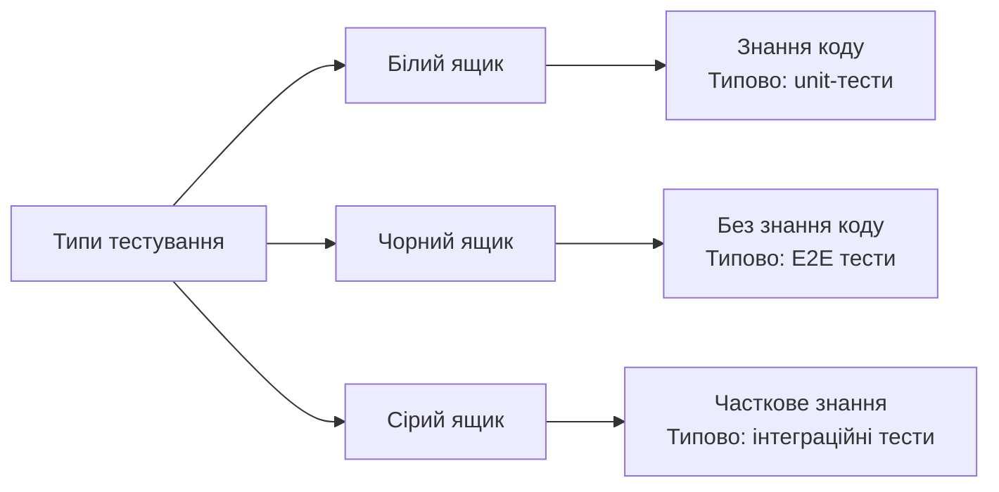
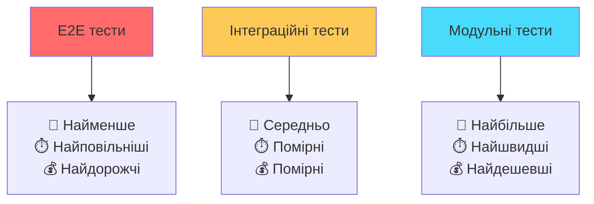
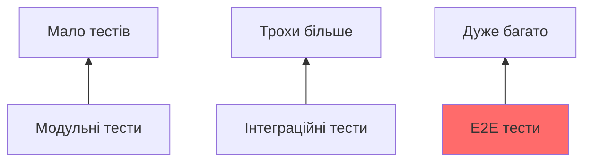
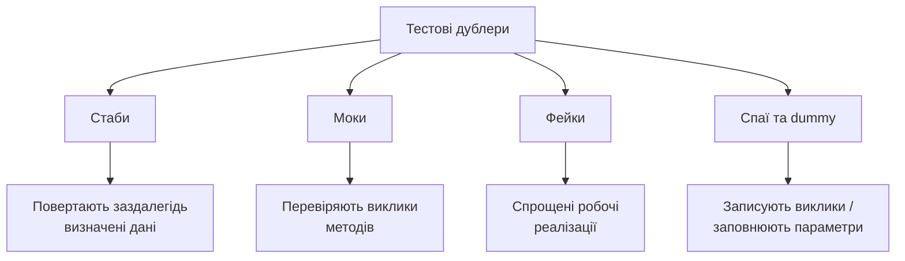
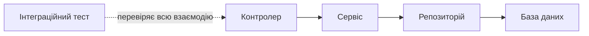
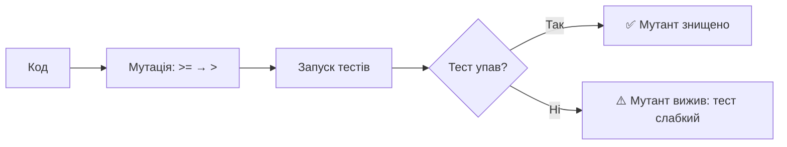
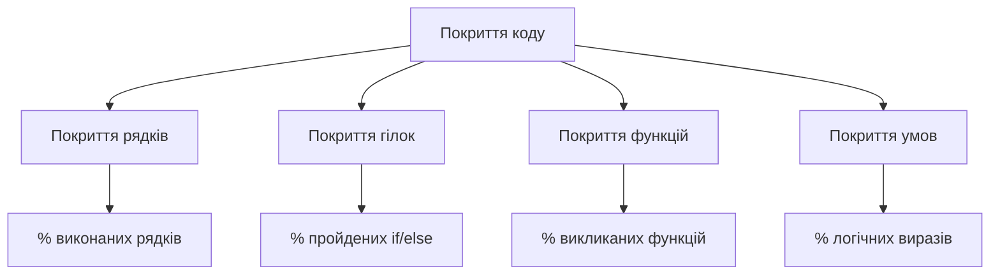
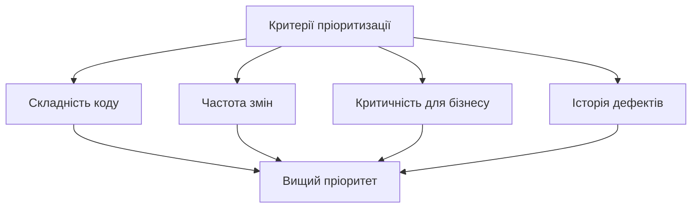
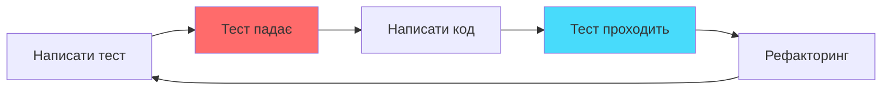

# Стратегії тестування: піраміда тестів

## План лекції

1. Основи тестування ПЗ
2. Концепція піраміди тестів
3. Модульні тести: фундамент
4. Інтеграційні тести: середина
5. End-to-End тести: вершина
6. Сучасні техніки тестування
7. Покриття коду
8. Стратегія тестування

## Основні поняття

- **Тестування** — систематичне виконання програми для пошуку помилок і перевірки відповідності очікуванням
- **Верифікація / валідація** — «правильно створюємо?» / «те створюємо?»
- **Піраміда тестів** — багато швидких тестів унизу, мало повільних угорі
- **Модульний (unit) тест** — перевіряє окрему функцію в ізоляції
- **Інтеграційний тест** — перевіряє взаємодію компонентів
- **Наскрізний (E2E) тест** — проходить сценарій користувача через усю систему
- **Тестовий дублер** — заміна реальної залежності в тесті
- **Покриття коду** — частка коду, виконаного тестами

## 1. Основи тестування

## Що таке тестування?

**Тестування** — систематичний процес виконання програми для виявлення помилок та перевірки відповідності результатів очікуваним.

### 🎯 Основні цілі:

- Верифікація: чи створюємо продукт правильно?
- Валідація: чи створюємо правильний продукт?
- Раннє виявлення проблем
- Підвищення впевненості в якості

### 💡 Ключова ідея:

Ціна помилки зростає з часом — знаходьте її якомога раніше

## Принципи ефективного тестування

### ✅ Основні принципи:

1. **Тестування показує наявність дефектів**, але не може довести їх відсутність
2. **Вичерпне тестування неможливе** — фокус на ризиках і критичних сценаріях
3. **Раннє тестування** економить час та гроші
4. **Концентрація дефектів** — приблизно 80% проблем у 20% коду
5. **Пестицидний парадокс** — однакові тести з часом перестають знаходити нові помилки
6. **Залежність від контексту** — медична система ≠ мобільна гра

## Типи тестування за знанням



**Відповідності типові, а не жорсткі**

## 2. Піраміда тестів

## Концепція піраміди



**Автор концепції:** Майк Кон (Mike Cohn), 2009

## Чому піраміда?

### 📊 Орієнтовний розподіл (практика Google):

- **70%** — модульні тести
- **20%** — інтеграційні тести
- **10%** — E2E тести

### 🎯 Логіка:

Більшість тестів на нижньому рівні забезпечує:

- Швидкий зворотний зв'язок розробникам
- Легку ідентифікацію проблем
- Низьку вартість створення та підтримки
- Можливість частого запуску

**Це орієнтир, а не закон**

## Еволюція моделі

### 🏆 Трофей тестування (Testing Trophy)

Акцент на інтеграційних тестах + статичний аналіз унизу. Популярний для клієнтської частини вебзастосунків.

### 🐝 Соти (Honeycomb)

Для мікросервісів: основна цінність — у тестах взаємодії сервісів.

### 💡 Спільне:

Баланс між швидкістю, вартістю та впевненістю

## Антипатерни тестування

### 🍦 Крижаний ріжок (перевернута піраміда)



**Проблеми:**

- Повільне виконання
- Складна підтримка
- Важко знайти причину проблеми

### ⏳ Годинникове скло

Багато модульних і багато E2E тестів, але мало інтеграційних посередині

## 3. Модульні тести

## Характеристики модульних тестів

### ✨ Ключові властивості:

- ⚡ **Швидкість** — мілісекунди на тест
- 🔒 **Ізольованість** — перевіряють одну функцію
- 🎲 **Детермінованість** — однаковий результат щоразу
- 🚫 **Незалежність** — без БД, мережі, файлів

### 🎯 Що тестуємо:

- Окремі функції та методи
- Логіку обчислень
- Граничні випадки
- Обробку помилок

## Структура тесту: AAA

### Arrange-Act-Assert (Given-When-Then)

```python
def test_calculate_discount():
    # Arrange (Given) — підготовка
    price = 100
    quantity = 15

    # Act (When) — дія
    discount = calculate_discount(price, quantity)

    # Assert (Then) — перевірка
    assert discount == 5
```

**Переваги:** чітка структура, легко читати та підтримувати

## Приклад: pytest

```python
def calculate_discount(price, quantity):
    if quantity >= 100:
        return price * 0.2
    elif quantity >= 50:
        return price * 0.1
    elif quantity >= 10:
        return price * 0.05
    return 0
```

```python
import pytest

@pytest.mark.parametrize("quantity, expected", [
    (5, 0), (9, 0), (10, 5),
    (49, 5), (50, 10), (100, 20),
])
def test_discount(quantity, expected):
    assert calculate_discount(100, quantity) == expected
```

**Перевіряйте межі:** 9 / 10, 49 / 50, 99 / 100

## Тестові дублери



**Мета:** ізоляція тестованого коду від залежностей

⚠️ Мокайте межі системи (пошта, зовнішні API), а не кожен внутрішній клас

## 4. Інтеграційні тести

## Роль інтеграційних тестів

### 🔗 Що перевіряють:

- Взаємодію між модулями
- Передачу даних між компонентами
- Роботу з базою даних
- API-ендпоінти
- Інтеграцію із зовнішніми сервісами



## Стратегії інтеграції

### 📈 Знизу вгору

Починаємо з базових модулів → рухаємось до верхніх рівнів

### 📉 Зверху вниз

Починаємо з верхнього рівня → рухаємось до базових модулів

### 🥪 Сендвіч (гібридна)

Поєднуємо обидва підходи, тестуємо критичні модулі паралельно

## Приклад інтеграційного тесту

```python
def test_create_user_endpoint(client):
    # Arrange
    user_data = {
        "username": "testuser",
        "email": "test@example.com",
        "password": "securepass",
    }

    # Act
    response = client.post("/api/users", json=user_data)

    # Assert
    assert response.status_code == 201
    assert "id" in response.get_json()

    # Перевірка стану бази даних
    user = get_user_by_email("test@example.com")
    assert user is not None
```

`client` — тестовий клієнт фреймворку (фікстура pytest)

## Testcontainers: реальна БД у тестах

### 🐳 Проблема:

SQLite у пам'яті ≠ PostgreSQL у продакшені

### ✅ Рішення:

```python
from testcontainers.postgres import PostgresContainer

@pytest.fixture(scope="session")
def database_url():
    with PostgresContainer("postgres:17") as pg:
        yield pg.get_connection_url()
```

Справжня СУБД у контейнері на час тестів — потрібен лише Docker

## Управління тестовими даними

### 🔧 Інструменти:

**Фікстури** — підготовлені набори даних і ресурсів

**Фабрики** — генерують тестові об'єкти динамічно (factory_boy, Faker)

**Транзакції** — відкат змін після тесту

### ⚠️ Важливо:

- Кожен тест працює з чистим станом
- Тести незалежні один від одного
- Можливість виконання в будь-якому порядку

## 5. End-to-End тести

## Характеристики E2E тестів

### 🎭 Що перевіряють:

Систему повністю від інтерфейсу до БД, імітуючи реальні сценарії користувача

### ⚙️ Особливості:

- ⏰ Повільне виконання (хвилини)
- 🏗️ Складне налаштування
- 💸 Дорога підтримка
- 🎯 Висока цінність для бізнесу
- 🔄 Реальне середовище

**Покривайте лише «золоті шляхи»**: вхід, оформлення замовлення

## Інструменти E2E тестування

### 🛠️ Популярні рішення:

**Playwright** — від Microsoft, Chromium + Firefox + WebKit, автоочікування, trace

**Cypress** — швидкий, зручний для розробників

**Selenium** — класичний, універсальний, потребує акуратних очікувань

**Puppeteer** — для Chrome/Chromium

### 💡 Вибір залежить від:

Технологічного стеку, вимог до браузерів, досвіду команди

## Page Object Model

```python
from playwright.sync_api import Page, expect

class LoginPage:
    def __init__(self, page: Page):
        self.page = page
        self.username = page.get_by_label("Ім'я користувача")
        self.password = page.get_by_label("Пароль")
        self.button = page.get_by_role("button", name="Увійти")

    def login(self, user, pwd):
        self.username.fill(user)
        self.password.fill(pwd)
        self.button.click()

def test_login(page: Page):
    login_page = LoginPage(page)
    page.goto("/login")
    login_page.login("user", "pass")
    expect(page).to_have_title("Панель")
```

## Виклики E2E тестування

### 🐛 Нестабільність (Flakiness)

**Причини:**

- Мережеві затримки
- Проблеми синхронізації
- Тимчасові збої інфраструктури

**Рішення:**

- Розумне очікування замість «сплячих» пауз
- Ізоляція даних тестів
- Карантин нестабільних тестів

### ⏱️ Час виконання

**Стратегії:**

- Паралелізація тестів
- Вибіркове запускання
- Потужніші сервери

## 6. Сучасні техніки тестування

## Тести на основі властивостей

```python
from hypothesis import given, strategies as st

@given(st.integers(min_value=0, max_value=10_000))
def test_discount_never_exceeds_price(quantity):
    assert 0 <= calculate_discount(100, quantity) <= 100
```

### 🎲 Ідея:

Описуємо **властивість**, а бібліотека (Hypothesis) генерує сотні вхідних даних і шукає контрприклад

## Мутаційне тестування



**Інструменти:** mutmut, Stryker

**Показник:** частка знищених мутантів чесніша за покриття рядків

## Контрактні тести та ШІ

### 🤝 Контрактні тести (Pact)

Споживач фіксує очікування від API, постачальник перевіряє їх автоматично — без запуску всієї системи

### 🤖 Тести від ШІ-асистентів

- ✅ Прискорюють рутину
- ⚠️ Часто повторюють реалізацію та дають хибне покриття
- 🎯 Перевіряйте: чи впаде тест, якщо зламати поведінку?

## 7. Покриття коду

## Метрики покриття



```bash
pytest --cov=app --cov-branch --cov-report=term-missing
```

## Інтерпретація покриття

### ⚠️ Поширені помилки:

**100% покриття ≠ відсутність помилок**

Можна виконувати код, але не перевіряти результати

### ✅ Правильний підхід:

- Покриття як інструмент виявлення неперевіреного коду
- Фокус на критичній бізнес-логіці
- Якість тестів важливіша за показники

### 🎯 Орієнтовні цілі:

- Критична логіка: 90–100%
- Загальний код: 70–80%
- Утилітні функції: менше

## 8. Стратегія тестування

## Визначення пріоритетів

### 🎯 Аналіз ризиків:



**Принцип:** більше тестів для високоризикових областей

## Баланс швидкості та покриття

### ⚡ Організація тестів:

**Димові (smoke)** — базова функціональність, дуже швидко

**Регресійні** — повне покриття, перед релізом

**Нічні** — довгі E2E, запуск за розкладом

### 🔄 Стратегія запуску:

- Модульні: при кожному коміті
- Інтеграційні: при Pull Request
- E2E: перед релізом + за розкладом

## Інтеграція в розробку

### 🎨 Test-Driven Development (TDD)



### 🚀 Безперервна інтеграція (CI):

Автоматичний запуск тестів при кожній зміні коду → **лекція 13**

## Додаткові типи тестів

### 🔒 Тести безпеки

Пошук вразливостей: SQL-ін'єкції, XSS → **лекція 14**

### ⚡ Тести продуктивності

Навантажувальне, стрес-тестування, тест сплесків (k6, Locust) → **лекція 16**

### ♿ Тести доступності

Відповідність стандартам WCAG

### 📱 Тести сумісності

Різні браузери, пристрої, ОС

## Інструменти для тестування

### 🐍 Python:

**pytest** — модульні та інтеграційні тести

**unittest** — вбудований фреймворк

**Hypothesis**, **mutmut**, **Testcontainers**

### 🟨 JavaScript:

**Vitest / Jest** — модульні та компонентні тести

**Testing Library** — тести компонентів

**Playwright / Cypress** — E2E

### ☕ Java:

**JUnit** — стандарт для модульних тестів

**TestNG** — розширені можливості

**Selenium / Playwright** — E2E

## Найкращі практики

### ✅ Золоті правила:

1. **Швидкі тести** — негайний зворотний зв'язок
2. **Ізольовані тести** — незалежність від інших
3. **Повторювані тести** — однакові результати
4. **Самоперевірка** — автоматична валідація
5. **Своєчасні тести** — писати разом з кодом

### 🎯 Фокус на якості:

Краще 10 якісних тестів, ніж 100 безглуздих

## Висновки

### 🎯 Ключові висновки:

1. **Піраміда тестів** — перевірена стратегія балансу
2. **Модульні тести** — основа впевненості в коді
3. **Інтеграційні тести** — перевірка взаємодії (з реальною СУБД через Testcontainers)
4. **E2E тести** — валідація користувацьких сценаріїв
5. **Покриття** — інструмент, не самоціль
6. **Автоматизація** — ключ до ефективності

### 💡 Головна думка:

Якість тестів важливіша за їх кількість. Тестування — інвестиція в майбутнє проєкту!
