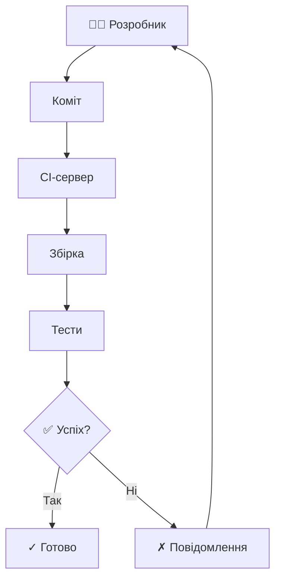
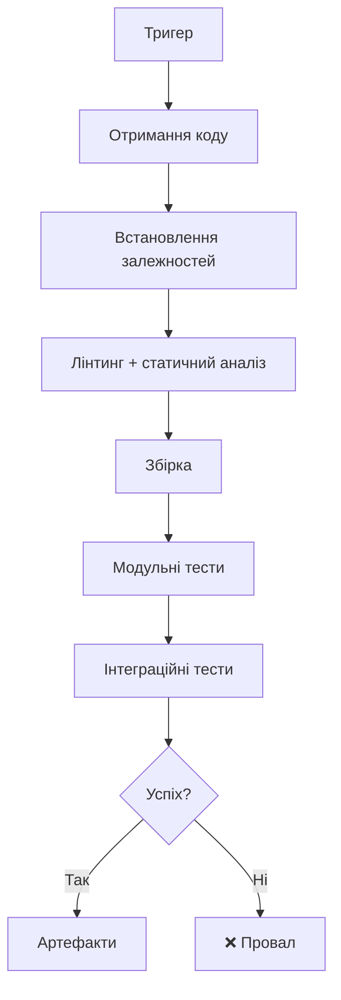
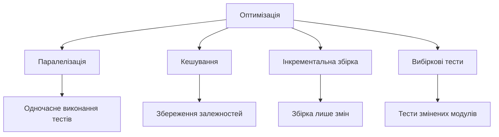
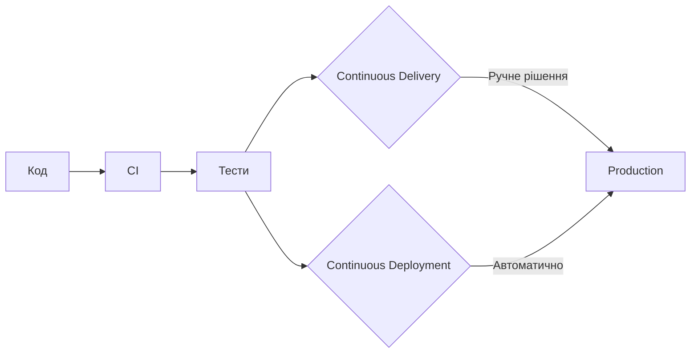
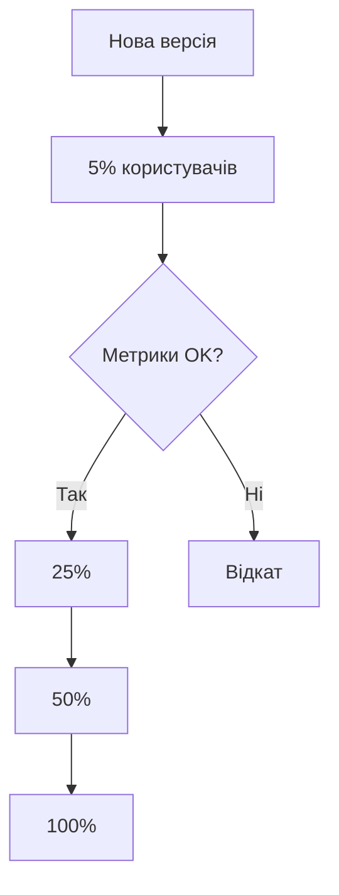
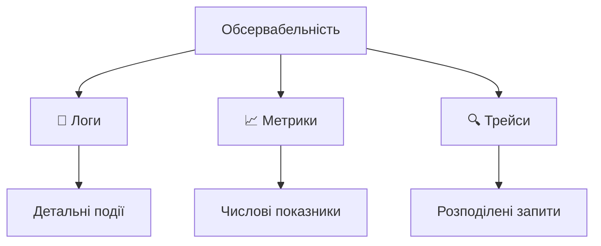
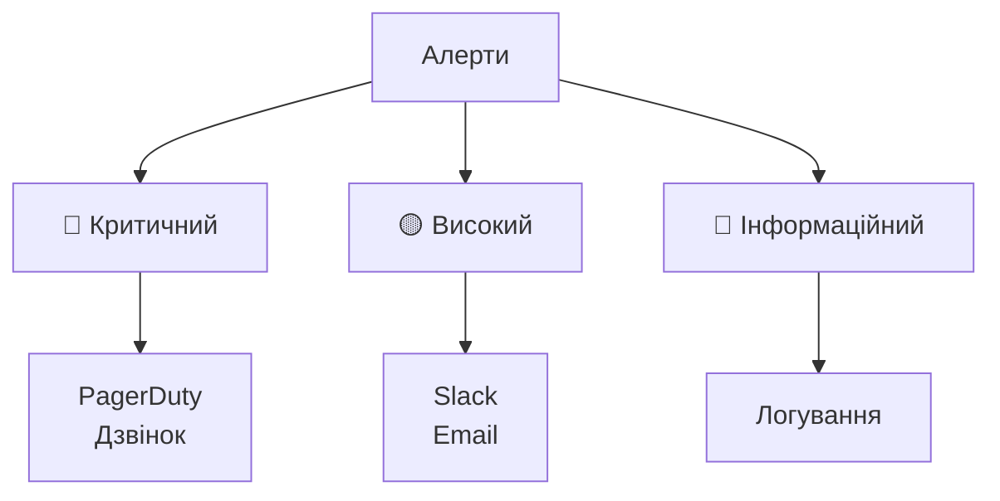
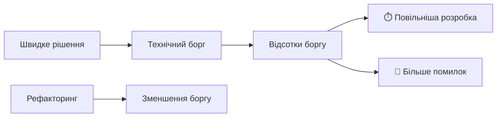
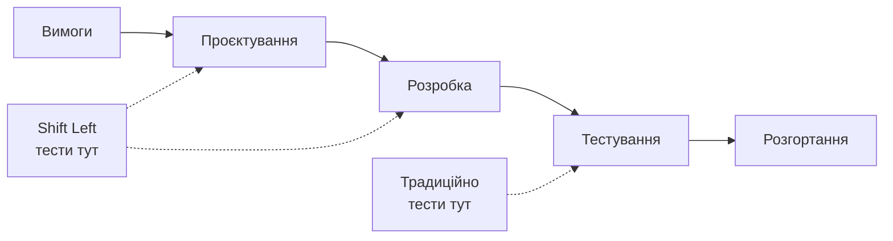
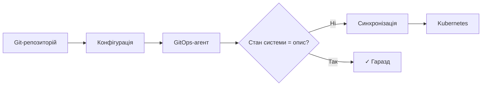

# CI/CD, моніторинг та підтримка якості коду

## План лекції

1. Основи Continuous Integration
2. Побудова CI-конвеєра
3. Continuous Delivery і Deployment
4. Моніторинг та обсервабельність
5. Підтримка якості коду
6. Інтеграція практик
7. Сучасні тренди

## Основні поняття

- **CI** — часті інтеграції коду з автоматичною збіркою та тестами
- **CI/CD-конвеєр** — автоматизований шлях зміни від коміту до користувача
- **Delivery / Deployment** — готовність до випуску / автоматичний випуск
- **Стратегії розгортання** — blue-green, canary, rolling, feature flags
- **Обсервабельність** — розуміння стану системи за логами, метриками, трейсами
- **SLI / SLO / бюджет помилок** — вимір, ціль і допустима «ненадійність»
- **IaC** — інфраструктура, описана кодом

## 1. Continuous Integration

## Що таке CI?

**Continuous Integration** — практика регулярної інтеграції коду в спільну базу з автоматичною перевіркою



### 🎯 Головна мета:

Виявити та виправити помилки якомога раніше

## Принципи CI

### ✅ Основні принципи:

1. **Єдиний репозиторій** — одне джерело істини
2. **Автоматична збірка** — без ручних кроків
3. **Самотестування** — тести є частиною збірки
4. **Щоденні коміти** — часта інтеграція
5. **Збірка кожного коміту** — негайна перевірка
6. **Швидка збірка** — відповідь за хвилини
7. **Прозорість** — усі бачать стан

## Переваги CI

### 🚀 Для команди:

**Раннє виявлення помилок** — контекст ще свіжий

**Менше конфліктів** — часта інтеграція малих змін

**Впевненість у коді** — автоматична валідація

**Прозорість** — стан проєкту видимий усім

### 💰 Для бізнесу:

- Швидша доставка функцій
- Менше часу на виправлення помилок
- Вища якість продукту

## Виклики впровадження

### ⚠️ Типові проблеми:

**Культурний опір** — звичка до довгих циклів розробки

**Повільні тести** — години виконання = неефективність

**Складність налаштування** — початкові інвестиції

### ✅ Рішення:

- Навчання команди
- Піраміда тестів (лекція 12)
- Поетапне впровадження

## 2. Побудова CI-конвеєра

## Компоненти конвеєра



**Принцип fail fast:** швидкі перевірки — першими

## Приклад: GitHub Actions

```yaml
name: CI

on:
  push:
    branches: [main, develop]
  pull_request:
    branches: [main]

permissions:
  contents: read

jobs:
  test:
    runs-on: ubuntu-latest
    strategy:
      matrix:
        python-version: ["3.12", "3.13", "3.14"]
    steps:
      - uses: actions/checkout@v6
      - uses: actions/setup-python@v6
        with:
          python-version: ${{ matrix.python-version }}
          cache: pip
```

## Продовження прикладу

```yaml
      - name: Встановлення залежностей
        run: |
          python -m pip install --upgrade pip
          pip install -r requirements.txt

      - name: Перевірка якості коду
        run: |
          ruff check app/
          ruff format --check app/

      - name: Запуск тестів
        run: pytest tests/ --cov=app --cov-report=xml
```

**Матриця** запускає кілька версій паралельно, `cache: pip` економить час, `permissions` — мінімальні права

## Популярні CI-системи

### 🛠️ Основні платформи:

**GitHub Actions** — інтеграція з GitHub, YAML у репозиторії

**GitLab CI/CD** — вбудована в GitLab, потужні можливості

**Jenkins** — гнучкий, власні сервери, багато плагінів

**CircleCI** — хмарний, швидкий, зручний для Docker

### 💡 Вибір залежить від:

Де розміщено код, бюджет, інфраструктура, команда

### ⚠️ Версії дій регулярно оновлюються

Звіряйте номери на Marketplace, автоматизуйте через Dependabot

## Оптимізація швидкості

### ⚡ Стратегії прискорення:



**Орієнтир:** результат за 5–10 хвилин

## 3. Continuous Delivery і Deployment

## Delivery vs Deployment



**Delivery** — завжди готові до випуску

**Deployment** — автоматичний випуск

## Метрики DORA

### 📈 Чотири метрики ефективності доставки:

**Швидкість:**

- Частота розгортань
- Час від коміту до продакшену

**Стабільність:**

- Частка невдалих змін
- Час відновлення після збою

### 💡 Головний висновок:

Найкращі команди і швидші, і стабільніші

## Стратегії розгортання

### 🔵🟢 Blue-Green

Два ідентичні середовища, миттєве переключення й простий відкат

### 🐤 Canary



Поступове розгортання з моніторингом

## Продовження стратегій

### 🔄 Rolling

Поступова заміна екземплярів без простою

### 🚩 Feature Flags

```python
if feature_flags.is_enabled("new_checkout", user=current_user):
    return new_checkout_flow()
return old_checkout_flow()
```

Розгортання коду ≠ випуск функції користувачам

## Управління конфігурацією

### 🔧 Принципи:

**Конфігурація ≠ код** — окреме зберігання

**12-Factor App** — конфігурація через змінні середовища

**Секрети окремо** — Vault, Secrets Manager, GitHub Secrets

**OIDC** — короткоживучі токени замість довготривалих ключів

### ⚠️ Ніколи:

- Паролі в коді
- API-ключі в репозиторії
- Хардкод конфігурації

## 4. Моніторинг та обсервабельність

### 📊 Три стовпи:



**Мета:** розуміти внутрішній стан системи за зовнішніми виходами

## OpenTelemetry

### 🔭 Галузевий стандарт телеметрії:

- Єдині API, SDK та протокол **OTLP**
- Логи, метрики й трейси в одному стандарті
- Незалежність від постачальника: Prometheus, Grafana, Jaeger…

### 💡 Практика:

Інструментуйте застосунок через OpenTelemetry — бекенд оберете чи зміните пізніше

## Golden Signals

### 🌟 Чотири ключові метрики (Google SRE):

**Latency** ⏱️ — час обробки запиту

**Traffic** 📊 — кількість запитів

**Errors** ❌ — частота помилок

**Saturation** 💾 — використання ресурсів

### 💡 Правило:

Якщо стежите за цими чотирма метриками, розумієте стан системи

## SLI, SLO і бюджет помилок

### 🎯 Надійність у числах:

**SLI** — показник: частка успішних запитів

**SLO** — ціль: 99,9% за 30 днів

**Бюджет помилок** — 0,1%: допустима «ненадійність»

### ⚖️ Як використовують:

- Бюджет є → випускаємо нові функції
- Бюджет вичерпано → фокус на стабільності

## Інструменти моніторингу

### 📈 Метрики: Prometheus + Grafana

```yaml
# prometheus.yml
scrape_configs:
  - job_name: 'webapp'
    static_configs:
      - targets: ['localhost:8080']
    metrics_path: '/metrics'
    scrape_interval: 15s
```

### 📝 Логи: ELK Stack або Grafana Loki

**Elasticsearch** — зберігання та пошук

**Logstash** — обробка логів

**Kibana** — візуалізація

### 🔍 Трейси: Jaeger, Zipkin (через OTLP)

## Приклад: панель Grafana

### 📊 Типова панель:

- Кількість запитів за секунду
- Час відповіді (p50, p95, p99)
- Частка помилок (%)
- Використання CPU / пам'яті
- З'єднання з базою даних

### 🎯 Мета:

Одним поглядом оцінити здоров'я системи

## Сповіщення (алерти)

### 🚨 Рівні серйозності:



### ✅ Правила:

- Кожен алерт має бути дієвим (actionable)
- Сповіщайте про симптоми для користувачів
- Runbook + аналіз інциденту без пошуку винних

## 5. Якість коду

## Статичний аналіз

### 🔍 Інструменти:

**Python:** Ruff (лінтер + форматувальник), mypy / Pyright

**JavaScript:** ESLint, Prettier, TypeScript

**Java:** Checkstyle, SpotBugs, SonarQube

### 🎯 Що перевіряють:

- Стиль коду
- Потенційні помилки
- Типи
- Безпека
- Складність коду

## Приклад конфігурації

```toml
# pyproject.toml
[tool.ruff]
line-length = 88
exclude = [".git", "__pycache__", "migrations"]

[tool.ruff.lint]
select = ["E", "W", "F", "I", "B"]
ignore = ["E203"]
```

**Ruff** замінює flake8 + black + isort одним швидким інструментом

## Рецензування коду (Code Review)

### 👥 Процес:

1. Створити Pull Request
2. Автоматичні перевірки (CI)
3. Рецензія колег
4. Обговорення та правки
5. Схвалення та злиття (захист гілки)

### ✅ На що дивитися:

- Правильність логіки
- Читабельність коду
- Дотримання архітектури
- Потенційні проблеми
- Тести покривають зміни

### 🤖 ШІ-помічники — фільтр, а не заміна людині

## Технічний борг



### 💡 Стратегія:

Закладати частину часу спринту на погашення боргу; пороги якості в конвеєрі

**Докладно → лекція 15**

## Метрики якості

### 📊 Ключові показники:

**Цикломатична складність** — складність логіки

**Дублювання коду** — повторювані фрагменти

**Покриття тестами** — частка перевіреного коду

**Індекс підтримуваності** — загальна оцінка

### ⚠️ Пам'ятайте:

Метрики — індикатори, не абсолюти

## 6. Інтеграція практик

## Shift Left Testing



**Ідея:** тестування та безпека (DevSecOps) на ранніх етапах

## Культура якості

### 🎯 Принципи:

**Відповідальність** — кожен відповідає за якість свого коду

**Парне програмування** — рецензування під час розробки

**Ретроспективи** — постійне вдосконалення

**Автоматизація** — машина виконує рутину

### 💡 Результат:

Якість вбудована в процес, а не додана наприкінці

## Баланс швидкості та якості

### ⚖️ Міф:

Швидкість та якість взаємовиключні

### ✅ Реальність:


Інвестиції в якість підвищують швидкість!

## 7. Сучасні тренди

## Infrastructure as Code

```hcl
# Приклад на Terraform
resource "aws_instance" "web" {
  ami           = "ami-0123456789abcdef0"
  instance_type = "t3.micro"

  tags = {
    Name        = "WebServer"
    Environment = "Production"
  }
}
```

**Переваги:** версійованість, відтворюваність, рецензування

**Інструменти:** Terraform / OpenTofu, Ansible, CloudFormation

## GitOps



**Принцип:** Git як єдине джерело істини (Argo CD, Flux)

## Chaos Engineering

### 🌪️ Що це:

Свідоме введення відмов для перевірки стійкості системи

### 🔬 Експерименти:

- Вимкнення серверів
- Мережеві затримки
- Пошкодження даних
- Високе навантаження

**Інструменти:** Chaos Monkey, Gremlin, LitmusChaos

**Мета:** виявити слабкі місця до реального інциденту

## Платформна інженерія

### 🏗️ Ідея:

Внутрішня платформа з готовими «золотими шляхами»: шаблони проєктів, конвеєри, панелі моніторингу

### 💡 Для розробника:

Менше налаштувань з нуля — більше самообслуговування за корпоративними шаблонами

## Практичний приклад: повний конвеєр

### 🔄 CI/CD для вебзастосунку:

1. **Коміт / Pull Request** → GitHub
2. **GitHub Actions** запускає:
    - Лінтинг коду
    - Модульні та інтеграційні тести
    - Збірку образу Docker
3. **Публікація образу** → реєстр контейнерів
4. **Argo CD** синхронізує Kubernetes
5. **OpenTelemetry** → метрики й трейси
6. **Prometheus + Grafana** відображають стан
7. **PagerDuty** сповіщає при порушенні SLO

## Інструменти екосистеми

### 🛠️ Toolchain:

**CI/CD:** GitHub Actions, GitLab CI, Jenkins

**Контейнери:** Docker, Kubernetes, Helm

**IaC:** Terraform / OpenTofu, Ansible, CloudFormation

**Моніторинг:** Prometheus, Grafana, Datadog

**Логування:** ELK, Loki, Splunk

**Безпека:** Vault, Trivy, SonarQube

## Найкращі практики

### ✅ Що робити:

1. **Автоматизуйте все**, що можна
2. **Моніторте все**, що важливо
3. **Тестуйте рано** та часто
4. **Розгортайте часто** малими порціями
5. **Збирайте метрики** та аналізуйте
6. **Документуйте** процеси та рішення

### 🎯 Мета:

Швидка, безпечна та надійна доставка цінності користувачам

## Висновки

### 🎯 Ключові висновки:

1. **CI/CD** — основа сучасної розробки
2. **Автоматизація** — інвестиція в продуктивність
3. **Обсервабельність (OpenTelemetry)** — критична для надійності
4. **SLO та бюджет помилок** — рішення на основі даних
5. **Якість коду** — довгострокова швидкість
6. **Культура** — важливіша за інструменти

### 💡 Головна думка:

Ефективні процеси CI/CD + моніторинг + якість = швидка доставка надійного ПЗ
