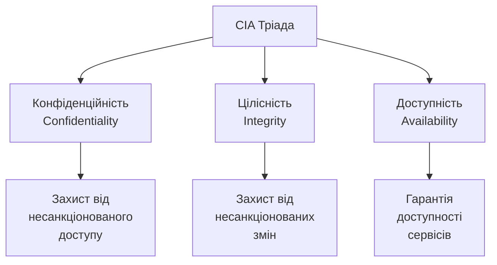
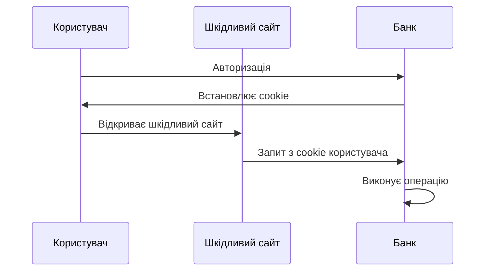
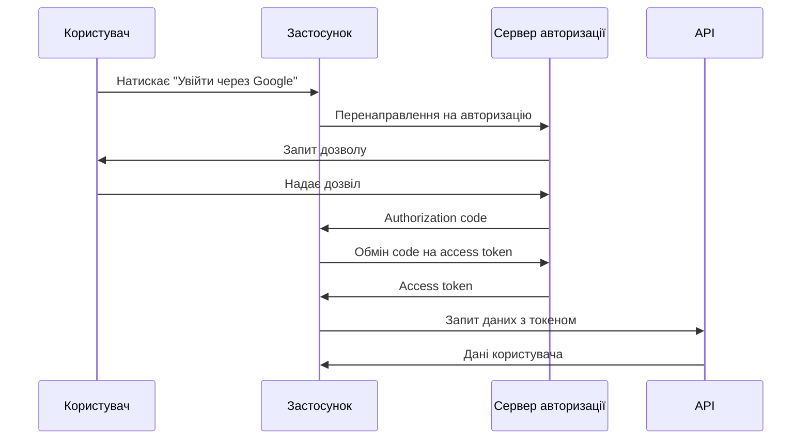

# Інформаційна безпека в розробці ПЗ

## План лекції

1. Основи інформаційної безпеки
2. Поширені вразливості вебзастосунків
3. Контроль доступу
4. Автентифікація та авторизація
5. Безпека API
6. Шифрування та криптографія
7. Безпека залежностей і ланцюга постачання
8. Логування та моніторинг
9. Безпечне розгортання
10. Безпека та штучний інтелект
11. Практичні рекомендації

## Основні поняття

- **Тріада CIA** — конфіденційність, цілісність, доступність
- **Автентифікація / авторизація** — «хто ви?» / «що вам дозволено?»
- **Найменші привілеї** — лише необхідні права
- **Захист в глибину** — кілька незалежних рівнів захисту
- **Ін'єкція** — дані інтерпретуються як команди
- **OWASP Top 10** — головні ризики вебзастосунків (редакція 2025)
- **Ланцюг постачання ПЗ** — усе зовнішнє, що потрапляє у продукт і збірку

## 1. Основи інформаційної безпеки

## Тріада CIA



## Конфіденційність (Confidentiality)

**Захист даних від несанкціонованого доступу**

- 🔐 Шифрування даних при передачі та зберіганні
- 👤 Автентифікація користувачів
- 🔑 Контроль доступу до ресурсів
- 🚪 Авторизація на основі ролей

**Приклад:** лише власник облікового запису бачить свої особисті дані

## Цілісність (Integrity)

**Гарантія, що дані не були змінені**

- ✅ Контрольні суми та хеші
- 🖊️ Цифрові підписи
- 📝 Журналювання змін
- 🔄 Версіонування даних

**Приклад:** банківська транзакція не може бути змінена після виконання

## Доступність (Availability)

**Забезпечення доступу до ресурсів**

- 🛡️ Захист від DDoS-атак
- 💾 Резервне копіювання
- 🔄 Відмовостійкість системи
- ⚡ Балансування навантаження

**Приклад:** вебсайт доступний 24/7 навіть при високому навантаженні

## Основні принципи безпеки

### 🔒 Принцип найменших привілеїв
Кожен компонент має лише необхідні права

### 🛡️ Захист в глибину
Кілька рівнів захисту замість одного

### 🏗️ Безпека через дизайн
Інтеграція безпеки з самого початку

### ❌ Безпечні значення за замовчуванням
Відмова в доступі, якщо явно не дозволено

## Моделювання загроз: STRIDE

### 🎯 Питання до кожного елемента схеми потоків даних:

- **S**poofing — підміна особи
- **T**ampering — підробка даних
- **R**epudiation — відмова від авторства
- **I**nformation disclosure — розкриття інформації
- **D**enial of service — відмова в обслуговуванні
- **E**levation of privilege — підвищення привілеїв

**Півгодини обговорення схеми економлять місяці виправлень**

## 2. Поширені вразливості

## OWASP Top 10:2025

### Найкритичніші ризики безпеки:

1. **Порушення контролю доступу** (тепер включає SSRF)
2. **Неправильна конфігурація безпеки**
3. **Збої безпеки ланцюга постачання ПЗ** 🆕
4. **Криптографічні збої**
5. **Ін'єкції**

## OWASP Top 10:2025 (продовження)

6. **Небезпечний дизайн**
7. **Збої автентифікації**
8. **Збої цілісності ПЗ та даних**
9. **Збої журналювання та сповіщення**
10. **Неправильна обробка виняткових ситуацій** 🆕

### 📈 Тенденція:

Усе більше уваги — конфігурації, процесам і ланцюгу постачання, а не лише помилкам у коді

## SQL-ін'єкції

### ❌ Небезпечний код:

```python
# НЕ ВИКОРИСТОВУЙТЕ!
username = request.form['username']
query = f"SELECT * FROM users WHERE username = '{username}'"
cursor.execute(query)
```

**Атака:** `admin' --` обходить перевірку пароля

### ✅ Безпечний код:

```python
# Параметризований запит
cursor.execute(
    "SELECT id, password_hash FROM users WHERE username = ?",
    (username,),
)
# Пароль перевіряємо за хешем, а не в SQL
```

## Cross-Site Scripting (XSS)

### Типи XSS:

- **Reflected XSS** — шкідливий код у HTTP-запиті
- **Stored XSS** — шкідливий код зберігається на сервері
- **DOM-based XSS** — вразливість у клієнтському коді

### Захист:

```python
# Шаблонізатор екранує вивід автоматично
render_template_string(
    "<div>Привіт, {{ name }}!</div>", name=name
)
```

Обережно з `|safe`, `Markup()`, `dangerouslySetInnerHTML`

## XSS: додаткові рівні захисту

```python
@app.after_request
def set_security_headers(response):
    response.headers["Content-Security-Policy"] = \
        "default-src 'self'; script-src 'self'"
    response.headers["X-Content-Type-Options"] = "nosniff"
    return response
```

- 🛡️ **CSP** — браузер не виконає чужий скрипт
- 🍪 **HttpOnly** cookies — недоступні для JavaScript
- 🧼 Очищення HTML від користувача: бібліотека (nh3), а не власний фільтр

## Cross-Site Request Forgery (CSRF)



### Захист — CSRF-токени + SameSite:

```python
if not hmac.compare_digest(
    request.form.get('csrf_token', ''),
    session.get('csrf_token', ''),
):
    abort(403)
```

## 3. Контроль доступу

## Порушення контролю доступу

### 🥇 #1 в OWASP

**Помилка:** система не перевіряє, чи має *цей* користувач право на *цей* об'єкт

```python
@app.get("/api/orders/<int:order_id>")
@login_required
def get_order(order_id):
    order = db.get_or_404(Order, order_id)
    if order.user_id != current_user.id \
            and current_user.role != "admin":
        abort(404)
    return jsonify(order.to_dict())
```

- **BOLA / IDOR** — перебір чужих ідентифікаторів
- **SSRF** — сервер звертається за URL зловмисника → список дозволених адрес

## 4. Автентифікація та авторизація

## Безпечне зберігання паролів

### ❌ НІКОЛИ не робіть так:

- Паролі у відкритому вигляді
- MD5, SHA-1, SHA-256 «просто так»
- Звичайне шифрування

### ✅ Правильний підхід:

```python
from argon2 import PasswordHasher

ph = PasswordHasher()
hash_value = ph.hash(password)
ph.verify(hash_value, password)
```

**Використовуйте:** Argon2id, scrypt, bcrypt, PBKDF2 (Werkzeug за замовчуванням — scrypt)

**Оновлюйте хеш** при вході: `check_needs_rehash`

## Сучасні рекомендації щодо паролів

### 📋 NIST SP 800-63B:

- ✅ Довжина важливіша за «складність»
- ✅ Перевірка на скомпрометовані паролі
- ✅ Дозволяти вставлення з менеджерів паролів
- ❌ Немає примусової зміни без ознак компрометації
- ❌ Немає правил «велика літера + цифра + спецсимвол»

## Багатофакторна автентифікація (MFA)

### Три фактори:

1. **Щось, що ви знаєте** 🧠
   - Пароль, PIN

2. **Щось, що ви маєте** 📱
   - Смартфон, апаратний ключ

3. **Щось, що ви є** 👤
   - Відбиток пальця, обличчя

### ⚠️ Надійність: SMS < TOTP < апаратні ключі / passkeys

## Time-based OTP (TOTP)

```python
import pyotp

# Генерація секрету для користувача
secret = pyotp.random_base32()

# Перевірка коду
totp = pyotp.TOTP(secret)
is_valid = totp.verify(user_code, valid_window=1)
```

**Застосунки:** Google Authenticator, Authy, 1Password

**Секрет зберігайте зашифрованим, обмежуйте кількість спроб**

## Passkeys і WebAuthn

### 🔑 Вхід без пароля:

- Пристрій створює **пару ключів** для сайту
- Приватний ключ **ніколи не залишає пристрою**
- Сервер зберігає лише відкритий ключ

### ✅ Переваги:

- Немає секрету, який можна викрасти з бази даних
- Прив'язка до домену → **стійкість до фішингу**
- Розблокування біометрією або PIN

**Реалізація:** перевірені бібліотеки (наприклад, py_webauthn)

## OAuth 2.0: Authorization Code Flow



**Використовуйте PKCE. Implicit Flow — застарілий** (OAuth 2.1)

## JSON Web Token (JWT)

### Структура JWT:

```
header.payload.signature
```

**Header:** тип токена та алгоритм
**Payload:** дані (claims) — лише закодовані, не зашифровані
**Signature:** перевірка цілісності

### Приклад:

```python
import jwt
from datetime import datetime, timedelta, timezone

now = datetime.now(timezone.utc)
payload = {'sub': str(user.id), 'exp': now + timedelta(minutes=15)}

token = jwt.encode(payload, secret_key, algorithm='HS256')
jwt.decode(token, secret_key, algorithms=['HS256'])
```

## JWT: правила безпеки

### ✅ Робіть:

- Короткий термін життя (15 хв – 1 год)
- Явно вказуйте `algorithms=[...]` при перевірці
- Асиметричні алгоритми (RS256, EdDSA) для багатьох сервісів

### ❌ Не робіть:

- Чутливі дані в payload
- «JWT у localStorage» — вразливо до XSS

### 💡 Пам'ятайте:

Токен важко відкликати. Для простих вебзастосунків сесії в захищеному cookie часто безпечніші

## 5. Безпека API

## Контроль доступу (RBAC)

**Role-Based Access Control**

```python
def require_role(*roles):
    def decorator(f):
        @wraps(f)
        def wrapper(*args, **kwargs):
            user = get_current_user()
            if user.role not in roles:
                return {'error': 'Access denied'}, 403
            return f(*args, **kwargs)
        return wrapper
    return decorator

@app.get('/admin/users')
@require_role('admin')
def get_all_users():
    return jsonify(users)
```

**Роль ≠ належність об'єкта** — перевіряйте обидва

## Rate Limiting

**Обмеження кількості запитів**

```python
from flask_limiter import Limiter
from flask_limiter.util import get_remote_address

limiter = Limiter(
    key_func=get_remote_address,
    app=app,
    default_limits=["200 per day", "50 per hour"],
    storage_uri="redis://localhost:6379",
)

@app.post('/api/login')
@limiter.limit("5 per minute")
def login():
    ...
```

**Захист від:**
- 🛡️ Brute force атак
- 📊 Зловживання API
- 💥 DDoS-атак

## Валідація вхідних даних

### Ніколи не довіряйте клієнтським даним!

```python
from marshmallow import Schema, fields, validate

class UserSchema(Schema):
    username = fields.Str(
        required=True,
        validate=validate.Length(min=3, max=50)
    )
    email = fields.Email(required=True)
    age = fields.Int(validate=validate.Range(min=18, max=120))

try:
    data = schema.load(request.json)
except ValidationError as err:
    return jsonify(err.messages), 400
```

**Також:** Pydantic; захист від масового присвоєння (`"role": "admin"`)

## 6. Шифрування

## HTTPS обов'язково!

### Transport Layer Security (TLS)

```nginx
server {
    listen 443 ssl;
    http2 on;

    ssl_certificate /path/fullchain.pem;
    ssl_certificate_key /path/privkey.pem;

    ssl_protocols TLSv1.2 TLSv1.3;

    add_header Strict-Transport-Security
        "max-age=31536000" always;
}
```

**Використовуйте:** Let's Encrypt + автоматичне поновлення (ACME, Certbot); шифри — за генератором Mozilla

## Шифрування даних у спокої

```python
from cryptography.fernet import Fernet

# Генерація ключа
key = Fernet.generate_key()
cipher = Fernet(key)

# Шифрування
encrypted = cipher.encrypt("Секретна інформація".encode())

# Розшифрування
original = cipher.decrypt(encrypted).decode()
```

**Важливо:** ключі — окремо від даних (KMS, Vault)

**Найкраще — не зберігати:** картки обробляє платіжний провайдер

## Цифрові підписи

**Забезпечують автентичність та цілісність**

```python
from cryptography.hazmat.primitives.asymmetric import rsa

# Генерація ключів
private_key = rsa.generate_private_key(
    public_exponent=65537, key_size=3072
)
public_key = private_key.public_key()

# Підпис приватним ключем
signature = private_key.sign(message, padding, hash_algo)

# Перевірка відкритим ключем
try:
    public_key.verify(signature, message, padding, hash_algo)
except InvalidSignature:
    ...
```

**Сучасна альтернатива:** Ed25519

## 7. Залежності та ланцюг постачання

## Сканування вразливостей

### Python:
```bash
pip install pip-audit
pip-audit -r requirements.txt
```

### Node.js:
```bash
npm audit
npm audit fix
```

### Автоматизація в CI/CD:

```yaml
# GitHub Actions
- name: Security scan
  run: |
    npm audit
    pip-audit -r requirements.txt
```

**Ще:** OSV-Scanner, Dependabot, Renovate

## Безпека ланцюга постачання

### 🎯 Атакують не ваш код, а компоненти, яким ви довіряєте

- 🕳️ Прихована шкідлива вставка (приклад: xz, 2024)
- 📦 Компрометація популярних пакетів
- 🎭 Typosquatting — пакети з подібними назвами
- 🤖 Вигадані ШІ назви пакетів, які реєструють зловмисники

### ✅ Захист:

- Lock-файли й фіксовані версії
- **SBOM** — перелік складників
- Дії CI — за хешем коміту, мінімальні права

## Принцип мінімальних залежностей

### Перед додаванням бібліотеки запитайте:

- ❓ Чи справді вона потрібна?
- 👥 Чи активно підтримується?
- 🔒 Яка історія безпеки?
- 📦 Скільки транзитивних залежностей?
- 📄 Чи підходить ліцензія?

**Кожна залежність = потенційна вразливість**

## 8. Логування та моніторинг

## Що логувати

### ✅ Важливі події безпеки:

- 🔐 Спроби автентифікації (успішні та ні)
- 🔑 Зміни прав доступу
- 📊 Доступ до чутливих даних
- ⚠️ Помилки валідації
- 🚫 Відхилені запити
- 🔄 Зміни конфігурації

### ❌ Не логуйте:

- Паролі та токени
- Номери кредитних карток
- Особисті дані (без необхідності)

**Логувати мало — треба ще й сповіщати**

## Приклад безпекового логування

```python
import logging

security_logger = logging.getLogger('security')

def log_security_event(event_type):
    def decorator(f):
        @wraps(f)
        def wrapper(*args, **kwargs):
            security_logger.info(
                "Event: %s, User: %s, IP: %s",
                event_type, get_current_user_id(),
                request.remote_addr,
            )
            return f(*args, **kwargs)
        return wrapper
    return decorator

@app.get('/admin/users')
@log_security_event('ADMIN_ACCESS')
def admin_panel():
    return render_template('admin.html')
```

**Параметри форматування** захищають від ін'єкції в лог

## Моніторинг аномалій

### Детектор brute force атак (навчальний):

```python
failed_attempts = defaultdict(list)

def check_brute_force(username, ip):
    key = f"{username}:{ip}"
    now = datetime.now()

    failed_attempts[key] = [
        t for t in failed_attempts[key]
        if now - t < timedelta(minutes=5)
    ]
    failed_attempts[key].append(now)

    if len(failed_attempts[key]) > 5:
        security_logger.warning(
            "Brute force: %s from %s", username, ip
        )
        return True
    return False
```

⚠️ У реальній системі лічильник — у спільному сховищі (Redis)

## 9. Безпечне розгортання

## Безпечна конфігурація

```python
class Config:
    # Секрети — зі змінних середовища; без значення — зупинка
    SECRET_KEY = os.environ["SECRET_KEY"]

    SESSION_COOKIE_SECURE = True
    SESSION_COOKIE_HTTPONLY = True
    SESSION_COOKIE_SAMESITE = 'Lax'

    WTF_CSRF_ENABLED = True
    PERMANENT_SESSION_LIFETIME = timedelta(hours=1)

class ProductionConfig(Config):
    DEBUG = False
```

- ❌ Не `os.environ.get(...) or os.urandom(32)` — сесії ламаються
- 🔍 Сканери секретів: gitleaks, TruffleHog, push protection

## Безпека контейнерів

```dockerfile
FROM python:3.14-slim

RUN useradd -m -u 1000 appuser
WORKDIR /app

COPY requirements.txt .
RUN pip install --no-cache-dir -r requirements.txt

COPY --chown=appuser:appuser . .
USER appuser

CMD ["gunicorn", "--bind", "0.0.0.0:8000", "app:app"]
```

- ✅ Непривілейований користувач, мінімальний образ
- ✅ Багатоетапна збірка, `.dockerignore`
- ✅ Сканування образів: Trivy, Docker Scout

## 10. Безпека та ШІ

## Код від ШІ-асистентів

### ⚠️ Ризики:

- Небезпечні шаблони (конкатенація SQL, слабка криптографія)
- Застарілі бібліотеки
- Вигадані назви пакетів

### ✅ Правила:

- Перевіряйте як код колеги
- Автоматичні перевірки в конвеєрі — обов'язкові
- Не передавайте секрети й персональні дані асистентам

## Застосунки з LLM

### 🤖 OWASP Top 10 for LLM Applications

**Prompt injection** — інструкція, схована в даних, які обробляє модель

### 🛡️ Захист:

- Найменші привілеї для моделі
- Чутливі дії — лише з підтвердженням людини
- Відповіді моделі — недовірений ввід

## 11. Практичні рекомендації

## Security Checklist для розробників

### Базові практики:

- ✅ Усі дані валідуються на сервері
- ✅ HTTPS для всього трафіку
- ✅ Паролі хешуються (Argon2id / scrypt / bcrypt)
- ✅ CSRF-захист для форм
- ✅ Параметризовані SQL-запити
- ✅ Екранування вмісту + CSP
- ✅ Перевірка прав на кожен об'єкт
- ✅ Rate limiting для API
- ✅ Логування безпекових подій

## Security Checklist (продовження)

### Розширені практики:

- ✅ MFA або passkeys
- ✅ Регулярне сканування залежностей, SBOM
- ✅ Security headers (CSP, HSTS)
- ✅ Принцип найменших привілеїв
- ✅ Секрети у змінних середовища або Vault
- ✅ Debug вимкнений у продакшені
- ✅ SAST + SCA + DAST у конвеєрі
- ✅ Регулярні аудити безпеки

## Типові помилки

### ❌ Що НЕ робити:

1. Зберігати паролі у відкритому вигляді
2. Довіряти клієнтським даним без валідації
3. Використовувати слабкі алгоритми шифрування
4. Ігнорувати оновлення залежностей
5. Жорстко кодувати секрети в коді
6. Вимикати CSRF-захист «бо не працює»
7. Використовувати `eval()` із введенням користувача
8. Виконувати зміну стану через GET

## Культура безпеки

### 🎯 Безпека — відповідальність усієї команди

- 📚 Регулярне навчання
- 👀 Рецензування коду з погляду безпеки
- 🤖 Автоматизоване тестування безпеки
- 📊 Моніторинг та сповіщення
- 🔄 Постійне покращення
- ⚖️ Правові вимоги: закон про захист персональних даних, GDPR, Cyber Resilience Act

**Правило:** якщо щось виглядає підозріло — воно підозріле!
