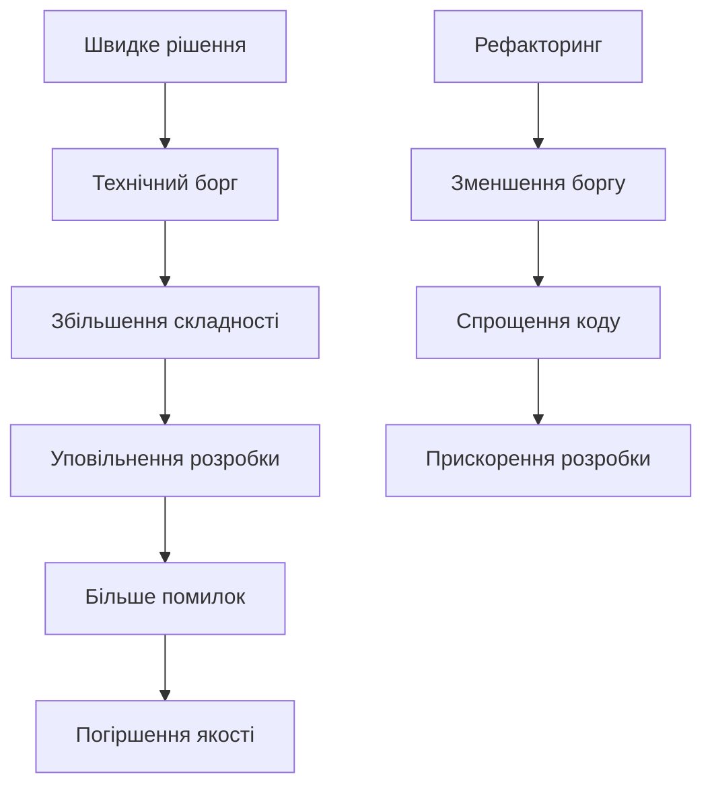
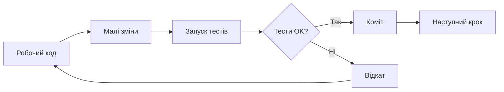

# Рефакторинг та чистий код

## План лекції

1. Філософія чистого коду
2. Іменування
3. Функції
4. Коментарі та документація
5. Рефакторинг
6. Принципи проєктування
7. Організація коду
8. Обробка помилок
9. Чистий код і ШІ-асистенти

## Основні поняття

- **Чистий код** — легко читається, виражає наміри, без зайвої складності
- **Рефакторинг** — зміна структури без зміни поведінки, малими кроками під захистом тестів
- **Технічний борг** — накопичені наслідки швидких, не оптимальних рішень
- **Запах коду** — ознака, що в дизайні, ймовірно, є проблема
- **SRP** — одна причина для зміни
- **SOLID** — п'ять принципів проєктування
- **KISS, YAGNI, DRY** — простота, «не додавай зайвого», «не дублюй знання»

## 1. Філософія чистого коду

## Що таке чистий код?

### 💡 Чистий код — це код, який:

- 📖 Легко читається як добре написана проза
- 🎯 Виражає наміри ясно та недвозначно
- 🧩 Має одну чітко визначену функцію
- ✅ Легко тестується
- 🚫 Не містить дублювання

**«Код пишеться один раз, але читається багато разів»**

## Що кажуть автори

### Майкл Фезерс:

> «Чистий код виглядає так, ніби його писала людина, якій не байдуже»

### Грейді Буч:

> «Чистий код простий та прямий. Він читається як добре написана проза»

### Бьярне Страуструп:

> Чистий код — елегантний та ефективний

### ⚖️ Джон Оустерхаут — противага:

Надмірне дроблення на крихітні функції шкодить. Мета — зрозумілість, а не механічне дотримання правил. **Правила — це орієнтири.**

## Технічний борг



### Причини боргу:

- 🎯 **Навмисний** — свідоме рішення
- 😕 **Ненавмисний** — недостатнє розуміння
- 🔄 **Борг через еволюцію** — зміна вимог

## Квадрант технічного боргу (Фаулер)

| | Навмисний | Ненавмисний |
|---|---|---|
| **Обачний** | «Випускаємо зараз, виправимо після» | «Тепер знаємо, як слід було» |
| **Безрозсудний** | «Немає часу на дизайн» | «Що таке шари архітектури?» |

### 💡 Висновок:

Виправданий лише **обачний** борг — той, про який знають і ним керують

## Читабельність = Продуктивність

### 📊 Факти:

- Співвідношення читання до писання коду — приблизно **10 : 1** (Р. Мартін)
- Читабельний код = швидша розробка
- Читабельний код = менше помилок
- Форматування виконує програма: **Ruff / Black**, Prettier

### ⚡ Інвестиція в читабельність окупається!

## 2. Іменування

## Значущі імена

### ❌ Погано — незрозумілі імена:

```python
def calc(d):
    r = d * 0.1
    return r
```

### ✅ Добре — описові імена:

```python
def calculate_discount(price):
    discount_rate = 0.1
    discount_amount = price * discount_rate
    return discount_amount
```

**Правило:** імена повинні розкривати наміри!

## Правила іменування змінних

### Основні принципи:

1. **Уникайте абревіатур**
   - ❌ `usr`, `pwd`, `tmp`
   - ✅ `user`, `password`, `temporary_data`

2. **Використовуйте вимовні назви**
   - ❌ `genymdhms`
   - ✅ `generate_timestamp`

3. **Імена повинні бути шуканими**
   - ❌ `7` (магічне число)
   - ✅ `DAYS_IN_WEEK = 7`

4. **Конвенції PEP 8**
   - `snake_case`, `PascalCase`, `UPPER_CASE`

## Іменування функцій

### Функції = дії, використовуйте дієслова!

```python
# ❌ Погано
def user(id):
    return database.query(id)

# ✅ Добре — дієслово показує дію
def get_user_by_id(user_id):
    return database.query(user_id)

# ✅ Булеві функції
def is_authenticated(user):
    return user.session_token is not None

def has_permission(user, resource):
    return resource in user.permissions
```

## Іменування класів

### Класи = сутності, використовуйте іменники!

```python
# ❌ Погано — назва описує дію
class DataProcessor:
    pass

# ✅ Добре — назва описує сутність
class CustomerOrder:
    def __init__(self, items):
        self.items = items

    def calculate_total(self):
        return sum(item.price for item in self.items)

class PaymentGateway:
    def process_payment(self, amount):
        pass
```

## 3. Функції

## Принцип єдиної відповідальності

### Кожна функція робить ОДНУ річ!

```python
# ❌ Погано — забагато відповідальностей
def process_user_registration(user_data):
    validate(user_data)
    hash_password(user_data['password'])
    save_to_database(user_data)
    send_email(user_data['email'])
    log_registration(user_data)
    return user

# ✅ Добре — розділення на окремі функції
def register_user(user_data):
    validate_user_data(user_data)
    user = create_user_account(user_data)
    complete_registration(user)
    return user
```

**Один рівень абстракції на функцію**

## Розмір функцій

### 📏 Функції повинні бути КОРОТКИМИ!

**Ідеальна функція:**
- ✅ Займає кілька рядків
- ✅ Вміщається на одному екрані
- ✅ Робить одну річ добре
- ✅ Зрозуміла без вивчення інших функцій

```python
# ✅ Добре — коротка та зрозуміла
def filter_active_users(users):
    return [u for u in users if u.is_active]

def calculate_average(numbers):
    if not numbers:
        return 0
    return sum(numbers) / len(numbers)
```

## Кількість параметрів

### Чим менше параметрів — тим краще!

- 🟢 **0 параметрів** — ідеально
- 🟢 **1–2 параметри** — добре
- 🟡 **3 параметри** — прийнятно
- 🔴 **4+ параметри** — ЗАНАДТО БАГАТО!

```python
# ❌ Погано — забагато параметрів
def create_user(email, password, first_name,
                last_name, phone, address, city):
    pass

# ✅ Добре — групування в dataclass
@dataclass
class UserData:
    email: str
    password: str
    personal_info: PersonalInfo
    address_info: AddressInfo

def create_user(user_data: UserData):
    pass
```

## Булеві прапорці — антипатерн

### Прапорці вказують, що функція робить більше однієї речі!

```python
# ❌ Погано — булевий прапорець
def render_user(user, include_details=False):
    if include_details:
        return render_detailed_user(user)
    return render_basic_user(user)

# ✅ Добре — окремі функції
def render_basic_user(user):
    return f"{user.name}"

def render_detailed_user(user):
    return f"{user.name}\n{user.email}\n{user.phone}"
```

## 4. Коментарі та документація

## Коли писати коментарі

### ✅ Коментарі КОРИСНІ для:

- 🎯 Пояснення причин нестандартних рішень
- 📐 Документування складних алгоритмів
- ⚠️ Попередження про можливі проблеми
- 📚 Документації API (docstrings)

### ❌ Коментарі ШКІДЛИВІ, коли:

- Описують очевидні речі
- Перефразовують код
- Застарілі або неточні
- Це закоментований код
- Пояснюють заплутаний код замість того, щоб його виправити

## Приклади коментарів

```python
# ❌ Погано — коментар не додає інформації
# Отримуємо користувача з бази даних
user = database.get_user(user_id)
# Перевіряємо чи активний
if user.is_active:
    return True

# ✅ Добре — код зрозумілий без коментарів
user = database.get_user(user_id)
if user.is_active:
    return True

# ✅ Добре — коментар пояснює ЧОМУ
# Використовуємо Decimal для грошових обчислень,
# щоб уникнути проблем з округленням float
from decimal import Decimal
total = Decimal(str(price))
```

## Docstrings для API

```python
def calculate_discount(
    price: float,
    discount_percent: int,
    max_discount: float | None = None,
) -> float:
    """
    Розраховує остаточну ціну товару після знижки.

    Args:
        price: Початкова ціна в гривнях.
        discount_percent: Відсоток знижки (0-100).
        max_discount: Максимальна сума знижки.

    Returns:
        Остаточна ціна після знижки.

    Raises:
        ValueError: Якщо discount_percent не в діапазоні 0-100.

    Examples:
        >>> calculate_discount(100, 10)
        90.0
    """
```

**Анотації типів документують самі; приклади перевіряє `doctest`**

## 5. Рефакторинг

## Що таке рефакторинг?

### 🔄 Рефакторинг — це:

- Зміна внутрішньої структури коду
- БЕЗ зміни зовнішньої поведінки
- Поступові малі кроки
- З постійною перевіркою тестами

### ⚠️ Рефакторинг ≠ Переписування!



**Немає тестів? Спочатку «фіксуючі» тести, потім рефакторинг**

## Коли рефакторити?

### 🕐 Правило бойскаутів:

> «Завжди залишай код чистішим, ніж ти його знайшов»

### Найкращий час:

- 🆕 Перед додаванням нової функції
- 🐛 При виправленні помилок
- 👀 Під час рецензування коду
- 🔄 Регулярно, як частина процесу

### 💡 Порада:

Не змішуйте рефакторинг і зміну поведінки в одному коміті

## Запахи коду

| Запах | Прийом рефакторингу |
|---|---|
| Довга функція | Виділення методу |
| Великий клас | Виділення класу (SRP) |
| Довгий список параметрів | Об'єкт-параметр |
| Дублювання | Спільна функція |
| Магічні числа | Іменована константа |
| «Заздрість до чужих даних» | Перенесення методу |
| Примітивна одержимість | Власний тип |
| «Хірургія дробовиком» | Зведення логіки разом |
| Мертвий код | Видалення |

**Запах — привід замислитися, а не вирок**

## Техніки: виділення методу

```python
# До рефакторингу — довга функція
def print_invoice(invoice):
    print("*" * 50)
    print(f"Invoice #{invoice.number}")
    print("*" * 50)
    for item in invoice.items:
        print(f"{item.name}: ${item.price}")
    total = sum(item.price for item in invoice.items)
    print(f"Total: ${total}")

# Після рефакторингу
def print_invoice(invoice):
    print_header(invoice)
    print_items(invoice.items)
    print_total(invoice)
```

## Заміна магічних чисел

```python
# ❌ До — магічні числа
def calculate_bonus(salary, years):
    if years >= 5:
        return salary * 0.1
    elif years >= 3:
        return salary * 0.05
    return salary * 0.02

# ✅ Після — іменовані константи
SENIOR_YEARS = 5
MID_LEVEL_YEARS = 3
SENIOR_BONUS_RATE = 0.1
MID_BONUS_RATE = 0.05
JUNIOR_BONUS_RATE = 0.02

def calculate_bonus(salary, years):
    if years >= SENIOR_YEARS:
        return salary * SENIOR_BONUS_RATE
    elif years >= MID_LEVEL_YEARS:
        return salary * MID_BONUS_RATE
    return salary * JUNIOR_BONUS_RATE
```

## Спрощення умов

```python
# ❌ До — складна умова
def should_notify(user, msg):
    if user.is_active and user.email_verified and \
       not user.notifications_disabled and msg.priority >= 3:
        return True
    return False

# ✅ Після — виразні функції
def should_notify(user, msg):
    return is_user_eligible(user) and is_message_important(msg)

def is_user_eligible(user):
    return (user.is_active
            and user.email_verified
            and not user.notifications_disabled)

def is_message_important(msg):
    return msg.priority >= 3
```

## Охоронні умови (guard clauses)

```python
# Замість вкладених if — ранні виходи
def get_discount(user, order):
    if user is None:
        return 0
    if not user.is_active:
        return 0
    if order.total < 1000:
        return 0

    # Основна логіка без вкладеності
    return order.total * 0.05
```

**Спершу відсіюємо особливі випадки, потім основна логіка**

## 6. Принципи проєктування

## SOLID: S — єдина відповідальність

### Клас має лише одну причину для зміни

```python
# ❌ Порушення SRP
class User:
    def save_to_database(self):
        pass
    def send_email(self):
        pass
    def generate_report(self):
        pass

# ✅ Дотримання SRP
class User:
    pass

class UserRepository:
    def save(self, user):
        pass

class EmailService:
    def send(self, user):
        pass
```

## SOLID: O — відкритість/закритість

### Відкритий для розширення, закритий для модифікації

```python
# ❌ Порушення OCP
class AreaCalculator:
    def calculate(self, shape):
        if isinstance(shape, Rectangle):
            return shape.w * shape.h
        elif isinstance(shape, Circle):
            return math.pi * shape.r ** 2

# ✅ Дотримання OCP
class Shape(ABC):
    @abstractmethod
    def area(self):
        pass

class Rectangle(Shape):
    def area(self):
        return self.width * self.height

class Circle(Shape):
    def area(self):
        return math.pi * self.radius ** 2
```

## SOLID: L — підстановка Ліскоу

### Підклас можна підставити замість базового без порушень

```python
# ❌ Порушення LSP
class Bird:
    def fly(self): ...

class Penguin(Bird):
    def fly(self):
        raise NotImplementedError

# ✅ Дотримання LSP
class Bird: ...

class FlyingBird(Bird):
    def fly(self): ...

class Penguin(Bird):
    def swim(self): ...
```

**Ознака порушення:** `isinstance` у клієнтському коді, виняток замість реалізації

## SOLID: I — розділення інтерфейсів

### Клієнт не залежить від методів, які не використовує

```python
# ❌ Один великий інтерфейс
class MultiFunctionDevice(Protocol):
    def print_document(self, doc): ...
    def scan_document(self, doc): ...
    def send_fax(self, doc): ...

# ✅ Малі спеціалізовані інтерфейси
class Printer(Protocol):
    def print_document(self, doc): ...

class Scanner(Protocol):
    def scan_document(self, doc): ...
```

## SOLID: D — інверсія залежностей

### Модулі залежать від абстракцій, а не від деталей

```python
class Notifier(Protocol):
    def send(self, recipient: str, text: str) -> None: ...

class EmailNotifier:
    def send(self, recipient: str, text: str) -> None:
        ...

class OrderService:
    def __init__(self, notifier: Notifier):
        self.notifier = notifier
```

**Це робить можливими тестові дублери (лекція 12)**

⚠️ SOLID — евристики, а не догма

## KISS та YAGNI

### Простота > Складність

```python
# ❌ Надмірно складно
class ConfigManagerFactory:
    @staticmethod
    def create(config_type):
        if config_type == 'json':
            return JSONConfigManager(
                FileSystemLoader(),
                Validator(),
                CacheManager()
            )

# ✅ Просто та зрозуміло
import json

def load_config(filepath):
    with open(filepath) as f:
        return json.load(f)
```

**YAGNI:** не додавайте функціональність, поки вона не потрібна

## DRY: Don't Repeat Yourself

### Кожен фрагмент знання має одне представлення

```python
# ❌ Дублювання коду
def get_active_users():
    return [u for u in users if u.status == 'active']

def get_active_admins():
    return [u for u in admins if u.status == 'active']

# ✅ Виділення спільної логіки
def filter_active(entities):
    return [e for e in entities if e.status == 'active']

active_users = filter_active(users)
active_admins = filter_active(admins)
```

⚠️ Однаковий код, що змінюватиметься з різних причин, не об'єднуйте. Правило трьох повторень

## DRY vs DAMP у тестах

### DAMP: Descriptive And Meaningful Phrases

- ✅ Тест читається зверху вниз без переходів
- ✅ Допустиме дублювання заради зрозумілості
- ❌ Прихована логіка у спільних допоміжних функціях

**У виробничому коді — DRY, у тестах — DAMP**

## 7. Організація коду

## Структура проєкту

```
project/
├── src/
│   ├── domain/          # Бізнес-логіка
│   │   ├── models/
│   │   └── services/
│   ├── api/             # HTTP endpoints
│   │   ├── controllers/
│   │   └── validators/
│   ├── infrastructure/  # БД, кеш, email
│   └── utils/           # Допоміжні функції
├── tests/
│   ├── unit/
│   └── integration/
└── docs/
```

**Шари з'являються за реальною потребою (YAGNI)**

## Явні залежності

### Впровадження залежностей покращує тестованість

```python
# ❌ Неявні залежності
class UserService:
    def __init__(self):
        self.db = Database()  # Жорстка залежність
        self.email = EmailService()

# ✅ Явні залежності через конструктор
class UserService:
    def __init__(self, repository, email_service):
        self.repository = repository
        self.email_service = email_service

# Легко тестувати з mock-об'єктами
service = UserService(mock_repo, mock_email)
```

## 8. Обробка помилок

## Використання виключень

### Виключення > Коди помилок

```python
# ❌ Коди помилок
def divide(a, b):
    if b == 0:
        return None, "Division by zero"
    return a / b, None

result, error = divide(10, 0)
if error:
    print(error)

# ✅ Виключення
def divide(a, b):
    if b == 0:
        raise ValueError("Cannot divide by zero")
    return a / b

try:
    result = divide(10, 0)
except ValueError as e:
    print(f"Error: {e}")
```

**Уникайте «голого» `except:`; `raise ... from e` зберігає причину**

## Специфічні виключення

```python
# ✅ Власні класи виключень
class UserNotFoundError(Exception):
    def __init__(self, user_id):
        self.user_id = user_id
        super().__init__(f"User {user_id} not found")

class InsufficientPermissionsError(Exception):
    def __init__(self, user, action):
        super().__init__(
            f"User {user.email} cannot {action}"
        )

# Використання
try:
    user = get_user(123)
except UserNotFoundError as e:
    logger.warning("User lookup failed: %s", e)
```

## Fail Fast принцип

### Виявляйте помилки якомога раніше!

```python
# ❌ Тихий збій
def process_order(order):
    calculate_total(order.items)  # Може бути None
    charge_customer(order.customer, order.total)

# ✅ Fail Fast з валідацією
def process_order(order):
    if not order.items:
        raise ValueError("Order must have items")
    if not order.customer:
        raise ValueError("Order must have customer")

    total = calculate_total(order.items)
    charge_customer(order.customer, total)
```

**Помилка не повинна «відкривати» доступ чи розкривати внутрішні деталі (лекція 14)**

## 9. Чистий код і ШІ-асистенти

## Чому чистий код важливіший, а не менш

### 🤖 Що змінилося:

- Код створюється за секунди → **вузьке місце — рецензування**
- Читабельний код перевірити легше, ніж «полотно» на сотні рядків
- Код, який ви не можете прочитати, ви не можете відповідально схвалити

### ⚠️ Ризики:

- Надлишковий код і дублювання
- Зайві абстракції
- Незнання домовленостей проєкту → **борг росте швидше**

## Практика роботи з асистентом

### ✅ Правила:

1. Малі, чітко сформульовані завдання
2. Опишіть конвенції проєкту в конфігураційних файлах
3. Просіть використовувати наявні функції, а не дублювати
4. Рефакторинг — під захистом тестів, малими кроками
5. Автоматичні перевірки в конвеєрі — для всього коду

### 🎯 Відповідальність — завжди на людині

## Code Review Checklist

### Перевіряйте під час рецензування:

- ✅ Імена зрозумілі та виразні?
- ✅ Функції короткі та мають одну відповідальність?
- ✅ Немає дублювання коду?
- ✅ Коментарі пояснюють ЧОМУ, а не ЩО?
- ✅ Помилки обробляються правильно?
- ✅ Код легко тестується?
- ✅ Дотримуються принципи SOLID (без надмірного ускладнення)?
- ✅ Рефакторинг окремо від зміни поведінки?

## Висновки

### 🎯 Ключові висновки:

1. **Чистий код** — інвестиція, яка окупається
2. **Технічний борг** — виправданий лише коли ним керують
3. **Рефакторинг** — малі кроки під захистом тестів
4. **Запахи коду** — сигнали, куди дивитися
5. **SOLID, KISS, YAGNI, DRY** — евристики, а не догми
6. **Відповідальність за код** — на людині, навіть якщо код згенерував ШІ

### 💡 Головна думка:

Залишайте код трохи чистішим, ніж ви його знайшли
